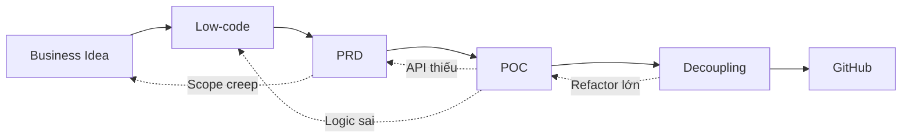

# 🧠 Brainstorm: Cải tiến Phương pháp Vibe Coding có Kiểm soát

## Context

Phương pháp Vibe Coding hiện tại gồm 6 bước tuần tự:
```
Business Idea → Low-code → PRD → POC → Decoupling → GitHub
```

**Điểm mạnh hiện tại:**
- Quy trình artifact-driven rõ ràng
- Prompt template theo cấu trúc Context–Role–Task–Output
- Nguyên tắc reuse-first/no-touch policy

**Gaps và cơ hội cải tiến:**
- Thiếu validation/testing giữa các bước
- Chưa có feedback loop khi phát hiện vấn đề
- Thiếu checkpoint để catch lỗi sớm
- Prompt templates chưa đủ chi tiết về error handling và edge cases

---

## Option A: Thêm Validation Gates (Quality Checkpoints)

Bổ sung các "cổng kiểm tra" giữa mỗi bước để đảm bảo chất lượng trước khi chuyển bước.

```
Business Idea → [Gate 1] → Low-code → [Gate 2] → PRD → [Gate 3] → POC → [Gate 4] → Decoupling → [Gate 5] → GitHub
```

### Đề xuất Quality Gates:

| Gate | Tên | Checklist kiểm tra |
|------|-----|-------------------|
| **Gate 1** | Scope Lock | ☐ MVP scope đã chốt? ☐ Stakeholder đồng ý? ☐ Out-of-scope rõ ràng? |
| **Gate 2** | Design Review | ☐ Screen list đủ? ☐ User flows cover edge cases? ☐ Business rules có ID? |
| **Gate 3** | PRD Approval | ☐ User stories INVEST? ☐ AC dạng Given-When-Then? ☐ API contract rõ? |
| **Gate 4** | POC Demo | ☐ Happy path chạy được? ☐ Error states hiển thị đúng? ☐ API integration OK? |
| **Gate 5** | Code Review | ☐ UI-logic tách biệt? ☐ Không duplicate? ☐ Lint/test pass? |

✅ **Pros:**
- Catch lỗi sớm, giảm chi phí fix
- Đảm bảo chất lượng artifact mỗi bước
- Tạo điểm check-in với stakeholder

❌ **Cons:**
- Tăng overhead nếu gate quá chặt
- Có thể chậm nếu không linh hoạt

📊 **Effort:** Medium

---

## Option B: Thêm Feedback Loops (Iterative Refinement)

Bổ sung cơ chế quay lại bước trước khi phát hiện vấn đề, thay vì chỉ đi tiến tới.



### Đề xuất Feedback Triggers:

| Từ Step | Quay về | Trigger condition | Action |
|---------|---------|-------------------|--------|
| POC → PRD | Step 3 | API endpoint thiếu/sai | Cập nhật API assumptions trong PRD |
| POC → Low-code | Step 2 | Luồng UX không hợp lý | Revise user flow |
| Decoupling → POC | Step 4 | Cần refactor lớn ảnh hưởng logic | Re-implement feature |
| PRD → Business Idea | Step 1 | Scope creep detected | Re-negotiate MVP scope |

✅ **Pros:**
- Linh hoạt, thích ứng với thay đổi
- Giảm accumulation of technical debt
- Realistic cho dự án thực tế

❌ **Cons:**
- Khó tracking progress nếu loop nhiều
- Cần discipline để không lạm dụng

📊 **Effort:** Medium

---

## Option C: Thêm Test-Driven Validation Layer

Bổ sung testing ở mỗi layer để validation tự động.

### Testing Strategy per Step:

| Step | Test Type | Artifacts |
|------|-----------|-----------|
| **Step 2: Low-code** | UI Review Checklist | Screen coverage matrix, Flow test cases |
| **Step 3: PRD** | AC Validation | Acceptance test scenarios (manual) |
| **Step 4: POC** | Smoke Tests | E2E test scripts (Playwright/Cypress) |
| **Step 5: Decoupling** | Unit + Integration | Jest/Vitest tests, API contract tests |
| **Step 6: GitHub** | CI Pipeline | Lint, test, build checks |

### Đề xuất Test Artifacts cho mỗi Step:

```
Step 2 Output:
├── screens.md
├── user-flows.md
├── business-rules.md
└── [NEW] test-scenarios.md  ← Manual test cases từ flows

Step 3 Output:
├── PRD.md
└── [NEW] acceptance-tests.md  ← Given-When-Then từ AC

Step 4 Output:
├── src/
└── [NEW] e2e/
    └── smoke.spec.ts  ← E2E smoke tests

Step 5 Output:
├── src/ (refactored)
└── [NEW] tests/
    ├── unit/
    └── integration/
```

✅ **Pros:**
- Validation tự động, giảm manual review
- Catch regression sớm
- Documentation qua tests

❌ **Cons:**
- Tăng effort đáng kể
- Cần skill testing

📊 **Effort:** High

---

## Option D: Enhanced Prompt Templates (CRTO+)

Cải tiến prompt templates hiện tại bằng cách thêm các sections:

### Cấu trúc CRTO+ (Context-Role-Task-Output + Extensions):

```
--Context--
[Giữ nguyên]

--Role--
[Giữ nguyên]

--Task--
[Giữ nguyên]

--Output--
[Giữ nguyên]

--[NEW] Constraints--
• Hard constraints: [KHÔNG được làm gì]
• Soft constraints: [Ưu tiên nhưng có thể đàm phán]

--[NEW] Edge Cases--
• Liệt kê các trường hợp đặc biệt cần xử lý
• Error scenarios
• Empty states

--[NEW] Validation Criteria--
• Làm sao biết output đạt yêu cầu?
• Checklist self-review

--[NEW] Anti-patterns--
• Những lỗi phổ biến cần tránh
• Ví dụ về output SAI

--[NEW] Examples--
• Ví dụ output ĐÚNG (nếu có)
• Reference từ project khác
```

✅ **Pros:**
- Prompt chất lượng hơn, output ít sai
- Giảm iterations
- Self-documenting

❌ **Cons:**
- Prompt dài hơn
- Cần effort soạn template

📊 **Effort:** Low-Medium

---

## Option E: Thêm Step 0 - Codebase Analysis (cho existing projects)

Với dự án đã có code (như GPS Tours), cần step đầu tiên để analyze codebase trước khi implement.

```
[NEW] Step 0: Codebase Analysis → Step 1 → Step 2 → ...
```

### Step 0 Activities:

| Activity | Output |
|----------|--------|
| Scan project structure | `project-structure.md` |
| Identify existing components | `reusable-components.md` |
| Map current vs target state | `gap-analysis.md` |
| Identify tech debt | `tech-debt-inventory.md` |
| Document conventions | `conventions.md` |

### Prompt Template cho Step 0:

```markdown
--Context--
Tôi có một codebase React/Next.js đang phát triển. Cần phân tích trước khi implement features mới.

--Role--
Bạn là Senior Tech Lead + Codebase Archaeologist.

--Task--
1. Scan và liệt kê cấu trúc thư mục hiện tại
2. Identify các components/hooks có thể reuse
3. Phát hiện patterns và conventions đang dùng
4. Liệt kê tech debt / code smells
5. Đề xuất refactoring priorities

--Output--
A) PROJECT STRUCTURE: tree view + mô tả
B) REUSABLE INVENTORY: bảng {Component | Path | Purpose | Reuse Potential}
C) CONVENTIONS: naming, folder structure, state management
D) TECH DEBT: bảng {Issue | Severity | Location | Suggested Fix}
E) RECOMMENDATIONS: prioritized action items
```

✅ **Pros:**
- Essential cho brownfield projects
- Tránh duplicate components
- Hiểu context trước khi code

❌ **Cons:**
- Không cần cho greenfield
- Tốn thời gian nếu codebase lớn

📊 **Effort:** Medium

---

## 💡 Recommendation: Kết hợp Options A + B + D + E

**Quy trình cải tiến đề xuất:**

```
[Step 0: Codebase Analysis] (nếu có code sẵn)
         ↓
    [Gate 0: Context Lock]
         ↓
Step 1: Business Idea
         ↓
    [Gate 1: Scope Lock]
         ↓
Step 2: Low-code (UI + Flow + Rule)
         ↓ ← Feedback loop nếu scope creep
    [Gate 2: Design Review]
         ↓
Step 3: PRD (BA role)
         ↓ ← Feedback loop nếu API thiếu
    [Gate 3: PRD Approval]
         ↓
Step 4: POC (Dev role)
         ↓ ← Feedback loop nếu UX issue
    [Gate 4: Demo & Smoke Test]
         ↓
Step 5: Decoupling
         ↓ ← Feedback loop nếu major refactor
    [Gate 5: Code Review + Lint/Test]
         ↓
Step 6: GitHub Delivery
```

**Lý do chọn kết hợp này:**
1. **Option A (Gates)**: Catch lỗi sớm với chi phí hợp lý
2. **Option B (Feedback Loops)**: Realistic, cho phép iterate
3. **Option D (CRTO+)**: Low effort, high impact cho prompt quality
4. **Option E (Step 0)**: Essential cho dự án có code sẵn như GPS Tours

---

## 📝 Enhanced Prompt Templates (CRTO+)

### Template 1: Step 0 - Codebase Analysis

```markdown
--Context--
Tôi có codebase [TECH STACK] cho dự án [TÊN DỰ ÁN].
Trước khi implement features mới, cần hiểu rõ codebase hiện tại.
Repo structure đính kèm.

--Role--
Bạn là Senior Tech Lead + Codebase Archaeologist.

--Task--
1. Phân tích cấu trúc project và liệt kê các layers/modules
2. Inventory tất cả components, hooks, services có thể reuse
3. Identify patterns và conventions đang được sử dụng
4. Phát hiện tech debt, code smells, potential issues
5. Map gap giữa current state và target features

--Output--
A) PROJECT OVERVIEW: architecture diagram + layer descriptions
B) REUSABLE INVENTORY:
   | Type | Name | Path | Purpose | Reuse Score (1-5) |
C) CONVENTIONS DETECTED: naming, structure, state, styling
D) TECH DEBT LOG:
   | ID | Issue | Severity | Location | Effort to Fix |
E) GAP ANALYSIS: what exists vs what needs to be built
F) RECOMMENDATIONS: prioritized action items

--Constraints--
• Chỉ phân tích, KHÔNG sửa code
• Focus vào những gì ảnh hưởng đến features mới
• Nếu thiếu thông tin, ghi rõ trong "Assumptions"

--Anti-patterns--
• KHÔNG đề xuất rewrite toàn bộ
• KHÔNG ignore existing patterns
• KHÔNG assume tech stack không được nêu

--Validation--
☐ Có inventory đầy đủ components?
☐ Conventions được document rõ?
☐ Tech debt có severity và location?
☐ Recommendations actionable?
```

---

### Template 2: Step 2 - Low-code (Enhanced)

```markdown
--Context--
Dự án: [TÊN PROJECT] - [MÔ TẢ NGẮN]
Mục tiêu MVP: [1-2 câu]
Modules trong scope:
1) [Module 1]: [mô tả]
2) [Module 2]: [mô tả]

UI/Components đã có (Reuse-first):
- Pages: [list pages]
- Components: [list components]
- Design system: [shadcn/tailwind/custom]

--Role--
Bạn là BA + UX Designer + Information Architect.

--Task--
Tạo Low-code artifacts:
1) Screen list với đầy đủ states (loading, empty, error, success)
2) User flows cho từng screen (happy path + 5 edge cases minimum)
3) Business rules với ID, priority, và validation logic
4) Data fields cho mỗi entity
5) Reuse mapping: component nào dùng lại, component nào tạo mới
6) [NEW] State management: global vs local state decisions

--Output--
A) SCREEN LIST:
   | Screen | Purpose | UI Blocks | Actions | States | Reuse? |

B) USER FLOWS (per screen):
   - Happy path: step-by-step
   - Edge case 1: [scenario + handling]
   - Edge case 2: [scenario + handling]
   - Edge case 3: [scenario + handling]
   - Edge case 4: [scenario + handling]
   - Edge case 5: [scenario + handling]

C) BUSINESS RULES:
   | ID | Name | Condition | Expected | Priority | Validation |

D) DATA FIELDS:
   | Entity | Field | Type | Required | Validation | UI Usage |

E) REUSE MAP:
   | Need | Existing Component | Gap | Action |

F) STATE DECISIONS:
   | State | Scope | Location | Sync Strategy |

--Constraints--
• MVP scope only - không thêm module ngoài list
• Ưu tiên reuse trước khi tạo mới
• Mỗi business rule phải có ID để track

--Edge Cases to Consider--
• Empty data states
• Network error states
• Permission denied scenarios
• Concurrent edit conflicts
• Invalid input handling
• Session timeout

--Validation Criteria--
☐ Mỗi screen có đủ 4 states (loading/empty/error/success)?
☐ User flows cover ít nhất 5 edge cases?
☐ Business rules có ID và priority?
☐ Reuse map rõ ràng?

--Anti-patterns--
✗ Tạo screen mới khi đã có screen tương tự
✗ Business rules không có ID
✗ User flows chỉ có happy path
✗ Ignore existing components
```

---

### Template 3: Step 3 - PRD (Enhanced)

```markdown
--Context--
Dự án: [TÊN PROJECT]
Low-code artifacts từ Step 2 đính kèm.
Codebase hiện tại đính kèm (nếu có).

--Role--
Bạn là Business Analyst + Product Owner.

--Task--
Chuyển Low-code artifacts thành PRD v1.0 "buildable":
1) Đọc screen list, user flows, business rules từ Step 2
2) Chuyển thành User Stories theo format chuẩn
3) Viết Acceptance Criteria dạng Given-When-Then
4) Xác định Functional & Non-functional requirements
5) Document API contracts (nếu đã biết)
6) Liệt kê risks và dependencies

--Output Format--

# PRD: [Tên Project] v1.0

## 1. Overview
### 1.1 Purpose
### 1.2 Goals & Success Metrics
### 1.3 Scope
- In-scope (MVP)
- Out-of-scope
- Future enhancements

## 2. Personas & Roles
| Role | Description | Permissions |

## 3. User Stories
| ID | As a... | I want to... | So that... | Priority | Module |

## 4. Functional Requirements
### 4.1 [Module 1]
#### FR-1.1: [Title]
- Description
- Business rules referenced: [BR-xxx]
- Acceptance Criteria:
  - Given [context]
  - When [action]
  - Then [outcome]
  
### 4.2 [Module 2]
...

## 5. Non-Functional Requirements
### 5.1 Performance
### 5.2 Security
### 5.3 Usability
### 5.4 Error Handling

## 6. Data Requirements
| Entity | Field | Type | Validation | Source |

## 7. API Contracts (if known)
| Endpoint | Method | Request | Response | Status Codes |

## 8. UI/UX Requirements
- Design system reference
- Responsive breakpoints
- Accessibility requirements

## 9. Dependencies & Risks
| ID | Dependency/Risk | Impact | Mitigation |

## 10. Open Questions
| ID | Question | Owner | Due Date |

--Constraints--
• PRD phải map 1:1 với Low-code artifacts
• Không thêm features ngoài scope
• Mọi assumption phải ghi rõ

--Validation Criteria--
☐ Mỗi User Story có ID unique?
☐ AC đủ Given-When-Then?
☐ Non-functional requirements có measurable targets?
☐ Open questions có owner?

--Anti-patterns--
✗ User stories quá vague ("cải thiện UX")
✗ AC không testable
✗ Thiếu error handling requirements
✗ Không có performance targets
```

---

### Template 4: Step 4 - POC (Enhanced)

```markdown
--Context--
PRD v1.0 đính kèm.
Codebase hiện tại đính kèm.
Codebase analysis từ Step 0 đính kèm (nếu có).

Mục tiêu POC:
- Chạy end-to-end: [flow chính]
- Kết nối API thật (hoặc mock nếu chưa có)

--Role--
Bạn là Senior Frontend Engineer + Codebase Maintainer.

--Task--
Bước 1: Phân tích và Planning
- Liệt kê KEEP (no-touch)
- Liệt kê IMPLEMENT (cần làm)
- Liệt kê MODIFY (cần sửa nhẹ)

Bước 2: Implementation Plan
- File plan với action và reason
- Dependency order

Bước 3: Code Implementation
- Code cho từng file
- Test instructions

--Output--

## A. ANALYSIS

### KEEP (No-touch) - Verified Working
| File/Component | Reason to Keep |

### IMPLEMENT (New)
| Feature | Files to Create | Dependencies |

### MODIFY (Minimal Changes)
| File | Change Required | Risk Level |

## B. FILE PLAN
| Order | File | Action | Reason | Dependencies | Risk |

## C. IMPLEMENTATION

### [File 1]
```[language]
// Code here
```

**Why this approach:**
**How to test:**

### [File 2]
...

## D. INTEGRATION CHECKLIST
☐ [Integration point 1]
☐ [Integration point 2]
...

## E. SMOKE TEST SCRIPT
1. [Test step 1]
2. [Test step 2]
...

## F. OPEN QUESTIONS / ASSUMPTIONS
| ID | Item | Type | Impact |

--Constraints--
• REUSE-FIRST: Dùng lại mọi thứ có thể
• NO-TOUCH: Không sửa code đang hoạt động tốt
• UI-LOGIC SEPARATION: UI chỉ render, logic ở hooks/services

--Edge Cases to Handle--
• API timeout → loading state + retry
• API error → error state + user-friendly message
• Empty data → empty state với CTA
• Auth expired → redirect to login
• Network offline → graceful degradation

--Validation--
☐ Không duplicate components?
☐ UI và logic tách biệt?
☐ Error states được handle?
☐ Smoke test pass?

--Anti-patterns--
✗ Copy-paste component thay vì reuse
✗ Logic trộn trong UI component
✗ Hardcode API URLs
✗ Ignore existing patterns/conventions
✗ No error handling
```

---

### Template 5: Step 5 - Decoupling (Enhanced)

```markdown
--Context--
POC đã chạy được từ Step 4.
Mục tiêu: Refactor để production-ready.

--Role--
Bạn là Senior Engineer + Code Quality Guardian.

--Task--
1. Audit POC code cho quality issues
2. Identify decoupling opportunities
3. Plan refactoring với priority
4. Execute refactoring
5. Verify không break functionality

--Output--

## A. CODE AUDIT

### Coupling Issues
| ID | Location | Issue | Severity | Fix Strategy |

### Duplication
| ID | Pattern | Occurrences | Consolidation Strategy |

### Naming/Convention Violations
| ID | Current | Should Be | Files Affected |

## B. REFACTORING PLAN
| Priority | Task | Files | Risk | Test Required |

## C. REFACTORED CODE

### [Refactor 1]: [Title]
**Before:**
```
// old code
```

**After:**
```
// new code
```

**Reason:**
**Risk mitigation:**

## D. NEW ABSTRACTIONS CREATED
| Abstraction | Type | Purpose | Usage |

## E. VERIFICATION CHECKLIST
☐ All previous functionality works?
☐ No new console errors?
☐ Lint passes?
☐ Build succeeds?
☐ Tests pass (if any)?

--Constraints--
• Functionality KHÔNG được break
• Mỗi refactor phải có lý do rõ ràng
• Small, incremental changes

--Validation--
☐ UI-logic separation achieved?
☐ No duplicate code?
☐ Consistent naming?
☐ Reusable abstractions created?

--Anti-patterns--
✗ Big bang refactor (quá nhiều thay đổi cùng lúc)
✗ Refactor without reason
✗ Break existing functionality
✗ Over-engineering (quá abstract)
```

---

## Checklist Tổng kết

### Gate Checklists:

**Gate 0 - Context Lock (sau Step 0):**
- [ ] Codebase structure documented?
- [ ] Reusable components inventoried?
- [ ] Conventions identified?
- [ ] Tech debt logged?

**Gate 1 - Scope Lock (sau Step 1):**
- [ ] MVP scope defined?
- [ ] In/out scope clear?
- [ ] Stakeholder approved?

**Gate 2 - Design Review (sau Step 2):**
- [ ] All screens listed?
- [ ] User flows have 5+ edge cases?
- [ ] Business rules have IDs?
- [ ] Reuse map complete?

**Gate 3 - PRD Approval (sau Step 3):**
- [ ] User stories INVEST?
- [ ] AC testable?
- [ ] NFR measurable?
- [ ] API contracts documented?

**Gate 4 - Demo (sau Step 4):**
- [ ] Happy path works?
- [ ] Error states shown?
- [ ] API integration OK?
- [ ] Smoke tests pass?

**Gate 5 - Code Review (sau Step 5):**
- [ ] UI-logic separated?
- [ ] No duplication?
- [ ] Lint/build pass?
- [ ] Tests pass?

---

## Next Steps

1. Review và chọn improvements phù hợp với context dự án
2. Apply enhanced templates vào GPS Tours project
3. Document lessons learned sau mỗi Sprint
4. Iterate và cải tiến templates dựa trên feedback
