# 📐 Use Case Diagram & Đặc tả
## Dự án GPS Tours & Phố Ẩm thực Vĩnh Khánh

> **Phiên bản:** 2.0  
> **Ngày tạo:** 2026-02-10  
> **Cập nhật:** 2026-02-10

---

## 1. Actors

| Actor | Loại | Mô tả | Platform |
|-------|------|-------|----------|
| **Admin** | Primary | Quản trị viên hệ thống, quản lý toàn bộ POIs, Tours, Users | Web Dashboard |
| **Shop Owner** | Primary | Chủ cửa hàng, quản lý POIs của mình | Web Dashboard |
| **Tourist** | Primary | Du khách sử dụng app để khám phá | Mobile App (Expo) |
| **System** | Secondary | Hệ thống tự động (GPS, triggers, notifications) | Backend |

---

## 2. Use Case Diagram

```mermaid
graph TB
    subgraph Actors
        Admin["👤 Admin"]
        ShopOwner["👤 Shop Owner"]
        Tourist["👤 Tourist"]
        System["⚙️ System"]
    end

    subgraph UC_Auth["🔐 Authentication"]
        UC01["UC-01: Đăng nhập Admin"]
        UC02["UC-02: Đăng ký tài khoản"]
        UC03["UC-03: Đăng nhập Shop Owner"]
        UC04["UC-04: Quên mật khẩu"]
    end

    subgraph UC_POI["📍 POI Management"]
        UC10["UC-10: Xem danh sách POIs"]
        UC11["UC-11: Tạo POI mới"]
        UC12["UC-12: Chỉnh sửa POI"]
        UC13["UC-13: Xóa POI"]
        UC14["UC-14: Upload media cho POI"]
        UC15["UC-15: Quản lý nội dung đa ngữ"]
    end

    subgraph UC_Tour["🗺️ Tour Management"]
        UC20["UC-20: Xem danh sách Tours"]
        UC21["UC-21: Tạo Tour mới"]
        UC22["UC-22: Chỉnh sửa Tour"]
        UC23["UC-23: Xóa Tour"]
        UC24["UC-24: Sắp xếp POIs trong Tour"]
    end

    subgraph UC_Tourist["📱 Tourist App"]
        UC30["UC-30: Xem bản đồ"]
        UC31["UC-31: Xem chi tiết POI"]
        UC32["UC-32: Nghe audio thuyết minh"]
        UC33["UC-33: Theo dõi Tour"]
        UC34["UC-34: Chuyển đổi ngôn ngữ"]
        UC35["UC-35: Xem lịch sử"]
        UC36["UC-36: Lưu POI yêu thích"]
    end

    subgraph UC_Shop["🏪 Shop Owner Features"]
        UC40["UC-40: Quản lý POIs của mình"]
        UC41["UC-41: Xem analytics"]
        UC42["UC-42: Cập nhật profile"]
    end

    subgraph UC_System["⚙️ System Auto"]
        UC50["UC-50: Phát hiện vị trí Tourist"]
        UC51["UC-51: Auto-trigger nội dung"]
        UC52["UC-52: Xử lý vùng giao thoa"]
    end

    Admin --> UC01
    Admin --> UC10
    Admin --> UC11
    Admin --> UC12
    Admin --> UC13
    Admin --> UC14
    Admin --> UC15
    Admin --> UC20
    Admin --> UC21
    Admin --> UC22
    Admin --> UC23
    Admin --> UC24

    ShopOwner --> UC02
    ShopOwner --> UC03
    ShopOwner --> UC40
    ShopOwner --> UC14
    ShopOwner --> UC41
    ShopOwner --> UC42

    Tourist --> UC02
    Tourist --> UC30
    Tourist --> UC31
    Tourist --> UC32
    Tourist --> UC33
    Tourist --> UC34
    Tourist --> UC35
    Tourist --> UC36

    System --> UC50
    System --> UC51
    System --> UC52

    UC11 -.->|include| UC14
    UC40 -.->|include| UC12
    UC31 -.->|include| UC32
    UC33 -.->|include| UC30
    UC51 -.->|include| UC50
    UC52 -.->|extend| UC51
    UC04 -.->|extend| UC01
    UC04 -.->|extend| UC03
```

---

## 3. Đặc tả Use Case chi tiết

---

### UC-01: Đăng nhập Admin

| Field | Detail |
|-------|--------|
| **Use Case Number** | UC-01 |
| **Use Case Name** | Đăng nhập Admin |
| **Actor(s)** | Admin |
| **Maturity** | Focused |
| **Summary** | Admin đăng nhập vào hệ thống dashboard bằng email và password để quản lý POIs, Tours và nội dung hệ thống. |

**Basic Course of Events:**

| | Actor Action | System Response |
|---|---|---|
| 1 | | Perform {Login Authentication} |
| 2 | | System hiển thị trang login với các trường email và password. |
| 3 | Admin nhập email và password, nhấn nút "Login". | |
| 4 | | System validate email format và password không rỗng. |
| 5 | | System gửi credentials đến Auth Service để xác thực. |
| 6 | | System so sánh password hash (bcrypt) với record trong database. |
| 7 | | System tạo JWT access token (15 phút) và refresh token (7 ngày). |
| 8 | | System lưu token vào response và redirect Admin đến Dashboard Overview. |
| | | The use case ends. |

**Alternative Paths:**

| ID | Mô tả |
|----|-------|
| **A1** | Admin chọn "Remember me": System lưu refresh token vào cookie httpOnly, access token vào localStorage. Lần truy cập sau sẽ auto-login nếu token còn hạn. Return to step 8. |
| **A2** | Admin chọn "Forgot password": Redirect sang UC-04 (Quên mật khẩu). |

**Exception Paths:**

| ID | Mô tả |
|----|-------|
| **E1** | Tại step 6, nếu email không tồn tại hoặc password sai: System hiển thị "Invalid email or password" (không phân biệt lỗi email hay password vì lý do bảo mật). Return to step 2. |
| **E2** | Tại step 6, nếu tài khoản bị khóa (status = 'locked'): System hiển thị "Your account has been locked. Please contact support." The use case ends. |
| **E3** | Tại step 5, nếu số lần đăng nhập sai ≥ 5 trong 15 phút: System khóa tài khoản tạm thời 15 phút và hiển thị "Too many failed attempts. Please try again later." The use case ends. |
| **E4** | Tại step 5, nếu server không phản hồi: System hiển thị "Service unavailable. Please try again." và tự động retry sau 5 giây. Return to step 2. |

**Extension Points:**

| Point | Mô tả |
|-------|-------|
| Login Authentication | Xác thực bằng email/password qua bcrypt hash comparison. JWT token được generate với claims: {sub: adminId, role: 'admin', iat, exp}. (See Business Rule BR-001) |

| Field | Detail |
|-------|--------|
| **Triggers** | Admin muốn truy cập dashboard để quản lý hệ thống. |
| **Assumptions** | Admin đã có tài khoản được tạo sẵn bởi system (Admin không tự đăng ký). |
| **Preconditions** | Admin có kết nối internet và truy cập được trang login. |
| **Post Conditions** | Admin được xác thực thành công, JWT tokens được lưu, và Admin ở trang Dashboard Overview. |
| **Reference: Business Rules** | BR-001, BR-002, BR-003 |
| **Author(s)** | AI Assistant |
| **Date** | 2026-02-10 |

---

### UC-02: Đăng ký tài khoản

| Field | Detail |
|-------|--------|
| **Use Case Number** | UC-02 |
| **Use Case Name** | Đăng ký tài khoản |
| **Actor(s)** | Tourist, Shop Owner |
| **Maturity** | Focused |
| **Summary** | Người dùng mới đăng ký tài khoản chọn vai trò Tourist hoặc Shop Owner thông qua unified registration endpoint. Nếu chọn Shop Owner, hệ thống tạo thêm record Shop_Owner với thông tin kinh doanh. |

**Basic Course of Events:**

| | Actor Action | System Response |
|---|---|---|
| 1 | User truy cập trang đăng ký (/register). | |
| 2 | | System hiển thị form đăng ký: email, password, confirm password, full name, role selector (Tourist / Shop Owner). |
| 3 | User nhập email, password, full name và chọn role = "Tourist". | |
| 4 | User nhấn nút "Register". | |
| 5 | | System validate: email format, email chưa tồn tại, password ≥ 8 ký tự (upper + lower + number), password khớp confirm. {Validate Registration} |
| 6 | | System hash password bằng bcrypt (cost 12). |
| 7 | | System tạo User record trong database (role = 'tourist'). |
| 8 | | System tạo JWT tokens (access + refresh). |
| 9 | | System auto-login và redirect đến Tourist App hoặc Shop Owner Dashboard tùy role. |
| | | The use case ends. |

**Alternative Paths:**

| ID | Mô tả |
|----|-------|
| **A1. Đăng ký Shop Owner** | |
| | Actor Action | System Response |
| 1 | User chọn role = "Shop Owner" tại step 3. | |
| 2 | | System hiển thị thêm các trường: business_name (bắt buộc), phone (bắt buộc). |
| 3 | User nhập business_name và phone. | |
| 4 | | Tại step 7, system tạo User record (role = 'shop_owner') VÀ tạo thêm Shop_Owner record (user_id = new user, business_name, phone). |
| | | Return to step 8 of Basic Course of Events. |
| **A2** | User đã có tài khoản: User nhấn "Already have an account? Login" → redirect đến /login. |

**Exception Paths:**

| ID | Mô tả |
|----|-------|
| **E1** | Tại {Validate Registration}, nếu email đã tồn tại: System hiển thị "This email is already registered. Please login or use another email." Return to step 2. |
| **E2** | Tại {Validate Registration}, nếu password yếu: System hiển thị chi tiết yêu cầu ("Must contain at least 8 characters, including uppercase, lowercase and number"). Return to step 2. |
| **E3** | Tại {Validate Registration}, nếu password và confirm không khớp: System hiển thị "Passwords do not match". Return to step 2. |

**Extension Points:**

| Point | Mô tả |
|-------|-------|
| Validate Registration | Kiểm tra tính hợp lệ: email unique, password strength, required fields. Nếu role = shop_owner thì business_name và phone cũng bắt buộc. (See Business Rule BR-1001) E1, E2, E3 |

| Field | Detail |
|-------|--------|
| **Triggers** | Người dùng mới muốn tạo tài khoản để sử dụng Tourist App hoặc Shop Owner Dashboard. |
| **Assumptions** | Email là duy nhất trong hệ thống. Một user chỉ có một role. |
| **Preconditions** | Email chưa được sử dụng trong hệ thống. |
| **Post Conditions** | User record được tạo trong database. Nếu Shop Owner, thêm Shop_Owner record. User được auto-login. |
| **Reference: Business Rules** | BR-1001, BR-1002 |
| **Author(s)** | AI Assistant |
| **Date** | 2026-02-10 |

---

### UC-11: Tạo POI mới (Admin)

| Field | Detail |
|-------|--------|
| **Use Case Number** | UC-11 |
| **Use Case Name** | Tạo POI mới |
| **Actor(s)** | Admin |
| **Maturity** | Focused |
| **Summary** | Admin tạo một Point of Interest mới với đầy đủ thông tin đa ngữ (Vietnamese + English), vị trí GPS, hình ảnh và audio thuyết minh. POI có thể được lưu dưới dạng Draft hoặc Published ngay. |

**Basic Course of Events:**

| | Actor Action | System Response |
|---|---|---|
| 1 | | Perform {Login Authentication} |
| 2 | | System hiển thị Dashboard với menu chính. |
| 3 | Admin chọn "POI Management" từ sidebar. A1. | |
| 4 | | System hiển thị danh sách POIs hiện tại (table view). |
| 5 | Admin nhấn nút "+ Add New POI". | |
| 6 | | System hiển thị form tạo POI với tabs ngôn ngữ [Vietnamese] [English]. |
| 7 | Admin nhập tên và mô tả POI (tiếng Việt). | |
| 8 | Admin chuyển tab sang English và nhập tên, mô tả tiếng Anh. A2 | |
| 9 | Admin chọn vị trí trên bản đồ (click hoặc nhập tọa độ lat/lng). | |
| 10 | | System hiển thị marker tại vị trí đã chọn và auto-fill tọa độ. |
| 11 | Admin chọn category: MAIN hoặc SUB. | |
| 12 | Admin thiết lập trigger_radius (mặc định 15m, tùy chỉnh 5-50m). | |
| 13 | Admin upload images bằng drag & drop. (Lặp lại nếu cần, tối đa 10 ảnh.) {Upload Media} | |
| 14 | | System validate file (type: JPEG/PNG/WebP, size ≤ 5MB), upload lên S3, hiển thị preview. |
| 15 | Admin upload audio files (Vietnamese + English). {Upload Media} | |
| 16 | | System validate audio (type: MP3/WAV, size ≤ 50MB), upload lên S3, hiển thị audio player preview. |
| 17 | Admin nhấn "Save Draft" hoặc "Publish". A3, A4 | |
| 18 | | System validate tất cả trường bắt buộc. {Validate POI Data} |
| 19 | | System lưu POI vào database với status tương ứng (draft/published). |
| 20 | | System hiển thị toast "POI created successfully!" và redirect về danh sách POIs. |
| | | The use case ends. |

**Alternative Paths:**

| ID | Mô tả |
|----|-------|
| **A1** | Admin có thể truy cập trực tiếp qua URL /admin/pois/create. Return to step 6 of Basic Course of Events. |
| **A2** | Admin có thể bỏ qua nội dung tiếng Anh (không bắt buộc cho MVP). Chỉ tiếng Việt là bắt buộc. Return to step 9. |
| **A3** | Admin nhấn "Cancel": System hiển thị dialog xác nhận "Discard changes?". Nếu đồng ý, redirect về danh sách POIs mà không lưu. Nếu không, return to step 17. |
| **A4** | Admin nhấn "Save Draft": System lưu với status = 'draft'. POI này chưa hiển thị trên Tourist App. Return to step 20. |

**Exception Paths:**

| ID | Mô tả |
|----|-------|
| **E1** | Tại {Validate POI Data}, nếu thiếu trường bắt buộc (name_vi, latitude, longitude, ít nhất 1 image): System highlight trường lỗi với thông báo validation cụ thể. Return to step 6. |
| **E2** | Tại {Upload Media}, nếu file không đúng format hoặc quá lớn: System hiển thị "Invalid file: [reason]". Return to step 13 hoặc 15. |
| **E3** | Tại {Upload Media}, nếu upload fail giữa chừng (network error): System tự động retry 3 lần. Nếu vẫn fail, hiển thị "Upload failed. Please try again." Return to step 13 hoặc 15. |
| **E4** | Tại step 17, nếu session hết hạn: System auto-save draft locally, redirect đến login. Sau khi login lại, system restore draft. Return to step 6. |

**Extension Points:**

| Point | Mô tả |
|-------|-------|
| Upload Media | Xử lý upload hình ảnh và audio lên S3/Cloudinary. Images được resize/optimize. Audio giữ nguyên quality. (See Business Rule BR-101, BR-102) E2, E3 |
| Validate POI Data | Kiểm tra: name_vi required, latitude ∈ [-90, 90], longitude ∈ [-180, 180], trigger_radius ∈ [5, 50], ít nhất 1 image required. (See Business Rule BR-001) E1 |

| Field | Detail |
|-------|--------|
| **Triggers** | Admin cần thêm một điểm tham quan mới vào hệ thống. |
| **Assumptions** | Admin đã đăng nhập. S3 storage khả dụng. Mapbox API khả dụng cho chọn vị trí. |
| **Preconditions** | Admin đã xác thực thành công (UC-01). |
| **Post Conditions** | POI mới được lưu trong database với status draft hoặc published. Media files được upload lên S3. Nếu published, POI hiển thị trên Tourist App. |
| **Reference: Business Rules** | BR-001, BR-101, BR-102, BR-103 |
| **Author(s)** | AI Assistant |
| **Date** | 2026-02-10 |

---

### UC-13: Xóa POI

| Field | Detail |
|-------|--------|
| **Use Case Number** | UC-13 |
| **Use Case Name** | Xóa POI |
| **Actor(s)** | Admin |
| **Maturity** | Focused |
| **Summary** | Admin xóa một POI khỏi hệ thống. Nếu POI thuộc một Tour, hệ thống cảnh báo cascade effect. System thực hiện soft-delete (đánh dấu archived). |

**Basic Course of Events:**

| | Actor Action | System Response |
|---|---|---|
| 1 | | Perform {Login Authentication} |
| 2 | Admin truy cập POI Management, tìm POI cần xóa. | |
| 3 | Admin nhấn nút "Delete" (🗑️) trên dòng POI. | |
| 4 | | System hiển thị dialog xác nhận: "Are you sure you want to delete [POI Name]?" |
| 5 | Admin nhấn "Confirm Delete". A1 | |
| 6 | | System kiểm tra POI có thuộc Tour nào không. {Check Tour Dependencies} |
| 7 | | System cập nhật POI status = 'archived' (soft-delete). |
| 8 | | System hiển thị toast "POI deleted successfully" và cập nhật danh sách. |
| | | The use case ends. |

**Alternative Paths:**

| ID | Mô tả |
|----|-------|
| **A1** | Admin nhấn "Cancel" tại step 5: Dialog đóng lại, không xóa gì. Return to step 2. |

**Exception Paths:**

| ID | Mô tả |
|----|-------|
| **E1** | Tại {Check Tour Dependencies}, nếu POI thuộc 1+ Tours: System hiển thị cảnh báo "This POI is part of [N] tour(s): [Tour names]. Deleting it will remove it from these tours." Admin phải nhấn "Delete Anyway" để xác nhận lần 2. Return to step 7. |

**Extension Points:**

| Point | Mô tả |
|-------|-------|
| Check Tour Dependencies | Kiểm tra bảng tour_pois xem POI có liên kết với Tour nào. Nếu có, cascade remove POI khỏi tour_pois. (See Business Rule BR-003) E1 |

| Field | Detail |
|-------|--------|
| **Triggers** | Admin muốn gỡ bỏ một POI không còn phù hợp khỏi hệ thống. |
| **Assumptions** | Soft-delete giữ data trong DB để phục hồi nếu cần. |
| **Preconditions** | Admin đã đăng nhập (UC-01). POI tồn tại trong hệ thống. |
| **Post Conditions** | POI status chuyển sang 'archived'. POI không hiển thị trên Tourist App. Nếu POI thuộc Tour, POI bị gỡ khỏi Tour. |
| **Reference: Business Rules** | BR-003, BR-104 |
| **Author(s)** | AI Assistant |
| **Date** | 2026-02-10 |

---

### UC-21: Tạo Tour mới

| Field | Detail |
|-------|--------|
| **Use Case Number** | UC-21 |
| **Use Case Name** | Tạo Tour mới |
| **Actor(s)** | Admin |
| **Maturity** | Focused |
| **Summary** | Admin tạo Tour bằng cách chọn và sắp xếp các POI đã published thành một lộ trình tham quan có thứ tự. System tự động tính estimated duration dựa trên khoảng cách giữa các POI. |

**Basic Course of Events:**

| | Actor Action | System Response |
|---|---|---|
| 1 | | Perform {Login Authentication} |
| 2 | Admin chọn "Tour Management" từ sidebar, nhấn "+ New Tour". | |
| 3 | | System hiển thị form tạo Tour và load danh sách POIs có status = 'published'. |
| 4 | Admin nhập tên Tour (Vietnamese + English) và mô tả. | |
| 5 | Admin chọn POIs từ danh sách (checkbox hoặc drag vào zone). (Lặp lại cho nhiều POIs.) A1 | |
| 6 | Admin sắp xếp thứ tự POIs bằng drag & drop. | |
| 7 | | System hiển thị route preview trên bản đồ (polyline nối các POIs). |
| 8 | | System tính estimated_duration dựa trên tổng khoảng cách + thời gian tham quan trung bình/POI. |
| 9 | Admin review route preview, nhấn "Create Tour". A2 | |
| 10 | | System validate dữ liệu. {Validate Tour Data} |
| 11 | | System lưu Tour record + tour_pois relationships (with sort_order). |
| 12 | | System hiển thị toast "Tour created!" và redirect về Tour List. |
| | | The use case ends. |

**Alternative Paths:**

| ID | Mô tả |
|----|-------|
| **A1** | Admin search POI theo tên: System filter danh sách POIs theo keyword. Return to step 5. |
| **A2** | Admin nhấn "Save Draft": System lưu với status = 'draft', Tour chưa hiển thị trên Tourist App. Return to step 12. |
| **A3** | Admin nhấn "Cancel": Confirm dialog, nếu đồng ý redirect về Tour List. Return to step 2. |

**Exception Paths:**

| ID | Mô tả |
|----|-------|
| **E1** | Tại {Validate Tour Data}, nếu không có POI nào được chọn: System hiển thị "A tour must have at least 1 POI." Return to step 5. |
| **E2** | Tại {Validate Tour Data}, nếu thiếu tên Tour: System hiển thị "Tour name (Vietnamese) is required." Return to step 4. |

**Extension Points:**

| Point | Mô tả |
|-------|-------|
| Validate Tour Data | Kiểm tra: name_vi required, ≥ 1 POI selected, tất cả POIs vẫn ở status 'published'. (See Business Rule BR-002) E1, E2 |

| Field | Detail |
|-------|--------|
| **Triggers** | Admin muốn tạo một lộ trình tham quan mới cho du khách. |
| **Assumptions** | Có ít nhất 1 POI published trong hệ thống. |
| **Preconditions** | Admin đã đăng nhập (UC-01). Ít nhất 1 POI có status 'published'. |
| **Post Conditions** | Tour record được tạo. Tour_POI relationships được lưu với sort_order. Nếu published, Tour hiển thị trên Tourist App. |
| **Reference: Business Rules** | BR-002, BR-201, BR-202 |
| **Author(s)** | AI Assistant |
| **Date** | 2026-02-10 |

---

### UC-30: Xem bản đồ (Tourist)

| Field | Detail |
|-------|--------|
| **Use Case Number** | UC-30 |
| **Use Case Name** | Xem bản đồ |
| **Actor(s)** | Tourist |
| **Maturity** | Focused |
| **Summary** | Tourist mở app và xem bản đồ tương tác với các POI markers xung quanh vị trí hiện tại. Bản đồ hiển thị các loại POIs bằng màu sắc khác nhau (🔴 Main, 🟡 Sub, 🔵 In range). |

**Basic Course of Events:**

| | Actor Action | System Response |
|---|---|---|
| 1 | Tourist mở GPS Tours app. | |
| 2 | | System kiểm tra GPS permission. {Check GPS Permission} |
| 3 | | System lấy vị trí hiện tại (lat, lng) từ GPS. |
| 4 | | System gọi API `GET /public/pois/nearby?lat=x&lng=y&radius=1000` để lấy POIs gần đó. |
| 5 | | System render bản đồ Mapbox centered tại vị trí Tourist. |
| 6 | | System hiển thị POI markers: 🔴 (Main POI), 🟡 (Sub POI). |
| 7 | | System hiển thị vị trí Tourist (📍) trên bản đồ. |
| 8 | Tourist tap vào một POI marker. A1 | |
| 9 | | System hiển thị preview card tại bottom: tên POI, khoảng cách, thumbnail. |
| 10 | Tourist tap card để xem chi tiết. | |
| 11 | | System navigate đến UC-31 (Xem chi tiết POI). |
| | | The use case ends. |

**Alternative Paths:**

| ID | Mô tả |
|----|-------|
| **A1** | Tourist pan/zoom bản đồ để khám phá khu vực khác: System load thêm POIs cho vùng hiển thị mới. Return to step 6. |
| **A2** | Tourist chọn tab "POIs" (list view): System hiển thị danh sách POIs sorted by distance. Tourist tap POI → go to UC-31. |
| **A3** | Tourist chọn tab "Tours": System hiển thị danh sách Tours → go to UC-33. |

**Exception Paths:**

| ID | Mô tả |
|----|-------|
| **E1** | Tại {Check GPS Permission}, nếu Tourist từ chối GPS: System hiển thị dialog "GPS is required to show nearby points of interest. Please enable location in Settings." Tourist có thể sử dụng app ở chế độ hạn chế (chỉ xem danh sách, không có bản đồ). Return to Alternative Path A2. |
| **E2** | Tại step 4, nếu không có POI nào trong bán kính 1km: System hiển thị thông báo "No points of interest nearby" với gợi ý zoom out. Return to step 5. |
| **E3** | Tại step 4, nếu mất kết nối mạng: System hiển thị cached POIs (nếu có) với banner "You are offline". Return to step 5. |

**Extension Points:**

| Point | Mô tả |
|-------|-------|
| Check GPS Permission | Kiểm tra và request quyền truy cập location. Trên iOS: requestWhenInUseAuthorization(). Trên Android: ACCESS_FINE_LOCATION. E1 |

| Field | Detail |
|-------|--------|
| **Triggers** | Tourist muốn khám phá các điểm tham quan xung quanh. |
| **Assumptions** | Tourist có smartphone với GPS. Có kết nối internet (4G/Wi-Fi). |
| **Preconditions** | App đã được cài đặt. Có ít nhất 1 POI published trong hệ thống. |
| **Post Conditions** | Bản đồ hiển thị với vị trí Tourist và các POI markers gần đó. GPS tracking bắt đầu chạy. |
| **Reference: Business Rules** | BR-401, BR-402 |
| **Author(s)** | AI Assistant |
| **Date** | 2026-02-10 |

---

### UC-40: Quản lý POIs của mình (Shop Owner)

| Field | Detail |
|-------|--------|
| **Use Case Number** | UC-40 |
| **Use Case Name** | Quản lý POIs của mình |
| **Actor(s)** | Shop Owner |
| **Maturity** | Focused |
| **Summary** | Shop Owner đăng nhập vào dashboard và quản lý (xem, tạo, chỉnh sửa) các POIs thuộc sở hữu của mình. Shop Owner chỉ thấy POIs có owner_id trùng với ID của mình (data isolation). Shop Owner KHÔNG có quyền xóa POI. |

**Basic Course of Events:**

| | Actor Action | System Response |
|---|---|---|
| 1 | | Perform {Shop Owner Login Authentication} (UC-03) |
| 2 | | System hiển thị Shop Owner Dashboard với menu: My POIs, Analytics, Profile. |
| 3 | Shop Owner chọn "My POIs". | |
| 4 | | System query `SELECT * FROM pois WHERE owner_id = {current_shop_owner_id}` (data isolation). |
| 5 | | System hiển thị danh sách POIs của Shop Owner (table: name, status, actions). |
| 6 | Shop Owner nhấn "+ New POI". A1, A2 | |
| 7 | | System hiển thị form tạo POI (simplified: không có category field). |
| 8 | Shop Owner nhập tên, mô tả, chọn vị trí, upload images và audio. | |
| 9 | Shop Owner nhấn "Save". | |
| 10 | | System validate dữ liệu. {Validate POI Data} |
| 11 | | System auto-set: owner_id = current Shop Owner ID, status = 'draft'. |
| 12 | | System lưu POI và hiển thị toast "POI created!". Danh sách được cập nhật. |
| | | The use case ends. |

**Alternative Paths:**

| ID | Mô tả |
|----|-------|
| **A1. Chỉnh sửa POI** | |
| | Actor Action | System Response |
| 1 | Shop Owner nhấn "Edit" trên một POI tại step 5. | |
| 2 | | System kiểm tra owner_id === current_shop_owner_id. {Verify Ownership} |
| 3 | | System hiển thị form edit với dữ liệu hiện tại. |
| 4 | Shop Owner sửa thông tin, nhấn "Save". | |
| 5 | | System validate và cập nhật POI. Return to step 5 of Basic Course of Events. |
| **A2** | Shop Owner nhấn "Delete": System hiển thị thông báo "Shop Owners cannot delete POIs. Please contact Admin." Không có hành động xóa. Return to step 5. |

**Exception Paths:**

| ID | Mô tả |
|----|-------|
| **E1** | Tại {Verify Ownership}, nếu owner_id ≠ current_shop_owner_id: System trả về 403 Forbidden và redirect về My POIs. Return to step 4. |
| **E2** | Tại step 5, nếu Shop Owner chưa có POI nào: System hiển thị empty state "You haven't created any POI yet" với CTA "Create your first POI". Return to step 6. |
| **E3** | Tại {Validate POI Data}: Giống E1 của UC-11. Return to step 7. |

**Extension Points:**

| Point | Mô tả |
|-------|-------|
| Verify Ownership | Tất cả API calls cho Shop Owner đều filter bằng owner_id để đảm bảo Shop Owner chỉ truy cập data của mình. (See Business Rule BR-1003, BR-1004) E1 |
| Validate POI Data | Tương tự UC-11 nhưng không có category field. (See Business Rule BR-001) E3 |

| Field | Detail |
|-------|--------|
| **Triggers** | Shop Owner muốn cập nhật thông tin cửa hàng/doanh nghiệp của mình trên hệ thống. |
| **Assumptions** | Shop Owner đã đăng ký thành công (UC-02) với role = 'shop_owner'. |
| **Preconditions** | Shop Owner đã đăng nhập (UC-03). |
| **Post Conditions** | POI được tạo/cập nhật trong database với owner_id = Shop Owner ID. |
| **Reference: Business Rules** | BR-1001, BR-1003, BR-1004, BR-1005 |
| **Author(s)** | AI Assistant |
| **Date** | 2026-02-10 |

---

### UC-51: Auto-trigger nội dung

| Field | Detail |
|-------|--------|
| **Use Case Number** | UC-51 |
| **Use Case Name** | Auto-trigger nội dung |
| **Actor(s)** | System, Tourist |
| **Maturity** | Focused |
| **Summary** | Hệ thống liên tục theo dõi vị trí GPS của Tourist. Khi Tourist đi vào vùng trigger_radius của một POI, hệ thống tự động hiển thị notification và mở nội dung POI (hình ảnh, mô tả, audio thuyết minh). |

**Basic Course of Events:**

| | Actor Action | System Response |
|---|---|---|
| 1 | | System bắt đầu GPS tracking loop (watchPosition, interval 5 giây). |
| 2 | | System nhận vị trí mới (lat, lng, accuracy). |
| 3 | | System kiểm tra GPS accuracy. {Validate GPS Accuracy} |
| 4 | | System tính khoảng cách từ Tourist đến tất cả POIs nearby (Haversine formula). |
| 5 | | System phát hiện distance ≤ trigger_radius của một POI. |
| 6 | | System kiểm tra POI đã xem trong 30 phút qua chưa. {Check Cooldown} |
| 7 | | System hiển thị notification: "Bạn đang gần [POI Name]". |
| 8 | | System auto-mở POI detail screen (UC-31). |
| 9 | | System bắt đầu phát audio thuyết minh. |
| 10 | | System ghi vào viewed_history (user_id, poi_id, timestamp). |
| 11 | | System tiếp tục tracking loop. Return to step 2. |
| | | The use case ends khi Tourist tắt app hoặc disable GPS. |

**Alternative Paths:**

| ID | Mô tả |
|----|-------|
| **A1. Nhiều POIs trong range** | |
| | Actor Action | System Response |
| 1 | | Tại step 5, nếu ≥ 2 POIs có distance ≤ trigger_radius: System chuyển sang UC-52 (Xử lý vùng giao thoa). |
| 2 | | System trigger POI ưu tiên cao nhất và hiển thị bottom sheet "Cũng gần bạn: [POI list]". |
| | | Return to step 11 of Basic Course of Events. |
| **A2** | Tourist dismiss notification: System ghi nhận, không auto-mở. Tourist vẫn có thể tap notification sau. Return to step 11. |

**Exception Paths:**

| ID | Mô tả |
|----|-------|
| **E1** | Tại {Validate GPS Accuracy}, nếu accuracy > ±10m: System giữ vị trí cũ, đợi update GPS chính xác hơn. Return to step 2. |
| **E2** | Tại {Check Cooldown}, nếu POI đã xem trong 30 phút qua: System skip auto-trigger (tránh spam). Return to step 11. |
| **E3** | Nếu mất kết nối mạng khi load POI detail: System hiển thị cached version nếu có, hoặc thông báo "Content unavailable offline". Return to step 11. |

**Extension Points:**

| Point | Mô tả |
|-------|-------|
| Validate GPS Accuracy | Chỉ sử dụng vị trí có accuracy ≤ 10m. Vị trí kém chính xác bị bỏ qua. (See Business Rule BR-401) E1 |
| Check Cooldown | Mỗi POI có cooldown 30 phút sau khi trigger. Tránh spam cho Tourist khi đi qua đi lại cùng khu vực. E2 |

| Field | Detail |
|-------|--------|
| **Triggers** | Tourist mở app và GPS tracking đang chạy. Tourist di chuyển vào vùng trigger zone của một POI. |
| **Assumptions** | Tourist đã bật GPS. App đang chạy (foreground hoặc background). POI có status 'published'. |
| **Preconditions** | GPS permission đã được cấp. Có POIs published trong khu vực. |
| **Post Conditions** | Tourist nhận notification và xem nội dung POI. Viewed_history được ghi lại. |
| **Reference: Business Rules** | BR-101, BR-102, BR-401, BR-402 |
| **Author(s)** | AI Assistant |
| **Date** | 2026-02-10 |

---

### UC-52: Xử lý vùng giao thoa

| Field | Detail |
|-------|--------|
| **Use Case Number** | UC-52 |
| **Use Case Name** | Xử lý vùng giao thoa (Overlap Zone) |
| **Actor(s)** | System, Tourist |
| **Maturity** | Focused |
| **Summary** | Khi Tourist nằm trong trigger zone của nhiều POI cùng lúc, hệ thống áp dụng thuật toán ưu tiên để chọn 1 POI auto-trigger và hiển thị các POI còn lại cho Tourist tự chọn. |

**Basic Course of Events:**

| | Actor Action | System Response |
|---|---|---|
| 1 | | System phát hiện Tourist nằm trong ≥ 2 trigger zones đồng thời. |
| 2 | | System thu thập danh sách POIs: [POI_A: 8m, POI_B: 12m, POI_C: 14m]. |
| 3 | | System áp dụng thuật toán ưu tiên. {Resolve Overlap Priority} |
| 4 | | System auto-trigger POI có priority cao nhất (gần nhất + chưa xem). |
| 5 | | System hiển thị bottom sheet "Cũng gần bạn:" với các POI còn lại. |
| 6 | Tourist tap chọn POI khác từ bottom sheet (tùy chọn). A1 | |
| 7 | | System hiển thị POI detail (UC-31) cho POI Tourist chọn. |
| | | The use case ends. |

**Alternative Paths:**

| ID | Mô tả |
|----|-------|
| **A1** | Tourist bỏ qua bottom sheet: Tourist tiếp tục xem POI auto-triggered. Bottom sheet tự ẩn sau 10 giây. Return to UC-30 (Map). |

**Exception Paths:**

| ID | Mô tả |
|----|-------|
| **E1** | Tại {Resolve Overlap Priority}, nếu tất cả POIs đều đã xem (cooldown active): System không auto-trigger bất kỳ POI nào. Chỉ hiển thị markers trên map. Return to UC-30. |

**Extension Points:**

| Point | Mô tả |
|-------|-------|
| Resolve Overlap Priority | Thuật toán sắp xếp: (1) Distance ASC - POI gần nhất ưu tiên. (2) Type: MAIN > SUB - POI chính ưu tiên hơn POI phụ. (3) Not recently viewed - POI chưa xem ưu tiên hơn. (See Business Rule BR-102) E1 |

| Field | Detail |
|-------|--------|
| **Triggers** | Tourist di chuyển vào khu vực có ≥ 2 trigger zones giao nhau (extends UC-51). |
| **Assumptions** | Tất cả POIs trong overlap zone đều có status 'published'. |
| **Preconditions** | UC-51 đang chạy. ≥ 2 POIs có trigger zones chồng lấn tại vị trí Tourist. |
| **Post Conditions** | 1 POI được auto-trigger. Các POI còn lại hiển thị trong bottom sheet. Tourist có thể override bằng cách chọn POI khác. |
| **Reference: Business Rules** | BR-102, BR-401 |
| **Author(s)** | AI Assistant |
| **Date** | 2026-02-10 |

---

## 4. Ma trận Actor → Use Case

| Use Case | Admin | Shop Owner | Tourist | System |
|----------|:-----:|:----------:|:-------:|:------:|
| UC-01 Đăng nhập Admin | ✅ | | | |
| UC-02 Đăng ký tài khoản | | ✅ | ✅ | |
| UC-03 Đăng nhập Shop Owner | | ✅ | | |
| UC-04 Quên mật khẩu | ✅ | ✅ | | |
| UC-10 Xem danh sách POIs | ✅ | | | |
| UC-11 Tạo POI mới | ✅ | | | |
| UC-12 Chỉnh sửa POI | ✅ | ✅ | | |
| UC-13 Xóa POI | ✅ | | | |
| UC-14 Upload media | ✅ | ✅ | | |
| UC-15 Nội dung đa ngữ | ✅ | | | |
| UC-20~24 Tour CRUD | ✅ | | | |
| UC-30 Xem bản đồ | | | ✅ | |
| UC-31 Xem chi tiết POI | | | ✅ | |
| UC-32 Nghe audio | | | ✅ | |
| UC-33 Theo dõi Tour | | | ✅ | |
| UC-34 Chuyển ngôn ngữ | | | ✅ | |
| UC-35 Xem lịch sử | | | ✅ | |
| UC-36 Lưu yêu thích | | | ✅ | |
| UC-40 Quản lý POIs mình | | ✅ | | |
| UC-41 Xem analytics | | ✅ | | |
| UC-42 Cập nhật profile | | ✅ | | |
| UC-50 Phát hiện vị trí | | | | ✅ |
| UC-51 Auto-trigger | | | | ✅ |
| UC-52 Xử lý overlap | | | | ✅ |

---

## 5. Relationships Summary

### Include (bắt buộc)

| Base UC | Included UC | Mô tả |
|---------|-------------|-------|
| UC-11 | UC-14 | Tạo POI bắt buộc upload ít nhất 1 image |
| UC-40 | UC-12 | Shop Owner quản lý = chỉnh sửa POIs |
| UC-31 | UC-32 | Xem chi tiết tự động load audio player |
| UC-33 | UC-30 | Theo dõi Tour bao gồm xem bản đồ |
| UC-51 | UC-50 | Auto-trigger cần phát hiện vị trí trước |

### Extend (tùy chọn)

| Base UC | Extended UC | Điều kiện |
|---------|------------|-----------|
| UC-01 | UC-04 | Khi Admin quên mật khẩu |
| UC-03 | UC-04 | Khi Shop Owner quên mật khẩu |
| UC-51 | UC-52 | Khi Tourist nằm trong ≥2 trigger zones |

---

> **Reference:** `PRDs/04_user_stories.md`, `PRDs/05_functional_requirements.md`, `PRDs/09_api_specifications.md`, `PRDs/11_business_rules.md`
