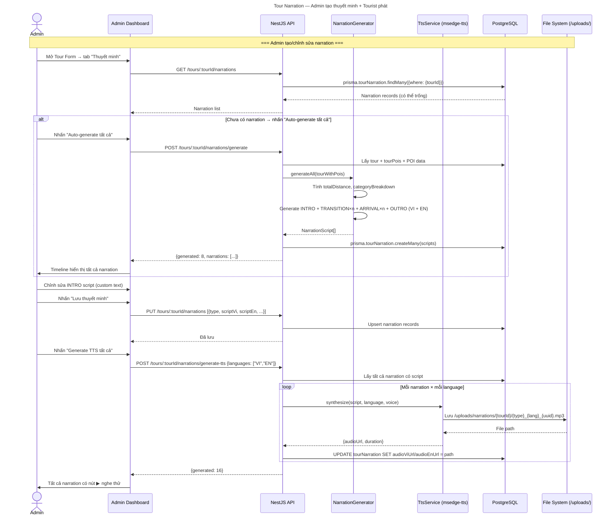
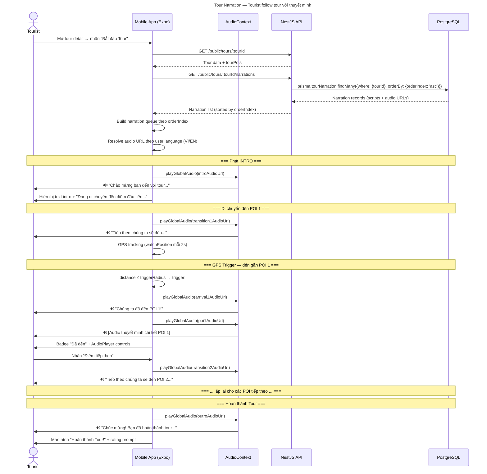
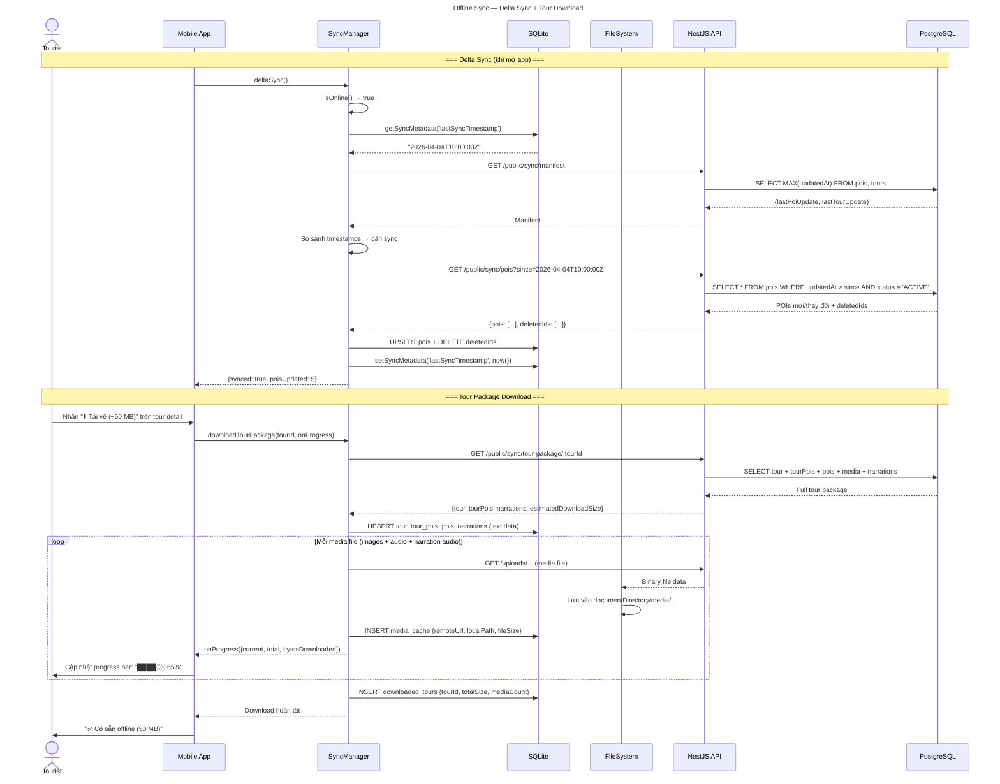
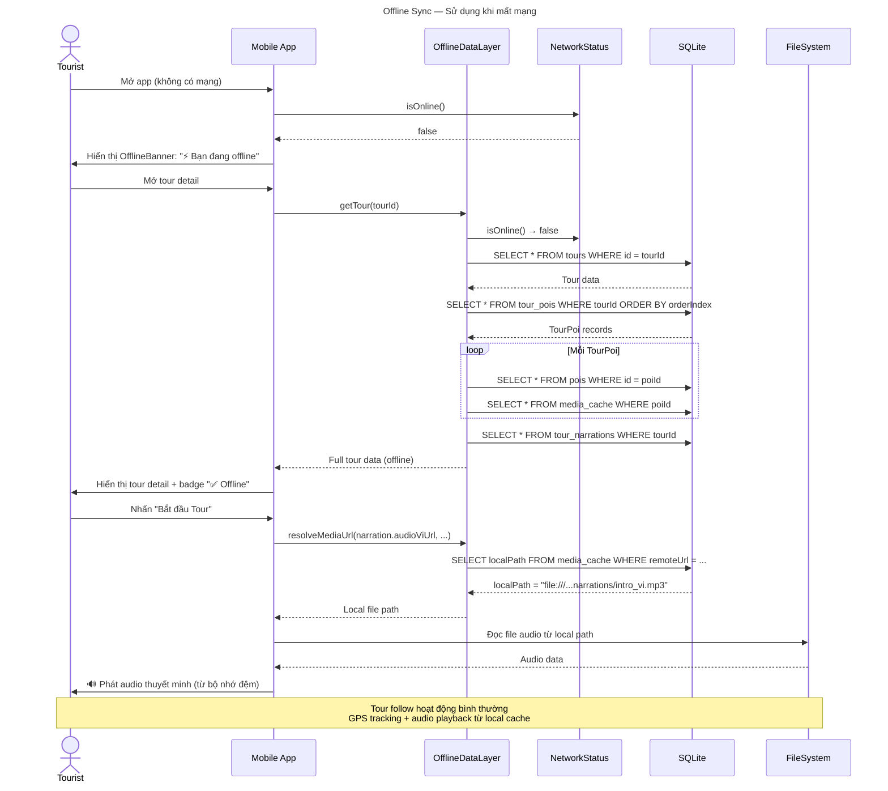

# Đặc tả Tính năng Phát triển

## Dự án GPS Tours & Phố Ẩm thực Vĩnh Khánh

> **Phiên bản:** 1.0
> **Ngày tạo:** 2026-04-05
> **Trạng thái:** Sẵn sàng phát triển
> **Đối tượng:** Đội phát triển (developer reference)

---

## Mục lục

- [Tính năng 1: Thuyết minh xuyên suốt Tour (Tour Narration)](#tính-năng-1-thuyết-minh-xuyên-suốt-tour-tour-narration)
- [Tính năng 2: Đồng bộ Offline & Tải Tour (Offline Sync)](#tính-năng-2-đồng-bộ-offline--tải-tour-offline-sync)

---

# Tính năng 1: Thuyết minh xuyên suốt Tour (Tour Narration)

## 1.1 Tổng quan

Hiện tại khi tourist follow tour, trải nghiệm bị "đứt đoạn" — chỉ phát audio tại từng POI, không có narration giữa các điểm. Tính năng này tạo trải nghiệm thuyết minh **liền mạch** xuyên suốt tour: từ lời chào khi bắt đầu, hướng dẫn giữa các điểm dừng, thông báo khi đến nơi, đến lời kết khi hoàn thành.

### Hiện trạng hệ thống

- Prisma model `TourPoi` đã có sẵn các field `customIntro`, `transitionNote`, `descriptionOverride` nhưng **chưa được sử dụng** trong playback
- TTS module (`msedge-tts`) hoạt động tốt, hỗ trợ VI/EN và nhiều ngôn ngữ khác
- Mobile tour follow screen (`apps/mobile/app/tour/follow/[id].tsx`) chỉ phát audio POI khi trigger GPS
- `AudioContext` global đã hoạt động (play/pause/seek)

### Hai loại Tour

| Loại | Người tạo | Narration |
|------|-----------|-----------|
| **Official** (`OFFICIAL`) | Admin / Shop Owner | Custom text **hoặc** auto-generate |
| **Custom** (`CUSTOM`) | Tourist | Luôn auto-generate |

## 1.2 Kiến trúc Narration

### Flow phát audio trong 1 tour

```
┌─────────────┐     ┌──────────────────────┐     ┌──────────────────────┐     ┌─────────────┐
│ Tour Intro  │ ──► │ Transition → POI 1   │ ──► │ Transition → POI 2   │ ──► │ Tour Outro  │
│ (greeting)  │     │ Arrival → POI Audio  │     │ Arrival → POI Audio  │     │ (farewell)  │
└─────────────┘     └──────────────────────┘     └──────────────────────┘     └─────────────┘
```

### 5 loại narration

| Loại | Khi nào phát | Nội dung mẫu |
|------|-------------|--------------|
| **INTRO** | Nhấn "Bắt đầu Tour" | "Chào mừng bạn đến với tour A! Tour gồm 5 điểm, trải dài 1.2km..." |
| **TRANSITION** | Rời POI hiện tại → đi đến POI tiếp | "Tiếp theo chúng ta sẽ đến Bánh tráng trộn Cô Ba, cách đây 200m..." |
| **ARRIVAL** | GPS trigger khi đến gần POI | "Chúng ta đã đến Bánh tráng trộn Cô Ba! Điểm dừng thứ 2 trong hành trình." |
| **POI_AUDIO** | Ngay sau Arrival | Audio thuyết minh chi tiết POI (đã có sẵn trong hệ thống) |
| **OUTRO** | Sau POI cuối cùng | "Chúc mừng bạn đã hoàn thành tour A! Cảm ơn bạn đã đồng hành." |

### Chế độ nội dung theo loại Tour

| Narration | Official Tour | Custom Tour (Tourist) |
|-----------|--------------|----------------------|
| INTRO | Admin/SO custom text **hoặc** auto | Luôn auto-generate |
| TRANSITION | Admin/SO custom text **hoặc** auto | Luôn auto-generate |
| ARRIVAL | Template cố định + tên POI | Template cố định + tên POI |
| POI_AUDIO | Đã có sẵn (PoiMedia) | Đã có sẵn (PoiMedia) |
| OUTRO | Admin/SO custom text **hoặc** auto | Luôn auto-generate |

## 1.3 Database Schema

### Prisma Model mới

```prisma
model TourNarration {
  id         String        @id @default(uuid())
  tourId     String
  type       NarrationType
  orderIndex Int           // Thứ tự phát: 0=intro, 1=transition→POI1, 2=arrival→POI1, ...

  // Liên kết POI (cho TRANSITION và ARRIVAL)
  fromPoiId  String?       // POI vừa rời (null cho INTRO)
  toPoiId    String?       // POI sắp đến (null cho OUTRO)

  // Nội dung song ngữ
  scriptVi   String?  @db.Text  // Nội dung tiếng Việt (null = auto-generate)
  scriptEn   String?  @db.Text  // Nội dung tiếng Anh

  // Audio TTS đã generate
  audioViUrl String?       // Đường dẫn file audio VI
  audioEnUrl String?       // Đường dẫn file audio EN

  isAutoGenerated Boolean  @default(false)
  createdAt  DateTime      @default(now())
  updatedAt  DateTime      @updatedAt

  tour       Tour    @relation(fields: [tourId], references: [id])

  @@unique([tourId, type, orderIndex])
  @@index([tourId])
}

enum NarrationType {
  INTRO
  TRANSITION
  ARRIVAL
  OUTRO
}
```

### Cập nhật Tour model

```prisma
model Tour {
  // ... fields hiện tại ...
  narrations TourNarration[]  // Thêm relation
}
```

### Ví dụ dữ liệu cho Tour có 3 POI

| orderIndex | type | fromPoiId | toPoiId | scriptVi |
|------------|------|-----------|---------|----------|
| 0 | INTRO | null | POI_1 | "Chào mừng bạn đến với tour..." |
| 1 | TRANSITION | null | POI_1 | "Điểm đầu tiên là..." |
| 2 | ARRIVAL | null | POI_1 | "Chúng ta đã đến POI 1!" |
| 3 | TRANSITION | POI_1 | POI_2 | "Tiếp theo, đi 200m về phía..." |
| 4 | ARRIVAL | POI_1 | POI_2 | "Đã đến POI 2!" |
| 5 | TRANSITION | POI_2 | POI_3 | "Điểm cuối cùng cách đây 150m..." |
| 6 | ARRIVAL | POI_2 | POI_3 | "Đã đến POI 3!" |
| 7 | OUTRO | POI_3 | null | "Chúc mừng bạn đã hoàn thành!" |

## 1.4 Auto-generation Templates

Khi Admin/Shop Owner không viết custom text, hoặc cho Custom Tour của Tourist, hệ thống tự tạo nội dung dựa trên metadata.

### Dữ liệu đầu vào cho generator

```typescript
interface TourGenerationContext {
  tourName: string;
  tourDescription?: string;
  totalDistance: number;        // Tổng khoảng cách (meters) - tính từ Haversine
  estimatedDuration: number;    // Phút - tính từ (distance/75) + (poiCount * 10)
  poiCount: number;
  categoryBreakdown: Record<string, number>;  // { DINING: 3, STREET_FOOD: 2, ... }
  pois: Array<{
    name: string;
    category: string;
    description?: string;
    distanceFromPrev: number;   // Meters từ POI trước
    walkTimeFromPrev: number;   // Phút đi bộ
    orderIndex: number;
  }>;
}
```

### Template INTRO

```
VI: "Chào mừng bạn đến với {tourName}! {tourDescription || ''}.
    Tour gồm {poiCount} điểm dừng, trải dài khoảng {totalDistance}m,
    dự kiến {estimatedDuration} phút đi bộ.
    Bạn sẽ khám phá {categoryList}.
    Hãy bắt đầu hành trình nào!"

EN: "Welcome to {tourName}! {tourDescription || ''}.
    This tour has {poiCount} stops, covering approximately {totalDistance}m,
    estimated {estimatedDuration} minutes on foot.
    You'll explore {categoryList}.
    Let's begin!"
```

**Ví dụ thực tế:**
> "Chào mừng bạn đến với Tour Ẩm thực Vĩnh Khánh! Khám phá những món ăn đường phố nổi tiếng nhất Quận 4. Tour gồm 5 điểm dừng, trải dài khoảng 1200m, dự kiến 35 phút đi bộ. Bạn sẽ khám phá ẩm thực đường phố, quán cà phê và chợ đặc sản. Hãy bắt đầu hành trình nào!"

### Template TRANSITION

```
VI: "Tuyệt vời! Tiếp theo chúng ta sẽ đến {nextPoiName},
    cách đây khoảng {distance}m, đi bộ khoảng {walkTime} phút.
    {categoryHint}"

EN: "Wonderful! Next we'll head to {nextPoiName},
    about {distance}m away, roughly {walkTime} minutes on foot.
    {categoryHint}"
```

**categoryHint** — gợi ý dựa theo loại POI:
- `DINING` → "Đây là một quán ăn nổi tiếng trong khu vực."
- `STREET_FOOD` → "Một điểm ẩm thực đường phố không thể bỏ qua."
- `CAFES_DESSERTS` → "Nơi thưởng thức cà phê và tráng miệng tuyệt vời."
- `CULTURAL_LANDMARKS` → "Một di tích văn hóa đặc sắc."
- Khác → Dùng `poi.description` (cắt 100 ký tự đầu) hoặc bỏ trống.

### Template ARRIVAL

```
VI: "Chúng ta đã đến {poiName}! Đây là điểm dừng thứ {n} trong hành trình.
    Hãy cùng lắng nghe câu chuyện về nơi này."

EN: "We've arrived at {poiName}! This is stop {n} on our journey.
    Let's hear the story of this place."
```

### Template OUTRO

```
VI: "Chúc mừng! Bạn đã hoàn thành {tourName}.
    Hôm nay chúng ta đã ghé thăm {poiCount} địa điểm
    và đi qua khoảng {totalDistance}m.
    Cảm ơn bạn đã đồng hành, hẹn gặp lại ở chuyến tham quan tiếp theo!"

EN: "Congratulations! You've completed {tourName}.
    Today we visited {poiCount} locations
    covering about {totalDistance}m.
    Thank you for joining, see you on the next adventure!"
```

## 1.5 API Endpoints

### Narration CRUD (Admin / Shop Owner)

| Method | Endpoint | Mô tả | Auth |
|--------|----------|-------|------|
| `GET` | `/tours/:tourId/narrations` | Lấy tất cả narration của tour | JWT (Admin/SO) |
| `PUT` | `/tours/:tourId/narrations` | Batch upsert narrations (tạo/sửa) | JWT (Admin/SO) |
| `DELETE` | `/tours/:tourId/narrations/:id` | Xóa 1 narration | JWT (Admin/SO) |

### Auto-generate + TTS

| Method | Endpoint | Mô tả | Auth |
|--------|----------|-------|------|
| `POST` | `/tours/:tourId/narrations/generate` | Auto-generate tất cả narration scripts | JWT (Admin/SO) |
| `POST` | `/tours/:tourId/narrations/generate-tts` | Generate TTS audio cho tất cả narration | JWT (Admin/SO) |
| `POST` | `/tours/:tourId/narrations/:id/tts` | Generate TTS cho 1 narration cụ thể | JWT (Admin/SO) |

### Public (Mobile)

| Method | Endpoint | Mô tả | Auth |
|--------|----------|-------|------|
| `GET` | `/public/tours/:tourId/narrations` | Lấy narrations cho mobile playback | Không |

### Request/Response mẫu

**PUT `/tours/:tourId/narrations`** — Batch upsert:

```json
// Request body
{
  "narrations": [
    {
      "type": "INTRO",
      "orderIndex": 0,
      "toPoiId": "poi-uuid-1",
      "scriptVi": "Chào mừng bạn đến với tour ẩm thực...",
      "scriptEn": "Welcome to the food tour..."
    },
    {
      "type": "TRANSITION",
      "orderIndex": 1,
      "fromPoiId": null,
      "toPoiId": "poi-uuid-1",
      "scriptVi": null  // null = sẽ auto-generate
    }
  ]
}
```

**POST `/tours/:tourId/narrations/generate`** — Auto-generate:

```json
// Request body (optional overrides)
{
  "types": ["INTRO", "TRANSITION", "ARRIVAL", "OUTRO"],  // Chỉ generate các loại này
  "overwriteExisting": false  // false = chỉ generate cho narration chưa có custom text
}

// Response
{
  "generated": 8,
  "skipped": 2,  // Đã có custom text, không overwrite
  "narrations": [...]
}
```

**POST `/tours/:tourId/narrations/generate-tts`** — Generate TTS audio:

```json
// Request body (optional)
{
  "languages": ["VI", "EN"],  // Generate cho ngôn ngữ nào
  "narrationIds": ["id1", "id2"]  // Chỉ generate cho các narration cụ thể (null = tất cả)
}

// Response
{
  "generated": 16,  // 8 narrations × 2 languages
  "narrations": [
    {
      "id": "...",
      "type": "INTRO",
      "audioViUrl": "/uploads/narrations/tour-id/intro_vi.mp3",
      "audioEnUrl": "/uploads/narrations/tour-id/intro_en.mp3"
    }
  ]
}
```

**GET `/public/tours/:tourId/narrations`** — Mobile fetch:

```json
// Response
[
  {
    "id": "...",
    "type": "INTRO",
    "orderIndex": 0,
    "toPoiId": "poi-1",
    "scriptVi": "Chào mừng...",
    "scriptEn": "Welcome...",
    "audioViUrl": "/uploads/narrations/.../intro_vi.mp3",
    "audioEnUrl": "/uploads/narrations/.../intro_en.mp3"
  },
  // ... các narration khác theo orderIndex
]
```

## 1.6 Backend Implementation

### File structure mới

```
apps/api/src/modules/tours/
├── tours.service.ts          (hiện tại)
├── tours.controller.ts       (hiện tại)
├── narration/
│   ├── narration.service.ts       // CRUD + auto-generate logic
│   ├── narration.controller.ts    // API endpoints
│   ├── narration-generator.ts     // Template engine cho auto-generate
│   ├── dto/
│   │   ├── upsert-narration.dto.ts
│   │   ├── generate-narration.dto.ts
│   │   └── generate-tts.dto.ts
│   └── narration.module.ts
```

### NarrationGenerator — Template engine

```typescript
// narration-generator.ts
@Injectable()
export class NarrationGenerator {

  generateIntro(ctx: TourGenerationContext, lang: 'VI' | 'EN'): string { ... }
  generateTransition(ctx: TourGenerationContext, fromIndex: number, lang: 'VI' | 'EN'): string { ... }
  generateArrival(poiName: string, stopNumber: number, lang: 'VI' | 'EN'): string { ... }
  generateOutro(ctx: TourGenerationContext, lang: 'VI' | 'EN'): string { ... }

  /**
   * Generate tất cả narration scripts cho 1 tour
   * @returns Array<{type, orderIndex, fromPoiId, toPoiId, scriptVi, scriptEn}>
   */
  generateAll(tour: TourWithPois): NarrationScript[] { ... }
}
```

### TTS Integration

Tái sử dụng `TtsService` hiện tại (`msedge-tts`):

```typescript
// narration.service.ts
async generateTtsForNarration(narrationId: string, languages: string[]) {
  const narration = await this.prisma.tourNarration.findUnique({...});

  for (const lang of languages) {
    const script = lang === 'VI' ? narration.scriptVi : narration.scriptEn;
    if (!script) continue;

    const audioPath = await this.ttsService.synthesize(script, lang);
    // Lưu audio path vào narration record
    await this.prisma.tourNarration.update({
      where: { id: narrationId },
      data: lang === 'VI' ? { audioViUrl: audioPath } : { audioEnUrl: audioPath },
    });
  }
}
```

### Lưu trữ audio

```
uploads/
├── tts/                    (POI audio — hiện tại)
├── narrations/             (Tour narration audio — MỚI)
│   ├── {tourId}/
│   │   ├── intro_vi_{uuid}.mp3
│   │   ├── intro_en_{uuid}.mp3
│   │   ├── transition_01_vi_{uuid}.mp3
│   │   ├── arrival_01_vi_{uuid}.mp3
│   │   └── outro_vi_{uuid}.mp3
```

## 1.7 Admin UI — Tour Narration Editor

### Vị trí trong giao diện

Trong trang **Tour Form** (`TourFormPage.tsx` / `ShopOwnerPOIFormPage.tsx`), thêm tab mới **"Thuyết minh"** bên cạnh tab thông tin tour hiện tại.

### Giao diện

```
┌─────────────────────────────────────────────────────────────┐
│  Tour Form    [Thông tin]  [Điểm dừng]  [Thuyết minh ✨]   │
├─────────────────────────────────────────────────────────────┤
│                                                             │
│  [Auto-generate tất cả]  [Generate TTS tất cả]             │
│                                                             │
│  ── Timeline View ──                                        │
│                                                             │
│  🎬 INTRO                                                   │
│  ┌─────────────────────────────────────────────────────┐    │
│  │ ☐ Tự động tạo   ☑ Custom                           │    │
│  │ [VI] Chào mừng bạn đến với tour...                 │    │
│  │ [EN] Welcome to the tour...                         │    │
│  │ 🔊 [▶ Nghe thử VI]  [▶ Nghe thử EN]  [🔄 Tạo TTS]│    │
│  └─────────────────────────────────────────────────────┘    │
│        │                                                    │
│        ▼                                                    │
│  🚶 TRANSITION → Bánh tráng trộn Cô Ba (200m, ~3 phút)    │
│  ┌─────────────────────────────────────────────────────┐    │
│  │ ☑ Tự động tạo   ☐ Custom                           │    │
│  │ [Preview] "Tiếp theo chúng ta sẽ đến..."           │    │
│  └─────────────────────────────────────────────────────┘    │
│        │                                                    │
│        ▼                                                    │
│  📍 ARRIVAL → Bánh tráng trộn Cô Ba                        │
│  ┌─────────────────────────────────────────────────────┐    │
│  │ [Auto] "Chúng ta đã đến Bánh tráng trộn Cô Ba!"   │    │
│  └─────────────────────────────────────────────────────┘    │
│        │                                                    │
│        ▼                                                    │
│  🎵 POI Audio (đã có sẵn — không chỉnh ở đây)              │
│        │                                                    │
│        ▼                                                    │
│  🚶 TRANSITION → Bún mắm Cô Sáu (350m, ~5 phút)           │
│  ...                                                        │
│        │                                                    │
│        ▼                                                    │
│  🏁 OUTRO                                                   │
│  ┌─────────────────────────────────────────────────────┐    │
│  │ ☐ Tự động tạo   ☑ Custom                           │    │
│  │ [VI] Cảm ơn bạn đã tham gia tour...                │    │
│  └─────────────────────────────────────────────────────┘    │
│                                                             │
│                          [💾 Lưu thuyết minh]               │
└─────────────────────────────────────────────────────────────┘
```

## 1.8 Mobile Playback — Cải tiến Tour Follow

### Narration Queue

Khi tourist bắt đầu tour, mobile fetch narrations và xây dựng **playback queue**:

```typescript
// Narration playback queue
interface NarrationQueueItem {
  narrationId: string;
  type: NarrationType;
  audioUrl: string;        // Resolved URL theo user language
  script: string;          // Text fallback nếu không có audio
  targetPoiId?: string;    // POI liên quan
  triggerCondition: 'immediate' | 'on_departure' | 'on_arrival';
}
```

### Flow phát audio cải tiến

```
Nhấn "Bắt đầu Tour"
  ├── Fetch GET /public/tours/:id/narrations
  ├── Build narration queue
  └── Phát [INTRO audio] ← tự động

Đang di chuyển đến POI 1:
  ├── Phát [TRANSITION audio → POI 1] ← khi nhấn "Tiếp tục" hoặc auto
  └── Hiển thị text: "Đang di chuyển đến {POI 1}... ~200m"

GPS trigger (đến gần POI 1):
  ├── Phát [ARRIVAL audio: "Đã đến POI 1!"]
  ├── Phát [POI 1 audio] ← audio thuyết minh chi tiết (đã có)
  └── Badge "Đã đến" + AudioPlayer

Nhấn "Điểm tiếp theo":
  ├── Phát [TRANSITION audio → POI 2]
  └── ... lặp lại ...

Hoàn thành POI cuối:
  ├── Phát [OUTRO audio]
  └── Màn hình "Hoàn thành Tour!" (đã có)
```

### Xử lý Custom Tour (Tourist)

Custom tour không có narration trong DB → mobile tự generate text từ template rồi dùng TTS on-device hoặc hiển thị text:

```typescript
// Option A: Gọi API generate on-the-fly
const narrations = await api.post(`/public/tours/${tourId}/narrations/generate-onthefly`);

// Option B: Generate text phía client (không cần API, nhanh hơn)
const narrations = generateClientNarration(tour);
// Hiển thị text thay vì audio (vì chưa có TTS)
```

**Khuyến nghị:** Dùng **Option B** — generate text client-side cho custom tour, chỉ hiển thị text (không audio). Giữ audio narration chỉ cho Official tour.

## 1.9 Sequence Diagram





## 1.10 Kế hoạch thực hiện

| Giai đoạn | Công việc | Thời gian |
|-----------|-----------|-----------|
| **1. Database** | Prisma migration: TourNarration model + enum | 0.5 ngày |
| **2. Backend Core** | NarrationService (CRUD), NarrationController, DTOs | 1.5 ngày |
| **3. Auto-generate** | NarrationGenerator (template engine + category hints) | 1 ngày |
| **4. TTS** | Tích hợp TtsService cho narration, lưu trữ audio files | 1 ngày |
| **5. Admin UI** | Tab "Thuyết minh" trong TourForm: timeline view, textarea, preview | 2 ngày |
| **6. Mobile** | Cải tiến tour follow: narration queue, sequential playback | 2 ngày |
| **7. Test & Polish** | E2E test flow, edge cases (tour không có narration, audio lỗi) | 1 ngày |
| | **Tổng** | **~9 ngày** |

## 1.11 Edge Cases & Lưu ý

1. **Tour không có narration** → Mobile fallback: phát POI audio như hiện tại (backward compatible)
2. **Narration có script nhưng chưa có audio** → Hiển thị text trên màn hình thay vì phát audio
3. **Thay đổi POI trong tour** → Khi thêm/xóa/reorder POI, narration cũ bị invalid → cần auto-regenerate hoặc cảnh báo admin
4. **Custom tour** → Client-side text generation, không cần audio (tiết kiệm server resources)
5. **Audio queue** → Nếu user skip (nhấn "Tiếp theo" nhanh), dừng audio hiện tại và phát cái tiếp theo
6. **Ngôn ngữ** → Ưu tiên ngôn ngữ user chọn; fallback sang VI nếu EN không có

---
---

# Tính năng 2: Đồng bộ Offline & Tải Tour (Offline Sync)

## 2.1 Tổng quan

Cho phép Tourist tải trước dữ liệu tour/POI (text + audio + images) khi có WiFi, sử dụng đầy đủ khi mất mạng. Đặc biệt quan trọng cho tourist nước ngoài không có data roaming.

### Hiện trạng hệ thống

- **SQLite** đã có (`expo-sqlite` v16): table `offline_pois` cơ bản (chỉ text, không media)
- **QR offline fallback** hoạt động một phần trong `scanner.tsx`
- **FileSystem** chưa dùng cho media caching
- **Network detection**: `expo-network` đã cài nhưng chưa dùng
- Không có sync endpoint phía backend

## 2.2 Kiến trúc tổng thể

```
┌─────────────────────────────────────────────────────────┐
│                    Mobile App (Expo)                     │
│                                                         │
│  ┌──────────────┐  ┌──────────────┐  ┌───────────────┐ │
│  │   SQLite     │  │  FileSystem  │  │  SyncManager  │ │
│  │  (text data) │  │ (media files)│  │ (coordinator) │ │
│  │              │  │              │  │               │ │
│  │ - pois       │  │ - images/    │  │ - detectNet() │ │
│  │ - tours      │  │ - audio/     │  │ - deltaSync() │ │
│  │ - tour_pois  │  │              │  │ - download()  │ │
│  │ - media_cache│  │              │  │ - cleanup()   │ │
│  │ - sync_meta  │  │              │  │               │ │
│  └──────┬───────┘  └──────┬───────┘  └───────┬───────┘ │
│         │                 │                   │         │
│         └─────────────────┼───────────────────┘         │
│                           │                             │
│  ┌────────────────────────┼────────────────────────┐    │
│  │       OfflineDataLayer (routing layer)           │    │
│  │  isOnline? → API call : SQLite/FileSystem query  │    │
│  └──────────────────────────────────────────────────┘    │
│                           │                             │
└───────────────────────────┼─────────────────────────────┘
                            │
                    ┌───────▼───────┐
                    │  NestJS API   │
                    │  /public/sync │
                    └───────────────┘
```

## 2.3 Database Schema

### Backend — Prisma (thêm field cho sync)

Không cần model mới. Chỉ sử dụng `updatedAt` đã có trên `Poi` và `Tour` để theo dõi thay đổi.

### Mobile — SQLite Schema (mở rộng)

```sql
-- Thay thế bảng offline_pois hiện tại → mở rộng đầy đủ
CREATE TABLE IF NOT EXISTS pois (
  id             TEXT PRIMARY KEY,
  nameVi         TEXT NOT NULL,
  nameEn         TEXT,
  descriptionVi  TEXT,
  descriptionEn  TEXT,
  latitude       REAL NOT NULL,
  longitude      REAL NOT NULL,
  category       TEXT NOT NULL,
  triggerRadius   INTEGER DEFAULT 15,
  syncedAt       INTEGER NOT NULL  -- unix timestamp
);

CREATE TABLE IF NOT EXISTS tours (
  id                TEXT PRIMARY KEY,
  nameVi            TEXT NOT NULL,
  nameEn            TEXT,
  descriptionVi     TEXT,
  descriptionEn     TEXT,
  tourType          TEXT NOT NULL,     -- OFFICIAL | CUSTOM
  estimatedDuration INTEGER,
  thumbnailLocalPath TEXT,             -- Đường dẫn thumbnail đã tải
  syncedAt          INTEGER NOT NULL
);

CREATE TABLE IF NOT EXISTS tour_pois (
  id                  TEXT PRIMARY KEY,
  tourId              TEXT NOT NULL,
  poiId               TEXT NOT NULL,
  orderIndex          INTEGER NOT NULL,
  titleOverride       TEXT,
  descriptionOverride TEXT,
  customIntro         TEXT,
  transitionNote      TEXT,
  estimatedStayMinutes INTEGER,
  FOREIGN KEY (tourId) REFERENCES tours(id) ON DELETE CASCADE,
  FOREIGN KEY (poiId) REFERENCES pois(id)
);

-- Tour narration (offline cache)
CREATE TABLE IF NOT EXISTS tour_narrations (
  id         TEXT PRIMARY KEY,
  tourId     TEXT NOT NULL,
  type       TEXT NOT NULL,           -- INTRO | TRANSITION | ARRIVAL | OUTRO
  orderIndex INTEGER NOT NULL,
  scriptVi   TEXT,
  scriptEn   TEXT,
  audioViLocalPath TEXT,              -- Đường dẫn file audio VI đã tải
  audioEnLocalPath TEXT,              -- Đường dẫn file audio EN đã tải
  FOREIGN KEY (tourId) REFERENCES tours(id) ON DELETE CASCADE
);

-- Media cache (images + audio đã tải)
CREATE TABLE IF NOT EXISTS media_cache (
  id           TEXT PRIMARY KEY,
  poiId        TEXT NOT NULL,
  type         TEXT NOT NULL,         -- IMAGE | AUDIO
  language     TEXT NOT NULL,         -- VI | EN | ALL
  remoteUrl    TEXT NOT NULL,         -- URL trên server
  localPath    TEXT NOT NULL,         -- Đường dẫn file đã tải xuống
  fileSize     INTEGER,              -- Bytes
  durationSec  REAL,                 -- Chỉ cho AUDIO
  downloadedAt INTEGER NOT NULL,
  FOREIGN KEY (poiId) REFERENCES pois(id)
);

-- Sync metadata
CREATE TABLE IF NOT EXISTS sync_metadata (
  key       TEXT PRIMARY KEY,
  value     TEXT NOT NULL,
  updatedAt INTEGER NOT NULL
);
-- Keys: 'lastSyncTimestamp', 'lastManifestHash', etc.

-- Bảng theo dõi tour đã download
CREATE TABLE IF NOT EXISTS downloaded_tours (
  tourId       TEXT PRIMARY KEY,
  totalSize    INTEGER NOT NULL,     -- Tổng dung lượng (bytes)
  mediaCount   INTEGER NOT NULL,     -- Số file media đã tải
  downloadedAt INTEGER NOT NULL,
  FOREIGN KEY (tourId) REFERENCES tours(id)
);
```

## 2.4 API Endpoints mới (Backend)

### Sync Module

Tạo module mới: `apps/api/src/modules/sync/`

| Method | Endpoint | Mô tả | Response |
|--------|----------|-------|----------|
| `GET` | `/public/sync/manifest` | Tổng quan dữ liệu + lastModified | `{poisCount, toursCount, lastPoiUpdate, lastTourUpdate}` |
| `GET` | `/public/sync/pois?since=ISO` | POIs thay đổi từ timestamp | `{pois: Poi[], deletedIds: string[]}` |
| `GET` | `/public/sync/tours?since=ISO` | Tours thay đổi từ timestamp | `{tours: Tour[], deletedIds: string[]}` |
| `GET` | `/public/sync/tour-package/:tourId` | Full tour + POIs + media URLs + narrations | Xem bên dưới |

### Response mẫu

**GET `/public/sync/manifest`**

```json
{
  "poisCount": 42,
  "toursCount": 8,
  "lastPoiUpdate": "2026-04-05T10:30:00.000Z",
  "lastTourUpdate": "2026-04-04T15:00:00.000Z",
  "totalMediaSize": 524288000  // ~500MB tổng media
}
```

**GET `/public/sync/pois?since=2026-04-01T00:00:00Z`**

```json
{
  "pois": [
    {
      "id": "poi-1",
      "nameVi": "Bánh tráng trộn Cô Ba",
      "nameEn": "Co Ba's Mixed Rice Paper",
      "descriptionVi": "...",
      "descriptionEn": "...",
      "latitude": 10.7543,
      "longitude": 106.6956,
      "category": "STREET_FOOD",
      "triggerRadius": 15,
      "media": [
        {
          "id": "media-1",
          "type": "IMAGE",
          "language": "ALL",
          "url": "/uploads/pois/poi-1/image.jpg",
          "sizeBytes": 512000
        },
        {
          "id": "media-2",
          "type": "AUDIO",
          "language": "VI",
          "url": "/uploads/tts/poi-1_vi_xxx/audio.mp3",
          "sizeBytes": 2048000,
          "durationSeconds": 45
        }
      ],
      "updatedAt": "2026-04-03T14:00:00.000Z"
    }
  ],
  "deletedIds": ["poi-old-1", "poi-old-2"]
}
```

**GET `/public/sync/tour-package/:tourId`**

```json
{
  "tour": {
    "id": "tour-1",
    "nameVi": "Tour Ẩm thực Vĩnh Khánh",
    "nameEn": "Vinh Khanh Food Tour",
    "descriptionVi": "...",
    "estimatedDuration": 90,
    "thumbnailUrl": "/uploads/tours/tour-1/thumb.jpg"
  },
  "tourPois": [
    {
      "id": "tp-1",
      "poiId": "poi-1",
      "orderIndex": 0,
      "titleOverride": null,
      "poi": { /* full POI with media[] */ }
    }
  ],
  "narrations": [
    {
      "id": "nar-1",
      "type": "INTRO",
      "orderIndex": 0,
      "scriptVi": "Chào mừng...",
      "audioViUrl": "/uploads/narrations/tour-1/intro_vi.mp3",
      "audioEnUrl": "/uploads/narrations/tour-1/intro_en.mp3"
    }
  ],
  "estimatedDownloadSize": 52428800  // ~50MB
}
```

## 2.5 Mobile — SyncManager

### File structure

```
apps/mobile/services/
├── database.ts           (hiện tại — cần mở rộng)
├── syncManager.ts        (MỚI — coordinator)
├── offlineDataLayer.ts   (MỚI — online/offline routing)
├── mediaDownloader.ts    (MỚI — download + cache media files)
└── networkStatus.ts      (MỚI — network state monitoring)
```

### SyncManager

```typescript
// syncManager.ts
import * as FileSystem from 'expo-file-system';
import * as Network from 'expo-network';

class SyncManager {
  /**
   * Delta sync — đồng bộ dữ liệu text (POIs, Tours)
   * Gọi khi app mở hoặc user nhấn "Sync Now"
   */
  async deltaSync(): Promise<SyncResult> {
    const isOnline = await this.isOnline();
    if (!isOnline) return { synced: false, reason: 'offline' };

    const lastSync = await db.getSyncMetadata('lastSyncTimestamp');
    const manifest = await api.get('/public/sync/manifest');

    // So sánh lastSync với manifest.lastPoiUpdate / lastTourUpdate
    if (needsSync) {
      const poisData = await api.get(`/public/sync/pois?since=${lastSync}`);
      await db.upsertPois(poisData.pois);
      await db.deletePois(poisData.deletedIds);

      const toursData = await api.get(`/public/sync/tours?since=${lastSync}`);
      await db.upsertTours(toursData.tours);
      await db.deleteTours(toursData.deletedIds);

      await db.setSyncMetadata('lastSyncTimestamp', new Date().toISOString());
    }
    return { synced: true, poisUpdated: ..., toursUpdated: ... };
  }

  /**
   * Download tour package — tải full tour cho offline
   * Gọi khi user nhấn "Download Tour"
   */
  async downloadTourPackage(
    tourId: string,
    onProgress: (progress: DownloadProgress) => void
  ): Promise<void> {
    const pkg = await api.get(`/public/sync/tour-package/${tourId}`);

    // 1. Lưu text data vào SQLite
    await db.upsertTour(pkg.tour);
    await db.upsertTourPois(pkg.tourPois);
    for (const tp of pkg.tourPois) {
      await db.upsertPoi(tp.poi);
    }
    await db.upsertNarrations(pkg.narrations);

    // 2. Thu thập tất cả media URLs cần tải
    const mediaItems = this.collectMediaUrls(pkg);
    let downloaded = 0;

    // 3. Tải từng file media
    for (const item of mediaItems) {
      const localPath = `${FileSystem.documentDirectory}media/${item.type}/${item.id}`;
      await FileSystem.downloadAsync(getMediaUrl(item.remoteUrl), localPath);

      await db.insertMediaCache({
        id: item.id,
        poiId: item.poiId,
        type: item.type,
        language: item.language,
        remoteUrl: item.remoteUrl,
        localPath,
        fileSize: item.sizeBytes,
      });

      downloaded++;
      onProgress({
        current: downloaded,
        total: mediaItems.length,
        currentFile: item.originalName,
        bytesDownloaded: ...,
        totalBytes: pkg.estimatedDownloadSize,
      });
    }

    // 4. Đánh dấu tour đã download
    await db.markTourDownloaded(tourId, pkg.estimatedDownloadSize, mediaItems.length);
  }

  /**
   * Xóa dữ liệu offline của tour
   */
  async removeTourOfflineData(tourId: string): Promise<void> {
    const mediaFiles = await db.getMediaCacheForTour(tourId);
    for (const file of mediaFiles) {
      await FileSystem.deleteAsync(file.localPath, { idempotent: true });
    }
    await db.deleteMediaCacheForTour(tourId);
    await db.deleteNarrationsForTour(tourId);
    await db.unmarkTourDownloaded(tourId);
  }

  async isOnline(): Promise<boolean> {
    const state = await Network.getNetworkStateAsync();
    return state.isConnected === true && state.isInternetReachable === true;
  }
}
```

### OfflineDataLayer — Online/Offline routing

```typescript
// offlineDataLayer.ts

class OfflineDataLayer {
  private syncManager = new SyncManager();

  /**
   * Lấy POI detail — tự động chọn source
   */
  async getPoi(poiId: string): Promise<PoiData> {
    if (await this.syncManager.isOnline()) {
      try {
        return await publicService.getPoiDetail(poiId);
      } catch {
        // API lỗi → fallback offline
        return this.getOfflinePoi(poiId);
      }
    }
    return this.getOfflinePoi(poiId);
  }

  /**
   * Lấy tour detail — tự động chọn source
   */
  async getTour(tourId: string): Promise<TourData> {
    if (await this.syncManager.isOnline()) {
      try {
        return await publicService.getTourDetail(tourId);
      } catch {
        return this.getOfflineTour(tourId);
      }
    }
    return this.getOfflineTour(tourId);
  }

  /**
   * Resolve media URL — local file nếu có, remote nếu online
   */
  async resolveMediaUrl(remoteUrl: string, poiId: string): Promise<string> {
    // Kiểm tra media_cache trước
    const cached = await db.getMediaCacheByUrl(remoteUrl);
    if (cached) {
      const exists = await FileSystem.getInfoAsync(cached.localPath);
      if (exists.exists) return cached.localPath;
    }
    // Không có cache → dùng remote URL
    return getMediaUrl(remoteUrl);
  }

  private async getOfflinePoi(poiId: string): Promise<PoiData> {
    const poi = await db.getPoi(poiId);
    if (!poi) throw new Error('POI not available offline');
    const media = await db.getMediaCache(poiId);
    return { ...poi, media };
  }

  private async getOfflineTour(tourId: string): Promise<TourData> {
    const tour = await db.getTour(tourId);
    if (!tour) throw new Error('Tour not available offline');
    const tourPois = await db.getTourPois(tourId);
    const narrations = await db.getNarrations(tourId);
    // Resolve POI data cho mỗi tourPoi
    for (const tp of tourPois) {
      tp.poi = await this.getOfflinePoi(tp.poiId);
    }
    return { ...tour, tourPois, narrations };
  }
}
```

## 2.6 UI Components mới (Mobile)

### DownloadTourButton

Hiển thị trên tour detail screen:

```
┌─────────────────────────────────────┐
│  Tour Ẩm thực Vĩnh Khánh           │
│  5 điểm dừng · 90 phút             │
│                                     │
│  ┌───────────────────────────────┐  │
│  │  ⬇️  Tải về (~50 MB)          │  │  ← Chưa tải
│  └───────────────────────────────┘  │
│                                     │
│  ┌───────────────────────────────┐  │
│  │  ████████░░░░  65% · 32/50MB  │  │  ← Đang tải
│  └───────────────────────────────┘  │
│                                     │
│  ┌───────────────────────────────┐  │
│  │  ✅ Có sẵn offline (50 MB)    │  │  ← Đã tải
│  │       [Xóa dữ liệu offline]  │  │
│  └───────────────────────────────┘  │
└─────────────────────────────────────┘
```

### OfflineBanner

Banner trên đầu màn hình khi mất mạng:

```
┌─────────────────────────────────────┐
│ ⚡ Bạn đang offline — Dữ liệu từ   │
│    bộ nhớ đệm                       │
└─────────────────────────────────────┘
```

### SyncStatusScreen

Trong tab "Thêm" → "Đồng bộ dữ liệu Offline":

```
┌─────────────────────────────────────┐
│  Dữ liệu Offline                   │
│                                     │
│  Đồng bộ lần cuối: 5 phút trước    │
│  [🔄 Đồng bộ ngay]                 │
│                                     │
│  ── Tours đã tải ──                 │
│                                     │
│  📦 Tour Ẩm thực Vĩnh Khánh        │
│     50 MB · 5 POIs · Tải 2 giờ trước│
│     [🗑️ Xóa]                        │
│                                     │
│  📦 Tour Di tích Quận 4             │
│     35 MB · 3 POIs · Tải hôm qua   │
│     [🗑️ Xóa]                        │
│                                     │
│  ── Tổng dung lượng ──              │
│  85 MB / Khả dụng: 2.1 GB          │
│                                     │
│  [🗑️ Xóa tất cả dữ liệu offline]  │
└─────────────────────────────────────┘
```

## 2.7 Sync Strategy

### Delta Sync (tự động, nền)

```
App mở lên
  ├── Kiểm tra network status
  ├── Nếu online:
  │     ├── GET /public/sync/manifest
  │     ├── So sánh lastPoiUpdate / lastTourUpdate với lastSyncTimestamp
  │     ├── Nếu có thay đổi:
  │     │     ├── GET /public/sync/pois?since=lastSync
  │     │     ├── Upsert POIs vào SQLite
  │     │     ├── GET /public/sync/tours?since=lastSync
  │     │     ├── Upsert Tours vào SQLite
  │     │     └── Cập nhật lastSyncTimestamp
  │     └── Nếu không → skip
  └── Nếu offline → skip, dùng data cũ
```

### Tour Package Download (user-initiated)

```
User nhấn "Tải về" trên tour detail
  ├── GET /public/sync/tour-package/:tourId
  ├── Lưu text data → SQLite (tour, tour_pois, pois, narrations)
  ├── Thu thập media URLs (images + audio + narration audio)
  ├── Download từng file → FileSystem.documentDirectory
  │     ├── media/images/{poiId}/{mediaId}.jpg
  │     ├── media/audio/{poiId}/{mediaId}.mp3
  │     └── media/narrations/{tourId}/{narrationId}_{lang}.mp3
  ├── Lưu local paths → media_cache table
  ├── Đánh dấu → downloaded_tours table
  └── Hiển thị badge "✅ Có sẵn offline"
```

### Conflict Resolution

**Strategy: Server-wins** — Dữ liệu server luôn là nguồn sự thật:
- Khi sync, data mới từ server ghi đè data cũ trong SQLite
- POI bị xóa trên server (`deletedIds`) → xóa khỏi SQLite + xóa media cache
- Tour thay đổi POIs → cần re-download package

## 2.8 Offline Detection & Routing

### NetworkStatusProvider

```typescript
// networkStatus.ts — Hook cho toàn app
import * as Network from 'expo-network';

export function useNetworkStatus() {
  const [isOnline, setIsOnline] = useState(true);

  useEffect(() => {
    // Check ban đầu
    Network.getNetworkStateAsync().then(state => {
      setIsOnline(state.isConnected && state.isInternetReachable);
    });

    // Polling mỗi 10s (expo-network không có listener)
    const interval = setInterval(async () => {
      const state = await Network.getNetworkStateAsync();
      setIsOnline(state.isConnected && state.isInternetReachable);
    }, 10000);

    return () => clearInterval(interval);
  }, []);

  return isOnline;
}
```

### Tích hợp vào các màn hình hiện tại

Các màn hình cần cập nhật:

| Màn hình | Thay đổi |
|----------|----------|
| `(tabs)/index.tsx` (Map) | Dùng `OfflineDataLayer.getAllPois()` thay `publicService.getAllPois()` |
| `poi/[id].tsx` (POI detail) | Dùng `OfflineDataLayer.getPoi()` + `resolveMediaUrl()` |
| `tour/[id].tsx` (Tour detail) | Dùng `OfflineDataLayer.getTour()` + hiển thị `DownloadTourButton` |
| `tour/follow/[id].tsx` (Tour follow) | Dùng `OfflineDataLayer.getTour()` + resolve narration & POI audio |
| `scanner.tsx` (QR) | Dùng `OfflineDataLayer.getPoi()` thay logic hiện tại |
| `(tabs)/more.tsx` (Settings) | Link đến `SyncStatusScreen` |

## 2.9 Sequence Diagram





## 2.10 Kế hoạch thực hiện

| Giai đoạn | Công việc | Thời gian |
|-----------|-----------|-----------|
| **1. Backend Sync API** | Sync module: manifest, delta pois/tours, tour-package endpoints | 2 ngày |
| **2. Mobile SQLite** | Mở rộng schema, migration từ `offline_pois` cũ, CRUD functions | 1.5 ngày |
| **3. SyncManager** | Delta sync logic, network detection, auto-sync on app open | 1.5 ngày |
| **4. Media Downloader** | FileSystem download, progress tracking, resume/retry | 2 ngày |
| **5. OfflineDataLayer** | Online/offline routing, media URL resolution, fallback logic | 1.5 ngày |
| **6. UI Components** | DownloadTourButton, OfflineBanner, SyncStatusScreen | 2 ngày |
| **7. Tích hợp** | Cập nhật tất cả màn hình dùng OfflineDataLayer | 1.5 ngày |
| **8. Testing** | Offline scenarios, partial download, network switching, cleanup | 2 ngày |
| | **Tổng** | **~14 ngày** |

## 2.11 Lưu ý & Edge Cases

1. **Dung lượng** — Tour 10 POIs × 2 ngôn ngữ × (1 ảnh + 1 audio) ≈ 100-250 MB. Cần hiển thị size trước khi download và kiểm tra dung lượng khả dụng.
2. **Download bị gián đoạn** — Lưu progress vào SQLite; khi resume, skip files đã tải (check `media_cache`).
3. **Tour thay đổi sau khi download** — Khi delta sync phát hiện tour `updatedAt` mới hơn `downloaded_tours.downloadedAt` → hiển thị badge "Cần cập nhật" + nút "Re-download".
4. **Xóa dữ liệu** — Cho phép xóa từng tour hoặc tất cả. Xóa cả files trong FileSystem + records SQLite.
5. **POI dùng chung** — Nếu 2 tour dùng chung POI, media chỉ tải 1 lần. Khi xóa tour, kiểm tra POI còn được dùng bởi tour khác không trước khi xóa media.
6. **WiFi-only download** — Mặc định chỉ download khi có WiFi. Cho phép user toggle "Cho phép tải bằng dữ liệu di động" trong settings.
7. **Background download** — Hiện tại chỉ hỗ trợ foreground. Có thể mở rộng với `expo-background-fetch` sau.

---

## Tổng kết & Roadmap

```
Tuần 1-2:   [======= Tour Narration (Backend + Admin UI) =======]
Tuần 2-3:   [======= Tour Narration (Mobile playback) =======]
Tuần 3-4:   [======= Offline Sync (Backend + SyncManager) =======]
Tuần 4-5:   [======= Offline Sync (Media download + UI) =======]
Tuần 5-6:   [======= Offline Sync (Tích hợp + Testing) =======]
```

**Tổng thời gian: ~5-6 tuần** (2 tính năng phát triển có phần song song)

### Dependencies giữa 2 tính năng

- **Tour Narration phải hoàn thành trước Offline Sync** — vì Offline Sync cần download narration audio files
- Offline Sync tour-package endpoint cần include narration data
- Mobile offline playback cần resolve cả POI audio + narration audio từ local cache

### Files cần tạo mới

**Backend:**
- `apps/api/prisma/migrations/xxx_tour_narration/migration.sql`
- `apps/api/src/modules/tours/narration/` (module, service, controller, DTOs, generator)
- `apps/api/src/modules/sync/` (module, service, controller)

**Mobile:**
- `apps/mobile/services/syncManager.ts`
- `apps/mobile/services/offlineDataLayer.ts`
- `apps/mobile/services/mediaDownloader.ts`
- `apps/mobile/services/networkStatus.ts`
- `apps/mobile/components/DownloadTourButton.tsx`
- `apps/mobile/components/OfflineBanner.tsx`
- `apps/mobile/app/sync-status.tsx`

**Admin:**
- `apps/admin/src/components/tours/NarrationEditor.tsx`
