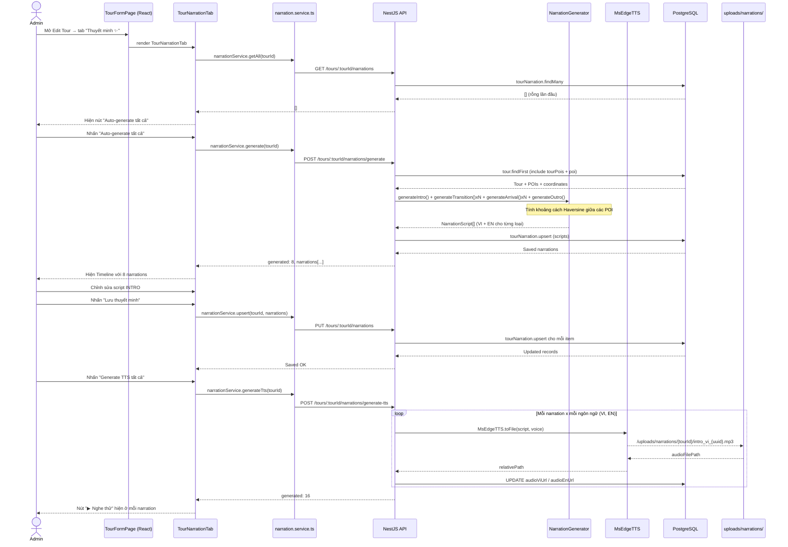
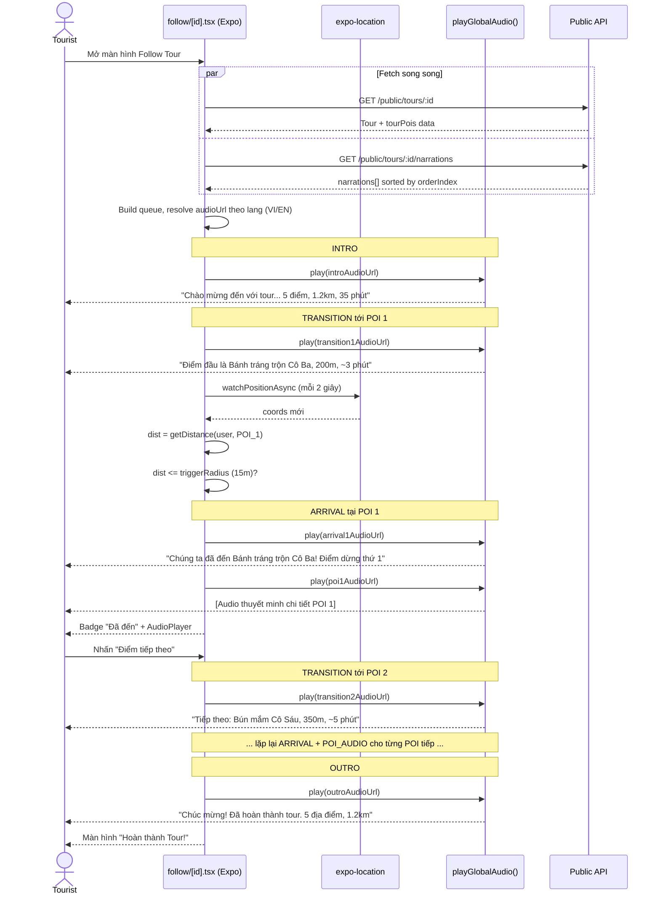
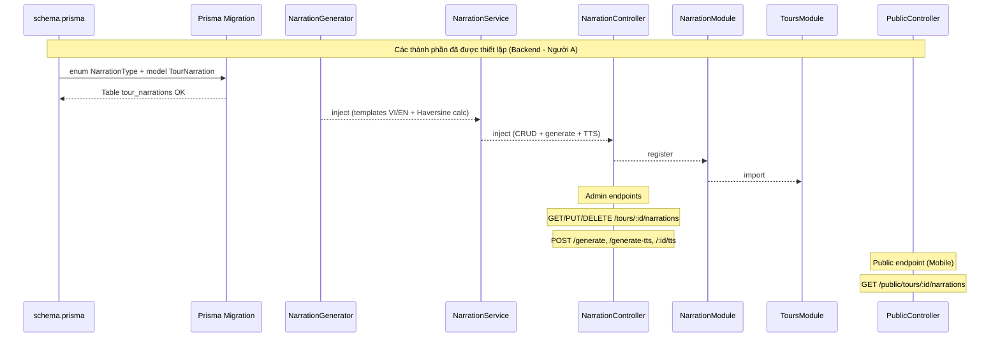

# Handoff: Tính năng Tour Narration — Frontend & Mobile

> **Dành cho:** Người B (Admin UI + Mobile)
> **Ngày:** 2026-04-06
> **Tính năng:** Thuyết minh xuyên suốt Tour (Tour Narration)
> **Trạng thái Backend:** ✅ Hoàn tất — API sẵn sàng để tích hợp

---

## Tổng quan nhanh

Backend đã triển khai xong toàn bộ. Bạn chỉ cần làm **2 việc**:

1. **Admin UI** — Thêm Tab "Thuyết minh ✨" vào `TourFormPage.tsx`
2. **Mobile** — Nâng cấp `apps/mobile/app/tour/follow/[id].tsx` để phát narration liên mạch

---

## Phần 1: API Backend đã có sẵn

Base URL: `http://localhost:3000` (hoặc theo biến môi trường của dự án)

### 1.1 Endpoints dành cho Admin UI

| Method | URL | Mô tả |
|--------|-----|--------|
| `GET` | `/tours/:tourId/narrations` | Lấy tất cả narrations của tour |
| `PUT` | `/tours/:tourId/narrations` | Batch upsert (tạo/cập nhật) narrations |
| `DELETE` | `/tours/:tourId/narrations/:id` | Xóa 1 narration |
| `POST` | `/tours/:tourId/narrations/generate` | **Auto-generate** tất cả scripts (VI + EN) |
| `POST` | `/tours/:tourId/narrations/generate-tts` | **Generate TTS audio** cho tất cả narrations |
| `POST` | `/tours/:tourId/narrations/:id/tts` | Generate TTS cho **1 narration** cụ thể |

### 1.2 Endpoint dành cho Mobile (Public, không cần auth)

| Method | URL | Mô tả |
|--------|-----|--------|
| `GET` | `/public/tours/:tourId/narrations` | Lấy narration queue cho playback |

---

## Phần 2: Kiểu dữ liệu (TypeScript Types)

```typescript
// Các loại narration
type NarrationType = 'INTRO' | 'TRANSITION' | 'ARRIVAL' | 'OUTRO';

// Object narration trả về từ API
interface TourNarration {
  id: string;
  type: NarrationType;
  orderIndex: number;       // Thứ tự phát: 0, 1, 2, 3, ...
  fromPoiId: string | null; // POI vừa rời (null cho INTRO)
  toPoiId: string | null;   // POI sắp đến (null cho OUTRO)
  scriptVi: string | null;  // Script tiếng Việt
  scriptEn: string | null;  // Script tiếng Anh
  audioViUrl: string | null; // URL file audio VI (vd: /uploads/narrations/.../intro_vi.mp3)
  audioEnUrl: string | null; // URL file audio EN
  isAutoGenerated?: boolean;
}

// Request body cho PUT upsert
interface UpsertNarrationPayload {
  narrations: Array<{
    type: NarrationType;
    orderIndex: number;
    fromPoiId?: string | null;
    toPoiId?: string | null;
    scriptVi?: string | null;
    scriptEn?: string | null;
  }>;
}

// Request body cho POST generate
interface GenerateNarrationPayload {
  types?: NarrationType[];     // Mặc định: tất cả 4 loại
  overwriteExisting?: boolean; // Mặc định: false (giữ custom text)
}

// Request body cho POST generate-tts
interface GenerateTtsPayload {
  languages?: string[];        // Mặc định: ['VI', 'EN']
  narrationIds?: string[];     // Mặc định: tất cả narrations của tour
}
```

---

## Phần 3: Admin UI — Tab "Thuyết minh"

### 3.1 Nơi cần sửa

File: `apps/admin/src/pages/admin/TourFormPage.tsx`

`TourFormPage` hiện đang render thẳng form, **chưa có hệ thống tabs**. Bạn cần:
1. Bọc nội dung form hiện tại vào tab **"Thông tin & Điểm dừng"**
2. Thêm tab mới **"Thuyết minh ✨"** bên cạnh

### 3.2 Gợi ý cấu trúc Tabs trong `TourFormPage.tsx`

```tsx
// Thêm state tab vào TourFormPage
const [activeTab, setActiveTab] = useState<'info' | 'narration'>('info');

// Render tabs header (đặt trên form hiện tại)
<div className="flex border-b border-slate-200 mb-6">
  <button
    onClick={() => setActiveTab('info')}
    className={`px-5 py-2.5 text-sm font-medium border-b-2 transition-colors ${
      activeTab === 'info'
        ? 'border-blue-600 text-blue-600'
        : 'border-transparent text-slate-500 hover:text-slate-700'
    }`}
  >
    Thông tin & Điểm dừng
  </button>

  {/* Chỉ hiện tab này khi đang sửa tour (isEditMode), vì cần tourId */}
  {isEditMode && (
    <button
      onClick={() => setActiveTab('narration')}
      className={`px-5 py-2.5 text-sm font-medium border-b-2 transition-colors ${
        activeTab === 'narration'
          ? 'border-purple-600 text-purple-600'
          : 'border-transparent text-slate-500 hover:text-slate-700'
      }`}
    >
      Thuyết minh ✨
    </button>
  )}
</div>

{activeTab === 'info' && (
  <>{/* Nội dung form hiện tại của TourFormPage */}</>
)}

{activeTab === 'narration' && id && (
  <TourNarrationTab tourId={id} />
)}
```

### 3.3 Component `TourNarrationTab` — Cần tạo mới

Tạo file: `apps/admin/src/components/TourNarrationTab.tsx`

**Logic flow:**
```
1. Mount → gọi GET /tours/:tourId/narrations
2. Nếu rỗng → hiện nút "Auto-generate tất cả" nổi bật
3. Hiện danh sách dạng Timeline (xem mockup)
4. Mỗi narration:
   - Badge loại: 🎬 INTRO / 🚶 TRANSITION / 📍 ARRIVAL / 🏁 OUTRO
   - Textarea script VI + EN (chỉnh sửa được)
   - Nút "▶ Nghe thử" nếu đã có audioUrl
   - Nút "🔄 Tạo TTS" cho từng narration riêng lẻ
5. Nút "💾 Lưu thuyết minh" → PUT /tours/:tourId/narrations
6. Nút "🔊 Generate TTS tất cả" → POST ...generate-tts
```

**Mockup Timeline:**
```
┌───────────────────────────────────────────────────────────┐
│  [🔄 Auto-generate tất cả]  [🔊 Generate TTS tất cả]      │
├───────────────────────────────────────────────────────────┤
│  🎬 INTRO                                                 │
│  ┌─────────────────────────────────────────────────────┐  │
│  │ [VI] textarea "Chào mừng bạn đến với tour A!..."   │  │
│  │ [EN] textarea "Welcome to tour A!..."               │  │
│  │ [▶ Nghe VI]  [▶ Nghe EN]  [🔄 Tạo TTS]            │  │
│  └─────────────────────────────────────────────────────┘  │
│        │ (đường kẻ dọc timeline)                          │
│        ▼                                                   │
│  🚶 TRANSITION → Bánh tráng trộn Cô Ba (~200m, ~3 phút)  │
│  ┌─────────────────────────────────────────────────────┐  │
│  │ [VI] textarea ...    [EN] textarea ...              │  │
│  └─────────────────────────────────────────────────────┘  │
│        │                                                   │
│        ▼                                                   │
│  📍 ARRIVAL → Bánh tráng trộn Cô Ba                       │
│  ┌─────────────────────────────────────────────────────┐  │
│  │ [VI] "Chúng ta đã đến Bánh tráng trộn Cô Ba!..."   │  │
│  └─────────────────────────────────────────────────────┘  │
│        │                                                   │
│        ▼  (... lặp lại cho từng POI ...)                  │
│        │                                                   │
│        ▼                                                   │
│  🏁 OUTRO                                                  │
│  ┌─────────────────────────────────────────────────────┐  │
│  │ [VI] textarea "Chúc mừng bạn đã hoàn thành!..."    │  │
│  └─────────────────────────────────────────────────────┘  │
│                                                           │
│                          [💾 Lưu thuyết minh]             │
└───────────────────────────────────────────────────────────┘
```

### 3.4 File service cần tạo

Tạo: `apps/admin/src/services/narration.service.ts`

```typescript
const API_BASE = import.meta.env.VITE_API_URL || 'http://localhost:3000';

const authHeaders = () => ({
  'Content-Type': 'application/json',
  Authorization: `Bearer ${localStorage.getItem('token')}`,
});

export const narrationService = {
  getAll: (tourId: string) =>
    fetch(`${API_BASE}/tours/${tourId}/narrations`, { headers: authHeaders() }).then(r => r.json()),

  upsert: (tourId: string, body: UpsertNarrationPayload) =>
    fetch(`${API_BASE}/tours/${tourId}/narrations`, {
      method: 'PUT', headers: authHeaders(), body: JSON.stringify(body),
    }).then(r => r.json()),

  generate: (tourId: string, body: GenerateNarrationPayload = {}) =>
    fetch(`${API_BASE}/tours/${tourId}/narrations/generate`, {
      method: 'POST', headers: authHeaders(), body: JSON.stringify(body),
    }).then(r => r.json()), // { generated, skipped, narrations[] }

  generateTts: (tourId: string, body: GenerateTtsPayload = {}) =>
    fetch(`${API_BASE}/tours/${tourId}/narrations/generate-tts`, {
      method: 'POST', headers: authHeaders(), body: JSON.stringify(body),
    }).then(r => r.json()), // { generated, narrations[] }

  generateSingleTts: (tourId: string, narrationId: string) =>
    fetch(`${API_BASE}/tours/${tourId}/narrations/${narrationId}/tts`, {
      method: 'POST', headers: authHeaders(), body: JSON.stringify({ languages: ['VI', 'EN'] }),
    }).then(r => r.json()),

  delete: (tourId: string, narrationId: string) =>
    fetch(`${API_BASE}/tours/${tourId}/narrations/${narrationId}`, {
      method: 'DELETE', headers: authHeaders(),
    }),
};
```

---

## Phần 4: Mobile — Nâng cấp Tour Follow Screen

### 4.1 Nơi cần sửa

File: `apps/mobile/app/tour/follow/[id].tsx`

### 4.2 Những gì cần thêm

Hiện tại screen chỉ phát POI audio khi GPS. Cần bổ sung:
1. Fetch narrations từ API khi khởi động
2. Phát **INTRO** tự động khi bắt đầu tour
3. Phát **TRANSITION** khi nhấn "Điểm tiếp theo"
4. Phát **ARRIVAL** khi GPS trigger (trước POI audio hiện tại)
5. Phát **OUTRO** khi hoàn thành POI cuối

### 4.3 State và helpers cần thêm vào `[id].tsx`

```typescript
// 1. Thêm state
const [narrations, setNarrations] = useState<TourNarration[]>([]);

// 2. Fetch cùng tourData
const fetchTourData = async () => {
  if (typeof id !== 'string') return;
  const [data, narrationData] = await Promise.all([
    isCustom ? touristService.getMyTourDetail(id) : publicService.getTourDetail(id),
    fetch(`${API_BASE}/public/tours/${id}/narrations`).then(r => r.json()).catch(() => []),
  ]);
  setTour(data);
  setNarrations(narrationData ?? []);
};

// 3. Helper: tìm narration theo type + POI đích
const findNarration = (type: NarrationType, toPoiId?: string) =>
  narrations.find(n => n.type === type && (!toPoiId || n.toPoiId === toPoiId));

// 4. Helper: lấy audio URL theo ngôn ngữ
const getNarrationUrl = (n: TourNarration): string | null => {
  const url = lang === 'EN' ? n.audioEnUrl : n.audioViUrl;
  return url ? getMediaUrl(url) : null;
};
```

### 4.4 Điểm phát audio

```typescript
// A. BẮT ĐẦU TOUR — phát INTRO (thêm vào useEffect khi narrations load)
useEffect(() => {
  if (!narrations.length || !tour) return;
  const intro = findNarration('INTRO');
  if (intro) {
    const url = getNarrationUrl(intro);
    if (url) playGlobalAudio(url);
  }
  // Phát TRANSITION đến POI đầu tiên ngay sau intro
  const firstPoiId = tour.tourPois?.[0]?.poiId;
  if (firstPoiId) {
    const transition = findNarration('TRANSITION', firstPoiId);
    if (transition) {
      // Queue sau khi intro kết thúc (dùng audio.onEnded hoặc setTimeout)
      const tUrl = getNarrationUrl(transition);
      if (tUrl) { /* queue */ }
    }
  }
}, [narrations]);

// B. GPS TRIGGER — thêm ARRIVAL ngay trước khi setTriggeredStops
if (dist <= (targetPoi.triggerRadius || 50) && !triggeredStops.has(currentStep)) {
  const currentPoiId = currentTourPois[currentStep].poiId;
  const arrival = findNarration('ARRIVAL', currentPoiId);
  if (arrival) {
    const aUrl = getNarrationUrl(arrival);
    if (aUrl) playGlobalAudio(aUrl);
    // POI audio phát tiếp sau (dùng queue/onEnded)
  }
  setTriggeredStops(prev => new Set(prev).add(currentStep));
}

// C. NHẤN "Điểm tiếp theo" — phát TRANSITION đến điểm kế
const handleNextStop = () => {
  const nextIndex = currentStep + 1;
  if (nextIndex < currentTourPois.length) {
    const nextPoiId = currentTourPois[nextIndex].poiId;
    const transition = findNarration('TRANSITION', nextPoiId);
    if (transition) {
      const tUrl = getNarrationUrl(transition);
      if (tUrl) playGlobalAudio(tUrl);
    }
  }
  setCurrentStep(nextIndex);
};

// D. HOÀN THÀNH TOUR — phát OUTRO
useEffect(() => {
  if (!isFinished || !narrations.length) return;
  const outro = findNarration('OUTRO');
  if (outro) {
    const oUrl = getNarrationUrl(outro);
    if (oUrl) playGlobalAudio(oUrl);
  }
}, [isFinished]);
```

### 4.5 Hiển thị text fallback

Khi script có nhưng audio chưa được tạo, hiển thị text trong bottomCard:

```tsx
{currentNarrationText && (
  <View style={{ backgroundColor: '#f0f9ff', borderRadius: 8, padding: 10, marginBottom: 12 }}>
    <Text style={{ fontSize: 13, color: '#0369a1', fontStyle: 'italic' }}>
      💬 {currentNarrationText}
    </Text>
  </View>
)}
```

---

## Phần 5: Edge Cases cần xử lý

| Tình huống | Xử lý |
|------------|--------|
| `narrations = []` | Bỏ qua toàn bộ logic narration, giữ flow cũ |
| Có script, chưa có audio | Hiển thị text thay vì phát audio |
| Custom Tour (Tourist) | API public có thể trả về rỗng → fallback hoàn toàn |
| User nhấn "Tiếp theo" nhanh khi đang phát | Dừng audio hiện tại, phát TRANSITION mới |
| Ngôn ngữ EN nhưng `audioEnUrl = null` | Fallback sang audioViUrl |

---

## Phần 6: Danh sách file cần tạo/sửa

| File | Hành động | Ghi chú |
|------|-----------|---------|
| `apps/admin/src/services/narration.service.ts` | **Tạo mới** | Service gọi API |
| `apps/admin/src/components/TourNarrationTab.tsx` | **Tạo mới** | Timeline UI Component |
| `apps/admin/src/pages/admin/TourFormPage.tsx` | **Sửa** | Thêm Tab system |
| `apps/mobile/app/tour/follow/[id].tsx` | **Sửa** | Thêm narration queue |

---

## Phần 7: Ước lượng thời gian (~2 ngày)

| Công việc | Thời gian |
|-----------|-----------|
| Admin: Tab system + narration.service.ts | 3 giờ |
| Admin: TourNarrationTab (Timeline UI) | 4 giờ |
| Mobile: Fetch + build queue + INTRO/OUTRO | 3 giờ |
| Mobile: TRANSITION/ARRIVAL triggers | 2 giờ |
| Mobile: Text fallback & edge cases | 1 giờ |
| Test tích hợp với Backend | 1 giờ |
| **Tổng** | **~14 giờ** |

---

> Nếu có vấn đề với API (response sai, thiếu field, lỗi 5xx) → báo với **Người A (Backend)**.
> Database đã có bảng `tour_narrations`. API compile sạch ✅

---

## Phần 8: Sequence Diagrams

### 8.1 Luồng Admin — Tạo & quản lý thuyết minh



### 8.2 Luồng Tourist — Follow Tour với thuyết minh liên mạch



### 8.3 Sơ đồ kiến trúc Backend (đã hoàn thành)


