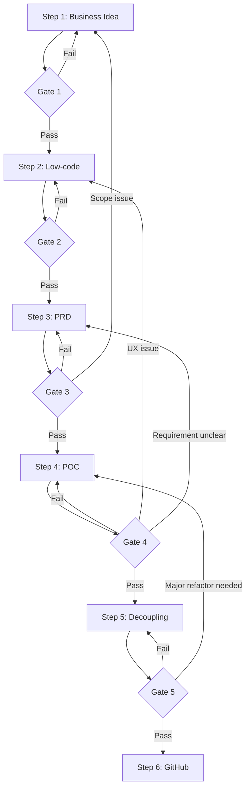

# 🚀 Vibe Coding Framework v2.0

> **Quy trình phát triển sản phẩm nhanh với AI có kiểm soát**
> 
> Phiên bản tối ưu cho dự án **Greenfield** (bắt đầu từ số 0)

---

## 📋 Mục lục

1. [Tổng quan Framework](#1-tổng-quan-framework)
2. [Quy trình 6 bước](#2-quy-trình-6-bước)
3. [Quality Gates](#3-quality-gates)
4. [Prompt Templates (CRTO+)](#4-prompt-templates-crto)
5. [Feedback Loops](#5-feedback-loops)
6. [Checklist & DoD](#6-checklist--dod)

---

## 1. Tổng quan Framework

### 1.1 Triết lý cốt lõi

```
Vibe Coding ≠ Code theo cảm hứng
Vibe Coding = Tăng tốc phát triển với AI + Kiểm soát chất lượng
```

### 1.2 Nguyên tắc chính

| Nguyên tắc | Mô tả |
|------------|-------|
| **Artifact-Driven** | Mỗi bước tạo ra output rõ ràng, có thể review |
| **Quality Gates** | Checkpoint giữa mỗi bước để validate chất lượng |
| **Feedback Loops** | Cho phép quay lại bước trước khi phát hiện vấn đề |
| **Single Source of Truth** | PRD là tài liệu gốc, mọi implementation phải map về PRD |
| **Incremental Delivery** | MVP first, iterate sau |

### 1.3 Kiến trúc tổng quan

```
┌─────────────────────────────────────────────────────────────────────────────┐
│                           VIBE CODING FRAMEWORK v2.0                        │
├─────────────────────────────────────────────────────────────────────────────┤
│                                                                             │
│  ┌──────────┐    ┌──────────┐    ┌──────────┐    ┌──────────┐    ┌────────┐│
│  │ STEP 1   │───▶│ STEP 2   │───▶│ STEP 3   │───▶│ STEP 4   │───▶│ STEP 5 ││
│  │ Business │    │ Low-code │    │   PRD    │    │   POC    │    │Decouple││
│  │   Idea   │    │ UI+Flow  │    │ BA Role  │    │ Dev Role │    │Refactor││
│  └────┬─────┘    └────┬─────┘    └────┬─────┘    └────┬─────┘    └───┬────┘│
│       │               │               │               │              │     │
│       ▼               ▼               ▼               ▼              ▼     │
│   [Gate 1]        [Gate 2]        [Gate 3]        [Gate 4]       [Gate 5]  │
│  Scope Lock      Design Rev      PRD Approval    Demo Pass      Code Rev   │
│       │               │               │               │              │     │
│       └───────────────┴───────────────┴───────────────┴──────────────┘     │
│                                   │                                         │
│                                   ▼                                         │
│                            ┌──────────┐                                     │
│                            │ STEP 6   │                                     │
│                            │ GitHub   │                                     │
│                            │ Delivery │                                     │
│                            └──────────┘                                     │
│                                                                             │
├─────────────────────────────────────────────────────────────────────────────┤
│  TOOLS LAYER                                                                │
│  ┌────────────┐  ┌────────────┐  ┌────────────┐  ┌────────────┐            │
│  │ AI Studio  │  │  Claude/   │  │   Cursor   │  │  GitHub    │            │
│  │ Gemini     │  │  ChatGPT   │  │   Copilot  │  │  Actions   │            │
│  └────────────┘  └────────────┘  └────────────┘  └────────────┘            │
└─────────────────────────────────────────────────────────────────────────────┘
```

---

## 2. Quy trình 6 bước

### Step 1: Business Idea (Requirements Intake)

**Mục tiêu:** Xác định vấn đề, người dùng, và phạm vi MVP

**Input:**
- Ý tưởng sản phẩm
- Thông tin thị trường/người dùng
- Constraints (budget, timeline, team)

**Output:**
- `requirements_intake.md`:
  - Problem statement
  - Target users
  - MVP scope (in/out)
  - Success metrics
  - Constraints

**Công cụ:** Perplexity (research), ChatGPT/Claude (brainstorm)

---

### Step 2: Low-code (UI + Flow + Rule)

**Mục tiêu:** Phác thảo hệ thống ở mức "low-code" - chốt nhanh phạm vi trước khi chi tiết

**Input:**
- `requirements_intake.md` từ Step 1

**Output:**
- `screens.md` - Danh sách màn hình với states
- `user_flows.md` - Luồng thao tác (happy path + edge cases)
- `business_rules.md` - Quy tắc nghiệp vụ có ID
- `data_fields.md` - Cấu trúc dữ liệu cơ bản
- `ui_mockups/` - Phác thảo giao diện (optional)

**Công cụ:** Google AI Studio, Figma, v0.dev

---

### Step 3: PRD (BA Role)

**Mục tiêu:** Chuẩn hóa yêu cầu thành tài liệu "buildable"

**Input:**
- Tất cả outputs từ Step 2

**Output:**
- `PRD.md`:
  - User Stories (INVEST format)
  - Functional Requirements
  - Acceptance Criteria (Given-When-Then)
  - Non-Functional Requirements
  - Data Requirements
  - API Contracts
  - Dependencies & Risks
  - Open Questions

**Công cụ:** Claude, ChatGPT

---

### Step 4: POC (Dev Role)

**Mục tiêu:** Triển khai bản chạy được end-to-end

**Input:**
- `PRD.md` từ Step 3
- UI mockups từ Step 2

**Output:**
- Working prototype với:
  - Core features implemented
  - API integration (real hoặc mock)
  - Basic UI states (loading, empty, error)
- `implementation_notes.md`
- Smoke test results

**Công cụ:** Cursor, Copilot, Claude

---

### Step 5: Decoupling (Refactor)

**Mục tiêu:** Chuyển từ "chạy được" sang "maintainable"

**Input:**
- POC code từ Step 4

**Output:**
- Refactored codebase:
  - UI-logic separation
  - Reusable components/hooks
  - Consistent naming/structure
- `refactoring_log.md`
- Updated tests

**Công cụ:** IDE, ESLint, Prettier

---

### Step 6: GitHub Delivery

**Mục tiêu:** Bàn giao theo chuẩn kỹ thuật

**Input:**
- Refactored code từ Step 5

**Output:**
- Clean Git history
- Pull Request với description
- CI/CD passing
- Updated README
- Changelog

**Công cụ:** GitHub, GitHub Actions

---

## 3. Quality Gates

### Gate 1: Scope Lock (sau Step 1)

| Check | Criteria |
|-------|----------|
| ☐ | MVP scope được định nghĩa rõ ràng? |
| ☐ | In-scope / Out-scope được liệt kê? |
| ☐ | Target users được xác định? |
| ☐ | Success metrics có thể đo được? |
| ☐ | Stakeholder đã đồng ý scope? |

**Pass criteria:** Tất cả items checked

---

### Gate 2: Design Review (sau Step 2)

| Check | Criteria |
|-------|----------|
| ☐ | Tất cả screens được liệt kê? |
| ☐ | Mỗi screen có đủ 4 states (loading/empty/error/success)? |
| ☐ | User flows có ≥5 edge cases per screen? |
| ☐ | Business rules có ID unique? |
| ☐ | Data fields đủ cho UI? |

**Pass criteria:** ≥80% items checked

---

### Gate 3: PRD Approval (sau Step 3)

| Check | Criteria |
|-------|----------|
| ☐ | User Stories theo INVEST format? |
| ☐ | Acceptance Criteria dạng Given-When-Then? |
| ☐ | Non-functional requirements có measurable targets? |
| ☐ | API contracts documented? |
| ☐ | Open questions có owner và due date? |
| ☐ | Stakeholder signed off? |

**Pass criteria:** Tất cả items checked

---

### Gate 4: Demo Pass (sau Step 4)

| Check | Criteria |
|-------|----------|
| ☐ | Happy path chạy được end-to-end? |
| ☐ | Error states hiển thị đúng? |
| ☐ | API integration hoạt động? |
| ☐ | Smoke tests pass? |
| ☐ | Demo cho stakeholder thành công? |

**Pass criteria:** ≥80% items checked

---

### Gate 5: Code Review (sau Step 5)

| Check | Criteria |
|-------|----------|
| ☐ | UI-logic tách biệt? |
| ☐ | Không có duplicate code? |
| ☐ | Naming conventions consistent? |
| ☐ | Lint/format pass? |
| ☐ | Build succeeds? |
| ☐ | Tests pass (nếu có)? |

**Pass criteria:** Tất cả items checked

---

## 4. Prompt Templates (CRTO+)

### Cấu trúc CRTO+ (Context-Role-Task-Output + Extensions)

```markdown
--Context--
[Ngữ cảnh dự án, ràng buộc, inputs]

--Role--
[Vai trò AI cần đóng]

--Task--
[Nhiệm vụ cụ thể, step-by-step]

--Output--
[Format output mong muốn, structure rõ ràng]

--Constraints-- [NEW]
[Những gì KHÔNG được làm]

--Edge Cases-- [NEW]
[Các trường hợp đặc biệt cần xử lý]

--Validation-- [NEW]
[Checklist để verify output đúng]

--Anti-patterns-- [NEW]
[Lỗi phổ biến cần tránh]
```

---

### Template: Step 1 - Business Idea

```markdown
--Context--
Tôi cần xây dựng [MÔ TẢ SẢN PHẨM 1-2 câu].
Target users: [NGƯỜI DÙNG MỤC TIÊU]
Constraints: 
- Timeline: [THỜI GIAN]
- Budget: [NGÂN SÁCH nếu có]
- Team: [QUY MÔ TEAM]

--Role--
Bạn là Product Manager + Business Analyst.

--Task--
1. Phân tích problem statement
2. Xác định MVP scope (in/out)
3. Định nghĩa success metrics
4. Liệt kê assumptions và risks

--Output--
## Requirements Intake

### 1. Problem Statement
[Vấn đề cần giải quyết]

### 2. Target Users
| Persona | Characteristics | Pain Points |

### 3. MVP Scope
**In-scope:**
- [Feature 1]
- [Feature 2]

**Out-of-scope:**
- [Feature X]

### 4. Success Metrics
| Metric | Target | How to Measure |

### 5. Assumptions
- [Assumption 1]

### 6. Risks
| Risk | Impact | Mitigation |

--Constraints--
• Focus MVP only - không thêm features "nice-to-have"
• Realistic với constraints đã nêu

--Validation--
☐ Problem statement rõ ràng?
☐ Scope in/out được phân biệt?
☐ Metrics đo được?
```

---

### Template: Step 2 - Low-code

```markdown
--Context--
Dự án: [TÊN PROJECT]
MVP scope từ Step 1:
- [Feature 1]
- [Feature 2]
- [Feature 3]

--Role--
Bạn là BA + UX Designer + Information Architect.

--Task--
1. Liệt kê tất cả screens cần có cho MVP
2. Vẽ user flows cho mỗi screen (happy + edge cases)
3. Định nghĩa business rules với ID
4. Xác định data fields cần thiết

--Output--
## A. SCREEN LIST
| ID | Screen | Purpose | UI Blocks | States |
|----|--------|---------|-----------|--------|
| S01 | | | | loading/empty/error/success |

## B. USER FLOWS
### Screen: [Tên screen]
**Happy Path:**
1. User [action 1]
2. System [response]
3. ...

**Edge Cases:**
| ID | Scenario | Expected Behavior |
|----|----------|-------------------|
| EC01 | [Situation] | [How to handle] |
| EC02 | | |
| EC03 | | |
| EC04 | | |
| EC05 | | |

## C. BUSINESS RULES
| ID | Rule Name | Condition | Action | Priority |
|----|-----------|-----------|--------|----------|
| BR01 | | IF... | THEN... | High/Medium/Low |

## D. DATA FIELDS
| Entity | Field | Type | Required | Validation |
|--------|-------|------|----------|------------|

--Constraints--
• MVP scope only - KHÔNG thêm screen ngoài scope
• Mỗi screen PHẢI có ít nhất 4 states
• Mỗi flow PHẢI có ít nhất 5 edge cases

--Edge Cases to Consider--
• Network error
• Empty data
• Invalid input
• Permission denied
• Timeout
• Concurrent actions

--Validation--
☐ Tất cả features trong scope có screen?
☐ Mỗi screen có đủ states?
☐ Business rules có ID unique?
☐ Edge cases ≥5 per screen?

--Anti-patterns--
✗ Chỉ có happy path
✗ Business rules không ID
✗ Thiếu error states
```

---

### Template: Step 3 - PRD

```markdown
--Context--
Dự án: [TÊN PROJECT]
Đính kèm:
- screens.md từ Step 2
- user_flows.md từ Step 2
- business_rules.md từ Step 2

--Role--
Bạn là Business Analyst + Product Owner.

--Task--
Chuyển đổi Low-code artifacts thành PRD formal:
1. Viết User Stories từ screens + flows
2. Chi tiết Functional Requirements
3. Viết Acceptance Criteria (Given-When-Then)
4. Định nghĩa Non-Functional Requirements
5. Document API contracts

--Output--
# PRD: [Project Name] v1.0

## 1. Overview
### 1.1 Purpose
### 1.2 Goals
### 1.3 Scope (In/Out)

## 2. User Stories
| ID | As a... | I want to... | So that... | Priority | Refs |
|----|---------|--------------|------------|----------|------|
| US01 | | | | Must/Should/Could | BR01, S01 |

## 3. Functional Requirements

### FR-01: [Title]
**Description:** 
**Business Rules:** BR01, BR02
**Acceptance Criteria:**
```gherkin
Given [context]
When [action]
Then [expected result]
```

## 4. Non-Functional Requirements
| ID | Category | Requirement | Target |
|----|----------|-------------|--------|
| NFR01 | Performance | Page load time | <2s |
| NFR02 | Security | | |
| NFR03 | Usability | | |

## 5. Data Requirements
| Entity | Field | Type | Constraints | Notes |
|--------|-------|------|-------------|-------|

## 6. API Contracts
| Endpoint | Method | Request | Response | Errors |
|----------|--------|---------|----------|--------|

## 7. Dependencies & Risks
| ID | Item | Type | Impact | Mitigation |

## 8. Open Questions
| ID | Question | Owner | Status | Due |

--Constraints--
• PRD PHẢI map 1:1 với Low-code artifacts
• KHÔNG thêm features mới
• Mọi assumption ghi rõ trong Open Questions

--Validation--
☐ User Stories theo INVEST?
☐ AC đủ Given-When-Then?
☐ NFR có target cụ thể?
☐ API contracts documented?

--Anti-patterns--
✗ User stories vague ("improve UX")
✗ AC không testable
✗ Thiếu error scenarios trong AC
✗ NFR không có measurable targets
```

---

### Template: Step 4 - POC

```markdown
--Context--
PRD.md đính kèm.
Tech stack: [TECH STACK]
Mục tiêu POC: Chạy end-to-end flow chính

--Role--
Bạn là Senior Frontend/Fullstack Engineer.

--Task--
1. Phân tích PRD và lập implementation plan
2. Implement core features theo priority
3. Integrate APIs (real hoặc mock)
4. Handle UI states (loading/empty/error)
5. Viết smoke test checklist

--Output--
## A. IMPLEMENTATION PLAN
| Priority | Feature | Files | Dependencies | Effort |
|----------|---------|-------|--------------|--------|

## B. CODE IMPLEMENTATION

### [Feature 1]
**Files to create:**
```
src/
├── components/[Component].tsx
├── hooks/use[Hook].ts
└── services/[service].ts
```

**Code:**
```typescript
// [filename]
[code here]
```

**Why this approach:**
[Explanation]

## C. API INTEGRATION
| Endpoint | Implementation | Status |
|----------|----------------|--------|
| | Real/Mock | Done/TODO |

## D. SMOKE TEST CHECKLIST
1. [ ] User can [action 1]
2. [ ] System shows [expected 1]
3. [ ] Error case [X] handled
...

## E. KNOWN ISSUES / TODO
| Issue | Severity | Plan |

--Constraints--
• UI và logic PHẢI tách biệt
• Naming theo conventions
• Handle tất cả error cases

--Edge Cases to Handle--
• API timeout → loading + retry
• API error → user-friendly message
• Empty data → empty state with CTA
• Network offline → graceful message

--Validation--
☐ Happy path works?
☐ Error states shown correctly?
☐ Code structure clean?
☐ No hardcoded values?

--Anti-patterns--
✗ Logic trong UI component
✗ Hardcode API URLs
✗ Ignore error handling
✗ Inline styles thay vì design system
```

---

### Template: Step 5 - Decoupling

```markdown
--Context--
POC code đính kèm.
Mục tiêu: Refactor để production-ready.

--Role--
Bạn là Senior Engineer + Code Quality Guardian.

--Task--
1. Audit code cho quality issues
2. Identify refactoring opportunities
3. Execute refactoring với small changes
4. Verify functionality preserved

--Output--
## A. CODE AUDIT

### Issues Found
| ID | Type | Location | Severity | Action |
|----|------|----------|----------|--------|
| | Coupling/Duplication/Naming/Structure | | High/Med/Low | |

## B. REFACTORING PLAN
| Order | Task | Risk | Verify How |
|-------|------|------|------------|

## C. REFACTORED CODE

### Refactor 1: [Title]
**Before:**
```typescript
// old code
```

**After:**
```typescript
// new code  
```

**Reason:** [Why this change]

## D. NEW ABSTRACTIONS
| Name | Type | Purpose | Used By |
|------|------|---------|---------|

## E. VERIFICATION
☐ All features still work
☐ No console errors
☐ Lint passes
☐ Build succeeds

--Constraints--
• Small incremental changes
• KHÔNG break existing functionality
• Mỗi refactor có reason rõ ràng

--Validation--
☐ UI-logic separated?
☐ No duplicate code?
☐ Consistent naming?
☐ Reusable abstractions created?

--Anti-patterns--
✗ Big bang refactor
✗ Over-abstraction
✗ Refactor without testing
✗ Remove code without understanding
```

---

### Template: Step 6 - GitHub Delivery

```markdown
--Context--
Refactored code từ Step 5.
Ready to deliver.

--Role--
Bạn là DevOps Engineer + Technical Writer.

--Task--
1. Prepare clean commit history
2. Write comprehensive PR description
3. Setup/verify CI checks
4. Update documentation

--Output--
## A. COMMIT HISTORY
```
feat: [Feature 1 description]
feat: [Feature 2 description]
fix: [Bug fix description]
refactor: [Refactor description]
docs: Update README
```

## B. PR DESCRIPTION
### Summary
[What this PR does]

### Changes
- [Change 1]
- [Change 2]

### Testing
- [How to test]
- [Test results]

### Screenshots/Demo
[If applicable]

### Checklist
- [ ] Code follows style guidelines
- [ ] Self-reviewed
- [ ] Tests pass
- [ ] Docs updated

## C. CI CHECKS
| Check | Status | Notes |
|-------|--------|-------|
| Lint | ✅/❌ | |
| Build | ✅/❌ | |
| Tests | ✅/❌ | |

## D. DOCUMENTATION
- [ ] README updated
- [ ] API docs updated
- [ ] Changelog updated

--Constraints--
• Commit messages theo Conventional Commits
• PR description đủ context cho reviewer
• CI PHẢI pass trước merge

--Validation--
☐ All CI checks pass?
☐ PR description complete?
☐ Docs updated?
☐ No sensitive data in code?
```

---

## 5. Feedback Loops

### Khi nào quay lại bước trước?



### Trigger conditions

| Từ | Về | Trigger | Action |
|----|-----|---------|--------|
| Step 4 → Step 3 | PRD | API thiếu/sai | Update API contracts |
| Step 4 → Step 2 | Low-code | UX không hợp lý | Revise user flows |
| Step 5 → Step 4 | POC | Cần refactor lớn | Re-implement feature |
| Step 3 → Step 1 | Business | Scope creep | Re-negotiate scope |

---

## 6. Checklist & DoD

### Definition of Done (DoD) mỗi Step

**Step 1 DoD:**
- [ ] Problem statement documented
- [ ] MVP scope locked
- [ ] Stakeholder approved
- [ ] Gate 1 passed

**Step 2 DoD:**
- [ ] All screens listed
- [ ] User flows with edge cases
- [ ] Business rules with IDs
- [ ] Data fields defined
- [ ] Gate 2 passed

**Step 3 DoD:**
- [ ] User Stories complete
- [ ] AC in Given-When-Then
- [ ] NFR with targets
- [ ] API contracts documented
- [ ] Gate 3 passed

**Step 4 DoD:**
- [ ] Happy path works
- [ ] Error states handled
- [ ] API integrated
- [ ] Smoke tests pass
- [ ] Gate 4 passed

**Step 5 DoD:**
- [ ] UI-logic separated
- [ ] No duplicates
- [ ] Lint/build pass
- [ ] Gate 5 passed

**Step 6 DoD:**
- [ ] Clean commits
- [ ] PR approved
- [ ] CI passed
- [ ] Docs updated
- [ ] Merged to main

---

## 📚 Quick Reference

### Công cụ theo Step

| Step | Primary Tool | Alternative |
|------|-------------|-------------|
| 1 | ChatGPT/Claude | Perplexity |
| 2 | Google AI Studio | v0.dev, Figma |
| 3 | Claude | ChatGPT |
| 4 | Cursor | Copilot |
| 5 | IDE + ESLint | SonarQube |
| 6 | GitHub | GitLab |

### Output files theo Step

```
project/
├── docs/
│   ├── 01_requirements_intake.md   ← Step 1
│   ├── 02_screens.md               ← Step 2
│   ├── 02_user_flows.md            ← Step 2
│   ├── 02_business_rules.md        ← Step 2
│   ├── 02_data_fields.md           ← Step 2
│   ├── 03_PRD.md                   ← Step 3
│   ├── 04_implementation_notes.md  ← Step 4
│   └── 05_refactoring_log.md       ← Step 5
├── src/                            ← Step 4, 5
├── tests/                          ← Step 5
├── README.md                       ← Step 6
└── CHANGELOG.md                    ← Step 6
```

---

> **Version:** 2.0  
> **Last Updated:** 2026-02-07  
> **Author:** Vibe Coding Framework Team
