# 📐 Use Case Diagram & Đặc tả
## Dự án GPS Tours & Phố Ẩm thực Vĩnh Khánh

> **Phiên bản:** 3.0
> **Ngày tạo:** 2026-02-10
> **Cập nhật:** 2026-03-22

---

## 1. Actors

| Actor | Loại | Mô tả | Platform |
|-------|------|-------|----------|
| **Admin** | Primary | Quản trị viên hệ thống, quản lý toàn bộ POIs, Tours, Users, Shops | Web Dashboard |
| **Shop Owner** | Primary | Chủ cửa hàng, quản lý POIs và thông tin cửa hàng của mình | Web Dashboard |
| **Tourist** | Primary | Du khách sử dụng app để khám phá điểm tham quan | Mobile App (Expo) |
| **System** | Secondary | Hệ thống tự động (GPS trigger, TTS, Criteria Engine) | Backend |

---

## 2. Danh sách Use Case

| Nhóm | UC | Tên | Actor |
|------|----|-----|-------|
| Auth & Account | UC-01 | Đăng nhập | Admin, Shop Owner, Tourist |
| | UC-02 | Đăng ký | Tourist, Shop Owner |
| | UC-03 | Đăng xuất | Admin, Shop Owner, Tourist |
| | UC-04 | Quên mật khẩu | Tourist, Shop Owner |
| | UC-05 | Chỉnh sửa hồ sơ cá nhân | Tourist |
| Quản lý POI (Admin) | UC-10 | Tạo POI | Admin |
| | UC-11 | Xem danh sách POI | Admin |
| | UC-12 | Xem chi tiết POI | Admin |
| | UC-13 | Sửa POI | Admin |
| | UC-14 | Xóa POI (soft delete) | Admin |
| | UC-15 | Thay đổi trạng thái POI | Admin |
| | UC-16 | Upload ảnh cho POI | Admin |
| | UC-17 | Tạo audio TTS cho POI (thủ công) | Admin |
| | UC-18 | Xem bản đồ tổng quan POIs | Admin |
| | UC-19 | Xem/tải mã QR của POI | Admin, Shop Owner |
| Quản lý POI (Shop Owner) | UC-20 | Tạo POI của shop mình | Shop Owner |
| | UC-21 | Xem danh sách POI của mình | Shop Owner |
| | UC-22 | Sửa POI của mình | Shop Owner |
| | UC-23 | Upload ảnh/audio cho POI | Shop Owner |
| | UC-24 | Tạo audio TTS cho POI | Shop Owner |
| | UC-25 | Xóa POI của mình (soft delete) | Shop Owner |
| Quản lý Tour | UC-30 | Tạo tour | Admin |
| | UC-31 | Xem danh sách tour | Admin |
| | UC-32 | Sửa tour | Admin |
| | UC-33 | Thêm/xóa POI khỏi tour | Admin |
| | UC-34 | Thay đổi trạng thái tour | Admin |
| | UC-35 | Xóa tour | Admin |
| Quản lý cửa hàng | UC-40 | Tạo tài khoản Shop Owner | Admin |
| | UC-41 | Xem danh sách cửa hàng | Admin |
| | UC-42 | Xem chi tiết cửa hàng | Admin |
| | UC-43 | Duyệt cửa hàng | Admin |
| | UC-44 | Xóa cửa hàng (soft delete) | Admin |
| | UC-45 | Khóa/Mở khóa tài khoản Shop Owner | Admin |
| Quản lý thông tin cửa hàng | UC-46 | Xem thông tin cửa hàng của mình | Shop Owner |
| | UC-47 | Chỉnh sửa thông tin cửa hàng | Shop Owner |
| Khám phá & Tương tác POI | UC-50 | Xem bản đồ POI | Tourist |
| | UC-51 | Xem chi tiết POI | Tourist |
| | UC-52 | Scan QR để mở POI | Tourist |
| | UC-53 | Nghe audio thuyết minh POI | Tourist |
| | UC-54 | Chọn ngôn ngữ nội dung | Tourist |
| | UC-55 | Yêu thích POI | Tourist (logged-in) |
| | UC-56 | Xem lịch sử tham quan POI | Tourist (logged-in) |
| Tour du lịch | UC-60 | Xem danh sách tour | Tourist |
| | UC-61 | Xem chi tiết tour | Tourist |
| | UC-62 | Tạo tour | Admin |
| | UC-63 | Chỉnh sửa tour | Admin |

---

## 3. Use Case Diagram

```mermaid
graph TB
    subgraph Actors
        Admin["👤 Admin"]
        ShopOwner["👤 Shop Owner"]
        Tourist["👤 Tourist"]
        System["⚙️ System"]
    end

    subgraph UC_Auth["🔐 Auth & Account"]
        UC01["UC-01: Đăng nhập"]
        UC02["UC-02: Đăng ký"]
        UC03["UC-03: Đăng xuất"]
        UC04["UC-04: Quên mật khẩu"]
        UC05["UC-05: Chỉnh sửa hồ sơ"]
    end

    subgraph UC_POI_Admin["📍 Quản lý POI - Admin"]
        UC10["UC-10: Tạo POI"]
        UC11["UC-11: Xem danh sách POI"]
        UC12["UC-12: Xem chi tiết POI"]
        UC13["UC-13: Sửa POI"]
        UC14["UC-14: Xóa POI"]
        UC15["UC-15: Thay đổi trạng thái POI"]
        UC16["UC-16: Upload ảnh cho POI"]
        UC17["UC-17: Tạo audio TTS (thủ công)"]
        UC18["UC-18: Xem bản đồ tổng quan POIs"]
        UC19["UC-19: Xem/tải mã QR của POI"]
    end

    subgraph UC_POI_Shop["🏪 Quản lý POI - Shop Owner"]
        UC20["UC-20: Tạo POI của mình"]
        UC21["UC-21: Xem danh sách POI của mình"]
        UC22["UC-22: Sửa POI của mình"]
        UC23["UC-23: Upload ảnh/audio"]
        UC24["UC-24: Tạo audio TTS"]
        UC25["UC-25: Xóa POI của mình"]
    end

    subgraph UC_Tour["🗺️ Quản lý Tour"]
        UC30["UC-30: Tạo tour"]
        UC31["UC-31: Xem danh sách tour"]
        UC32["UC-32: Sửa tour"]
        UC33["UC-33: Thêm/xóa POI khỏi tour"]
        UC34["UC-34: Thay đổi trạng thái tour"]
        UC35["UC-35: Xóa tour"]
    end

    subgraph UC_Shop["🏬 Quản lý cửa hàng"]
        UC40["UC-40: Tạo tài khoản Shop Owner"]
        UC41["UC-41: Xem danh sách cửa hàng"]
        UC42["UC-42: Xem chi tiết cửa hàng"]
        UC43["UC-43: Duyệt cửa hàng"]
        UC44["UC-44: Xóa cửa hàng"]
        UC45["UC-45: Khóa/Mở khóa tài khoản"]
        UC46["UC-46: Xem thông tin cửa hàng"]
        UC47["UC-47: Chỉnh sửa thông tin cửa hàng"]
    end

    subgraph UC_Mobile["📱 Khám phá & Tương tác POI"]
        UC50["UC-50: Xem bản đồ POI"]
        UC51["UC-51: Xem chi tiết POI"]
        UC52["UC-52: Scan QR mở POI"]
        UC53["UC-53: Nghe audio thuyết minh"]
        UC54["UC-54: Chọn ngôn ngữ"]
        UC55["UC-55: Yêu thích POI"]
        UC56["UC-56: Xem lịch sử tham quan"]
    end

    subgraph UC_TourMobile["🚶 Tour du lịch"]
        UC60["UC-60: Xem danh sách tour"]
        UC61["UC-61: Xem chi tiết tour"]
        UC62["UC-62: Tạo tour"]
        UC63["UC-63: Chỉnh sửa tour"]
    end

    Admin --> UC01 & UC03 & UC10 & UC11 & UC12 & UC13 & UC14 & UC15 & UC16 & UC17 & UC18 & UC19
    Admin --> UC30 & UC31 & UC32 & UC33 & UC34 & UC35
    Admin --> UC40 & UC41 & UC42 & UC43 & UC44 & UC45
    Admin --> UC62 & UC63

    ShopOwner --> UC01 & UC03 & UC19 & UC20 & UC21 & UC22 & UC23 & UC24 & UC25
    ShopOwner --> UC46 & UC47

    Tourist --> UC02 & UC01 & UC03 & UC04 & UC05
    Tourist --> UC50 & UC51 & UC52 & UC53 & UC54 & UC55 & UC56
    Tourist --> UC60 & UC61

    System -.->|auto-trigger| UC53
    System -.->|generate| UC17
    System -.->|generate| UC24
    System -.->|auto-generate| UC19

    UC04 -.->|extend| UC01
    UC10 -.->|include| UC16
    UC20 -.->|include| UC23
    UC51 -.->|include| UC53
    UC52 -.->|include| UC51
    UC17 -.->|include| UC13
    UC24 -.->|include| UC22
```

---

## 4. Đặc tả Use Case chi tiết

---

### UC-01: Đăng nhập

| Field | Detail |
|-------|--------|
| **Use Case Number** | UC-01 |
| **Use Case Name** | Đăng nhập |
| **Actor(s)** | Admin, Shop Owner, Tourist |
| **Maturity** | Focused |
| **Summary** | Người dùng đăng nhập bằng email và password để truy cập hệ thống theo role tương ứng. Sau khi xác thực thành công, hệ thống cấp JWT access token (15 phút) và refresh token (7 ngày). |

**Basic Course of Events:**

| # | Actor Action | System Response |
|---|---|---|
| 1 | Actor truy cập trang đăng nhập. | System hiển thị form email + password. |
| 2 | Actor nhập email và password, nhấn "Đăng nhập". | |
| 3 | | System validate email format và password không rỗng. |
| 4 | | System tra cứu user theo email, so sánh bcrypt hash password. |
| 5 | | System tạo JWT access token (15 phút) + refresh token (7 ngày, lưu Redis). |
| 6 | | System redirect đến giao diện tương ứng theo role: Admin → Dashboard, Shop Owner → Portal, Tourist → App. |
| | | The use case ends. |

**Alternative Paths:**

| ID | Mô tả |
|----|-------|
| **A1** | Tourist chọn "Quên mật khẩu" → chuyển sang UC-04. |
| **A2** | Tourist chưa có tài khoản, chọn "Đăng ký" → chuyển sang UC-02. |

**Exception Paths:**

| ID | Mô tả |
|----|-------|
| **E1** | Email không tồn tại hoặc password sai: System hiển thị "Email hoặc mật khẩu không đúng". Return to step 1. |
| **E2** | Tài khoản bị khóa (status = LOCKED): System hiển thị "Tài khoản đã bị khóa. Liên hệ quản trị viên." The use case ends. |
| **E3** | Sai ≥ 5 lần trong 15 phút: System khóa tạm thời và hiển thị thông báo. The use case ends. |

| Field | Detail |
|-------|--------|
| **Triggers** | Actor muốn truy cập hệ thống. |
| **Preconditions** | Actor có tài khoản hợp lệ trong hệ thống. |
| **Post Conditions** | Actor được xác thực. JWT tokens được cấp và lưu. Actor ở trang tương ứng vai trò. |
| **Reference: Business Rules** | BR-001, BR-002, BR-003 |
| **Date** | 2026-02-10 |

---

### UC-02: Đăng ký

| Field | Detail |
|-------|--------|
| **Use Case Number** | UC-02 |
| **Use Case Name** | Đăng ký |
| **Actor(s)** | Tourist, Shop Owner |
| **Maturity** | Focused |
| **Summary** | Người dùng mới tạo tài khoản với role Tourist hoặc Shop Owner. Nếu chọn Shop Owner, hệ thống tạo thêm record ShopOwner liên kết với user. |

**Basic Course of Events:**

| # | Actor Action | System Response |
|---|---|---|
| 1 | Actor truy cập trang đăng ký. | System hiển thị form: email, password, fullName, chọn role (Tourist / Shop Owner). |
| 2 | Actor điền form và nhấn "Đăng ký". | |
| 3 | | System validate: email chưa tồn tại, password ≥ 8 ký tự (có chữ hoa + số). {Validate Registration} |
| 4 | | System hash password bằng bcrypt (cost 12). |
| 5 | | System tạo User record (role = TOURIST). |
| 6 | | System cấp JWT tokens và auto-login. |
| 7 | | System redirect Tourist về màn hình bản đồ. |
| | | The use case ends. |

**Alternative Paths:**

| ID | Mô tả |
|----|-------|
| **A1 – Shop Owner** | Tại step 2, nếu chọn role Shop Owner: System yêu cầu thêm shopName + phone. Tại step 5, tạo thêm ShopOwner record liên kết user. Redirect về Shop Owner Portal. Return to step 6. |

**Exception Paths:**

| ID | Mô tả |
|----|-------|
| **E1** | Email đã tồn tại: "Email này đã được đăng ký". Return to step 1. |
| **E2** | Password yếu: Hiển thị yêu cầu cụ thể. Return to step 1. |
| **E3** | Password và confirm không khớp: Hiển thị "Mật khẩu không khớp". Return to step 1. |

| Field | Detail |
|-------|--------|
| **Triggers** | Người dùng chưa có tài khoản muốn sử dụng hệ thống. |
| **Preconditions** | Email chưa được đăng ký trong hệ thống. |
| **Post Conditions** | User record được tạo. Actor được auto-login và chuyển đến giao diện tương ứng. |
| **Reference: Business Rules** | BR-1001, BR-1002 |
| **Date** | 2026-02-10 |

---

### UC-03: Đăng xuất

| Field | Detail |
|-------|--------|
| **Use Case Number** | UC-03 |
| **Use Case Name** | Đăng xuất |
| **Actor(s)** | Admin, Shop Owner, Tourist |
| **Maturity** | Focused |
| **Summary** | Người dùng đăng xuất khỏi hệ thống. Access token và refresh token bị vô hiệu hóa. |

**Basic Course of Events:**

| # | Actor Action | System Response |
|---|---|---|
| 1 | Actor nhấn nút "Đăng xuất". | System hiển thị xác nhận "Bạn muốn đăng xuất?". |
| 2 | Actor xác nhận. | |
| 3 | | System gọi API logout: xóa refresh token khỏi Redis. |
| 4 | | System xóa token khỏi storage phía client (localStorage / AsyncStorage). |
| 5 | | System redirect về trang đăng nhập. |
| | | The use case ends. |

**Alternative Paths:**

| ID | Mô tả |
|----|-------|
| **A1** | Actor hủy xác nhận: không thực hiện logout. The use case ends. |

| Field | Detail |
|-------|--------|
| **Triggers** | Actor muốn kết thúc phiên làm việc. |
| **Preconditions** | Actor đang đăng nhập. |
| **Post Conditions** | Refresh token bị xóa khỏi Redis. Actor phải đăng nhập lại để tiếp tục. |
| **Date** | 2026-03-21 |

---

### UC-04: Quên mật khẩu

| Field | Detail |
|-------|--------|
| **Use Case Number** | UC-04 |
| **Use Case Name** | Quên mật khẩu |
| **Actor(s)** | Tourist, Shop Owner |
| **Maturity** | Focused |
| **Summary** | Người dùng yêu cầu đặt lại mật khẩu qua email. Hệ thống gửi link reset có thời hạn 15 phút. |

**Basic Course of Events:**

| # | Actor Action | System Response |
|---|---|---|
| 1 | Actor nhấn "Quên mật khẩu" trên trang đăng nhập. | System hiển thị form nhập email. |
| 2 | Actor nhập email, nhấn "Gửi". | |
| 3 | | System kiểm tra email tồn tại trong hệ thống. |
| 4 | | System tạo reset token (UUID, hết hạn sau 15 phút), lưu vào database. |
| 5 | | System gửi email chứa link: `https://app/reset-password?token=<uuid>`. |
| 6 | | System hiển thị "Đã gửi email hướng dẫn đặt lại mật khẩu". |
| 7 | Actor mở link trong email, nhập mật khẩu mới. | |
| 8 | | System xác thực token còn hạn, hash password mới, cập nhật database, xóa token. |
| 9 | | System hiển thị "Mật khẩu đã được đặt lại thành công". Redirect đến đăng nhập. |
| | | The use case ends. |

**Exception Paths:**

| ID | Mô tả |
|----|-------|
| **E1** | Email không tồn tại: System vẫn hiển thị thông báo thành công (tránh lộ thông tin). |
| **E2** | Token hết hạn hoặc không hợp lệ: "Link đã hết hạn. Vui lòng yêu cầu lại." The use case ends. |

| Field | Detail |
|-------|--------|
| **Triggers** | Actor quên mật khẩu và không thể đăng nhập. |
| **Preconditions** | Actor có email hợp lệ đã đăng ký trong hệ thống. |
| **Post Conditions** | Mật khẩu được cập nhật. Reset token bị xóa. Actor có thể đăng nhập với mật khẩu mới. |
| **Date** | 2026-03-21 |

---

### UC-05: Chỉnh sửa hồ sơ cá nhân

| Field | Detail |
|-------|--------|
| **Use Case Number** | UC-05 |
| **Use Case Name** | Chỉnh sửa hồ sơ cá nhân |
| **Actor(s)** | Tourist |
| **Maturity** | Focused |
| **Summary** | Tourist đăng nhập có thể cập nhật thông tin cá nhân: họ tên, số điện thoại. Email không thể thay đổi. |

**Basic Course of Events:**

| # | Actor Action | System Response |
|---|---|---|
| 1 | Tourist vào màn hình "Chỉnh sửa hồ sơ". | System hiển thị form với các trường hiện tại: fullName, phone. Email hiển thị nhưng readonly. |
| 2 | Tourist chỉnh sửa thông tin, nhấn "Lưu". | |
| 3 | | System validate fullName không rỗng. |
| 4 | | System cập nhật User record trong database. |
| 5 | | System hiển thị "Cập nhật thành công". |
| | | The use case ends. |

| Field | Detail |
|-------|--------|
| **Triggers** | Tourist muốn cập nhật thông tin cá nhân. |
| **Preconditions** | Tourist đã đăng nhập (UC-01). |
| **Post Conditions** | User record được cập nhật trong database. |
| **Date** | 2026-03-21 |

---

### UC-10: Tạo POI

| Field | Detail |
|-------|--------|
| **Use Case Number** | UC-10 |
| **Use Case Name** | Tạo POI |
| **Actor(s)** | Admin |
| **Maturity** | Focused |
| **Summary** | Admin tạo Point of Interest mới với nội dung đa ngữ (VI/EN/ZH), vị trí GPS, category, trigger radius. POI được lưu với trạng thái DRAFT mặc định. |

**Basic Course of Events:**

| # | Actor Action | System Response |
|---|---|---|
| 1 | Admin chọn "POI Management" → "+ Tạo POI". | System hiển thị form tạo POI với tabs ngôn ngữ [VI] [EN] [ZH]. |
| 2 | Admin nhập tên và mô tả (tiếng Việt, bắt buộc). | |
| 3 | Admin chọn vị trí trên bản đồ hoặc nhập tọa độ lat/lng. | System hiển thị marker tại vị trí đã chọn. |
| 4 | Admin chọn category và thiết lập trigger_radius (mặc định 50m). | |
| 5 | Admin nhấn "Lưu Draft" hoặc "Đăng". | |
| 6 | | System validate các trường bắt buộc. {Validate POI Data} |
| 7 | | System tạo POI record với status DRAFT (hoặc ACTIVE nếu chọn "Đăng"). |
| 8 | | System hiển thị "Tạo POI thành công" và redirect về danh sách. |
| | | The use case ends. |

**Alternative Paths:**

| ID | Mô tả |
|----|-------|
| **A1** | Admin nhập thêm nội dung EN và/hoặc ZH (không bắt buộc). |
| **A2** | Admin nhấn "Hủy": System xác nhận huỷ, không lưu, redirect về danh sách. |

**Exception Paths:**

| ID | Mô tả |
|----|-------|
| **E1** | Thiếu trường bắt buộc (nameVi, lat/lng): System highlight lỗi. Return to step 1. |
| **E2** | Tọa độ không hợp lệ: System hiển thị "Vui lòng chọn vị trí hợp lệ". Return to step 3. |

| Field | Detail |
|-------|--------|
| **Triggers** | Admin cần thêm điểm tham quan mới. |
| **Preconditions** | Admin đã đăng nhập. |
| **Post Conditions** | POI record được tạo trong database với status DRAFT. |
| **Reference: Business Rules** | BR-101, BR-102 |
| **Date** | 2026-02-10 |

---

### UC-11: Xem danh sách POI

| Field | Detail |
|-------|--------|
| **Use Case Number** | UC-11 |
| **Use Case Name** | Xem danh sách POI |
| **Actor(s)** | Admin |
| **Maturity** | Focused |
| **Summary** | Admin xem toàn bộ danh sách POI trong hệ thống với bộ lọc theo status, category và tìm kiếm theo tên. |

**Basic Course of Events:**

| # | Actor Action | System Response |
|---|---|---|
| 1 | Admin vào "POI Management". | System hiển thị bảng danh sách POI: tên, category, status, ngày tạo, lượt xem. |
| 2 | Admin lọc theo status (DRAFT / ACTIVE / ARCHIVED) hoặc category. | System cập nhật danh sách theo filter. |
| 3 | Admin tìm kiếm theo tên. | System tìm kiếm realtime (debounce 300ms). |
| 4 | Admin click vào một POI. | System chuyển sang UC-12 (Xem chi tiết POI). |
| | | The use case ends. |

| Field | Detail |
|-------|--------|
| **Preconditions** | Admin đã đăng nhập. |
| **Post Conditions** | Admin xem được danh sách POI phù hợp với bộ lọc. |
| **Date** | 2026-02-10 |

---

### UC-12: Xem chi tiết POI

| Field | Detail |
|-------|--------|
| **Use Case Number** | UC-12 |
| **Use Case Name** | Xem chi tiết POI |
| **Actor(s)** | Admin |
| **Maturity** | Focused |
| **Summary** | Admin xem toàn bộ thông tin chi tiết của một POI: nội dung đa ngữ, media, vị trí bản đồ, trạng thái, thống kê lượt xem. |

**Basic Course of Events:**

| # | Actor Action | System Response |
|---|---|---|
| 1 | Admin chọn một POI từ danh sách (UC-11). | System hiển thị trang chi tiết POI. |
| 2 | | System hiển thị: tên (VI/EN/ZH), mô tả (VI/EN/ZH), vị trí trên bản đồ, danh sách ảnh, danh sách audio, trạng thái, thống kê. |
| 3 | Admin có thể nhấn "Sửa" → UC-13 hoặc thay đổi trạng thái → UC-15. | |
| | | The use case ends. |

| Field | Detail |
|-------|--------|
| **Preconditions** | Admin đã đăng nhập. POI tồn tại trong hệ thống (deletedAt = null). |
| **Post Conditions** | Admin nắm đầy đủ thông tin POI. |
| **Date** | 2026-03-21 |

---

### UC-13: Sửa POI

| Field | Detail |
|-------|--------|
| **Use Case Number** | UC-13 |
| **Use Case Name** | Sửa POI |
| **Actor(s)** | Admin |
| **Maturity** | Focused |
| **Summary** | Admin chỉnh sửa thông tin của POI đã tồn tại: nội dung đa ngữ, vị trí, category, trigger_radius. |

**Basic Course of Events:**

| # | Actor Action | System Response |
|---|---|---|
| 1 | Admin nhấn "Sửa" từ trang chi tiết POI (UC-12). | System hiển thị form chỉnh sửa với dữ liệu hiện tại. |
| 2 | Admin thay đổi thông tin cần sửa. | |
| 3 | Admin nhấn "Lưu thay đổi". | |
| 4 | | System validate các trường bắt buộc. |
| 5 | | System cập nhật POI record trong database. |
| 6 | | System hiển thị "Cập nhật thành công". |
| | | The use case ends. |

**Exception Paths:**

| ID | Mô tả |
|----|-------|
| **E1** | Thiếu trường bắt buộc: System highlight lỗi. Return to step 1. |

| Field | Detail |
|-------|--------|
| **Preconditions** | Admin đã đăng nhập. POI tồn tại và chưa bị xóa. |
| **Post Conditions** | POI được cập nhật trong database với dữ liệu mới. |
| **Date** | 2026-02-10 |

---

### UC-14: Xóa POI (soft delete)

| Field | Detail |
|-------|--------|
| **Use Case Number** | UC-14 |
| **Use Case Name** | Xóa POI (soft delete) |
| **Actor(s)** | Admin |
| **Maturity** | Focused |
| **Summary** | Admin xóa mềm POI bằng cách set deletedAt = now(). POI không bị xóa vật lý khỏi database và không còn xuất hiện trên Tourist App. |

**Basic Course of Events:**

| # | Actor Action | System Response |
|---|---|---|
| 1 | Admin nhấn "Xóa" tại POI muốn xóa. | System hiển thị dialog xác nhận "Bạn chắc chắn muốn xóa POI này?". |
| 2 | Admin xác nhận xóa. | |
| 3 | | System set deletedAt = now() cho POI record. |
| 4 | | System hiển thị "Xóa thành công". POI không còn hiển thị trong danh sách lẫn Tourist App. |
| | | The use case ends. |

**Alternative Paths:**

| ID | Mô tả |
|----|-------|
| **A1** | Admin hủy xác nhận: không thực hiện xóa. The use case ends. |

| Field | Detail |
|-------|--------|
| **Preconditions** | Admin đã đăng nhập. POI tồn tại (deletedAt = null). |
| **Post Conditions** | POI.deletedAt được set. POI ẩn khỏi mọi danh sách công khai. |
| **Reference: Business Rules** | BR-201 |
| **Date** | 2026-02-10 |

---

### UC-15: Thay đổi trạng thái POI (DRAFT → ACTIVE → ARCHIVED)

| Field | Detail |
|-------|--------|
| **Use Case Number** | UC-15 |
| **Use Case Name** | Thay đổi trạng thái POI |
| **Actor(s)** | Admin |
| **Maturity** | Focused |
| **Summary** | Admin thay đổi trạng thái POI theo vòng đời: DRAFT (mới tạo, chưa công khai) → ACTIVE (công khai trên Tourist App) → ARCHIVED (ẩn nhưng giữ dữ liệu). |

**Basic Course of Events:**

| # | Actor Action | System Response |
|---|---|---|
| 1 | Admin chọn POI cần thay đổi trạng thái (từ danh sách hoặc trang chi tiết). | System hiển thị nút thay đổi trạng thái (dropdown hoặc toggle). |
| 2 | Admin chọn trạng thái mới (ACTIVE / ARCHIVED / DRAFT). | System hiển thị xác nhận nếu chuyển sang ARCHIVED. |
| 3 | Admin xác nhận. | |
| 4 | | System cập nhật status POI trong database. |
| 5 | | System hiển thị badge trạng thái mới. Nếu ACTIVE, POI xuất hiện trên Tourist App ngay lập tức. |
| | | The use case ends. |

| Field | Detail |
|-------|--------|
| **Preconditions** | Admin đã đăng nhập. POI tồn tại và chưa bị xóa. |
| **Post Conditions** | Status POI được cập nhật. Tourist App phản ánh trạng thái mới. |
| **Date** | 2026-02-10 |

---

### UC-16: Upload ảnh cho POI

| Field | Detail |
|-------|--------|
| **Use Case Number** | UC-16 |
| **Use Case Name** | Upload ảnh cho POI |
| **Actor(s)** | Admin |
| **Maturity** | Focused |
| **Summary** | Admin upload một hoặc nhiều ảnh cho POI. Ảnh được lưu vào thư mục uploads trên server và tạo record PoiMedia type=IMAGE. |

**Basic Course of Events:**

| # | Actor Action | System Response |
|---|---|---|
| 1 | Admin vào trang chi tiết / form chỉnh sửa POI. | System hiển thị khu vực upload ảnh với drag & drop. |
| 2 | Admin chọn hoặc kéo thả file ảnh (JPEG/PNG/WebP). | |
| 3 | | System validate: định dạng hợp lệ, kích thước ≤ 5MB. {Upload Media} |
| 4 | | System lưu file vào `/uploads/`, tạo PoiMedia record (type=IMAGE, language=ALL). |
| 5 | | System hiển thị preview ảnh vừa upload. |
| | | The use case ends. |

**Exception Paths:**

| ID | Mô tả |
|----|-------|
| **E1** | File không đúng định dạng hoặc quá lớn: "File không hợp lệ: [lý do]". Return to step 2. |

| Field | Detail |
|-------|--------|
| **Preconditions** | Admin đã đăng nhập. POI đã tồn tại trong hệ thống. |
| **Post Conditions** | File ảnh lưu trên server. PoiMedia record được tạo trong database. |
| **Reference: Business Rules** | BR-101, BR-102 |
| **Date** | 2026-02-10 |

---

### UC-17: Tạo audio TTS cho POI

| Field | Detail |
|-------|--------|
| **Use Case Number** | UC-17 |
| **Use Case Name** | Tạo audio TTS cho POI |
| **Actor(s)** | Admin |
| **Maturity** | Focused |
| **Summary** | Admin nhấn nút "Tạo audio TTS" để hệ thống tự động chuyển đổi nội dung mô tả văn bản của POI thành file audio MP3 sử dụng Microsoft Edge TTS (msedge-tts). Admin chọn ngôn ngữ (VI/EN/ZH). |

**Basic Course of Events:**

| # | Actor Action | System Response |
|---|---|---|
| 1 | Admin vào trang chi tiết POI, chọn tab ngôn ngữ (VI / EN / ZH). | System hiển thị nút "Tạo audio TTS [language]". |
| 2 | Admin nhấn nút "Tạo audio TTS". | System hiển thị trạng thái đang xử lý. |
| 3 | | System đọc nội dung mô tả (descriptionVi / descriptionEn / descriptionZh) của POI. |
| 4 | | System gọi TtsService.generateAudio(text, language, poiId) → msedge-tts synthesize. {TTS Generation} |
| 5 | | System lưu file audio vào `/uploads/`, tạo hoặc thay thế PoiMedia record (type=AUDIO, language=VI/EN/ZH). |
| 6 | | System hiển thị audio player với file mới. Toast "Tạo audio thành công". |
| | | The use case ends. |

**Alternative Paths:**

| ID | Mô tả |
|----|-------|
| **A1** | Đã có audio cho ngôn ngữ đó: System xóa record cũ và tạo mới. |

**Exception Paths:**

| ID | Mô tả |
|----|-------|
| **E1** | POI không có mô tả cho ngôn ngữ được chọn: "Không có nội dung [language] để tạo audio". The use case ends. |
| **E2** | Lỗi kết nối TTS service: "Không thể tạo audio lúc này. Vui lòng thử lại." The use case ends. |

**Extension Points:**

| Point | Mô tả |
|-------|-------|
| TTS Generation | Sử dụng msedge-tts: VI → vi-VN-HoaiMyNeural, EN → en-US-AriaNeural, ZH → zh-CN-XiaoxiaoNeural. Output: MP3 file. |

| Field | Detail |
|-------|--------|
| **Triggers** | Admin muốn có audio thuyết minh mà không cần upload thủ công. |
| **Preconditions** | Admin đã đăng nhập. POI có nội dung mô tả cho ngôn ngữ cần tạo. |
| **Post Conditions** | File audio MP3 được lưu. PoiMedia record (type=AUDIO) được tạo/cập nhật. |
| **Date** | 2026-03-21 |

---

### UC-18: Xem bản đồ tổng quan POIs

| Field | Detail |
|-------|--------|
| **Use Case Number** | UC-18 |
| **Use Case Name** | Xem bản đồ tổng quan POIs |
| **Actor(s)** | Admin |
| **Maturity** | Focused |
| **Summary** | Admin truy cập trang Map View (`/admin/map`) để xem tổng quan tất cả POIs trên bản đồ Leaflet. Hỗ trợ filter theo status, xem route Tour, toggle trigger radius, và điều hướng nhanh đến chi tiết/chỉnh sửa POI. |

**Basic Course of Events:**

| # | Actor Action | System Response |
|---|---|---|
| 1 | Admin truy cập /admin/map. | System load tất cả POIs (limit 200) kèm media, và tất cả Tours kèm tourPois. |
| 2 | | System render Leaflet map centered HCM City [10.76, 106.70], zoom 15. |
| 3 | | System hiển thị markers theo category color (8 colors), circles theo trigger radius. |
| 4 | Admin chọn filter status (All/Active/Draft/Archived). | System ẩn/hiện markers theo status. |
| 5 | Admin chọn Tour từ dropdown. | System vẽ Polyline nối POIs theo orderIndex, highlight POIs thuộc Tour. |
| 6 | Admin click marker POI. | System hiển thị popup: tên, category, status, audio badge, nút View/Edit. |
| 7 | Admin nhấn "Edit" trong popup. | System navigate → /admin/pois/:id/edit. |

| Field | Detail |
|-------|--------|
| **Triggers** | Admin muốn có cái nhìn tổng quan về phân bố POIs và routes Tour trên bản đồ. |
| **Preconditions** | Admin đã đăng nhập. |
| **Post Conditions** | Không thay đổi dữ liệu (read-only view). |
| **Date** | 2026-03-22 |

---

### UC-20: Tạo POI của shop mình

| Field | Detail |
|-------|--------|
| **Use Case Number** | UC-20 |
| **Use Case Name** | Tạo POI của shop mình |
| **Actor(s)** | Shop Owner |
| **Maturity** | Focused |
| **Summary** | Shop Owner tạo POI đại diện cho cửa hàng của mình. POI được tự động gắn ownerId = userId. POI mới ở trạng thái DRAFT, cần Admin duyệt (chuyển ACTIVE) trước khi hiển thị trên Tourist App. |

**Basic Course of Events:**

| # | Actor Action | System Response |
|---|---|---|
| 1 | Shop Owner vào "Quản lý POI" → "+ Tạo POI mới". | System hiển thị form tạo POI. |
| 2 | Shop Owner nhập tên, mô tả tiếng Việt (bắt buộc), và chọn vị trí trên bản đồ. | |
| 3 | Shop Owner nhập thêm tên/mô tả tiếng Anh (tùy chọn). | |
| 4 | Shop Owner nhấn "Tạo POI". | |
| 5 | | System tạo POI record (ownerId = userId, createdById = userId, status = DRAFT). |
| 6 | | System hiển thị "POI đã được tạo thành công. Đang chờ Admin duyệt". |
| | | The use case ends. |

| Field | Detail |
|-------|--------|
| **Preconditions** | Shop Owner đã đăng nhập. |
| **Post Conditions** | POI được tạo với status DRAFT và ownerId gắn với Shop Owner. |
| **Date** | 2026-03-21 |

---

### UC-21: Xem danh sách POI của mình

| Field | Detail |
|-------|--------|
| **Use Case Number** | UC-21 |
| **Use Case Name** | Xem danh sách POI của mình |
| **Actor(s)** | Shop Owner |
| **Maturity** | Focused |
| **Summary** | Shop Owner xem danh sách các POI thuộc quyền sở hữu (ownerId = userId), bao gồm trạng thái và thống kê cơ bản. |

**Basic Course of Events:**

| # | Actor Action | System Response |
|---|---|---|
| 1 | Shop Owner vào "Quản lý POI". | System truy vấn các POI có ownerId = userId, deletedAt = null. |
| 2 | | System hiển thị danh sách: tên POI, status, lượt xem, ảnh đại diện. |
| 3 | Shop Owner nhấn vào một POI. | System chuyển đến trang chi tiết POI (UC-22 form). |
| | | The use case ends. |

| Field | Detail |
|-------|--------|
| **Preconditions** | Shop Owner đã đăng nhập. |
| **Post Conditions** | Shop Owner thấy đúng danh sách POI của mình. |
| **Date** | 2026-03-21 |

---

### UC-22: Sửa POI của mình

| Field | Detail |
|-------|--------|
| **Use Case Number** | UC-22 |
| **Use Case Name** | Sửa POI của mình |
| **Actor(s)** | Shop Owner |
| **Maturity** | Focused |
| **Summary** | Shop Owner chỉnh sửa nội dung POI do mình tạo. Hệ thống kiểm tra quyền sở hữu (ownerId = userId) trước khi cho phép sửa. |

**Basic Course of Events:**

| # | Actor Action | System Response |
|---|---|---|
| 1 | Shop Owner chọn POI từ danh sách (UC-21) và nhấn "Sửa". | System chuyển đến `/owner/pois/:id/edit`. |
| 2 | | System gọi `GET /shop-owner/pois/:id` để lấy chi tiết POI + media. Kiểm tra ownerId === userId. E1. |
| 3 | | System điền dữ liệu hiện tại vào form (tên, mô tả VI/EN, toạ độ, category). Hiển thị media hiện có (ảnh, audio). |
| 4 | Shop Owner chỉnh sửa thông tin. Nhãn form chuyển theo tab ngôn ngữ (VI/EN). | |
| 5 | Shop Owner tuỳ chọn nhấn "Tạo audio TTS" (VI hoặc EN). | System gọi `POST /tts/generate/:poiId`. Tạo audio và cập nhật danh sách media. {Tạo TTS — xem UC-24.} |
| 6 | Shop Owner nhấn "Lưu thay đổi". | |
| 7 | | System gọi `PUT /shop-owner/pois/:id` với dữ liệu mới. Upload media mới qua `POST /shop-owner/pois/:id/media`. |
| 8 | | System hiển thị "Cập nhật thành công". Chuyển về `/owner/dashboard`. |
| | | The use case ends. |

**Alternative Paths:**

| ID | Mô tả |
|----|-------|
| **A1 – Chế độ xem** | Shop Owner nhấn nút "Xem" thay vì "Sửa" → System chuyển đến `/owner/pois/:id` (readOnly=true). Tất cả input bị disabled. Chỉ có nút "Quay lại". |

**Exception Paths:**

| ID | Mô tả |
|----|-------|
| **E1** | poi.ownerId ≠ userId: System trả về 403 Forbidden. Chuyển về dashboard. The use case ends. |

| Field | Detail |
|-------|--------|
| **Preconditions** | Shop Owner đã đăng nhập. POI thuộc quyền sở hữu của Shop Owner. |
| **Post Conditions** | POI được cập nhật. |
| **Date** | 2026-03-22 |

---

### UC-23: Upload ảnh/audio cho POI

| Field | Detail |
|-------|--------|
| **Use Case Number** | UC-23 |
| **Use Case Name** | Upload ảnh/audio cho POI |
| **Actor(s)** | Shop Owner |
| **Maturity** | Focused |
| **Summary** | Shop Owner upload ảnh (IMAGE) hoặc file audio (AUDIO) cho POI của mình. Hệ thống kiểm tra quyền sở hữu trước khi cho phép upload. |

**Basic Course of Events:**

| # | Actor Action | System Response |
|---|---|---|
| 1 | Shop Owner vào trang chỉnh sửa POI (UC-22), vào mục "Media". | System hiển thị khu vực upload ảnh và audio. |
| 2 | Shop Owner chọn file (ảnh hoặc audio) và loại ngôn ngữ (VI/EN/ZH/ALL). | |
| 3 | | System kiểm tra quyền sở hữu, validate file (định dạng + kích thước). |
| 4 | | System lưu file vào `/uploads/`, tạo PoiMedia record. |
| 5 | | System hiển thị preview media vừa upload. |
| | | The use case ends. |

**Exception Paths:**

| ID | Mô tả |
|----|-------|
| **E1** | File không hợp lệ: "Định dạng hoặc kích thước không được hỗ trợ". Return to step 2. |
| **E2** | Không có quyền: 403 Forbidden. The use case ends. |

| Field | Detail |
|-------|--------|
| **Preconditions** | Shop Owner đã đăng nhập. POI thuộc quyền sở hữu. |
| **Post Conditions** | File lưu trên server. PoiMedia record được tạo trong database. |
| **Date** | 2026-03-21 |

---

### UC-24: Tạo audio TTS cho POI (Shop Owner)

| Field | Detail |
|-------|--------|
| **Use Case Number** | UC-24 |
| **Use Case Name** | Tạo audio TTS cho POI |
| **Actor(s)** | Shop Owner |
| **Maturity** | Focused |
| **Summary** | Tương tự UC-17 nhưng giới hạn cho POI thuộc quyền sở hữu của Shop Owner. Hệ thống kiểm tra ownerId = userId trước khi tạo audio. |

**Basic Course of Events:**

| # | Actor Action | System Response |
|---|---|---|
| 1 | Shop Owner vào form chỉnh sửa POI, chọn tab ngôn ngữ (VI/EN). | System hiển thị nút "Tạo audio TTS". |
| 2 | Shop Owner nhấn "Tạo audio TTS". | |
| 3 | | System kiểm tra poi.ownerId === userId. |
| 4 | | System đọc nội dung mô tả và gọi TtsService.generateAudio(). |
| 5 | | System lưu file, tạo/thay thế PoiMedia record. |
| 6 | | System hiển thị audio player. Toast "Tạo audio thành công". |
| | | The use case ends. |

**Exception Paths:**

| ID | Mô tả |
|----|-------|
| **E1** | Không có mô tả cho ngôn ngữ chọn: "Chưa có nội dung [language] để tạo audio". |
| **E2** | Không có quyền: 403 Forbidden. |

| Field | Detail |
|-------|--------|
| **Preconditions** | Shop Owner đã đăng nhập. POI có nội dung mô tả. |
| **Post Conditions** | Audio file và PoiMedia record được tạo/cập nhật. |
| **Date** | 2026-03-21 |

---

### UC-25: Xóa POI của mình (soft delete)

| Field | Detail |
|-------|--------|
| **Use Case Number** | UC-25 |
| **Use Case Name** | Xóa POI của mình (soft delete) |
| **Actor(s)** | Shop Owner |
| **Maturity** | Focused |
| **Summary** | Shop Owner xóa mềm POI do mình sở hữu. Hệ thống kiểm tra ownerId = userId trước khi cho phép xóa. |

**Basic Course of Events:**

| # | Actor Action | System Response |
|---|---|---|
| 1 | Shop Owner chọn POI từ danh sách và nhấn "Xóa". | System hiển thị dialog xác nhận. |
| 2 | Shop Owner xác nhận. | |
| 3 | | System kiểm tra poi.ownerId === userId. |
| 4 | | System set deletedAt = now(). POI ẩn khỏi Tourist App và danh sách của Shop Owner. |
| 5 | | System hiển thị "Xóa thành công". |
| | | The use case ends. |

**Exception Paths:**

| ID | Mô tả |
|----|-------|
| **E1** | Không có quyền: 403 Forbidden. The use case ends. |

| Field | Detail |
|-------|--------|
| **Preconditions** | Shop Owner đã đăng nhập. POI thuộc quyền sở hữu và chưa bị xóa. |
| **Post Conditions** | POI.deletedAt được set. POI không còn hiển thị. |
| **Date** | 2026-03-21 |

---

### UC-30: Tạo tour

| Field | Detail |
|-------|--------|
| **Use Case Number** | UC-30 |
| **Use Case Name** | Tạo tour |
| **Actor(s)** | Admin |
| **Maturity** | Focused |
| **Summary** | Admin tạo một Tour du lịch mới với tên, mô tả và danh sách POI được sắp xếp theo thứ tự. Tour mặc định ở trạng thái DRAFT. |

**Basic Course of Events:**

| # | Actor Action | System Response |
|---|---|---|
| 1 | Admin vào "Tour Management" → "+ Tạo Tour". | System hiển thị form tạo tour. |
| 2 | Admin nhập tên tour (VI, bắt buộc), mô tả (tùy chọn). | |
| 3 | Admin tìm kiếm và chọn POI để thêm vào tour, sắp xếp thứ tự. | System cập nhật danh sách POI trong tour realtime. |
| 4 | Admin nhấn "Lưu". | |
| 5 | | System tạo Tour record + TourPoi records với orderIndex. |
| 6 | | System hiển thị "Tạo tour thành công". |
| | | The use case ends. |

**Exception Paths:**

| ID | Mô tả |
|----|-------|
| **E1** | Tên tour rỗng: "Vui lòng nhập tên tour". Return to step 1. |

| Field | Detail |
|-------|--------|
| **Preconditions** | Admin đã đăng nhập. Đã có ít nhất 1 POI ACTIVE trong hệ thống. |
| **Post Conditions** | Tour record và TourPoi records được tạo. |
| **Date** | 2026-02-10 |

---

### UC-31: Xem danh sách tour

| Field | Detail |
|-------|--------|
| **Use Case Number** | UC-31 |
| **Use Case Name** | Xem danh sách tour |
| **Actor(s)** | Admin |
| **Maturity** | Focused |
| **Summary** | Admin xem danh sách tất cả tour trong hệ thống với trạng thái và số lượng POI. |

**Basic Course of Events:**

| # | Actor Action | System Response |
|---|---|---|
| 1 | Admin vào "Tour Management". | System hiển thị bảng danh sách tour: tên, status, số POI, ngày tạo. |
| 2 | Admin nhấn vào một tour. | System chuyển đến trang chi tiết tour. |
| | | The use case ends. |

| Field | Detail |
|-------|--------|
| **Preconditions** | Admin đã đăng nhập. |
| **Post Conditions** | Admin xem được danh sách tour. |
| **Date** | 2026-02-10 |

---

### UC-32: Sửa tour

| Field | Detail |
|-------|--------|
| **Use Case Number** | UC-32 |
| **Use Case Name** | Sửa tour |
| **Actor(s)** | Admin |
| **Maturity** | Focused |
| **Summary** | Admin chỉnh sửa thông tin tour (tên, mô tả). Việc thêm/xóa POI trong tour được xử lý riêng tại UC-33. |

**Basic Course of Events:**

| # | Actor Action | System Response |
|---|---|---|
| 1 | Admin chọn tour từ danh sách và nhấn "Sửa". | System hiển thị form với dữ liệu hiện tại. |
| 2 | Admin thay đổi tên hoặc mô tả tour. | |
| 3 | Admin nhấn "Lưu". | System cập nhật Tour record. Toast "Cập nhật thành công". |
| | | The use case ends. |

| Field | Detail |
|-------|--------|
| **Preconditions** | Admin đã đăng nhập. Tour tồn tại. |
| **Post Conditions** | Tour record được cập nhật. |
| **Date** | 2026-02-10 |

---

### UC-33: Thêm/xóa POI khỏi tour

| Field | Detail |
|-------|--------|
| **Use Case Number** | UC-33 |
| **Use Case Name** | Thêm/xóa POI khỏi tour |
| **Actor(s)** | Admin |
| **Maturity** | Focused |
| **Summary** | Admin quản lý danh sách POI trong một tour cụ thể: thêm POI mới, xóa POI đã có, thay đổi thứ tự hiển thị bằng drag & drop. |

**Basic Course of Events:**

| # | Actor Action | System Response |
|---|---|---|
| 1 | Admin vào trang quản lý tour (UC-31). | System hiển thị danh sách POI hiện có trong tour và ô tìm kiếm POI. |
| 2 | **Thêm:** Admin tìm kiếm POI và nhấn "+ Thêm vào tour". | System tạo TourPoi record, cập nhật danh sách. |
| 3 | **Xóa:** Admin nhấn "Xóa" trên POI trong danh sách. | System xóa TourPoi record tương ứng. |
| 4 | **Sắp xếp:** Admin kéo thả để thay đổi thứ tự POI. | System cập nhật orderIndex cho tất cả TourPoi records. |
| | | The use case ends. |

**Exception Paths:**

| ID | Mô tả |
|----|-------|
| **E1** | POI đã tồn tại trong tour: "POI này đã có trong tour". Return to step 2. |

| Field | Detail |
|-------|--------|
| **Preconditions** | Admin đã đăng nhập. Tour tồn tại. |
| **Post Conditions** | TourPoi records được cập nhật đúng thứ tự. |
| **Date** | 2026-02-10 |

---

### UC-34: Thay đổi trạng thái tour (DRAFT → ACTIVE → ARCHIVED)

| Field | Detail |
|-------|--------|
| **Use Case Number** | UC-34 |
| **Use Case Name** | Thay đổi trạng thái tour |
| **Actor(s)** | Admin |
| **Maturity** | Focused |
| **Summary** | Admin thay đổi trạng thái tour: DRAFT (ẩn) → ACTIVE (hiển thị trên Tourist App) → ARCHIVED (ẩn, giữ dữ liệu). |

**Basic Course of Events:**

| # | Actor Action | System Response |
|---|---|---|
| 1 | Admin chọn tour và thay đổi status từ dropdown. | System hiển thị xác nhận nếu chuyển ARCHIVED. |
| 2 | Admin xác nhận. | System cập nhật Tour.status. |
| 3 | | System hiển thị badge status mới. Nếu ACTIVE, tour xuất hiện trên Tourist App. |
| | | The use case ends. |

| Field | Detail |
|-------|--------|
| **Preconditions** | Admin đã đăng nhập. Tour tồn tại. |
| **Post Conditions** | Tour.status được cập nhật. Tourist App phản ánh thay đổi. |
| **Date** | 2026-02-10 |

---

### UC-35: Xóa tour

| Field | Detail |
|-------|--------|
| **Use Case Number** | UC-35 |
| **Use Case Name** | Xóa tour |
| **Actor(s)** | Admin |
| **Maturity** | Focused |
| **Summary** | Admin xóa tour khỏi hệ thống. Dữ liệu TourPoi (liên kết POI trong tour) cũng bị xóa cascade. |

**Basic Course of Events:**

| # | Actor Action | System Response |
|---|---|---|
| 1 | Admin nhấn "Xóa" tại tour cần xóa. | System hiển thị xác nhận. |
| 2 | Admin xác nhận. | System xóa Tour record và tất cả TourPoi liên quan. |
| 3 | | System hiển thị "Xóa tour thành công". |
| | | The use case ends. |

| Field | Detail |
|-------|--------|
| **Preconditions** | Admin đã đăng nhập. Tour tồn tại. |
| **Post Conditions** | Tour và TourPoi records bị xóa. Tour không còn trên Tourist App. |
| **Date** | 2026-02-10 |

---

### UC-40: Tạo tài khoản Shop Owner

| Field | Detail |
|-------|--------|
| **Use Case Number** | UC-40 |
| **Use Case Name** | Tạo tài khoản Shop Owner |
| **Actor(s)** | Admin |
| **Maturity** | Focused |
| **Summary** | Admin tạo tài khoản Shop Owner mới trong hệ thống. Hệ thống tạo User record (role=SHOP_OWNER) và ShopOwner record liên kết. |

**Basic Course of Events:**

| # | Actor Action | System Response |
|---|---|---|
| 1 | Admin vào "Quản lý cửa hàng" → "+ Tạo Shop Owner". | System hiển thị form: email, password tạm, fullName, shopName, phone, shopAddress. |
| 2 | Admin điền đầy đủ thông tin và nhấn "Tạo". | |
| 3 | | System kiểm tra email chưa tồn tại. |
| 4 | | System tạo User record (role=SHOP_OWNER) + ShopOwner record. |
| 5 | | System gửi email thông báo cho Shop Owner kèm password tạm. |
| 6 | | System hiển thị "Tạo tài khoản thành công". |
| | | The use case ends. |

**Exception Paths:**

| ID | Mô tả |
|----|-------|
| **E1** | Email đã tồn tại: "Email này đã được sử dụng". Return to step 1. |

| Field | Detail |
|-------|--------|
| **Preconditions** | Admin đã đăng nhập. |
| **Post Conditions** | User + ShopOwner records được tạo. Shop Owner nhận email thông báo. |
| **Date** | 2026-03-21 |

---

### UC-41: Xem danh sách cửa hàng

| Field | Detail |
|-------|--------|
| **Use Case Number** | UC-41 |
| **Use Case Name** | Xem danh sách cửa hàng |
| **Actor(s)** | Admin |
| **Maturity** | Focused |
| **Summary** | Admin xem danh sách tất cả cửa hàng trong hệ thống với thông tin cơ bản: tên, trạng thái duyệt, số POI, tài khoản liên kết. |

**Basic Course of Events:**

| # | Actor Action | System Response |
|---|---|---|
| 1 | Admin vào "Quản lý cửa hàng". | System hiển thị bảng danh sách: tên cửa hàng, email chủ, trạng thái, số POI. |
| 2 | Admin lọc theo trạng thái hoặc tìm kiếm theo tên. | System cập nhật danh sách realtime. |
| 3 | Admin nhấn vào cửa hàng. | System chuyển đến UC-42 (Xem chi tiết). |
| | | The use case ends. |

| Field | Detail |
|-------|--------|
| **Preconditions** | Admin đã đăng nhập. |
| **Post Conditions** | Admin xem được danh sách cửa hàng. |
| **Date** | 2026-03-21 |

---

### UC-42: Xem chi tiết cửa hàng

| Field | Detail |
|-------|--------|
| **Use Case Number** | UC-42 |
| **Use Case Name** | Xem chi tiết cửa hàng |
| **Actor(s)** | Admin |
| **Maturity** | Focused |
| **Summary** | Admin xem thông tin đầy đủ của một cửa hàng: thông tin kinh doanh, tài khoản chủ cửa hàng, danh sách POI, thống kê. |

**Basic Course of Events:**

| # | Actor Action | System Response |
|---|---|---|
| 1 | Admin chọn cửa hàng từ danh sách (UC-41). | System hiển thị: tên, địa chỉ, SĐT, email, trạng thái, danh sách POI của cửa hàng. |
| 2 | Admin có thể nhấn "Duyệt" (UC-43) hoặc "Khóa/Mở khóa" (UC-45) từ trang này. | |
| | | The use case ends. |

| Field | Detail |
|-------|--------|
| **Preconditions** | Admin đã đăng nhập. Cửa hàng tồn tại. |
| **Post Conditions** | Admin nắm đầy đủ thông tin cửa hàng. |
| **Date** | 2026-03-21 |

---

### UC-43: Duyệt cửa hàng

| Field | Detail |
|-------|--------|
| **Use Case Number** | UC-43 |
| **Use Case Name** | Duyệt cửa hàng |
| **Actor(s)** | Admin |
| **Maturity** | Focused |
| **Summary** | Admin xem xét và phê duyệt (hoặc từ chối) cửa hàng mới đăng ký. Sau khi được duyệt, Shop Owner có thể đăng tải POI và hiển thị trên Tourist App. |

**Basic Course of Events:**

| # | Actor Action | System Response |
|---|---|---|
| 1 | Admin xem chi tiết cửa hàng chờ duyệt (UC-42). | System hiển thị nút "Duyệt" và "Từ chối". |
| 2 | Admin nhấn "Duyệt". | System cập nhật trạng thái ShopOwner → APPROVED. |
| 3 | | System gửi thông báo cho Shop Owner: "Cửa hàng của bạn đã được duyệt". |
| | | The use case ends. |

**Alternative Paths:**

| ID | Mô tả |
|----|-------|
| **A1** | Admin nhấn "Từ chối": System yêu cầu nhập lý do, cập nhật status → REJECTED, gửi email thông báo. The use case ends. |

| Field | Detail |
|-------|--------|
| **Preconditions** | Admin đã đăng nhập. Cửa hàng ở trạng thái chờ duyệt (PENDING). |
| **Post Conditions** | Trạng thái cửa hàng được cập nhật. Shop Owner nhận thông báo. |
| **Date** | 2026-03-21 |

---

### UC-44: Xóa cửa hàng (soft delete)

| Field | Detail |
|-------|--------|
| **Use Case Number** | UC-44 |
| **Use Case Name** | Xóa cửa hàng (soft delete) |
| **Actor(s)** | Admin |
| **Maturity** | Focused |
| **Summary** | Admin xóa mềm cửa hàng khỏi hệ thống. Dữ liệu được giữ nguyên trong database nhưng cửa hàng và các POI liên quan không còn hiển thị. |

**Basic Course of Events:**

| # | Actor Action | System Response |
|---|---|---|
| 1 | Admin nhấn "Xóa cửa hàng" từ trang chi tiết (UC-42). | System hiển thị xác nhận cảnh báo. |
| 2 | Admin xác nhận. | System set deletedAt trên ShopOwner record. |
| 3 | | System ẩn tất cả POI của cửa hàng (cascade update). |
| 4 | | System hiển thị "Xóa thành công". |
| | | The use case ends. |

| Field | Detail |
|-------|--------|
| **Preconditions** | Admin đã đăng nhập. Cửa hàng tồn tại. |
| **Post Conditions** | Cửa hàng và POI liên quan bị ẩn. |
| **Date** | 2026-03-21 |

---

### UC-45: Khóa/Mở khóa tài khoản Shop Owner

| Field | Detail |
|-------|--------|
| **Use Case Number** | UC-45 |
| **Use Case Name** | Khóa/Mở khóa tài khoản Shop Owner |
| **Actor(s)** | Admin |
| **Maturity** | Focused |
| **Summary** | Admin khóa (LOCKED) hoặc mở khóa (ACTIVE) tài khoản Shop Owner. Khi bị khóa, Shop Owner không thể đăng nhập. |

**Basic Course of Events:**

| # | Actor Action | System Response |
|---|---|---|
| 1 | Admin chọn tài khoản Shop Owner và nhấn "Khóa tài khoản". | System hiển thị xác nhận. |
| 2 | Admin xác nhận. | System cập nhật User.status = LOCKED. |
| 3 | | Các JWT session hiện tại của Shop Owner bị vô hiệu hóa. |
| 4 | | System hiển thị "Tài khoản đã bị khóa". |
| | | The use case ends. |

**Alternative Paths:**

| ID | Mô tả |
|----|-------|
| **A1** | Mở khóa: Admin nhấn "Mở khóa". System cập nhật User.status = ACTIVE. Shop Owner có thể đăng nhập trở lại. |

| Field | Detail |
|-------|--------|
| **Preconditions** | Admin đã đăng nhập. |
| **Post Conditions** | User.status được cập nhật. Shop Owner không thể/có thể đăng nhập theo trạng thái mới. |
| **Date** | 2026-03-21 |

---

### UC-46: Xem thông tin cửa hàng của mình

| Field | Detail |
|-------|--------|
| **Use Case Number** | UC-46 |
| **Use Case Name** | Xem thông tin cửa hàng của mình |
| **Actor(s)** | Shop Owner |
| **Maturity** | Focused |
| **Summary** | Shop Owner xem thông tin hồ sơ cửa hàng: tên cửa hàng, địa chỉ, số điện thoại, email tài khoản. |

**Basic Course of Events:**

| # | Actor Action | System Response |
|---|---|---|
| 1 | Shop Owner vào "Thông tin cửa hàng" / "Hồ sơ". | System truy vấn ShopOwner record theo userId. |
| 2 | | System hiển thị: shopName, phone, shopAddress, email. |
| | | The use case ends. |

| Field | Detail |
|-------|--------|
| **Preconditions** | Shop Owner đã đăng nhập. |
| **Post Conditions** | Shop Owner xem được thông tin cửa hàng của mình. |
| **Date** | 2026-03-21 |

---

### UC-47: Chỉnh sửa thông tin cửa hàng

| Field | Detail |
|-------|--------|
| **Use Case Number** | UC-47 |
| **Use Case Name** | Chỉnh sửa thông tin cửa hàng |
| **Actor(s)** | Shop Owner |
| **Maturity** | Focused |
| **Summary** | Shop Owner cập nhật thông tin kinh doanh của cửa hàng mình: tên cửa hàng, số điện thoại, địa chỉ. |

**Basic Course of Events:**

| # | Actor Action | System Response |
|---|---|---|
| 1 | Shop Owner nhấn "Chỉnh sửa" từ màn hình UC-46. | System hiển thị form với thông tin hiện tại. |
| 2 | Shop Owner thay đổi shopName, phone, shopAddress và nhấn "Lưu". | |
| 3 | | System cập nhật ShopOwner record (where userId = currentUser.id). |
| 4 | | System hiển thị "Cập nhật thành công". |
| | | The use case ends. |

| Field | Detail |
|-------|--------|
| **Preconditions** | Shop Owner đã đăng nhập. |
| **Post Conditions** | ShopOwner record được cập nhật. |
| **Date** | 2026-03-21 |

---

### UC-50: Xem bản đồ POI

| Field | Detail |
|-------|--------|
| **Use Case Number** | UC-50 |
| **Use Case Name** | Xem bản đồ POI |
| **Actor(s)** | Tourist |
| **Maturity** | Focused |
| **Summary** | Tourist mở màn hình bản đồ, thấy toàn bộ POI đang ACTIVE trên bản đồ dưới dạng marker. Vị trí thực tế của Tourist được hiển thị với vòng tròn bán kính 50m. |

**Basic Course of Events:**

| # | Actor Action | System Response |
|---|---|---|
| 1 | Tourist mở tab "Bản đồ". | System yêu cầu quyền truy cập vị trí nếu chưa có. |
| 2 | Tourist cấp quyền vị trí. | System khởi tạo MapView, tải danh sách POI (status=ACTIVE) từ API. |
| 3 | | System hiển thị các POI dưới dạng marker màu sắc theo category, vòng tròn bán kính 50m quanh vị trí Tourist. |
| 4 | | System bắt đầu theo dõi GPS liên tục (watchPositionAsync, cập nhật mỗi 5m). |
| 5 | Tourist nhấn vào một marker. | System mở bottom sheet xem chi tiết POI (UC-51). |
| | | The use case ends (Tourist tiếp tục tương tác với bản đồ). |

**Alternative Paths:**

| ID | Mô tả |
|----|-------|
| **A1** | Tourist từ chối quyền vị trí: Bản đồ vẫn hiển thị POI nhưng không có vị trí Tourist và không có auto-trigger. |
| **A2** | Không có kết nối internet: Bản đồ hiển thị tile đã cache, POI offline (nếu đã lưu). |

| Field | Detail |
|-------|--------|
| **Triggers** | Tourist muốn khám phá các điểm tham quan trên bản đồ. |
| **Preconditions** | Có kết nối internet (để tải POI). |
| **Post Conditions** | Tourist thấy bản đồ với marker POI và vị trí hiện tại. GPS theo dõi liên tục để auto-trigger. |
| **Date** | 2026-02-10 |

---

### UC-51: Xem chi tiết POI

| Field | Detail |
|-------|--------|
| **Use Case Number** | UC-51 |
| **Use Case Name** | Xem chi tiết POI |
| **Actor(s)** | Tourist |
| **Maturity** | Focused |
| **Summary** | Tourist xem toàn bộ thông tin của một POI: tên, mô tả (theo ngôn ngữ đã chọn), hình ảnh, audio thuyết minh, vị trí. Có thể yêu thích POI nếu đã đăng nhập. |

**Basic Course of Events:**

| # | Actor Action | System Response |
|---|---|---|
| 1 | Tourist nhấn marker trên bản đồ hoặc mở link POI. | System gọi API GET /public/pois/:id. |
| 2 | | System hiển thị trang chi tiết POI: ảnh carousel, tên (theo lang), mô tả (theo lang), nút nghe audio. |
| 3 | | System ghi log ViewHistory (triggerType = MANUAL). |
| 4 | Tourist nhấn nút "Nghe audio". | System chuyển sang UC-53 (Nghe audio thuyết minh POI). |
| | | The use case ends. |

**Alternative Paths:**

| ID | Mô tả |
|----|-------|
| **A1** | Tourist nhấn nút ngôn ngữ (VI/EN/ZH): Nội dung chuyển sang ngôn ngữ đã chọn (UC-54). |
| **A2** | Tourist nhấn "Yêu thích": UC-55 được kích hoạt. |

| Field | Detail |
|-------|--------|
| **Preconditions** | POI tồn tại với status ACTIVE. |
| **Post Conditions** | ViewHistory record được ghi. Tourist thấy đầy đủ thông tin POI. |
| **Date** | 2026-02-10 |

---

### UC-52: Scan QR để mở POI

| Field | Detail |
|-------|--------|
| **Use Case Number** | UC-52 |
| **Use Case Name** | Scan QR để mở POI |
| **Actor(s)** | Tourist |
| **Maturity** | Focused |
| **Summary** | Tourist scan mã QR gắn tại cửa hàng/điểm tham quan để mở trang chi tiết POI tương ứng. QR code chứa URL dạng deep link đến POI. |

**Basic Course of Events:**

| # | Actor Action | System Response |
|---|---|---|
| 1 | Tourist nhấn tab "Scan QR" hoặc nút QR trên màn hình bản đồ. | System yêu cầu quyền camera. Hiển thị viewfinder scan. |
| 2 | Tourist hướng camera vào mã QR. | System decode QR → lấy POI ID từ URL. |
| 3 | | System gọi API GET /public/pois/:id. |
| 4 | | System navigate đến trang chi tiết POI (UC-51). |
| 5 | | System ghi log ViewHistory (triggerType = QR). |
| | | The use case ends. |

**Exception Paths:**

| ID | Mô tả |
|----|-------|
| **E1** | Tourist từ chối quyền camera: Hiển thị hướng dẫn cấp quyền. The use case ends. |
| **E2** | QR không hợp lệ hoặc POI không tồn tại: "Mã QR không hợp lệ". The use case ends. |

| Field | Detail |
|-------|--------|
| **Triggers** | Tourist thấy mã QR tại thực địa. |
| **Preconditions** | Có kết nối internet. Tourist cấp quyền camera. |
| **Post Conditions** | Tourist được chuyển đến trang chi tiết POI. ViewHistory được ghi (triggerType=QR). |
| **Date** | 2026-02-10 |

---

### UC-53: Nghe audio thuyết minh POI

| Field | Detail |
|-------|--------|
| **Use Case Number** | UC-53 |
| **Use Case Name** | Nghe audio thuyết minh POI |
| **Actor(s)** | Tourist, System |
| **Maturity** | Focused |
| **Summary** | Tourist nghe audio thuyết minh cho POI theo ngôn ngữ đã chọn. Có thể kích hoạt thủ công (nhấn nút) hoặc tự động (GPS trigger qua Criteria Engine). Chỉ một audio phát tại một thời điểm (global player). |

**Basic Course of Events:**

| # | Actor Action | System Response |
|---|---|---|
| 1 | Tourist nhấn nút "▶ Nghe audio" trong trang chi tiết POI. | System tìm audio media phù hợp ngôn ngữ hiện tại (language = VI/EN/ZH hoặc ALL). |
| 2 | | System gọi AudioContext.playGlobalAudio(audioUrl, poiId). |
| 3 | | System stream audio từ server. Hiển thị AudioPlayer component (progress bar, pause/resume). |
| 4 | Tourist nhấn "⏸ Tạm dừng". | System dừng phát. |
| 5 | Tourist nhấn "▶ Tiếp tục". | System tiếp tục từ vị trí dừng. |
| | | The use case ends. |

**Alternative Paths:**

| ID | Mô tả |
|----|-------|
| **A1 – Auto-trigger** | System (GPS) phát hiện Tourist trong vùng trigger của POI → Criteria Engine chọn POI tốt nhất → System tự động gọi playGlobalAudio. Nếu đang có audio khác phát, audio cũ bị thay thế. |
| **A2 – Đổi ngôn ngữ** | Tourist chọn ngôn ngữ khác (UC-54): System tìm audio cho ngôn ngữ mới và play lại từ đầu. |

**Exception Paths:**

| ID | Mô tả |
|----|-------|
| **E1** | POI không có audio cho ngôn ngữ hiện tại: Nút audio disabled, hiển thị "Chưa có audio cho ngôn ngữ này". |
| **E2** | Lỗi load audio (network): Hiển thị "Không thể tải audio. Kiểm tra kết nối". |

| Field | Detail |
|-------|--------|
| **Triggers** | Tourist nhấn nút play, hoặc System auto-trigger qua GPS. |
| **Preconditions** | POI có PoiMedia record (type=AUDIO, language phù hợp). |
| **Post Conditions** | Audio đang phát. ViewHistory.audioPlayed = true nếu phát đủ 30 giây. |
| **Date** | 2026-02-10 |

---

### UC-54: Chọn ngôn ngữ nội dung

| Field | Detail |
|-------|--------|
| **Use Case Number** | UC-54 |
| **Use Case Name** | Chọn ngôn ngữ nội dung |
| **Actor(s)** | Tourist |
| **Maturity** | Focused |
| **Summary** | Tourist chọn ngôn ngữ hiển thị (VI / EN / ZH). Khi thay đổi ngôn ngữ, toàn bộ nội dung POI (tên, mô tả, audio) chuyển sang ngôn ngữ tương ứng. Lựa chọn được lưu vào AsyncStorage. |

**Basic Course of Events:**

| # | Actor Action | System Response |
|---|---|---|
| 1 | Tourist vào "Cài đặt" → "Ngôn ngữ" hoặc nhấn nút 🌐 trên trang POI. | System hiển thị danh sách ngôn ngữ: 🇻🇳 Tiếng Việt, 🇬🇧 English, 🇨🇳 中文. |
| 2 | Tourist chọn ngôn ngữ. | System lưu code ngôn ngữ vào AsyncStorage ('app_language'). |
| 3 | | System cập nhật UI: tên POI, mô tả, và audio player tìm audio theo ngôn ngữ mới. |
| | | The use case ends. |

**Alternative Paths:**

| ID | Mô tả |
|----|-------|
| **A1** | POI chưa có nội dung ngôn ngữ được chọn: Hiển thị nội dung tiếng Việt làm fallback, kèm ghi chú "Chưa có nội dung [language]". |

| Field | Detail |
|-------|--------|
| **Triggers** | Tourist muốn xem nội dung theo ngôn ngữ ưu tiên. |
| **Preconditions** | App đang chạy. |
| **Post Conditions** | Ngôn ngữ được lưu. Nội dung POI hiển thị theo ngôn ngữ mới. Audio tương ứng được tải. |
| **Date** | 2026-03-21 |

---

### UC-55: Yêu thích POI

| Field | Detail |
|-------|--------|
| **Use Case Number** | UC-55 |
| **Use Case Name** | Yêu thích POI |
| **Actor(s)** | Tourist (logged-in) |
| **Maturity** | Focused |
| **Summary** | Tourist đăng nhập có thể thêm hoặc bỏ POI khỏi danh sách yêu thích. Danh sách yêu thích được lưu trên server và đồng bộ giữa các thiết bị. |

**Basic Course of Events:**

| # | Actor Action | System Response |
|---|---|---|
| 1 | Tourist nhấn biểu tượng ♡ trên trang chi tiết POI (UC-51). | System kiểm tra trạng thái yêu thích hiện tại. |
| 2 | | Nếu chưa yêu thích: System gọi API POST /tourist/favorites/{poiId}. Tạo Favorite record. Icon chuyển thành ❤️. |
| 3 | | Nếu đã yêu thích: System gọi API DELETE /tourist/favorites/{poiId}. Xóa Favorite record. Icon chuyển thành ♡. |
| | | The use case ends. |

**Exception Paths:**

| ID | Mô tả |
|----|-------|
| **E1** | Tourist chưa đăng nhập, nhấn ♡: Hiển thị "Đăng nhập để lưu yêu thích". Redirect đến màn hình đăng nhập. |

| Field | Detail |
|-------|--------|
| **Preconditions** | Tourist đã đăng nhập (UC-01). POI tồn tại. |
| **Post Conditions** | Favorite record được tạo hoặc xóa. |
| **Date** | 2026-02-10 |

---

### UC-56: Xem lịch sử tham quan POI

| Field | Detail |
|-------|--------|
| **Use Case Number** | UC-56 |
| **Use Case Name** | Xem lịch sử tham quan POI |
| **Actor(s)** | Tourist (logged-in) |
| **Maturity** | Focused |
| **Summary** | Tourist xem danh sách các POI đã ghé thăm/xem, bao gồm thông tin: tên POI, thời gian, cách kích hoạt (GPS/QR/thủ công), có nghe audio hay không. |

**Basic Course of Events:**

| # | Actor Action | System Response |
|---|---|---|
| 1 | Tourist vào tab "Lịch sử" hoặc màn hình "Lịch sử tham quan". | System gọi API GET /tourist/history. |
| 2 | | System hiển thị danh sách ViewHistory: ảnh POI, tên POI, ngày giờ, triggerType, audioPlayed icon. |
| 3 | Tourist nhấn vào mục lịch sử. | System navigate đến trang chi tiết POI đó (UC-51). |
| | | The use case ends. |

**Exception Paths:**

| ID | Mô tả |
|----|-------|
| **E1** | Tourist chưa đăng nhập: Hiển thị "Đăng nhập để xem lịch sử". |
| **E2** | Chưa có lịch sử: Hiển thị màn hình empty state "Chưa có lịch sử tham quan". |

| Field | Detail |
|-------|--------|
| **Preconditions** | Tourist đã đăng nhập. |
| **Post Conditions** | Tourist xem được lịch sử các POI đã tham quan. |
| **Date** | 2026-02-10 |

---

### UC-60: Xem danh sách tour

| Field | Detail |
|-------|--------|
| **Use Case Number** | UC-60 |
| **Use Case Name** | Xem danh sách tour |
| **Actor(s)** | Tourist |
| **Maturity** | Focused |
| **Summary** | Tourist xem danh sách các tour đang ACTIVE trong hệ thống, bao gồm tên tour, số điểm tham quan và mô tả ngắn. |

**Basic Course of Events:**

| # | Actor Action | System Response |
|---|---|---|
| 1 | Tourist vào tab "Tours". | System gọi API GET /public/tours (status = ACTIVE). |
| 2 | | System hiển thị danh sách tour: tên, số POI, ảnh thumbnail (ảnh POI đầu tiên trong tour). |
| 3 | Tourist nhấn vào một tour. | System chuyển đến UC-61 (Xem chi tiết tour). |
| | | The use case ends. |

**Exception Paths:**

| ID | Mô tả |
|----|-------|
| **E1** | Không có tour ACTIVE: Hiển thị "Chưa có tour nào. Quay lại sau nhé!". |

| Field | Detail |
|-------|--------|
| **Preconditions** | Có kết nối internet. |
| **Post Conditions** | Tourist xem được danh sách tour ACTIVE. |
| **Date** | 2026-02-10 |

---

### UC-61: Xem chi tiết tour

| Field | Detail |
|-------|--------|
| **Use Case Number** | UC-61 |
| **Use Case Name** | Xem chi tiết tour |
| **Actor(s)** | Tourist |
| **Maturity** | Focused |
| **Summary** | Tourist xem chi tiết một tour: danh sách POI theo thứ tự, bản đồ toàn tuyến với route nối các POI, thông tin mỗi POI trong tour. |

**Basic Course of Events:**

| # | Actor Action | System Response |
|---|---|---|
| 1 | Tourist chọn tour từ danh sách (UC-60). | System gọi API GET /public/tours/:id (kèm danh sách POI trong tour). |
| 2 | | System hiển thị: tên tour, mô tả, bản đồ với markers tất cả POI và polyline nối các điểm. |
| 3 | | System hiển thị danh sách POI theo thứ tự với số thứ tự, tên, khoảng cách ước tính. |
| 4 | Tourist nhấn vào một POI trong tour. | System navigate đến UC-51 (Xem chi tiết POI). |
| | | The use case ends. |

| Field | Detail |
|-------|--------|
| **Preconditions** | Tour tồn tại với status ACTIVE. |
| **Post Conditions** | Tourist nắm được lộ trình tour và có thể bắt đầu tham quan. |
| **Date** | 2026-02-10 |

---

### UC-62: Tạo tour

| Field | Detail |
|-------|--------|
| **Use Case Number** | UC-62 |
| **Use Case Name** | Tạo tour |
| **Actor(s)** | Admin |
| **Maturity** | Focused |
| **Summary** | Tương đương UC-30. Use case này nằm trong nhóm Tour du lịch để phản ánh rằng Admin tạo tour được hiển thị cho Tourist sử dụng. Xem đặc tả UC-30. |

> **Tham chiếu:** Xem đặc tả đầy đủ tại UC-30.

| Field | Detail |
|-------|--------|
| **Actor(s)** | Admin |
| **Reference** | UC-30 |
| **Date** | 2026-03-21 |

---

### UC-63: Chỉnh sửa tour

| Field | Detail |
|-------|--------|
| **Use Case Number** | UC-63 |
| **Use Case Name** | Chỉnh sửa tour |
| **Actor(s)** | Admin |
| **Maturity** | Focused |
| **Summary** | Tương đương UC-32. Use case này nằm trong nhóm Tour du lịch để phản ánh rằng Admin chỉnh sửa tour được hiển thị cho Tourist sử dụng. Xem đặc tả UC-32. |

> **Tham chiếu:** Xem đặc tả đầy đủ tại UC-32.

| Field | Detail |
|-------|--------|
| **Actor(s)** | Admin |
| **Reference** | UC-32 |
| **Date** | 2026-03-21 |

---

## 5. Ma trận Actor – Use Case

| Use Case | Admin | Shop Owner | Tourist |
|----------|:-----:|:----------:|:-------:|
| UC-01 Đăng nhập | ✓ | ✓ | ✓ |
| UC-02 Đăng ký | | ✓ | ✓ |
| UC-03 Đăng xuất | ✓ | ✓ | ✓ |
| UC-04 Quên mật khẩu | | ✓ | ✓ |
| UC-05 Chỉnh sửa hồ sơ | | | ✓ |
| UC-10 Tạo POI | ✓ | | |
| UC-11 Xem danh sách POI | ✓ | | |
| UC-12 Xem chi tiết POI | ✓ | | |
| UC-13 Sửa POI | ✓ | | |
| UC-14 Xóa POI | ✓ | | |
| UC-15 Thay đổi trạng thái POI | ✓ | | |
| UC-16 Upload ảnh POI | ✓ | | |
| UC-17 Tạo audio TTS (Admin) | ✓ | | |
| UC-20 Tạo POI của mình | | ✓ | |
| UC-21 Xem danh sách POI của mình | | ✓ | |
| UC-22 Sửa POI của mình | | ✓ | |
| UC-23 Upload ảnh/audio POI | | ✓ | |
| UC-24 Tạo audio TTS (Shop Owner) | | ✓ | |
| UC-25 Xóa POI của mình | | ✓ | |
| UC-30 Tạo tour | ✓ | | |
| UC-31 Xem danh sách tour | ✓ | | |
| UC-32 Sửa tour | ✓ | | |
| UC-33 Thêm/xóa POI khỏi tour | ✓ | | |
| UC-34 Thay đổi trạng thái tour | ✓ | | |
| UC-35 Xóa tour | ✓ | | |
| UC-40 Tạo tài khoản Shop Owner | ✓ | | |
| UC-41 Xem danh sách cửa hàng | ✓ | | |
| UC-42 Xem chi tiết cửa hàng | ✓ | | |
| UC-43 Duyệt cửa hàng | ✓ | | |
| UC-44 Xóa cửa hàng | ✓ | | |
| UC-45 Khóa/Mở khóa tài khoản | ✓ | | |
| UC-46 Xem thông tin cửa hàng | | ✓ | |
| UC-47 Chỉnh sửa thông tin cửa hàng | | ✓ | |
| UC-50 Xem bản đồ POI | | | ✓ |
| UC-51 Xem chi tiết POI | | | ✓ |
| UC-52 Scan QR mở POI | | | ✓ |
| UC-53 Nghe audio thuyết minh | | | ✓ |
| UC-54 Chọn ngôn ngữ nội dung | | | ✓ |
| UC-55 Yêu thích POI | | | ✓* |
| UC-56 Xem lịch sử tham quan | | | ✓* |
| UC-60 Xem danh sách tour | | | ✓ |
| UC-61 Xem chi tiết tour | | | ✓ |
| UC-62 Tạo tour | ✓ | | |
| UC-63 Chỉnh sửa tour | ✓ | | |

> ✓* = Yêu cầu Tourist đăng nhập
