# Use Case Diagram & Specifications
## GPS Tours & Vinh Khanh Food Street Project

> **Version:** 3.0
> **Created:** 2026-02-10
> **Updated:** 2026-03-22

---

## 1. Actors

| Actor | Type | Description | Platform |
|-------|------|-------------|----------|
| **Admin** | Primary | System administrator, manages all POIs, Tours, Users, Shops | Web Dashboard |
| **Shop Owner** | Primary | Store owner, manages own POIs and shop information | Web Dashboard |
| **Tourist** | Primary | Visitor using the app to explore points of interest | Mobile App (Expo) |
| **System** | Secondary | Automated system (GPS trigger, TTS, Criteria Engine) | Backend |

---

## 2. Use Case List

| Group | UC | Name | Actor |
|-------|----|------|-------|
| Auth & Account | UC-01 | Login | Admin, Shop Owner, Tourist |
| | UC-02 | Register | Tourist, Shop Owner |
| | UC-03 | Logout | Admin, Shop Owner, Tourist |
| | UC-04 | Forgot Password | Tourist, Shop Owner |
| | UC-05 | Edit Personal Profile | Tourist |
| POI Management (Admin) | UC-10 | Create POI | Admin |
| | UC-11 | View POI List | Admin |
| | UC-12 | View POI Details | Admin |
| | UC-13 | Edit POI | Admin |
| | UC-14 | Delete POI (soft delete) | Admin |
| | UC-15 | Change POI Status | Admin |
| | UC-16 | Upload Images for POI | Admin |
| | UC-17 | Generate TTS Audio for POI (manual) | Admin |
| | UC-18 | View POI Overview Map | Admin |
| POI Management (Shop Owner) | UC-20 | Create Own POI | Shop Owner |
| | UC-21 | View Own POI List | Shop Owner |
| | UC-22 | Edit Own POI | Shop Owner |
| | UC-23 | Upload Images/Audio for POI | Shop Owner |
| | UC-24 | Generate TTS Audio for POI | Shop Owner |
| | UC-25 | Delete Own POI (soft delete) | Shop Owner |
| Tour Management | UC-30 | Create Tour | Admin |
| | UC-31 | View Tour List | Admin |
| | UC-32 | Edit Tour | Admin |
| | UC-33 | Add/Remove POI from Tour | Admin |
| | UC-34 | Change Tour Status | Admin |
| | UC-35 | Delete Tour | Admin |
| Shop Management | UC-40 | Create Shop Owner Account | Admin |
| | UC-41 | View Shop List | Admin |
| | UC-42 | View Shop Details | Admin |
| | UC-43 | Approve Shop | Admin |
| | UC-44 | Delete Shop (soft delete) | Admin |
| | UC-45 | Lock/Unlock Shop Owner Account | Admin |
| Shop Info Management | UC-46 | View Own Shop Information | Shop Owner |
| | UC-47 | Edit Shop Information | Shop Owner |
| Explore & Interact POI | UC-50 | View POI Map | Tourist |
| | UC-51 | View POI Details | Tourist |
| | UC-52 | Scan QR to Open POI | Tourist |
| | UC-53 | Listen to POI Audio Guide | Tourist |
| | UC-54 | Select Content Language | Tourist |
| | UC-55 | Favorite POI | Tourist (logged-in) |
| | UC-56 | View POI Visit History | Tourist (logged-in) |
| Tour Exploration | UC-60 | View Tour List | Tourist |
| | UC-61 | View Tour Details | Tourist |
| | UC-62 | Create Tour | Admin |
| | UC-63 | Edit Tour | Admin |

---

## 3. Use Case Diagram

```mermaid
graph TB
    subgraph Actors
        Admin["👤 Admin"]
        ShopOwner["👤 Shop Owner"]
        Tourist["👤 Tourist"]
        System["⚙️ System"]
    end

    subgraph UC_Auth["🔐 Auth & Account"]
        UC01["UC-01: Login"]
        UC02["UC-02: Register"]
        UC03["UC-03: Logout"]
        UC04["UC-04: Forgot Password"]
        UC05["UC-05: Edit Profile"]
    end

    subgraph UC_POI_Admin["📍 POI Management - Admin"]
        UC10["UC-10: Create POI"]
        UC11["UC-11: View POI List"]
        UC12["UC-12: View POI Details"]
        UC13["UC-13: Edit POI"]
        UC14["UC-14: Delete POI"]
        UC15["UC-15: Change POI Status"]
        UC16["UC-16: Upload Images"]
        UC17["UC-17: Generate TTS Audio (manual)"]
        UC18["UC-18: View POI Overview Map"]
    end

    subgraph UC_POI_Shop["🏪 POI Management - Shop Owner"]
        UC20["UC-20: Create Own POI"]
        UC21["UC-21: View Own POI List"]
        UC22["UC-22: Edit Own POI"]
        UC23["UC-23: Upload Images/Audio"]
        UC24["UC-24: Generate TTS Audio"]
        UC25["UC-25: Delete Own POI"]
    end

    subgraph UC_Tour["🗺️ Tour Management"]
        UC30["UC-30: Create Tour"]
        UC31["UC-31: View Tour List"]
        UC32["UC-32: Edit Tour"]
        UC33["UC-33: Add/Remove POI from Tour"]
        UC34["UC-34: Change Tour Status"]
        UC35["UC-35: Delete Tour"]
    end

    subgraph UC_Shop["🏬 Shop Management"]
        UC40["UC-40: Create Shop Owner Account"]
        UC41["UC-41: View Shop List"]
        UC42["UC-42: View Shop Details"]
        UC43["UC-43: Approve Shop"]
        UC44["UC-44: Delete Shop"]
        UC45["UC-45: Lock/Unlock Account"]
        UC46["UC-46: View Own Shop Info"]
        UC47["UC-47: Edit Shop Info"]
    end

    subgraph UC_Mobile["📱 Explore & Interact POI"]
        UC50["UC-50: View POI Map"]
        UC51["UC-51: View POI Details"]
        UC52["UC-52: Scan QR to Open POI"]
        UC53["UC-53: Listen to Audio Guide"]
        UC54["UC-54: Select Language"]
        UC55["UC-55: Favorite POI"]
        UC56["UC-56: View Visit History"]
    end

    subgraph UC_TourMobile["🚶 Tour Exploration"]
        UC60["UC-60: View Tour List"]
        UC61["UC-61: View Tour Details"]
        UC62["UC-62: Create Tour"]
        UC63["UC-63: Edit Tour"]
    end

    Admin --> UC01 & UC03 & UC10 & UC11 & UC12 & UC13 & UC14 & UC15 & UC16 & UC17 & UC18
    Admin --> UC30 & UC31 & UC32 & UC33 & UC34 & UC35
    Admin --> UC40 & UC41 & UC42 & UC43 & UC44 & UC45
    Admin --> UC62 & UC63

    ShopOwner --> UC01 & UC03 & UC20 & UC21 & UC22 & UC23 & UC24 & UC25
    ShopOwner --> UC46 & UC47

    Tourist --> UC02 & UC01 & UC03 & UC04 & UC05
    Tourist --> UC50 & UC51 & UC52 & UC53 & UC54 & UC55 & UC56
    Tourist --> UC60 & UC61

    System -.->|auto-trigger| UC53
    System -.->|generate| UC17
    System -.->|generate| UC24

    UC04 -.->|extend| UC01
    UC10 -.->|include| UC16
    UC20 -.->|include| UC23
    UC51 -.->|include| UC53
    UC52 -.->|include| UC51
    UC17 -.->|include| UC13
    UC24 -.->|include| UC22
```

---

## 4. Detailed Use Case Specifications

---

### UC-01: Login

| Field | Detail |
|-------|--------|
| **Use Case Number** | UC-01 |
| **Use Case Name** | Login |
| **Actor(s)** | Admin, Shop Owner, Tourist |
| **Maturity** | Focused |
| **Summary** | User logs in with email and password to access the system according to their role. Upon successful authentication, the system issues a JWT access token (15 minutes) and refresh token (7 days). |

**Basic Course of Events:**

| # | Actor Action | System Response |
|---|---|---|
| 1 | Actor navigates to the login page. | System displays a form with email + password fields. |
| 2 | Actor enters email and password, clicks "Login". A1. A2. | |
| 3 | | System validates email format and non-empty password. |
| 4 | | System looks up the user by email and compares the bcrypt-hashed password. E1. E2. E3. |
| 5 | | System generates JWT access token (15 min) + refresh token (7 days, stored in Redis). |
| 6 | | System redirects to the appropriate interface by role: Admin → Dashboard, Shop Owner → Portal, Tourist → App. |
| | | The use case ends. |

**Alternative Paths:**

| ID | Description |
|----|-------------|
| **A1** | Tourist selects "Forgot Password" → redirects to UC-04. |
| **A2** | Tourist does not have an account, selects "Register" → redirects to UC-02. |

**Exception Paths:**

| ID | Description |
|----|-------------|
| **E1** | Email does not exist or password is incorrect: System displays "Incorrect email or password". Return to step 1. |
| **E2** | Account is locked (status = LOCKED): System displays "Account has been locked. Contact administrator." The use case ends. |
| **E3** | Failed ≥ 5 times within 15 minutes: System temporarily locks the account and displays a notification. The use case ends. |

| Field | Detail |
|-------|--------|
| **Triggers** | Actor wants to access the system. |
| **Preconditions** | Actor has a valid account in the system. |
| **Post Conditions** | Actor is authenticated. JWT tokens are issued and stored. Actor is on the role-appropriate page. |
| **Reference: Business Rules** | BR-001, BR-002, BR-003 |
| **Date** | 2026-02-10 |

---

### UC-02: Register

| Field | Detail |
|-------|--------|
| **Use Case Number** | UC-02 |
| **Use Case Name** | Register |
| **Actor(s)** | Tourist, Shop Owner |
| **Maturity** | Focused |
| **Summary** | New user creates an account with the role Tourist or Shop Owner. If Shop Owner is selected, the system also creates a linked ShopOwner record. |

**Basic Course of Events:**

| # | Actor Action | System Response |
|---|---|---|
| 1 | Actor navigates to the registration page. | System displays form: email, password, fullName, role selection (Tourist / Shop Owner). |
| 2 | Actor fills in the form and clicks "Register". A1. | |
| 3 | | System validates: email does not already exist, password ≥ 8 characters (with uppercase + number). {Validate Registration} E1. E2. E3. |
| 4 | | System hashes password using bcrypt (cost 12). |
| 5 | | System creates User record (role = TOURIST). |
| 6 | | System issues JWT tokens and auto-logs in. |
| 7 | | System redirects Tourist to the map screen. |
| | | The use case ends. |

**Alternative Paths:**

| ID | Description |
|----|-------------|
| **A1 – Shop Owner** | At step 2, if Shop Owner role is selected: System additionally requires shopName + phone. At step 5, also creates a linked ShopOwner record. Redirects to Shop Owner Portal. Return to step 6. |

**Exception Paths:**

| ID | Description |
|----|-------------|
| **E1** | Email already exists: "This email is already registered". Return to step 1. |
| **E2** | Weak password: Displays specific requirements. Return to step 1. |
| **E3** | Password and confirmation do not match: Displays "Passwords do not match". Return to step 1. |

| Field | Detail |
|-------|--------|
| **Triggers** | User without an account wants to use the system. |
| **Preconditions** | Email is not already registered in the system. |
| **Post Conditions** | User record is created. Actor is auto-logged in and redirected to the appropriate interface. |
| **Reference: Business Rules** | BR-1001, BR-1002 |
| **Date** | 2026-02-10 |

---

### UC-03: Logout

| Field | Detail |
|-------|--------|
| **Use Case Number** | UC-03 |
| **Use Case Name** | Logout |
| **Actor(s)** | Admin, Shop Owner, Tourist |
| **Maturity** | Focused |
| **Summary** | User logs out of the system. Access token and refresh token are invalidated. |

**Basic Course of Events:**

| # | Actor Action | System Response |
|---|---|---|
| 1 | Actor clicks "Logout" button. | System displays confirmation "Do you want to log out?". |
| 2 | Actor confirms. A1. | |
| 3 | | System calls logout API: removes refresh token from Redis. |
| 4 | | System clears tokens from client storage (localStorage / AsyncStorage). |
| 5 | | System redirects to the login page. |
| | | The use case ends. |

**Alternative Paths:**

| ID | Description |
|----|-------------|
| **A1** | Actor cancels confirmation: logout is not performed. The use case ends. |

| Field | Detail |
|-------|--------|
| **Triggers** | Actor wants to end their session. |
| **Preconditions** | Actor is currently logged in. |
| **Post Conditions** | Refresh token is deleted from Redis. Actor must log in again to continue. |
| **Date** | 2026-03-21 |

---

### UC-04: Forgot Password

| Field | Detail |
|-------|--------|
| **Use Case Number** | UC-04 |
| **Use Case Name** | Forgot Password |
| **Actor(s)** | Tourist, Shop Owner |
| **Maturity** | Focused |
| **Summary** | User requests a password reset via email. The system sends a reset link valid for 15 minutes. |

**Basic Course of Events:**

| # | Actor Action | System Response |
|---|---|---|
| 1 | Actor clicks "Forgot Password" on the login page. | System displays an email input form. |
| 2 | Actor enters email and clicks "Send". | |
| 3 | | System checks whether the email exists in the system. E1. |
| 4 | | System creates a reset token (UUID, expires in 15 minutes) and saves it to the database. |
| 5 | | System sends an email containing the link: `https://app/reset-password?token=<uuid>`. |
| 6 | | System displays "Password reset instructions have been sent to your email". |
| 7 | Actor opens the link in the email and enters a new password. | |
| 8 | | System validates the token is still valid, hashes the new password, updates the database, and deletes the token. E2. |
| 9 | | System displays "Password has been reset successfully". Redirects to login. |
| | | The use case ends. |

**Exception Paths:**

| ID | Description |
|----|-------------|
| **E1** | Email does not exist: System still displays a success message (to prevent information leakage). |
| **E2** | Token expired or invalid: "Link has expired. Please request a new one." The use case ends. |

| Field | Detail |
|-------|--------|
| **Triggers** | Actor forgot their password and cannot log in. |
| **Preconditions** | Actor has a valid email registered in the system. |
| **Post Conditions** | Password is updated. Reset token is deleted. Actor can log in with the new password. |
| **Date** | 2026-03-21 |

---

### UC-05: Edit Personal Profile

| Field | Detail |
|-------|--------|
| **Use Case Number** | UC-05 |
| **Use Case Name** | Edit Personal Profile |
| **Actor(s)** | Tourist |
| **Maturity** | Focused |
| **Summary** | Logged-in Tourist can update personal information: full name, phone number. Email cannot be changed. |

**Basic Course of Events:**

| # | Actor Action | System Response |
|---|---|---|
| 1 | Tourist navigates to "Edit Profile" screen. | System displays form with current fields: fullName, phone. Email is displayed as read-only. |
| 2 | Tourist edits information and clicks "Save". | |
| 3 | | System validates that fullName is not empty. |
| 4 | | System updates the User record in the database. |
| 5 | | System displays "Update successful". |
| | | The use case ends. |

| Field | Detail |
|-------|--------|
| **Triggers** | Tourist wants to update personal information. |
| **Preconditions** | Tourist is logged in (UC-01). |
| **Post Conditions** | User record is updated in the database. |
| **Date** | 2026-03-21 |

---

### UC-10: Create POI

| Field | Detail |
|-------|--------|
| **Use Case Number** | UC-10 |
| **Use Case Name** | Create POI |
| **Actor(s)** | Admin |
| **Maturity** | Focused |
| **Summary** | Admin creates a new Point of Interest with multilingual content (VI/EN/ZH), GPS location, category, and trigger radius. The POI is saved with DRAFT status by default. |

**Basic Course of Events:**

| # | Actor Action | System Response |
|---|---|---|
| 1 | Admin selects "POI Management" → "+ Create POI". | System displays a POI creation form with language tabs [VI] [EN] [ZH]. |
| 2 | Admin enters name and description (Vietnamese, required). A1. | |
| 3 | Admin selects location on the map or enters lat/lng coordinates. | System displays a marker at the selected location. |
| 4 | Admin selects category and sets trigger_radius (default 50m). | |
| 5 | Admin clicks "Save Draft" or "Publish". A2. | |
| 6 | | System validates required fields. {Validate POI Data} E1. E2. |
| 7 | | System creates POI record with status DRAFT (or ACTIVE if "Publish" was selected). |
| 8 | | System displays "POI created successfully" and redirects to the list. |
| | | The use case ends. |

**Alternative Paths:**

| ID | Description |
|----|-------------|
| **A1** | Admin additionally enters EN and/or ZH content (optional). |
| **A2** | Admin clicks "Cancel": System confirms cancellation, does not save, redirects to list. |

**Exception Paths:**

| ID | Description |
|----|-------------|
| **E1** | Missing required fields (nameVi, lat/lng): System highlights errors. Return to step 1. |
| **E2** | Invalid coordinates: System displays "Please select a valid location". Return to step 3. |

| Field | Detail |
|-------|--------|
| **Triggers** | Admin needs to add a new point of interest. |
| **Preconditions** | Admin is logged in. |
| **Post Conditions** | POI record is created in the database with DRAFT status. |
| **Reference: Business Rules** | BR-101, BR-102 |
| **Date** | 2026-02-10 |

---

### UC-11: View POI List

| Field | Detail |
|-------|--------|
| **Use Case Number** | UC-11 |
| **Use Case Name** | View POI List |
| **Actor(s)** | Admin |
| **Maturity** | Focused |
| **Summary** | Admin views the complete list of POIs in the system with filters by status, category, and name search. |

**Basic Course of Events:**

| # | Actor Action | System Response |
|---|---|---|
| 1 | Admin navigates to "POI Management". | System displays a POI table: name, category, status, creation date, view count. |
| 2 | Admin filters by status (DRAFT / ACTIVE / ARCHIVED) or category. | System updates the list according to filters. |
| 3 | Admin searches by name. | System performs real-time search (debounce 300ms). |
| 4 | Admin clicks on a POI. | System navigates to UC-12 (View POI Details). |
| | | The use case ends. |

| Field | Detail |
|-------|--------|
| **Preconditions** | Admin is logged in. |
| **Post Conditions** | Admin can see the POI list matching the applied filters. |
| **Date** | 2026-02-10 |

---

### UC-12: View POI Details

| Field | Detail |
|-------|--------|
| **Use Case Number** | UC-12 |
| **Use Case Name** | View POI Details |
| **Actor(s)** | Admin |
| **Maturity** | Focused |
| **Summary** | Admin views full details of a POI: multilingual content, media, map location, status, and view statistics. |

**Basic Course of Events:**

| # | Actor Action | System Response |
|---|---|---|
| 1 | Admin selects a POI from the list (UC-11). | System displays the POI detail page. |
| 2 | | System shows: name (VI/EN/ZH), description (VI/EN/ZH), location on map, image list, audio list, status, statistics. |
| 3 | Admin can click "Edit" → UC-13 or change status → UC-15. | |
| | | The use case ends. |

| Field | Detail |
|-------|--------|
| **Preconditions** | Admin is logged in. POI exists in the system (deletedAt = null). |
| **Post Conditions** | Admin has full knowledge of the POI information. |
| **Date** | 2026-03-21 |

---

### UC-13: Edit POI

| Field | Detail |
|-------|--------|
| **Use Case Number** | UC-13 |
| **Use Case Name** | Edit POI |
| **Actor(s)** | Admin |
| **Maturity** | Focused |
| **Summary** | Admin edits information of an existing POI: multilingual content, location, category, trigger_radius. |

**Basic Course of Events:**

| # | Actor Action | System Response |
|---|---|---|
| 1 | Admin clicks "Edit" from the POI detail page (UC-12). | System displays the edit form with current data. |
| 2 | Admin modifies the information as needed. | |
| 3 | Admin clicks "Save Changes". | |
| 4 | | System validates required fields. E1. |
| 5 | | System updates the POI record in the database. |
| 6 | | System displays "Update successful". |
| | | The use case ends. |

**Exception Paths:**

| ID | Description |
|----|-------------|
| **E1** | Missing required fields: System highlights errors. Return to step 1. |

| Field | Detail |
|-------|--------|
| **Preconditions** | Admin is logged in. POI exists and has not been deleted. |
| **Post Conditions** | POI is updated in the database with new data. |
| **Date** | 2026-02-10 |

---

### UC-14: Delete POI (Soft Delete)

| Field | Detail |
|-------|--------|
| **Use Case Number** | UC-14 |
| **Use Case Name** | Delete POI (Soft Delete) |
| **Actor(s)** | Admin |
| **Maturity** | Focused |
| **Summary** | Admin soft-deletes a POI by setting deletedAt = now(). The POI is not physically removed from the database and no longer appears on the Tourist App. |

**Basic Course of Events:**

| # | Actor Action | System Response |
|---|---|---|
| 1 | Admin clicks "Delete" on the target POI. | System displays confirmation dialog "Are you sure you want to delete this POI?". |
| 2 | Admin confirms deletion. A1. | |
| 3 | | System sets deletedAt = now() on the POI record. |
| 4 | | System displays "Deleted successfully". POI no longer appears in the list or Tourist App. |
| | | The use case ends. |

**Alternative Paths:**

| ID | Description |
|----|-------------|
| **A1** | Admin cancels confirmation: deletion is not performed. The use case ends. |

| Field | Detail |
|-------|--------|
| **Preconditions** | Admin is logged in. POI exists (deletedAt = null). |
| **Post Conditions** | POI.deletedAt is set. POI is hidden from all public lists. |
| **Reference: Business Rules** | BR-201 |
| **Date** | 2026-02-10 |

---

### UC-15: Change POI Status (DRAFT → ACTIVE → ARCHIVED)

| Field | Detail |
|-------|--------|
| **Use Case Number** | UC-15 |
| **Use Case Name** | Change POI Status |
| **Actor(s)** | Admin |
| **Maturity** | Focused |
| **Summary** | Admin changes the POI status through its lifecycle: DRAFT (newly created, not public) → ACTIVE (visible on Tourist App) → ARCHIVED (hidden but data preserved). |

**Basic Course of Events:**

| # | Actor Action | System Response |
|---|---|---|
| 1 | Admin selects the POI to change status (from list or detail page). | System displays a status change control (dropdown or toggle). |
| 2 | Admin selects the new status (ACTIVE / ARCHIVED / DRAFT). | System shows confirmation if transitioning to ARCHIVED. |
| 3 | Admin confirms. | |
| 4 | | System updates the POI status in the database. |
| 5 | | System displays the new status badge. If ACTIVE, the POI appears on the Tourist App immediately. |
| | | The use case ends. |

| Field | Detail |
|-------|--------|
| **Preconditions** | Admin is logged in. POI exists and has not been deleted. |
| **Post Conditions** | POI status is updated. Tourist App reflects the new status. |
| **Date** | 2026-02-10 |

---

### UC-16: Upload Images for POI

| Field | Detail |
|-------|--------|
| **Use Case Number** | UC-16 |
| **Use Case Name** | Upload Images for POI |
| **Actor(s)** | Admin |
| **Maturity** | Focused |
| **Summary** | Admin uploads one or more images for a POI. Images are saved to the uploads directory on the server and a PoiMedia record with type=IMAGE is created. |

**Basic Course of Events:**

| # | Actor Action | System Response |
|---|---|---|
| 1 | Admin navigates to the POI detail / edit form. | System displays the image upload area with drag & drop. |
| 2 | Admin selects or drags image files (JPEG/PNG/WebP). | |
| 3 | | System validates: valid format, size ≤ 5MB. {Upload Media} E1. |
| 4 | | System saves the file to `/uploads/`, creates a PoiMedia record (type=IMAGE, language=ALL). |
| 5 | | System displays a preview of the uploaded image. |
| | | The use case ends. |

**Exception Paths:**

| ID | Description |
|----|-------------|
| **E1** | File has invalid format or is too large: "Invalid file: [reason]". Return to step 2. |

| Field | Detail |
|-------|--------|
| **Preconditions** | Admin is logged in. POI already exists in the system. |
| **Post Conditions** | Image file is saved on the server. PoiMedia record is created in the database. |
| **Reference: Business Rules** | BR-101, BR-102 |
| **Date** | 2026-02-10 |

---

### UC-17: Generate TTS Audio for POI

| Field | Detail |
|-------|--------|
| **Use Case Number** | UC-17 |
| **Use Case Name** | Generate TTS Audio for POI |
| **Actor(s)** | Admin |
| **Maturity** | Focused |
| **Summary** | Admin clicks "Generate TTS Audio" to have the system automatically convert the POI's text description into an MP3 audio file using Microsoft Edge TTS (msedge-tts). Admin selects a language (VI/EN/ZH). |

**Basic Course of Events:**

| # | Actor Action | System Response |
|---|---|---|
| 1 | Admin navigates to the POI detail page, selects a language tab (VI / EN / ZH). | System displays the "Generate TTS Audio [language]" button. |
| 2 | Admin clicks "Generate TTS Audio". | System displays a processing status. |
| 3 | | System reads the description content (descriptionVi / descriptionEn / descriptionZh) of the POI. E1. |
| 4 | | System calls TtsService.generateAudio(text, language, poiId) → msedge-tts synthesize. {TTS Generation} A1. E2. |
| 5 | | System saves the audio file to `/uploads/`, creates or replaces the PoiMedia record (type=AUDIO, language=VI/EN/ZH). |
| 6 | | System displays the audio player with the new file. Toast "Audio generated successfully". |
| | | The use case ends. |

**Alternative Paths:**

| ID | Description |
|----|-------------|
| **A1** | Audio already exists for that language: System deletes the old record and creates a new one. |

**Exception Paths:**

| ID | Description |
|----|-------------|
| **E1** | POI has no description for the selected language: "No [language] content available to generate audio". The use case ends. |
| **E2** | TTS service connection error: "Unable to generate audio at this time. Please try again." The use case ends. |

**Extension Points:**

| Point | Description |
|-------|-------------|
| TTS Generation | Uses msedge-tts: VI → vi-VN-HoaiMyNeural, EN → en-US-AriaNeural, ZH → zh-CN-XiaoxiaoNeural. Output: MP3 file. |

| Field | Detail |
|-------|--------|
| **Triggers** | Admin wants audio narration without manually uploading. |
| **Preconditions** | Admin is logged in. POI has description content for the target language. |
| **Post Conditions** | MP3 audio file is saved. PoiMedia record (type=AUDIO) is created/updated. |
| **Date** | 2026-03-21 |

---

### UC-18: View POI Overview Map

| Field | Detail |
|-------|--------|
| **Use Case Number** | UC-18 |
| **Use Case Name** | View POI Overview Map |
| **Actor(s)** | Admin |
| **Maturity** | Focused |
| **Summary** | Admin accesses the Map View page (`/admin/map`) to see an overview of all POIs on a Leaflet map. Supports filtering by status, viewing Tour routes, toggling trigger radius, and quick navigation to POI detail/edit pages. |

**Basic Course of Events:**

| # | Actor Action | System Response |
|---|---|---|
| 1 | Admin navigates to /admin/map. | System loads all POIs (limit 200) with media, and all Tours with tourPois. |
| 2 | | System renders Leaflet map centered on HCM City [10.76, 106.70], zoom 15. |
| 3 | | System displays markers by category color (8 colors), circles by trigger radius. |
| 4 | Admin selects status filter (All/Active/Draft/Archived). | System shows/hides markers by status. |
| 5 | Admin selects a Tour from the dropdown. | System draws a Polyline connecting POIs by orderIndex, highlights POIs belonging to the Tour. |
| 6 | Admin clicks a POI marker. | System displays popup: name, category, status, audio badge, View/Edit buttons. |
| 7 | Admin clicks "Edit" in the popup. | System navigates to /admin/pois/:id/edit. |

| Field | Detail |
|-------|--------|
| **Triggers** | Admin wants an overview of POI distribution and Tour routes on the map. |
| **Preconditions** | Admin is logged in. |
| **Post Conditions** | No data changes (read-only view). |
| **Date** | 2026-03-22 |

---

### UC-20: Create Own POI

| Field | Detail |
|-------|--------|
| **Use Case Number** | UC-20 |
| **Use Case Name** | Create Own POI |
| **Actor(s)** | Shop Owner |
| **Maturity** | Focused |
| **Summary** | Shop Owner creates a POI representing their store. The POI is automatically assigned ownerId = userId. New POIs are set to DRAFT status and require Admin approval (transition to ACTIVE) before appearing on the Tourist App. |

**Basic Course of Events:**

| # | Actor Action | System Response |
|---|---|---|
| 1 | Shop Owner navigates to "POI Management" → "+ Create New POI". | System displays the POI creation form. |
| 2 | Shop Owner enters name, Vietnamese description (required), and selects location on the map. | |
| 3 | Shop Owner optionally enters English name/description. | |
| 4 | Shop Owner clicks "Create POI". | |
| 5 | | System creates POI record (ownerId = userId, createdById = userId, status = DRAFT). |
| 6 | | System displays "POI created successfully. Pending Admin approval". |
| | | The use case ends. |

| Field | Detail |
|-------|--------|
| **Preconditions** | Shop Owner is logged in. |
| **Post Conditions** | POI is created with DRAFT status and ownerId linked to the Shop Owner. |
| **Date** | 2026-03-21 |

---

### UC-21: View Own POI List

| Field | Detail |
|-------|--------|
| **Use Case Number** | UC-21 |
| **Use Case Name** | View Own POI List |
| **Actor(s)** | Shop Owner |
| **Maturity** | Focused |
| **Summary** | Shop Owner views a list of POIs they own (ownerId = userId), including status and basic statistics. |

**Basic Course of Events:**

| # | Actor Action | System Response |
|---|---|---|
| 1 | Shop Owner navigates to "POI Management". | System queries POIs where ownerId = userId and deletedAt = null. |
| 2 | | System displays the list: POI name, status, view count, thumbnail image. |
| 3 | Shop Owner clicks on a POI. | System navigates to the POI detail page (UC-22 form). |
| | | The use case ends. |

| Field | Detail |
|-------|--------|
| **Preconditions** | Shop Owner is logged in. |
| **Post Conditions** | Shop Owner sees exactly their own POI list. |
| **Date** | 2026-03-21 |

---

### UC-22: Edit Own POI

| Field | Detail |
|-------|--------|
| **Use Case Number** | UC-22 |
| **Use Case Name** | Edit Own POI |
| **Actor(s)** | Shop Owner |
| **Maturity** | Focused |
| **Summary** | Shop Owner edits the content of a POI they created. The system verifies ownership (ownerId = userId) before allowing edits. |

**Basic Course of Events:**

| # | Actor Action | System Response |
|---|---|---|
| 1 | Shop Owner selects a POI from the list (UC-21) and clicks "Edit". | System displays the edit form with current data. |
| 2 | Shop Owner modifies information. | |
| 3 | Shop Owner clicks "Save". | |
| 4 | | System verifies poi.ownerId === userId. E1. |
| 5 | | System updates the POI record. |
| 6 | | System displays "Update successful". |
| | | The use case ends. |

**Exception Paths:**

| ID | Description |
|----|-------------|
| **E1** | poi.ownerId ≠ userId: System returns 403 Forbidden. The use case ends. |

| Field | Detail |
|-------|--------|
| **Preconditions** | Shop Owner is logged in. POI is owned by the Shop Owner. |
| **Post Conditions** | POI is updated. |
| **Date** | 2026-03-21 |

---

### UC-23: Upload Images/Audio for POI

| Field | Detail |
|-------|--------|
| **Use Case Number** | UC-23 |
| **Use Case Name** | Upload Images/Audio for POI |
| **Actor(s)** | Shop Owner |
| **Maturity** | Focused |
| **Summary** | Shop Owner uploads images (IMAGE) or audio files (AUDIO) for their own POI. The system verifies ownership before allowing upload. |

**Basic Course of Events:**

| # | Actor Action | System Response |
|---|---|---|
| 1 | Shop Owner navigates to the POI edit page (UC-22), goes to the "Media" section. | System displays image and audio upload areas. |
| 2 | Shop Owner selects a file (image or audio) and language type (VI/EN/ZH/ALL). | |
| 3 | | System verifies ownership, validates the file (format + size). E1. E2. |
| 4 | | System saves the file to `/uploads/`, creates a PoiMedia record. |
| 5 | | System displays a preview of the uploaded media. |
| | | The use case ends. |

**Exception Paths:**

| ID | Description |
|----|-------------|
| **E1** | Invalid file: "Format or size is not supported". Return to step 2. |
| **E2** | No permission: 403 Forbidden. The use case ends. |

| Field | Detail |
|-------|--------|
| **Preconditions** | Shop Owner is logged in. POI is owned by the Shop Owner. |
| **Post Conditions** | File is saved on the server. PoiMedia record is created in the database. |
| **Date** | 2026-03-21 |

---

### UC-24: Generate TTS Audio for POI (Shop Owner)

| Field | Detail |
|-------|--------|
| **Use Case Number** | UC-24 |
| **Use Case Name** | Generate TTS Audio for POI |
| **Actor(s)** | Shop Owner |
| **Maturity** | Focused |
| **Summary** | Similar to UC-17 but restricted to POIs owned by the Shop Owner. The system verifies ownerId = userId before generating audio. |

**Basic Course of Events:**

| # | Actor Action | System Response |
|---|---|---|
| 1 | Shop Owner navigates to the POI edit form, selects a language tab (VI/EN). | System displays the "Generate TTS Audio" button. |
| 2 | Shop Owner clicks "Generate TTS Audio". | |
| 3 | | System verifies poi.ownerId === userId. E2. |
| 4 | | System reads the description content and calls TtsService.generateAudio(). E1. |
| 5 | | System saves the file, creates/replaces the PoiMedia record. |
| 6 | | System displays the audio player. Toast "Audio generated successfully". |
| | | The use case ends. |

**Exception Paths:**

| ID | Description |
|----|-------------|
| **E1** | No description for the selected language: "No [language] content available to generate audio". |
| **E2** | No permission: 403 Forbidden. |

| Field | Detail |
|-------|--------|
| **Preconditions** | Shop Owner is logged in. POI has description content. |
| **Post Conditions** | Audio file and PoiMedia record are created/updated. |
| **Date** | 2026-03-21 |

---

### UC-25: Delete Own POI (Soft Delete)

| Field | Detail |
|-------|--------|
| **Use Case Number** | UC-25 |
| **Use Case Name** | Delete Own POI (Soft Delete) |
| **Actor(s)** | Shop Owner |
| **Maturity** | Focused |
| **Summary** | Shop Owner soft-deletes a POI they own. The system verifies ownerId = userId before allowing deletion. |

**Basic Course of Events:**

| # | Actor Action | System Response |
|---|---|---|
| 1 | Shop Owner selects a POI from the list and clicks "Delete". | System displays a confirmation dialog. |
| 2 | Shop Owner confirms. | |
| 3 | | System verifies poi.ownerId === userId. E1. |
| 4 | | System sets deletedAt = now(). POI is hidden from Tourist App and Shop Owner's list. |
| 5 | | System displays "Deleted successfully". |
| | | The use case ends. |

**Exception Paths:**

| ID | Description |
|----|-------------|
| **E1** | No permission: 403 Forbidden. The use case ends. |

| Field | Detail |
|-------|--------|
| **Preconditions** | Shop Owner is logged in. POI is owned by them and not already deleted. |
| **Post Conditions** | POI.deletedAt is set. POI no longer appears. |
| **Date** | 2026-03-21 |

---

### UC-30: Create Tour

| Field | Detail |
|-------|--------|
| **Use Case Number** | UC-30 |
| **Use Case Name** | Create Tour |
| **Actor(s)** | Admin |
| **Maturity** | Focused |
| **Summary** | Admin creates a new tour with a name, description, and an ordered list of POIs. The tour defaults to DRAFT status. |

**Basic Course of Events:**

| # | Actor Action | System Response |
|---|---|---|
| 1 | Admin navigates to "Tour Management" → "+ Create Tour". | System displays the tour creation form. |
| 2 | Admin enters tour name (VI, required) and description (optional). | |
| 3 | Admin searches for and selects POIs to add to the tour, then arranges the order. | System updates the POI list in the tour in real time. |
| 4 | Admin clicks "Save". E1. | |
| 5 | | System creates Tour record + TourPoi records with orderIndex. |
| 6 | | System displays "Tour created successfully". |
| | | The use case ends. |

**Exception Paths:**

| ID | Description |
|----|-------------|
| **E1** | Tour name is empty: "Please enter a tour name". Return to step 1. |

| Field | Detail |
|-------|--------|
| **Preconditions** | Admin is logged in. At least 1 ACTIVE POI exists in the system. |
| **Post Conditions** | Tour record and TourPoi records are created. |
| **Date** | 2026-02-10 |

---

### UC-31: View Tour List

| Field | Detail |
|-------|--------|
| **Use Case Number** | UC-31 |
| **Use Case Name** | View Tour List |
| **Actor(s)** | Admin |
| **Maturity** | Focused |
| **Summary** | Admin views all tours in the system with status and POI count. |

**Basic Course of Events:**

| # | Actor Action | System Response |
|---|---|---|
| 1 | Admin navigates to "Tour Management". | System displays a tour table: name, status, POI count, creation date. |
| 2 | Admin clicks on a tour. | System navigates to the tour detail page. |
| | | The use case ends. |

| Field | Detail |
|-------|--------|
| **Preconditions** | Admin is logged in. |
| **Post Conditions** | Admin can see the tour list. |
| **Date** | 2026-02-10 |

---

### UC-32: Edit Tour

| Field | Detail |
|-------|--------|
| **Use Case Number** | UC-32 |
| **Use Case Name** | Edit Tour |
| **Actor(s)** | Admin |
| **Maturity** | Focused |
| **Summary** | Admin edits tour information (name, description). Adding/removing POIs within the tour is handled separately in UC-33. |

**Basic Course of Events:**

| # | Actor Action | System Response |
|---|---|---|
| 1 | Admin selects a tour from the list and clicks "Edit". | System displays the form with current data. |
| 2 | Admin changes the tour name or description. | |
| 3 | Admin clicks "Save". | System updates the Tour record. Toast "Update successful". |
| | | The use case ends. |

| Field | Detail |
|-------|--------|
| **Preconditions** | Admin is logged in. Tour exists. |
| **Post Conditions** | Tour record is updated. |
| **Date** | 2026-02-10 |

---

### UC-33: Add/Remove POI from Tour

| Field | Detail |
|-------|--------|
| **Use Case Number** | UC-33 |
| **Use Case Name** | Add/Remove POI from Tour |
| **Actor(s)** | Admin |
| **Maturity** | Focused |
| **Summary** | Admin manages the POI list within a specific tour: add new POIs, remove existing ones, reorder via drag & drop. |

**Basic Course of Events:**

| # | Actor Action | System Response |
|---|---|---|
| 1 | Admin navigates to the tour management page (UC-31). | System displays the current POI list in the tour and a POI search box. |
| 2 | **Add:** Admin searches for a POI and clicks "+ Add to tour". | System creates a TourPoi record and updates the list. E1. |
| 3 | **Remove:** Admin clicks "Remove" on a POI in the list. | System deletes the corresponding TourPoi record. |
| 4 | **Reorder:** Admin drags and drops to change POI order. | System updates the orderIndex for all TourPoi records. |
| | | The use case ends. |

**Exception Paths:**

| ID | Description |
|----|-------------|
| **E1** | POI already exists in the tour: "This POI is already in the tour". Return to step 2. |

| Field | Detail |
|-------|--------|
| **Preconditions** | Admin is logged in. Tour exists. |
| **Post Conditions** | TourPoi records are updated with correct order. |
| **Date** | 2026-02-10 |

---

### UC-34: Change Tour Status (DRAFT → ACTIVE → ARCHIVED)

| Field | Detail |
|-------|--------|
| **Use Case Number** | UC-34 |
| **Use Case Name** | Change Tour Status |
| **Actor(s)** | Admin |
| **Maturity** | Focused |
| **Summary** | Admin changes the tour status: DRAFT (hidden) → ACTIVE (visible on Tourist App) → ARCHIVED (hidden, data preserved). |

**Basic Course of Events:**

| # | Actor Action | System Response |
|---|---|---|
| 1 | Admin selects a tour and changes status from dropdown. | System shows confirmation if transitioning to ARCHIVED. |
| 2 | Admin confirms. | System updates Tour.status. |
| 3 | | System displays the new status badge. If ACTIVE, the tour appears on the Tourist App. |
| | | The use case ends. |

| Field | Detail |
|-------|--------|
| **Preconditions** | Admin is logged in. Tour exists. |
| **Post Conditions** | Tour.status is updated. Tourist App reflects the change. |
| **Date** | 2026-02-10 |

---

### UC-35: Delete Tour

| Field | Detail |
|-------|--------|
| **Use Case Number** | UC-35 |
| **Use Case Name** | Delete Tour |
| **Actor(s)** | Admin |
| **Maturity** | Focused |
| **Summary** | Admin deletes a tour from the system. TourPoi data (POI links within the tour) is also cascade-deleted. |

**Basic Course of Events:**

| # | Actor Action | System Response |
|---|---|---|
| 1 | Admin clicks "Delete" on the target tour. | System displays confirmation. |
| 2 | Admin confirms. | System deletes the Tour record and all associated TourPoi records. |
| 3 | | System displays "Tour deleted successfully". |
| | | The use case ends. |

| Field | Detail |
|-------|--------|
| **Preconditions** | Admin is logged in. Tour exists. |
| **Post Conditions** | Tour and TourPoi records are deleted. Tour no longer appears on Tourist App. |
| **Date** | 2026-02-10 |

---

### UC-40: Create Shop Owner Account

| Field | Detail |
|-------|--------|
| **Use Case Number** | UC-40 |
| **Use Case Name** | Create Shop Owner Account |
| **Actor(s)** | Admin |
| **Maturity** | Focused |
| **Summary** | Admin creates a new Shop Owner account in the system. The system creates a User record (role=SHOP_OWNER) and a linked ShopOwner record. |

**Basic Course of Events:**

| # | Actor Action | System Response |
|---|---|---|
| 1 | Admin navigates to "Shop Management" → "+ Create Shop Owner". | System displays form: email, temporary password, fullName, shopName, phone, shopAddress. |
| 2 | Admin fills in all information and clicks "Create". | |
| 3 | | System checks that the email does not already exist. E1. |
| 4 | | System creates User record (role=SHOP_OWNER) + ShopOwner record. |
| 5 | | System sends a notification email to the Shop Owner with the temporary password. |
| 6 | | System displays "Account created successfully". |
| | | The use case ends. |

**Exception Paths:**

| ID | Description |
|----|-------------|
| **E1** | Email already exists: "This email is already in use". Return to step 1. |

| Field | Detail |
|-------|--------|
| **Preconditions** | Admin is logged in. |
| **Post Conditions** | User + ShopOwner records are created. Shop Owner receives notification email. |
| **Date** | 2026-03-21 |

---

### UC-41: View Shop List

| Field | Detail |
|-------|--------|
| **Use Case Number** | UC-41 |
| **Use Case Name** | View Shop List |
| **Actor(s)** | Admin |
| **Maturity** | Focused |
| **Summary** | Admin views the list of all shops in the system with basic info: name, approval status, POI count, linked account. |

**Basic Course of Events:**

| # | Actor Action | System Response |
|---|---|---|
| 1 | Admin navigates to "Shop Management". | System displays a table: shop name, owner email, status, POI count. |
| 2 | Admin filters by status or searches by name. | System updates the list in real time. |
| 3 | Admin clicks on a shop. | System navigates to UC-42 (View Details). |
| | | The use case ends. |

| Field | Detail |
|-------|--------|
| **Preconditions** | Admin is logged in. |
| **Post Conditions** | Admin can see the shop list. |
| **Date** | 2026-03-21 |

---

### UC-42: View Shop Details

| Field | Detail |
|-------|--------|
| **Use Case Number** | UC-42 |
| **Use Case Name** | View Shop Details |
| **Actor(s)** | Admin |
| **Maturity** | Focused |
| **Summary** | Admin views complete information for a shop: business details, owner account, POI list, and statistics. |

**Basic Course of Events:**

| # | Actor Action | System Response |
|---|---|---|
| 1 | Admin selects a shop from the list (UC-41). | System displays: name, address, phone, email, status, shop's POI list. |
| 2 | Admin can click "Approve" (UC-43) or "Lock/Unlock" (UC-45) from this page. | |
| | | The use case ends. |

| Field | Detail |
|-------|--------|
| **Preconditions** | Admin is logged in. Shop exists. |
| **Post Conditions** | Admin has full knowledge of the shop information. |
| **Date** | 2026-03-21 |

---

### UC-43: Approve Shop

| Field | Detail |
|-------|--------|
| **Use Case Number** | UC-43 |
| **Use Case Name** | Approve Shop |
| **Actor(s)** | Admin |
| **Maturity** | Focused |
| **Summary** | Admin reviews and approves (or rejects) a newly registered shop. After approval, the Shop Owner can publish POIs that appear on the Tourist App. |

**Basic Course of Events:**

| # | Actor Action | System Response |
|---|---|---|
| 1 | Admin views details of a pending shop (UC-42). | System displays "Approve" and "Reject" buttons. |
| 2 | Admin clicks "Approve". A1. | System updates ShopOwner status → APPROVED. |
| 3 | | System sends notification to Shop Owner: "Your shop has been approved". |
| | | The use case ends. |

**Alternative Paths:**

| ID | Description |
|----|-------------|
| **A1** | Admin clicks "Reject": System requires a rejection reason, updates status → REJECTED, sends notification email. The use case ends. |

| Field | Detail |
|-------|--------|
| **Preconditions** | Admin is logged in. Shop is in PENDING status. |
| **Post Conditions** | Shop status is updated. Shop Owner receives notification. |
| **Date** | 2026-03-21 |

---

### UC-44: Delete Shop (Soft Delete)

| Field | Detail |
|-------|--------|
| **Use Case Number** | UC-44 |
| **Use Case Name** | Delete Shop (Soft Delete) |
| **Actor(s)** | Admin |
| **Maturity** | Focused |
| **Summary** | Admin soft-deletes a shop from the system. Data is preserved in the database but the shop and its associated POIs no longer appear. |

**Basic Course of Events:**

| # | Actor Action | System Response |
|---|---|---|
| 1 | Admin clicks "Delete Shop" from the detail page (UC-42). | System displays a warning confirmation. |
| 2 | Admin confirms. | System sets deletedAt on the ShopOwner record. |
| 3 | | System hides all shop's POIs (cascade update). |
| 4 | | System displays "Deleted successfully". |
| | | The use case ends. |

| Field | Detail |
|-------|--------|
| **Preconditions** | Admin is logged in. Shop exists. |
| **Post Conditions** | Shop and associated POIs are hidden. |
| **Date** | 2026-03-21 |

---

### UC-45: Lock/Unlock Shop Owner Account

| Field | Detail |
|-------|--------|
| **Use Case Number** | UC-45 |
| **Use Case Name** | Lock/Unlock Shop Owner Account |
| **Actor(s)** | Admin |
| **Maturity** | Focused |
| **Summary** | Admin locks (LOCKED) or unlocks (ACTIVE) a Shop Owner account. When locked, the Shop Owner cannot log in. |

**Basic Course of Events:**

| # | Actor Action | System Response |
|---|---|---|
| 1 | Admin selects a Shop Owner account and clicks "Lock Account". A1. | System displays confirmation. |
| 2 | Admin confirms. | System updates User.status = LOCKED. |
| 3 | | All current JWT sessions of the Shop Owner are invalidated. |
| 4 | | System displays "Account has been locked". |
| | | The use case ends. |

**Alternative Paths:**

| ID | Description |
|----|-------------|
| **A1** | Unlock: Admin clicks "Unlock". System updates User.status = ACTIVE. Shop Owner can log in again. |

| Field | Detail |
|-------|--------|
| **Preconditions** | Admin is logged in. |
| **Post Conditions** | User.status is updated. Shop Owner cannot/can log in according to the new status. |
| **Date** | 2026-03-21 |

---

### UC-46: View Own Shop Information

| Field | Detail |
|-------|--------|
| **Use Case Number** | UC-46 |
| **Use Case Name** | View Own Shop Information |
| **Actor(s)** | Shop Owner |
| **Maturity** | Focused |
| **Summary** | Shop Owner views their shop profile: shop name, address, phone number, account email. |

**Basic Course of Events:**

| # | Actor Action | System Response |
|---|---|---|
| 1 | Shop Owner navigates to "Shop Info" / "Profile". | System queries the ShopOwner record by userId. |
| 2 | | System displays: shopName, phone, shopAddress, email. |
| | | The use case ends. |

| Field | Detail |
|-------|--------|
| **Preconditions** | Shop Owner is logged in. |
| **Post Conditions** | Shop Owner can see their shop information. |
| **Date** | 2026-03-21 |

---

### UC-47: Edit Shop Information

| Field | Detail |
|-------|--------|
| **Use Case Number** | UC-47 |
| **Use Case Name** | Edit Shop Information |
| **Actor(s)** | Shop Owner |
| **Maturity** | Focused |
| **Summary** | Shop Owner updates their shop's business information: shop name, phone number, address. |

**Basic Course of Events:**

| # | Actor Action | System Response |
|---|---|---|
| 1 | Shop Owner clicks "Edit" from UC-46 screen. | System displays the form with current information. |
| 2 | Shop Owner modifies shopName, phone, shopAddress and clicks "Save". | |
| 3 | | System updates the ShopOwner record (where userId = currentUser.id). |
| 4 | | System displays "Update successful". |
| | | The use case ends. |

| Field | Detail |
|-------|--------|
| **Preconditions** | Shop Owner is logged in. |
| **Post Conditions** | ShopOwner record is updated. |
| **Date** | 2026-03-21 |

---

### UC-50: View POI Map

| Field | Detail |
|-------|--------|
| **Use Case Number** | UC-50 |
| **Use Case Name** | View POI Map |
| **Actor(s)** | Tourist |
| **Maturity** | Focused |
| **Summary** | Tourist opens the map screen and sees all ACTIVE POIs displayed as markers on the map. The tourist's real-time location is shown with a 50m radius circle. |

**Basic Course of Events:**

| # | Actor Action | System Response |
|---|---|---|
| 1 | Tourist opens the "Map" tab. | System requests location permission if not already granted. |
| 2 | Tourist grants location permission. A1. | System initializes MapView, loads POI list (status=ACTIVE) from API. A2. |
| 3 | | System displays POIs as color-coded markers by category, with a 50m radius circle around the tourist's location. |
| 4 | | System starts continuous GPS tracking (watchPositionAsync, updates every 5m). |
| 5 | Tourist taps a marker. | System opens a bottom sheet with POI details (UC-51). |
| | | The use case ends (Tourist continues interacting with the map). |

**Alternative Paths:**

| ID | Description |
|----|-------------|
| **A1** | Tourist denies location permission: Map still displays POIs but without tourist location and no auto-trigger. |
| **A2** | No internet connection: Map displays cached tiles, offline POIs (if previously saved). |

| Field | Detail |
|-------|--------|
| **Triggers** | Tourist wants to explore points of interest on the map. |
| **Preconditions** | Internet connection available (to load POIs). |
| **Post Conditions** | Tourist sees the map with POI markers and current location. GPS tracking is active for auto-trigger. |
| **Date** | 2026-02-10 |

---

### UC-51: View POI Details

| Field | Detail |
|-------|--------|
| **Use Case Number** | UC-51 |
| **Use Case Name** | View POI Details |
| **Actor(s)** | Tourist |
| **Maturity** | Focused |
| **Summary** | Tourist views full information of a POI: name, description (in selected language), images, audio guide, and location. Can favorite the POI if logged in. |

**Basic Course of Events:**

| # | Actor Action | System Response |
|---|---|---|
| 1 | Tourist taps a marker on the map or opens a POI link. | System calls API GET /public/pois/:id. |
| 2 | | System displays the POI detail page: image carousel, name (by lang), description (by lang), audio play button. |
| 3 | | System logs ViewHistory (triggerType = MANUAL). |
| 4 | Tourist taps "Play Audio". A1. A2. | System switches to UC-53 (Listen to POI Audio Guide). |
| | | The use case ends. |

**Alternative Paths:**

| ID | Description |
|----|-------------|
| **A1** | Tourist taps language button (VI/EN/ZH): Content switches to the selected language (UC-54). |
| **A2** | Tourist taps "Favorite": UC-55 is triggered. |

| Field | Detail |
|-------|--------|
| **Preconditions** | POI exists with status ACTIVE. |
| **Post Conditions** | ViewHistory record is logged. Tourist sees full POI information. |
| **Date** | 2026-02-10 |

---

### UC-52: Scan QR to Open POI

| Field | Detail |
|-------|--------|
| **Use Case Number** | UC-52 |
| **Use Case Name** | Scan QR to Open POI |
| **Actor(s)** | Tourist |
| **Maturity** | Focused |
| **Summary** | Tourist scans a QR code posted at a shop/attraction to open the corresponding POI detail page. The QR code contains a deep link URL to the POI. |

**Basic Course of Events:**

| # | Actor Action | System Response |
|---|---|---|
| 1 | Tourist taps the "Scan QR" tab or QR button on the map screen. | System requests camera permission. Displays scan viewfinder. E1. |
| 2 | Tourist points the camera at the QR code. | System decodes QR → extracts POI ID from the URL. |
| 3 | | System calls API GET /public/pois/:id. E2. |
| 4 | | System navigates to the POI detail page (UC-51). |
| 5 | | System logs ViewHistory (triggerType = QR). |
| | | The use case ends. |

**Exception Paths:**

| ID | Description |
|----|-------------|
| **E1** | Tourist denies camera permission: Displays instructions to grant permission. The use case ends. |
| **E2** | Invalid QR or POI does not exist: "Invalid QR code". The use case ends. |

| Field | Detail |
|-------|--------|
| **Triggers** | Tourist sees a QR code at the physical location. |
| **Preconditions** | Internet connection available. Tourist grants camera permission. |
| **Post Conditions** | Tourist is navigated to the POI detail page. ViewHistory is logged (triggerType=QR). |
| **Date** | 2026-02-10 |

---

### UC-53: Listen to POI Audio Guide

| Field | Detail |
|-------|--------|
| **Use Case Number** | UC-53 |
| **Use Case Name** | Listen to POI Audio Guide |
| **Actor(s)** | Tourist, System |
| **Maturity** | Focused |
| **Summary** | Tourist listens to the audio guide for a POI in the selected language. Can be triggered manually (pressing play) or automatically (GPS trigger via Criteria Engine). Only one audio plays at a time (global player). |

**Basic Course of Events:**

| # | Actor Action | System Response |
|---|---|---|
| 1 | Tourist taps "▶ Play Audio" on the POI detail page. A1. | System finds the audio media matching the current language (language = VI/EN/ZH or ALL). E1. |
| 2 | | System calls AudioContext.playGlobalAudio(audioUrl, poiId). |
| 3 | | System streams audio from the server. Displays AudioPlayer component (progress bar, pause/resume). E2. |
| 4 | Tourist taps "⏸ Pause". | System pauses playback. |
| 5 | Tourist taps "▶ Resume". A2. | System resumes from the paused position. |
| | | The use case ends. |

**Alternative Paths:**

| ID | Description |
|----|-------------|
| **A1 – Auto-trigger** | System (GPS) detects the Tourist within a POI's trigger zone → Criteria Engine selects the best POI → System automatically calls playGlobalAudio. If another audio is playing, the old audio is replaced immediately. |
| **A2 – Language change** | Tourist selects a different language (UC-54): System finds the audio for the new language and plays from the beginning. |

**Exception Paths:**

| ID | Description |
|----|-------------|
| **E1** | POI has no audio for the current language: Audio button is disabled, displays "No audio available for this language". |
| **E2** | Audio load error (network): Displays "Unable to load audio. Check your connection". |

| Field | Detail |
|-------|--------|
| **Triggers** | Tourist taps play button, or System auto-triggers via GPS. |
| **Preconditions** | POI has a PoiMedia record (type=AUDIO, matching language). |
| **Post Conditions** | Audio is playing. ViewHistory.audioPlayed = true if played for at least 30 seconds. |
| **Date** | 2026-02-10 |

---

### UC-54: Select Content Language

| Field | Detail |
|-------|--------|
| **Use Case Number** | UC-54 |
| **Use Case Name** | Select Content Language |
| **Actor(s)** | Tourist |
| **Maturity** | Focused |
| **Summary** | Tourist selects a display language (VI / EN / ZH). When changed, all POI content (name, description, audio) switches to the corresponding language. The selection is saved to AsyncStorage. |

**Basic Course of Events:**

| # | Actor Action | System Response |
|---|---|---|
| 1 | Tourist goes to "Settings" → "Language" or taps the 🌐 button on the POI page. | System displays the language list: 🇻🇳 Tiếng Việt, 🇬🇧 English, 🇨🇳 中文. |
| 2 | Tourist selects a language. | System saves the language code to AsyncStorage ('app_language'). |
| 3 | | System updates the UI: POI name, description, and audio player search for audio in the new language. A1. |
| | | The use case ends. |

**Alternative Paths:**

| ID | Description |
|----|-------------|
| **A1** | POI does not have content in the selected language: Displays Vietnamese content as fallback, with a note "Content not available in [language]". |

| Field | Detail |
|-------|--------|
| **Triggers** | Tourist wants to view content in their preferred language. |
| **Preconditions** | App is running. |
| **Post Conditions** | Language is saved. POI content is displayed in the new language. Corresponding audio is loaded. |
| **Date** | 2026-03-21 |

---

### UC-55: Favorite POI

| Field | Detail |
|-------|--------|
| **Use Case Number** | UC-55 |
| **Use Case Name** | Favorite POI |
| **Actor(s)** | Tourist (logged-in) |
| **Maturity** | Focused |
| **Summary** | Logged-in Tourist can add or remove a POI from their favorites list. The favorites list is stored on the server and synced across devices. |

**Basic Course of Events:**

| # | Actor Action | System Response |
|---|---|---|
| 1 | Tourist taps the ♡ icon on the POI detail page (UC-51). E1. | System checks the current favorite status. |
| 2 | | If not favorited: System calls API POST /tourist/favorites/{poiId}. Creates Favorite record. Icon changes to ❤️. |
| 3 | | If already favorited: System calls API DELETE /tourist/favorites/{poiId}. Deletes Favorite record. Icon changes to ♡. |
| | | The use case ends. |

**Exception Paths:**

| ID | Description |
|----|-------------|
| **E1** | Tourist is not logged in and taps ♡: Displays "Log in to save favorites". Redirects to login screen. |

| Field | Detail |
|-------|--------|
| **Preconditions** | Tourist is logged in (UC-01). POI exists. |
| **Post Conditions** | Favorite record is created or deleted. |
| **Date** | 2026-02-10 |

---

### UC-56: View POI Visit History

| Field | Detail |
|-------|--------|
| **Use Case Number** | UC-56 |
| **Use Case Name** | View POI Visit History |
| **Actor(s)** | Tourist (logged-in) |
| **Maturity** | Focused |
| **Summary** | Tourist views a list of POIs they have visited/viewed, including: POI name, timestamp, trigger method (GPS/QR/manual), and whether audio was played. |

**Basic Course of Events:**

| # | Actor Action | System Response |
|---|---|---|
| 1 | Tourist navigates to the "History" tab or "Visit History" screen. | System calls API GET /tourist/history. E1. |
| 2 | | System displays the ViewHistory list: POI image, POI name, date/time, triggerType, audioPlayed icon. E2. |
| 3 | Tourist taps a history entry. | System navigates to the corresponding POI detail page (UC-51). |
| | | The use case ends. |

**Exception Paths:**

| ID | Description |
|----|-------------|
| **E1** | Tourist is not logged in: Displays "Log in to view history". |
| **E2** | No history yet: Displays empty state "No visit history yet". |

| Field | Detail |
|-------|--------|
| **Preconditions** | Tourist is logged in. |
| **Post Conditions** | Tourist can see their POI visit history. |
| **Date** | 2026-02-10 |

---

### UC-60: View Tour List

| Field | Detail |
|-------|--------|
| **Use Case Number** | UC-60 |
| **Use Case Name** | View Tour List |
| **Actor(s)** | Tourist |
| **Maturity** | Focused |
| **Summary** | Tourist views the list of ACTIVE tours in the system, including tour name, number of stops, and a short description. |

**Basic Course of Events:**

| # | Actor Action | System Response |
|---|---|---|
| 1 | Tourist opens the "Tours" tab. | System calls API GET /public/tours (status = ACTIVE). |
| 2 | | System displays the tour list: name, POI count, thumbnail image (first POI's image in the tour). E1. |
| 3 | Tourist taps a tour. | System navigates to UC-61 (View Tour Details). |
| | | The use case ends. |

**Exception Paths:**

| ID | Description |
|----|-------------|
| **E1** | No ACTIVE tours: Displays "No tours available yet. Check back later!". |

| Field | Detail |
|-------|--------|
| **Preconditions** | Internet connection available. |
| **Post Conditions** | Tourist can see the list of ACTIVE tours. |
| **Date** | 2026-02-10 |

---

### UC-61: View Tour Details

| Field | Detail |
|-------|--------|
| **Use Case Number** | UC-61 |
| **Use Case Name** | View Tour Details |
| **Actor(s)** | Tourist |
| **Maturity** | Focused |
| **Summary** | Tourist views the details of a tour: ordered POI list, a full-route map with polyline connecting POIs, and information for each POI in the tour. |

**Basic Course of Events:**

| # | Actor Action | System Response |
|---|---|---|
| 1 | Tourist selects a tour from the list (UC-60). | System calls API GET /public/tours/:id (with POI list in tour). |
| 2 | | System displays: tour name, description, map with markers for all POIs and polyline connecting them. |
| 3 | | System displays the ordered POI list with sequence numbers, names, and estimated distances. |
| 4 | Tourist taps a POI in the tour. | System navigates to UC-51 (View POI Details). |
| | | The use case ends. |

| Field | Detail |
|-------|--------|
| **Preconditions** | Tour exists with status ACTIVE. |
| **Post Conditions** | Tourist understands the tour route and can begin exploring. |
| **Date** | 2026-02-10 |

---

### UC-62: Create Tour

| Field | Detail |
|-------|--------|
| **Use Case Number** | UC-62 |
| **Use Case Name** | Create Tour |
| **Actor(s)** | Admin |
| **Maturity** | Focused |
| **Summary** | Equivalent to UC-30. This use case is placed in the Tour Exploration group to reflect that Admin-created tours are displayed for Tourist use. See UC-30 for full specification. |

> **Reference:** See full specification at UC-30.

| Field | Detail |
|-------|--------|
| **Actor(s)** | Admin |
| **Reference** | UC-30 |
| **Date** | 2026-03-21 |

---

### UC-63: Edit Tour

| Field | Detail |
|-------|--------|
| **Use Case Number** | UC-63 |
| **Use Case Name** | Edit Tour |
| **Actor(s)** | Admin |
| **Maturity** | Focused |
| **Summary** | Equivalent to UC-32. This use case is placed in the Tour Exploration group to reflect that Admin-edited tours are displayed for Tourist use. See UC-32 for full specification. |

> **Reference:** See full specification at UC-32.

| Field | Detail |
|-------|--------|
| **Actor(s)** | Admin |
| **Reference** | UC-32 |
| **Date** | 2026-03-21 |

---

## 5. Actor – Use Case Matrix

| Use Case | Admin | Shop Owner | Tourist |
|----------|:-----:|:----------:|:-------:|
| UC-01 Login | ✓ | ✓ | ✓ |
| UC-02 Register | | ✓ | ✓ |
| UC-03 Logout | ✓ | ✓ | ✓ |
| UC-04 Forgot Password | | ✓ | ✓ |
| UC-05 Edit Profile | | | ✓ |
| UC-10 Create POI | ✓ | | |
| UC-11 View POI List | ✓ | | |
| UC-12 View POI Details | ✓ | | |
| UC-13 Edit POI | ✓ | | |
| UC-14 Delete POI | ✓ | | |
| UC-15 Change POI Status | ✓ | | |
| UC-16 Upload POI Images | ✓ | | |
| UC-17 Generate TTS Audio (Admin) | ✓ | | |
| UC-18 View POI Overview Map | ✓ | | |
| UC-20 Create Own POI | | ✓ | |
| UC-21 View Own POI List | | ✓ | |
| UC-22 Edit Own POI | | ✓ | |
| UC-23 Upload Images/Audio | | ✓ | |
| UC-24 Generate TTS Audio (Shop Owner) | | ✓ | |
| UC-25 Delete Own POI | | ✓ | |
| UC-30 Create Tour | ✓ | | |
| UC-31 View Tour List | ✓ | | |
| UC-32 Edit Tour | ✓ | | |
| UC-33 Add/Remove POI from Tour | ✓ | | |
| UC-34 Change Tour Status | ✓ | | |
| UC-35 Delete Tour | ✓ | | |
| UC-40 Create Shop Owner Account | ✓ | | |
| UC-41 View Shop List | ✓ | | |
| UC-42 View Shop Details | ✓ | | |
| UC-43 Approve Shop | ✓ | | |
| UC-44 Delete Shop | ✓ | | |
| UC-45 Lock/Unlock Account | ✓ | | |
| UC-46 View Own Shop Info | | ✓ | |
| UC-47 Edit Shop Info | | ✓ | |
| UC-50 View POI Map | | | ✓ |
| UC-51 View POI Details | | | ✓ |
| UC-52 Scan QR to Open POI | | | ✓ |
| UC-53 Listen to Audio Guide | | | ✓ |
| UC-54 Select Content Language | | | ✓ |
| UC-55 Favorite POI | | | ✓* |
| UC-56 View Visit History | | | ✓* |
| UC-60 View Tour List | | | ✓ |
| UC-61 View Tour Details | | | ✓ |
| UC-62 Create Tour | ✓ | | |
| UC-63 Edit Tour | ✓ | | |

> ✓* = Requires Tourist to be logged in
