# Sequence Diagrams
## Dự án GPS Tours & Phố Ẩm thực Vĩnh Khánh

> **Phiên bản:** 4.1
> **Ngày tạo:** 2026-02-10
> **Cập nhật:** 2026-04-05
> **Trạng thái:** Synced với codebase (apps/api, apps/admin, apps/mobile)

---

## Danh sách Diagrams

| ID | Diagram | Actor | Ref UC |
|----|---------|-------|--------|
| SD-01 | Admin Login | Admin | UC-01 |
| SD-02 | Shop Owner Register + Login | Shop Owner | UC-02, UC-03 |
| SD-03 | Admin Create POI | Admin | UC-11 |
| SD-04 | Shop Owner Create POI | Shop Owner | UC-20 |
| SD-05 | Create Tour | Admin | UC-30 |
| SD-06 | Tourist View Map + Auto-trigger | Tourist, System | UC-50, UC-52 |
| SD-07 | Tourist Follow Tour | Tourist | UC-61 |
| SD-08 | Nearby POI Auto-Playback Queue | System | UC-52 |
| SD-09 | Quên mật khẩu (Forgot Password) | Admin, Shop Owner, Tourist | UC-04 |
| SD-10 | Chỉnh sửa POI (Edit POI) | Admin | UC-12 |
| SD-11 | Xóa POI (Delete POI — Soft Delete) | Admin | UC-13 |
| SD-12 | Tourist Lưu POI yêu thích | Tourist | UC-56 |
| SD-13 | Shop Owner Xem Analytics | Shop Owner | UC-41 |
| SD-14 | Tourist Chuyển đổi ngôn ngữ (VI/EN) | Tourist | UC-54 |
| SD-15 | Tourist Đăng ký & Đăng nhập | Tourist | FR-404 |
| SD-16 | Global Audio Singleton | Tourist, System | FR-403 |
| SD-17 | QR Code Offline Fallback (SQLite) | Tourist | FR-503 |
| SD-18 | TTS Audio Generation | Admin, Shop Owner | UC-16, UC-24 |
| SD-19 | Device Capability Check | Tourist, System | UC-50 |
| SD-20 | Admin & Shop Owner Map View | Admin, Shop Owner | UC-17 |
| SD-21 | Auto QR Code Generation & View/Download | System, Admin | UC-19, FR-211 |
| SD-22 | Shop Owner View/Edit POI + TTS | Shop Owner | UC-20 |
| SD-23 | Translation Workflow | Admin, Shop Owner | — |
| SD-24 | Tourist Custom Tour CRUD | Tourist | — |
| SD-25 | Admin Analytics Overview | Admin | — |
| SD-26 | Admin Merchant Management | Admin | — |
| SD-27 | Profile Management (All Roles) | All | — |
| SD-28 | Token Refresh & Logout | All | FR-102 |

---

## SD-01: Admin Login

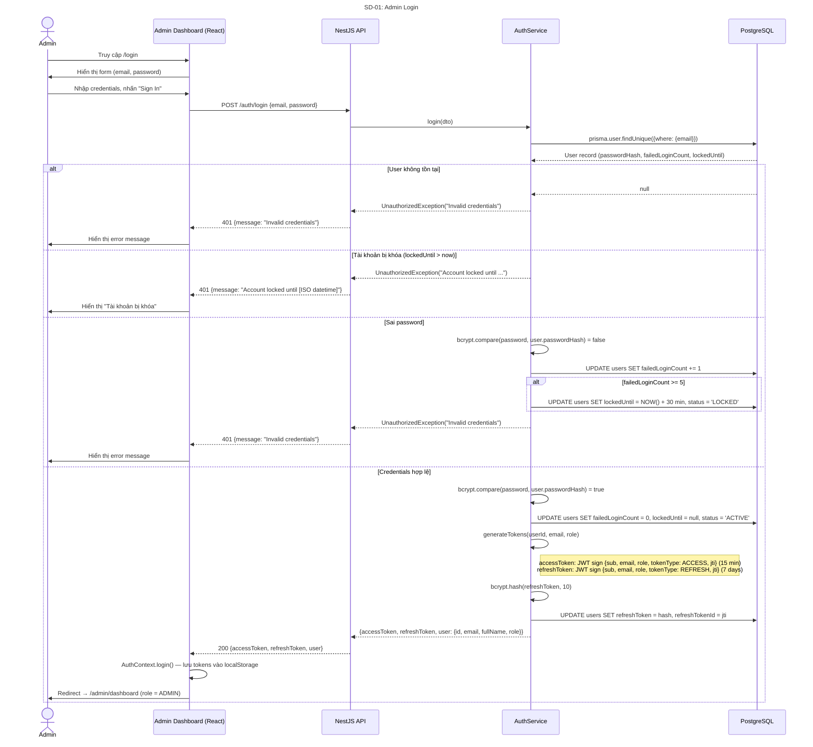
```mermaid
sequenceDiagram
    title SD-01: Admin Login
    actor Admin
    participant UI as Admin Dashboard (React)
    participant API as NestJS API
    participant Auth as AuthService
    participant DB as PostgreSQL

    Admin->>UI: Truy cập /login
    UI->>Admin: Hiển thị form (email, password)
    Admin->>UI: Nhập credentials, nhấn "Sign In"
    UI->>API: POST /auth/login {email, password}
    API->>Auth: login(dto)
    Auth->>DB: prisma.user.findUnique({where: {email}})
    DB-->>Auth: User record (passwordHash, failedLoginCount, lockedUntil)

    alt User không tồn tại
        DB-->>Auth: null
        Auth-->>API: UnauthorizedException("Invalid credentials")
        API-->>UI: 401 {message: "Invalid credentials"}
        UI->>Admin: Hiển thị error message
    else Tài khoản bị khóa (lockedUntil > now)
        Auth-->>API: UnauthorizedException("Account locked until ...")
        API-->>UI: 401 {message: "Account locked until [ISO datetime]"}
        UI->>Admin: Hiển thị "Tài khoản bị khóa"
    else Sai password
        Auth->>Auth: bcrypt.compare(password, user.passwordHash) = false
        Auth->>DB: UPDATE users SET failedLoginCount += 1
        alt failedLoginCount >= 5
            Auth->>DB: UPDATE users SET lockedUntil = NOW() + 30 min, status = 'LOCKED'
        end
        Auth-->>API: UnauthorizedException("Invalid credentials")
        API-->>UI: 401 {message: "Invalid credentials"}
        UI->>Admin: Hiển thị error message
    else Credentials hợp lệ
        Auth->>Auth: bcrypt.compare(password, user.passwordHash) = true
        Auth->>DB: UPDATE users SET failedLoginCount = 0, lockedUntil = null, status = 'ACTIVE'
        Auth->>Auth: generateTokens(userId, email, role)
        Note right of Auth: accessToken: JWT sign {sub, email, role, tokenType: ACCESS, jti} (15 min)<br/>refreshToken: JWT sign {sub, email, role, tokenType: REFRESH, jti} (7 days)
        Auth->>Auth: bcrypt.hash(refreshToken, 10)
        Auth->>DB: UPDATE users SET refreshToken = hash, refreshTokenId = jti
        Auth-->>API: {accessToken, refreshToken, user: {id, email, fullName, role}}
        API-->>UI: 200 {accessToken, refreshToken, user}
        UI->>UI: AuthContext.login() — lưu tokens vào localStorage
        UI->>Admin: Redirect → /admin/dashboard (role = ADMIN)
    end
```

---

## SD-02: Shop Owner Register + Login

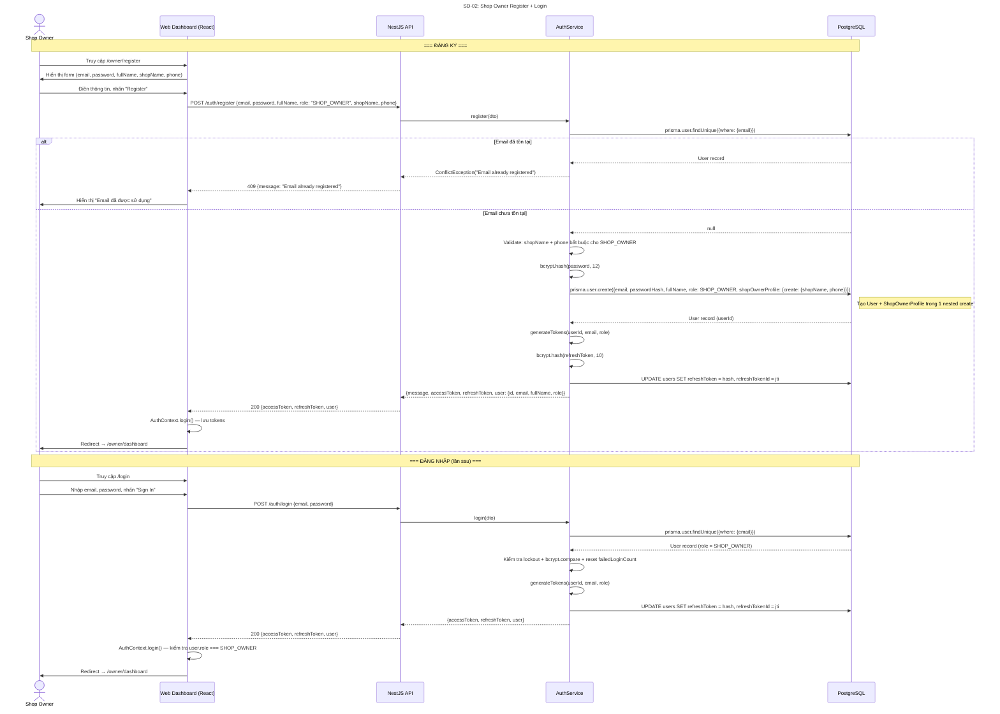
```mermaid
sequenceDiagram
    title SD-02: Shop Owner Register + Login
    actor SO as Shop Owner
    participant UI as Web Dashboard (React)
    participant API as NestJS API
    participant Auth as AuthService
    participant DB as PostgreSQL

    Note over SO, DB: === ĐĂNG KÝ ===
    SO->>UI: Truy cập /owner/register
    UI->>SO: Hiển thị form (email, password, fullName, shopName, phone)
    SO->>UI: Điền thông tin, nhấn "Register"
    UI->>API: POST /auth/register {email, password, fullName, role: "SHOP_OWNER", shopName, phone}
    API->>Auth: register(dto)
    Auth->>DB: prisma.user.findUnique({where: {email}})

    alt Email đã tồn tại
        DB-->>Auth: User record
        Auth-->>API: ConflictException("Email already registered")
        API-->>UI: 409 {message: "Email already registered"}
        UI->>SO: Hiển thị "Email đã được sử dụng"
    else Email chưa tồn tại
        DB-->>Auth: null
        Auth->>Auth: Validate: shopName + phone bắt buộc cho SHOP_OWNER
        Auth->>Auth: bcrypt.hash(password, 12)
        Auth->>DB: prisma.user.create({email, passwordHash, fullName, role: SHOP_OWNER, shopOwnerProfile: {create: {shopName, phone}}})
        Note right of DB: Tạo User + ShopOwnerProfile trong 1 nested create
        DB-->>Auth: User record (userId)
        Auth->>Auth: generateTokens(userId, email, role)
        Auth->>Auth: bcrypt.hash(refreshToken, 10)
        Auth->>DB: UPDATE users SET refreshToken = hash, refreshTokenId = jti
        Auth-->>API: {message, accessToken, refreshToken, user: {id, email, fullName, role}}
        API-->>UI: 200 {accessToken, refreshToken, user}
        UI->>UI: AuthContext.login() — lưu tokens
        UI->>SO: Redirect → /owner/dashboard
    end

    Note over SO, DB: === ĐĂNG NHẬP (lần sau) ===
    SO->>UI: Truy cập /login
    SO->>UI: Nhập email, password, nhấn "Sign In"
    UI->>API: POST /auth/login {email, password}
    API->>Auth: login(dto)
    Auth->>DB: prisma.user.findUnique({where: {email}})
    DB-->>Auth: User record (role = SHOP_OWNER)
    Auth->>Auth: Kiểm tra lockout + bcrypt.compare + reset failedLoginCount
    Auth->>Auth: generateTokens(userId, email, role)
    Auth->>DB: UPDATE users SET refreshToken = hash, refreshTokenId = jti
    Auth-->>API: {accessToken, refreshToken, user}
    API-->>UI: 200 {accessToken, refreshToken, user}
    UI->>UI: AuthContext.login() — kiểm tra user.role === SHOP_OWNER
    UI->>SO: Redirect → /owner/dashboard
```

---

## SD-03: Admin Create POI

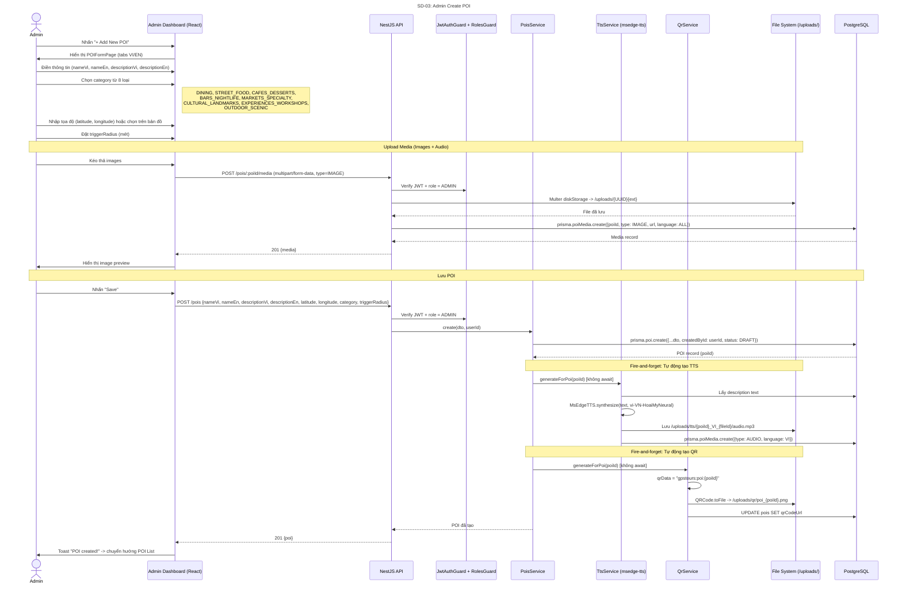
```mermaid
sequenceDiagram
    title SD-03: Admin Create POI
    actor Admin
    participant UI as Admin Dashboard (React)
    participant API as NestJS API
    participant Guard as JwtAuthGuard + RolesGuard
    participant POI as PoisService
    participant TTS as TtsService (msedge-tts)
    participant QR as QrService
    participant FS as File System (/uploads/)
    participant DB as PostgreSQL

    Admin->>UI: Nhấn "+ Add New POI"
    UI->>Admin: Hiển thị POIFormPage (tabs VI/EN)

    Admin->>UI: Điền thông tin (nameVi, nameEn, descriptionVi, descriptionEn)
    Admin->>UI: Chọn category từ 8 loại
    Note right of UI: DINING, STREET_FOOD, CAFES_DESSERTS,<br/>BARS_NIGHTLIFE, MARKETS_SPECIALTY,<br/>CULTURAL_LANDMARKS, EXPERIENCES_WORKSHOPS,<br/>OUTDOOR_SCENIC
    Admin->>UI: Nhập tọa độ (latitude, longitude) hoặc chọn trên bản đồ
    Admin->>UI: Đặt triggerRadius (mét)

    Note over Admin, FS: Upload Media (Images + Audio)
    Admin->>UI: Kéo thả images
    UI->>API: POST /pois/:poiId/media (multipart/form-data, type=IMAGE)
    API->>Guard: Verify JWT + role = ADMIN
    API->>FS: Multer diskStorage -> /uploads/{UUID}{ext}
    FS-->>API: File đã lưu
    API->>DB: prisma.poiMedia.create({poiId, type: IMAGE, url, language: ALL})
    DB-->>API: Media record
    API-->>UI: 201 {media}
    UI->>Admin: Hiển thị image preview

    Note over Admin, DB: Lưu POI
    Admin->>UI: Nhấn "Save"
    UI->>API: POST /pois {nameVi, nameEn, descriptionVi, descriptionEn, latitude, longitude, category, triggerRadius}
    API->>Guard: Verify JWT + role = ADMIN
    API->>POI: create(dto, userId)
    POI->>DB: prisma.poi.create({...dto, createdById: userId, status: DRAFT})
    DB-->>POI: POI record (poiId)

    Note over POI, FS: Fire-and-forget: Tự động tạo TTS
    POI->>TTS: generateForPoi(poiId) [không await]
    TTS->>DB: Lấy description text
    TTS->>TTS: MsEdgeTTS.synthesize(text, vi-VN-HoaiMyNeural)
    TTS->>FS: Lưu /uploads/tts/{poiId}_VI_{fileId}/audio.mp3
    TTS->>DB: prisma.poiMedia.create({type: AUDIO, language: VI})

    Note over POI, FS: Fire-and-forget: Tự động tạo QR
    POI->>QR: generateForPoi(poiId) [không await]
    QR->>QR: qrData = "gpstours:poi:{poiId}"
    QR->>FS: QRCode.toFile -> /uploads/qr/poi_{poiId}.png
    QR->>DB: UPDATE pois SET qrCodeUrl

    POI-->>API: POI đã tạo
    API-->>UI: 201 {poi}
    UI->>Admin: Toast "POI created!" -> chuyển hướng POI List
```

---

## SD-04: Shop Owner Create POI

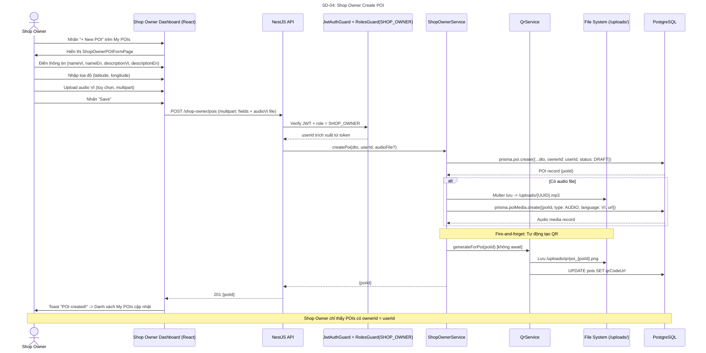
```mermaid
sequenceDiagram
    title SD-04: Shop Owner Create POI
    actor SO as Shop Owner
    participant UI as Shop Owner Dashboard (React)
    participant API as NestJS API
    participant Guard as JwtAuthGuard + RolesGuard(SHOP_OWNER)
    participant POI as ShopOwnerService
    participant QR as QrService
    participant FS as File System (/uploads/)
    participant DB as PostgreSQL

    SO->>UI: Nhấn "+ New POI" trên My POIs
    UI->>SO: Hiển thị ShopOwnerPOIFormPage

    SO->>UI: Điền thông tin (nameVi, nameEn, descriptionVi, descriptionEn)
    SO->>UI: Nhập tọa độ (latitude, longitude)
    SO->>UI: Upload audio VI (tùy chọn, multipart)

    SO->>UI: Nhấn "Save"
    UI->>API: POST /shop-owner/pois (multipart: fields + audioVi file)
    API->>Guard: Verify JWT + role = SHOP_OWNER
    Guard-->>API: userId trích xuất từ token

    API->>POI: createPoi(dto, userId, audioFile?)
    POI->>DB: prisma.poi.create({...dto, ownerId: userId, status: DRAFT})
    DB-->>POI: POI record (poiId)

    alt Có audio file
        POI->>FS: Multer lưu -> /uploads/{UUID}.mp3
        POI->>DB: prisma.poiMedia.create({poiId, type: AUDIO, language: VI, url})
        DB-->>POI: Audio media record
    end

    Note over POI, FS: Fire-and-forget: Tự động tạo QR
    POI->>QR: generateForPoi(poiId) [không await]
    QR->>FS: Lưu /uploads/qr/poi_{poiId}.png
    QR->>DB: UPDATE pois SET qrCodeUrl

    POI-->>API: {poiId}
    API-->>UI: 201 {poiId}
    UI->>SO: Toast "POI created!" -> Danh sách My POIs cập nhật

    Note over SO, DB: Shop Owner chỉ thấy POIs có ownerId = userId
```

---

## SD-05: Create Tour

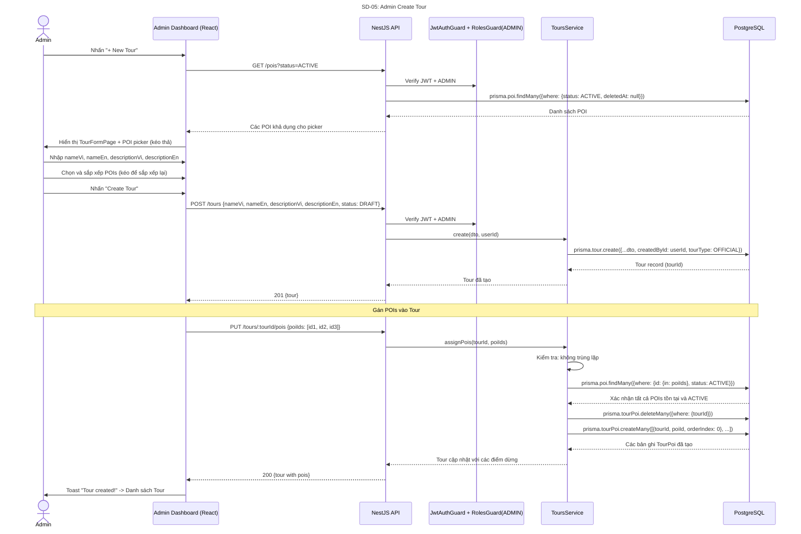
```mermaid
sequenceDiagram
    title SD-05: Admin Create Tour
    actor Admin
    participant UI as Admin Dashboard (React)
    participant API as NestJS API
    participant Guard as JwtAuthGuard + RolesGuard(ADMIN)
    participant Tour as ToursService
    participant DB as PostgreSQL

    Admin->>UI: Nhấn "+ New Tour"
    UI->>API: GET /pois?status=ACTIVE
    API->>Guard: Verify JWT + ADMIN
    API->>DB: prisma.poi.findMany({where: {status: ACTIVE, deletedAt: null}})
    DB-->>API: Danh sách POI
    API-->>UI: Các POI khả dụng cho picker

    UI->>Admin: Hiển thị TourFormPage + POI picker (kéo thả)
    Admin->>UI: Nhập nameVi, nameEn, descriptionVi, descriptionEn
    Admin->>UI: Chọn và sắp xếp POIs (kéo để sắp xếp lại)
    Admin->>UI: Nhấn "Create Tour"

    UI->>API: POST /tours {nameVi, nameEn, descriptionVi, descriptionEn, status: DRAFT}
    API->>Guard: Verify JWT + ADMIN
    API->>Tour: create(dto, userId)
    Tour->>DB: prisma.tour.create({...dto, createdById: userId, tourType: OFFICIAL})
    DB-->>Tour: Tour record (tourId)
    Tour-->>API: Tour đã tạo
    API-->>UI: 201 {tour}

    Note over Admin, DB: Gán POIs vào Tour
    UI->>API: PUT /tours/:tourId/pois {poiIds: [id1, id2, id3]}
    API->>Tour: assignPois(tourId, poiIds)
    Tour->>Tour: Kiểm tra: không trùng lặp
    Tour->>DB: prisma.poi.findMany({where: {id: {in: poiIds}, status: ACTIVE}})
    DB-->>Tour: Xác nhận tất cả POIs tồn tại và ACTIVE
    Tour->>DB: prisma.tourPoi.deleteMany({where: {tourId}})
    Tour->>DB: prisma.tourPoi.createMany([{tourId, poiId, orderIndex: 0}, ...])
    DB-->>Tour: Các bản ghi TourPoi đã tạo
    Tour-->>API: Tour cập nhật với các điểm dừng
    API-->>UI: 200 {tour with pois}
    UI->>Admin: Toast "Tour created!" -> Danh sách Tour
```

---

## SD-06: Tourist View Map + Auto-trigger

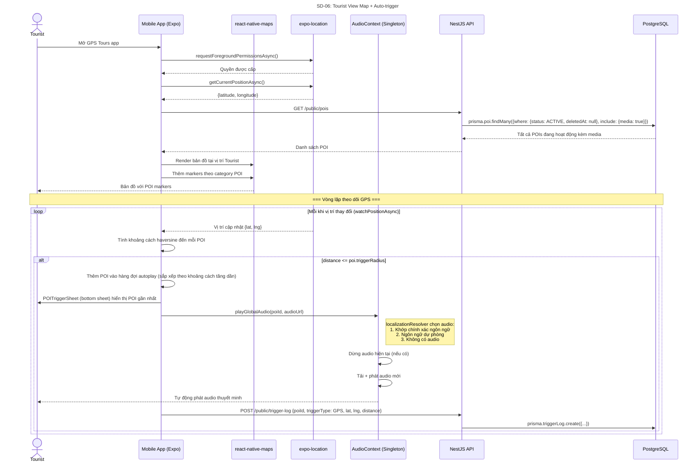
```mermaid
sequenceDiagram
    title SD-06: Tourist View Map + Auto-trigger
    actor Tourist
    participant App as Mobile App (Expo)
    participant Map as react-native-maps
    participant GPS as expo-location
    participant Audio as AudioContext (Singleton)
    participant API as NestJS API
    participant DB as PostgreSQL

    Tourist->>App: Mở GPS Tours app
    App->>GPS: requestForegroundPermissionsAsync()
    GPS-->>App: Quyền được cấp
    App->>GPS: getCurrentPositionAsync()
    GPS-->>App: {latitude, longitude}

    App->>API: GET /public/pois
    API->>DB: prisma.poi.findMany({where: {status: ACTIVE, deletedAt: null}, include: {media: true}})
    DB-->>API: Tất cả POIs đang hoạt động kèm media
    API-->>App: Danh sách POI

    App->>Map: Render bản đồ tại vị trí Tourist
    App->>Map: Thêm markers theo category POI
    Map-->>Tourist: Bản đồ với POI markers

    Note over Tourist, DB: === Vòng lặp theo dõi GPS ===
    loop Mỗi khi vị trí thay đổi (watchPositionAsync)
        GPS-->>App: Vị trí cập nhật {lat, lng}
        App->>App: Tính khoảng cách haversine đến mỗi POI

        alt distance <= poi.triggerRadius
            App->>App: Thêm POI vào hàng đợi autoplay (sắp xếp theo khoảng cách tăng dần)
            App->>Tourist: POITriggerSheet (bottom sheet) hiển thị POI gần nhất
            App->>Audio: playGlobalAudio(poiId, audioUrl)
            Note right of Audio: localizationResolver chọn audio:<br/>1. Khớp chính xác ngôn ngữ<br/>2. Ngôn ngữ dự phòng<br/>3. Không có audio
            Audio->>Audio: Dừng audio hiện tại (nếu có)
            Audio->>Audio: Tải + phát audio mới
            Audio-->>Tourist: Tự động phát audio thuyết minh

            App->>API: POST /public/trigger-log {poiId, triggerType: GPS, lat, lng, distance}
            API->>DB: prisma.triggerLog.create({...})
        end
    end
```

---

## SD-07: Tourist Follow Tour

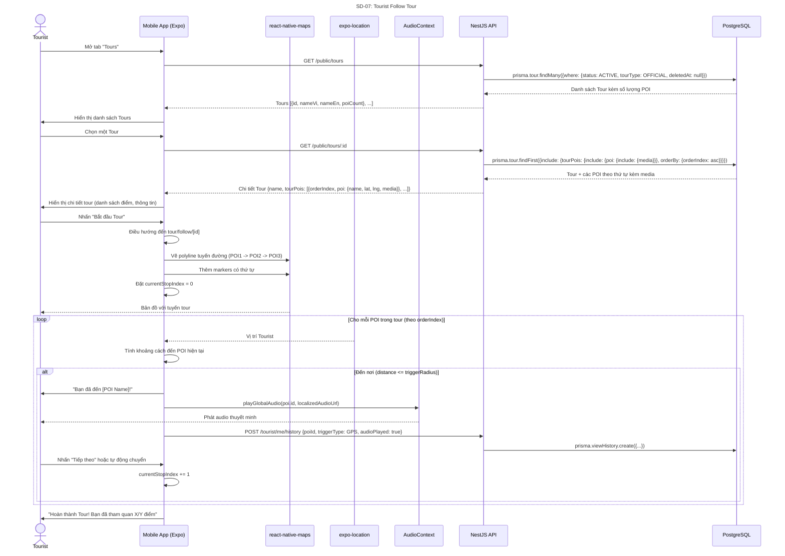
```mermaid
sequenceDiagram
    title SD-07: Tourist Follow Tour
    actor Tourist
    participant App as Mobile App (Expo)
    participant Map as react-native-maps
    participant GPS as expo-location
    participant Audio as AudioContext
    participant API as NestJS API
    participant DB as PostgreSQL

    Tourist->>App: Mở tab "Tours"
    App->>API: GET /public/tours
    API->>DB: prisma.tour.findMany({where: {status: ACTIVE, tourType: OFFICIAL, deletedAt: null}})
    DB-->>API: Danh sách Tour kèm số lượng POI
    API-->>App: Tours [{id, nameVi, nameEn, poiCount}, ...]
    App->>Tourist: Hiển thị danh sách Tours

    Tourist->>App: Chọn một Tour
    App->>API: GET /public/tours/:id
    API->>DB: prisma.tour.findFirst({include: {tourPois: {include: {poi: {include: {media}}}, orderBy: {orderIndex: asc}}}})
    DB-->>API: Tour + các POI theo thứ tự kèm media
    API-->>App: Chi tiết Tour {name, tourPois: [{orderIndex, poi: {name, lat, lng, media}}, ...]}

    App->>Tourist: Hiển thị chi tiết tour (danh sách điểm, thông tin)
    Tourist->>App: Nhấn "Bắt đầu Tour"
    App->>App: Điều hướng đến tour/follow/[id]

    App->>Map: Vẽ polyline tuyến đường (POI1 -> POI2 -> POI3)
    App->>Map: Thêm markers có thứ tự
    App->>App: Đặt currentStopIndex = 0
    Map-->>Tourist: Bản đồ với tuyến tour

    loop Cho mỗi POI trong tour (theo orderIndex)
        GPS-->>App: Vị trí Tourist
        App->>App: Tính khoảng cách đến POI hiện tại

        alt Đến nơi (distance <= triggerRadius)
            App->>Tourist: "Bạn đã đến [POI Name]!"
            App->>Audio: playGlobalAudio(poi.id, localizedAudioUrl)
            Audio-->>Tourist: Phát audio thuyết minh
            App->>API: POST /tourist/me/history {poiId, triggerType: GPS, audioPlayed: true}
            API->>DB: prisma.viewHistory.create({...})
            Tourist->>App: Nhấn "Tiếp theo" hoặc tự động chuyển
            App->>App: currentStopIndex += 1
        end
    end

    App->>Tourist: "Hoàn thành Tour! Bạn đã tham quan X/Y điểm"
```

---

## SD-08: Nearby POI Auto-Playback Queue

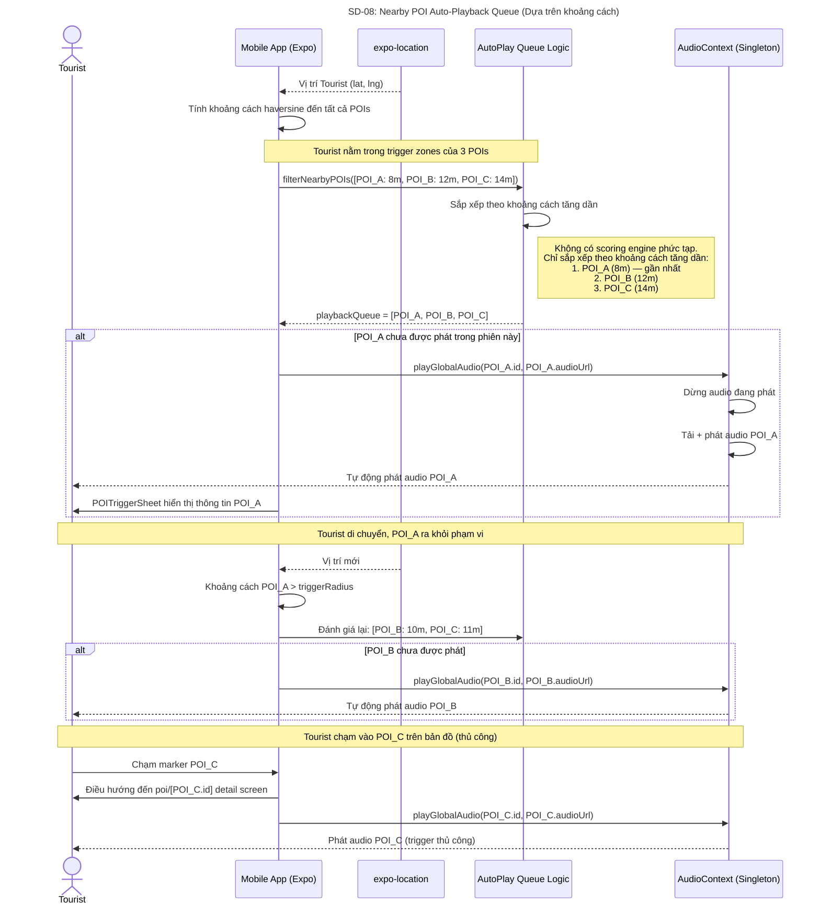
```mermaid
sequenceDiagram
    title SD-08: Nearby POI Auto-Playback Queue (Dựa trên khoảng cách)
    actor Tourist
    participant App as Mobile App (Expo)
    participant GPS as expo-location
    participant Queue as AutoPlay Queue Logic
    participant Audio as AudioContext (Singleton)

    GPS-->>App: Vị trí Tourist (lat, lng)
    App->>App: Tính khoảng cách haversine đến tất cả POIs

    Note over App, Queue: Tourist nằm trong trigger zones của 3 POIs
    App->>Queue: filterNearbyPOIs([POI_A: 8m, POI_B: 12m, POI_C: 14m])

    Queue->>Queue: Sắp xếp theo khoảng cách tăng dần
    Note right of Queue: Không có scoring engine phức tạp.<br/>Chỉ sắp xếp theo khoảng cách tăng dần:<br/>1. POI_A (8m) — gần nhất<br/>2. POI_B (12m)<br/>3. POI_C (14m)

    Queue-->>App: playbackQueue = [POI_A, POI_B, POI_C]

    alt POI_A chưa được phát trong phiên này
        App->>Audio: playGlobalAudio(POI_A.id, POI_A.audioUrl)
        Audio->>Audio: Dừng audio đang phát
        Audio->>Audio: Tải + phát audio POI_A
        Audio-->>Tourist: Tự động phát audio POI_A
        App->>Tourist: POITriggerSheet hiển thị thông tin POI_A
    end

    Note over Tourist, Audio: Tourist di chuyển, POI_A ra khỏi phạm vi
    GPS-->>App: Vị trí mới
    App->>App: Khoảng cách POI_A > triggerRadius
    App->>Queue: Đánh giá lại: [POI_B: 10m, POI_C: 11m]

    alt POI_B chưa được phát
        App->>Audio: playGlobalAudio(POI_B.id, POI_B.audioUrl)
        Audio-->>Tourist: Tự động phát audio POI_B
    end

    Note over Tourist, Audio: Tourist chạm vào POI_C trên bản đồ (thủ công)
    Tourist->>App: Chạm marker POI_C
    App->>Tourist: Điều hướng đến poi/[POI_C.id] detail screen
    App->>Audio: playGlobalAudio(POI_C.id, POI_C.audioUrl)
    Audio-->>Tourist: Phát audio POI_C (trigger thủ công)
```

---

## SD-09: Quên mật khẩu (Forgot Password)

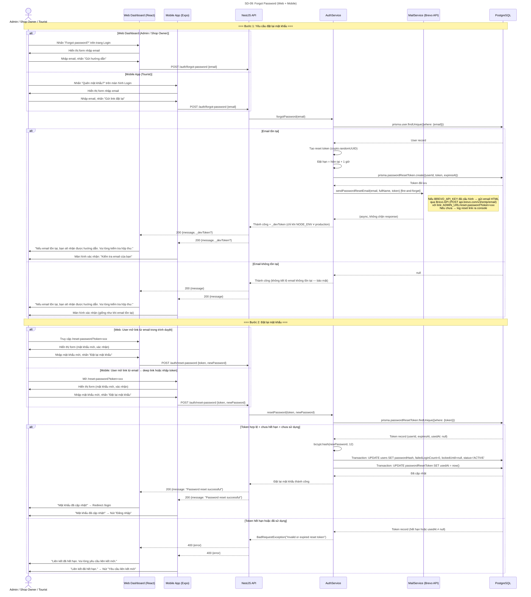
```mermaid
sequenceDiagram
    title SD-09: Forgot Password (Web + Mobile)
    actor User as Admin / Shop Owner / Tourist
    participant WebUI as Web Dashboard (React)
    participant MobileUI as Mobile App (Expo)
    participant API as NestJS API
    participant Auth as AuthService
    participant Mail as MailService (Brevo API)
    participant DB as PostgreSQL

    Note over User, DB: === Bước 1: Yêu cầu đặt lại mật khẩu ===

    alt Web Dashboard (Admin / Shop Owner)
        User->>WebUI: Nhấn "Forgot password?" trên trang Login
        WebUI->>User: Hiển thị form nhập email
        User->>WebUI: Nhập email, nhấn "Gửi hướng dẫn"
        WebUI->>API: POST /auth/forgot-password {email}
    else Mobile App (Tourist)
        User->>MobileUI: Nhấn "Quên mật khẩu?" trên màn hình Login
        MobileUI->>User: Hiển thị form nhập email
        User->>MobileUI: Nhập email, nhấn "Gửi link đặt lại"
        MobileUI->>API: POST /auth/forgot-password {email}
    end

    API->>Auth: forgotPassword(email)
    Auth->>DB: prisma.user.findUnique({where: {email}})

    alt Email tồn tại
        DB-->>Auth: User record
        Auth->>Auth: Tạo reset token (crypto.randomUUID)
        Auth->>Auth: Đặt hạn = hiện tại + 1 giờ
        Auth->>DB: prisma.passwordResetToken.create({userId, token, expiresAt})
        DB-->>Auth: Token đã lưu
        Auth->>Mail: sendPasswordResetEmail(email, fullName, token) [fire-and-forget]
        Note right of Mail: Nếu BREVO_API_KEY đã cấu hình → gửi email HTML<br/>qua Brevo API (POST api.brevo.com/v3/smtp/email)<br/>với link: ADMIN_URL/reset-password?token=xxx<br/>Nếu chưa → log reset link ra console
        Mail-->>Auth: (async, không chặn response)
        Auth-->>API: Thành công + _devToken (chỉ khi NODE_ENV ≠ production)
        API-->>WebUI: 200 {message, _devToken?}
        API-->>MobileUI: 200 {message, _devToken?}
        WebUI->>User: "Nếu email tồn tại, bạn sẽ nhận được hướng dẫn. Vui lòng kiểm tra hộp thư."
        MobileUI->>User: Màn hình xác nhận: "Kiểm tra email của bạn"
    else Email không tồn tại
        DB-->>Auth: null
        Auth-->>API: Thành công (không tiết lộ email không tồn tại — bảo mật)
        API-->>WebUI: 200 {message}
        API-->>MobileUI: 200 {message}
        WebUI->>User: "Nếu email tồn tại, bạn sẽ nhận được hướng dẫn. Vui lòng kiểm tra hộp thư."
        MobileUI->>User: Màn hình xác nhận (giống như khi email tồn tại)
    end

    Note over User, DB: === Bước 2: Đặt lại mật khẩu ===

    alt Web: User mở link từ email trong trình duyệt
        User->>WebUI: Truy cập /reset-password?token=xxx
        WebUI->>User: Hiển thị form (mật khẩu mới, xác nhận)
        User->>WebUI: Nhập mật khẩu mới, nhấn "Đặt lại mật khẩu"
        WebUI->>API: POST /auth/reset-password {token, newPassword}
    else Mobile: User mở link từ email → deep link hoặc nhập token
        User->>MobileUI: Mở /reset-password?token=xxx
        MobileUI->>User: Hiển thị form (mật khẩu mới, xác nhận)
        User->>MobileUI: Nhập mật khẩu mới, nhấn "Đặt lại mật khẩu"
        MobileUI->>API: POST /auth/reset-password {token, newPassword}
    end

    API->>Auth: resetPassword(token, newPassword)
    Auth->>DB: prisma.passwordResetToken.findUnique({where: {token}})

    alt Token hợp lệ + chưa hết hạn + chưa sử dụng
        DB-->>Auth: Token record (userId, expiresAt, usedAt: null)
        Auth->>Auth: bcrypt.hash(newPassword, 12)
        Auth->>DB: Transaction: UPDATE users SET passwordHash, failedLoginCount=0, lockedUntil=null, status='ACTIVE'
        Auth->>DB: Transaction: UPDATE passwordResetToken SET usedAt = now()
        DB-->>Auth: Đã cập nhật
        Auth-->>API: Đặt lại mật khẩu thành công
        API-->>WebUI: 200 {message: "Password reset successful"}
        API-->>MobileUI: 200 {message: "Password reset successful"}
        WebUI->>User: "Mật khẩu đã cập nhật!" → Redirect /login
        MobileUI->>User: "Mật khẩu đã cập nhật!" → Nút "Đăng nhập"
    else Token hết hạn hoặc đã sử dụng
        DB-->>Auth: Token record (hết hạn hoặc usedAt ≠ null)
        Auth-->>API: BadRequestException("Invalid or expired reset token")
        API-->>WebUI: 400 {error}
        API-->>MobileUI: 400 {error}
        WebUI->>User: "Liên kết đã hết hạn. Vui lòng yêu cầu liên kết mới."
        MobileUI->>User: "Liên kết đã hết hạn." → Nút "Yêu cầu liên kết mới"
    end
```

---

## SD-10: Chỉnh sửa POI (Edit POI)

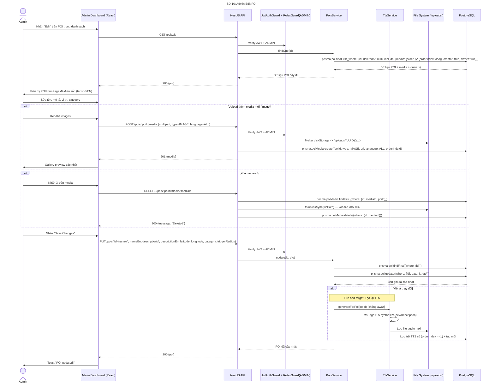
```mermaid
sequenceDiagram
    title SD-10: Admin Edit POI
    actor Admin
    participant UI as Admin Dashboard (React)
    participant API as NestJS API
    participant Guard as JwtAuthGuard + RolesGuard(ADMIN)
    participant POI as PoisService
    participant TTS as TtsService
    participant FS as File System (/uploads/)
    participant DB as PostgreSQL

    Admin->>UI: Nhấn "Edit" trên POI trong danh sách
    UI->>API: GET /pois/:id
    API->>Guard: Verify JWT + ADMIN
    API->>POI: findOne(id)
    POI->>DB: prisma.poi.findFirst({where: {id, deletedAt: null}, include: {media: {orderBy: {orderIndex: asc}}, creator: true, owner: true}})
    DB-->>POI: Dữ liệu POI + media + quan hệ
    POI-->>API: Dữ liệu POI đầy đủ
    API-->>UI: 200 {poi}
    UI->>Admin: Hiển thị POIFormPage đã điền sẵn (tabs VI/EN)

    Admin->>UI: Sửa tên, mô tả, vị trí, category

    alt Upload thêm media mới (image)
        Admin->>UI: Kéo thả images
        UI->>API: POST /pois/:poiId/media (multipart, type=IMAGE, language=ALL)
        API->>Guard: Verify JWT + ADMIN
        API->>FS: Multer diskStorage -> /uploads/{UUID}{ext}
        API->>DB: prisma.poiMedia.create({poiId, type: IMAGE, url, language: ALL, orderIndex})
        API-->>UI: 201 {media}
        UI->>Admin: Gallery preview cập nhật
    end

    alt Xóa media cũ
        Admin->>UI: Nhấn X trên media
        UI->>API: DELETE /pois/:poiId/media/:mediaId
        API->>DB: prisma.poiMedia.findFirst({where: {id: mediaId, poiId}})
        API->>FS: fs.unlinkSync(filePath) — xóa file khỏi disk
        API->>DB: prisma.poiMedia.delete({where: {id: mediaId}})
        API-->>UI: 200 {message: "Deleted"}
    end

    Admin->>UI: Nhấn "Save Changes"
    UI->>API: PUT /pois/:id {nameVi, nameEn, descriptionVi, descriptionEn, latitude, longitude, category, triggerRadius}
    API->>Guard: Verify JWT + ADMIN
    API->>POI: update(id, dto)
    POI->>DB: prisma.poi.findFirst({where: {id}})
    POI->>DB: prisma.poi.update({where: {id}, data: {...dto}})
    DB-->>POI: Bản ghi đã cập nhật

    alt Mô tả thay đổi
        Note over POI, TTS: Fire-and-forget: Tạo lại TTS
        POI->>TTS: generateForPoi(poiId) [không await]
        TTS->>TTS: MsEdgeTTS.synthesize(newDescription)
        TTS->>FS: Lưu file audio mới
        TTS->>DB: Lưu trữ TTS cũ (orderIndex = -1) + tạo mới
    end

    POI-->>API: POI đã cập nhật
    API-->>UI: 200 {poi}
    UI->>Admin: Toast "POI updated!"
```

---

## SD-11: Xóa POI (Soft Delete)

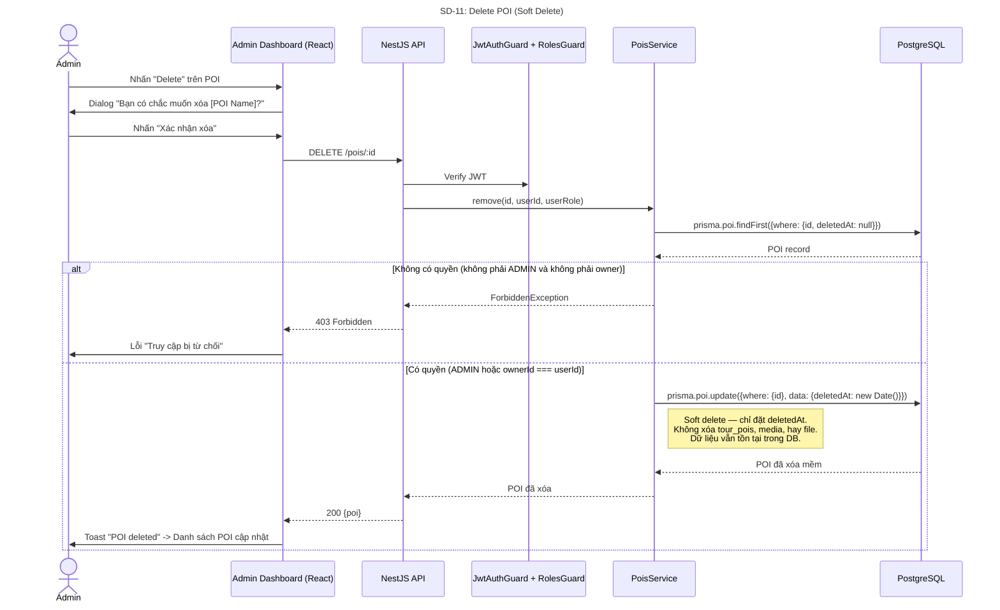
```mermaid
sequenceDiagram
    title SD-11: Delete POI (Soft Delete)
    actor Admin
    participant UI as Admin Dashboard (React)
    participant API as NestJS API
    participant Guard as JwtAuthGuard + RolesGuard
    participant POI as PoisService
    participant DB as PostgreSQL

    Admin->>UI: Nhấn "Delete" trên POI
    UI->>Admin: Dialog "Bạn có chắc muốn xóa [POI Name]?"
    Admin->>UI: Nhấn "Xác nhận xóa"

    UI->>API: DELETE /pois/:id
    API->>Guard: Verify JWT
    API->>POI: remove(id, userId, userRole)
    POI->>DB: prisma.poi.findFirst({where: {id, deletedAt: null}})
    DB-->>POI: POI record

    alt Không có quyền (không phải ADMIN và không phải owner)
        POI-->>API: ForbiddenException
        API-->>UI: 403 Forbidden
        UI->>Admin: Lỗi "Truy cập bị từ chối"
    else Có quyền (ADMIN hoặc ownerId === userId)
        POI->>DB: prisma.poi.update({where: {id}, data: {deletedAt: new Date()}})
        Note right of POI: Soft delete — chỉ đặt deletedAt.<br/>Không xóa tour_pois, media, hay file.<br/>Dữ liệu vẫn tồn tại trong DB.
        DB-->>POI: POI đã xóa mềm
        POI-->>API: POI đã xóa
        API-->>UI: 200 {poi}
        UI->>Admin: Toast "POI deleted" -> Danh sách POI cập nhật
    end
```

---

## SD-12: Tourist Lưu POI yêu thích

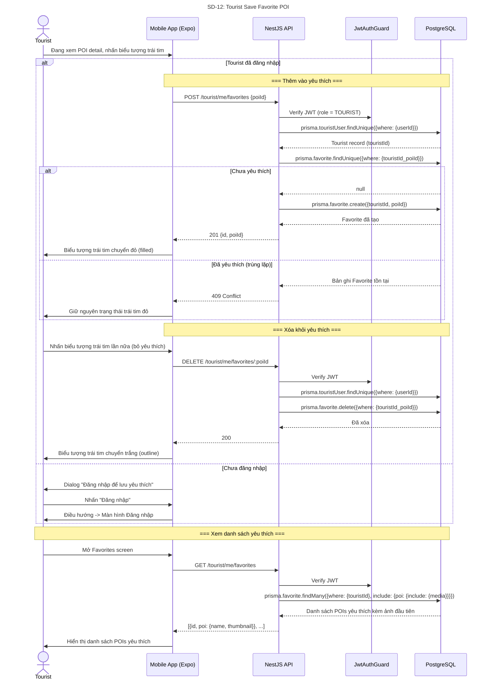
```mermaid
sequenceDiagram
    title SD-12: Tourist Save Favorite POI
    actor Tourist
    participant App as Mobile App (Expo)
    participant API as NestJS API
    participant Guard as JwtAuthGuard
    participant DB as PostgreSQL

    Tourist->>App: Đang xem POI detail, nhấn biểu tượng trái tim

    alt Tourist đã đăng nhập
        Note over App, DB: === Thêm vào yêu thích ===
        App->>API: POST /tourist/me/favorites {poiId}
        API->>Guard: Verify JWT (role = TOURIST)
        API->>DB: prisma.touristUser.findUnique({where: {userId}})
        DB-->>API: Tourist record (touristId)
        API->>DB: prisma.favorite.findUnique({where: {touristId_poiId}})

        alt Chưa yêu thích
            DB-->>API: null
            API->>DB: prisma.favorite.create({touristId, poiId})
            DB-->>API: Favorite đã tạo
            API-->>App: 201 {id, poiId}
            App->>Tourist: Biểu tượng trái tim chuyển đỏ (filled)
        else Đã yêu thích (trùng lặp)
            DB-->>API: Bản ghi Favorite tồn tại
            API-->>App: 409 Conflict
            App->>Tourist: Giữ nguyên trạng thái trái tim đỏ
        end

        Note over App, DB: === Xóa khỏi yêu thích ===
        Tourist->>App: Nhấn biểu tượng trái tim lần nữa (bỏ yêu thích)
        App->>API: DELETE /tourist/me/favorites/:poiId
        API->>Guard: Verify JWT
        API->>DB: prisma.touristUser.findUnique({where: {userId}})
        API->>DB: prisma.favorite.delete({where: {touristId_poiId}})
        DB-->>API: Đã xóa
        API-->>App: 200
        App->>Tourist: Biểu tượng trái tim chuyển trắng (outline)

    else Chưa đăng nhập
        App->>Tourist: Dialog "Đăng nhập để lưu yêu thích"
        Tourist->>App: Nhấn "Đăng nhập"
        App->>Tourist: Điều hướng -> Màn hình Đăng nhập
    end

    Note over Tourist, DB: === Xem danh sách yêu thích ===
    Tourist->>App: Mở Favorites screen
    App->>API: GET /tourist/me/favorites
    API->>Guard: Verify JWT
    API->>DB: prisma.favorite.findMany({where: {touristId}, include: {poi: {include: {media}}}})
    DB-->>API: Danh sách POIs yêu thích kèm ảnh đầu tiên
    API-->>App: [{id, poi: {name, thumbnail}}, ...]
    App->>Tourist: Hiển thị danh sách POIs yêu thích
```

---

## SD-13: Shop Owner Xem Analytics

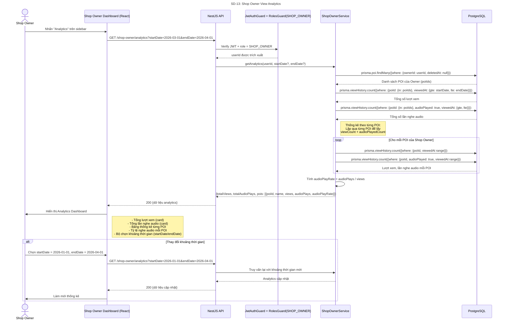
```mermaid
sequenceDiagram
    title SD-13: Shop Owner View Analytics
    actor SO as Shop Owner
    participant UI as Shop Owner Dashboard (React)
    participant API as NestJS API
    participant Guard as JwtAuthGuard + RolesGuard(SHOP_OWNER)
    participant Service as ShopOwnerService
    participant DB as PostgreSQL

    SO->>UI: Nhấn "Analytics" trên sidebar
    UI->>API: GET /shop-owner/analytics?startDate=2026-03-01&endDate=2026-04-01
    API->>Guard: Verify JWT + role = SHOP_OWNER
    Guard-->>API: userId được trích xuất

    API->>Service: getAnalytics(userId, startDate?, endDate?)
    Service->>DB: prisma.poi.findMany({where: {ownerId: userId, deletedAt: null}})
    DB-->>Service: Danh sách POI của Owner (poiIds)

    Service->>DB: prisma.viewHistory.count({where: {poiId: {in: poiIds}, viewedAt: {gte: startDate, lte: endDate}}})
    DB-->>Service: Tổng số lượt xem

    Service->>DB: prisma.viewHistory.count({where: {poiId: {in: poiIds}, audioPlayed: true, viewedAt: {gte, lte}}})
    DB-->>Service: Tổng số lần nghe audio

    Note right of Service: Thống kê theo từng POI:<br/>Lặp qua từng POI để lấy<br/>viewCount + audioPlayedCount

    loop Cho mỗi POI của Shop Owner
        Service->>DB: prisma.viewHistory.count({where: {poiId, viewedAt range}})
        Service->>DB: prisma.viewHistory.count({where: {poiId, audioPlayed: true, viewedAt range}})
        DB-->>Service: Lượt xem, lần nghe audio mỗi POI
    end

    Service->>Service: Tính audioPlayRate = audioPlays / views
    Service-->>API: {totalViews, totalAudioPlays, pois: [{poiId, name, views, audioPlays, audioPlayRate}]}
    API-->>UI: 200 {dữ liệu analytics}

    UI->>SO: Hiển thị Analytics Dashboard
    Note right of UI: - Tổng lượt xem (card)<br/>- Tổng lần nghe audio (card)<br/>- Bảng thống kê từng POI<br/>- Tỷ lệ nghe audio mỗi POI<br/>- Bộ chọn khoảng thời gian (startDate/endDate)

    alt Thay đổi khoảng thời gian
        SO->>UI: Chọn startDate = 2026-01-01, endDate = 2026-04-01
        UI->>API: GET /shop-owner/analytics?startDate=2026-01-01&endDate=2026-04-01
        API->>Service: Truy vấn lại với khoảng thời gian mới
        Service-->>API: Analytics cập nhật
        API-->>UI: 200 {dữ liệu cập nhật}
        UI->>SO: Làm mới thống kê
    end
```

---

## SD-14: Tourist Chuyển đổi ngôn ngữ (VI/EN)

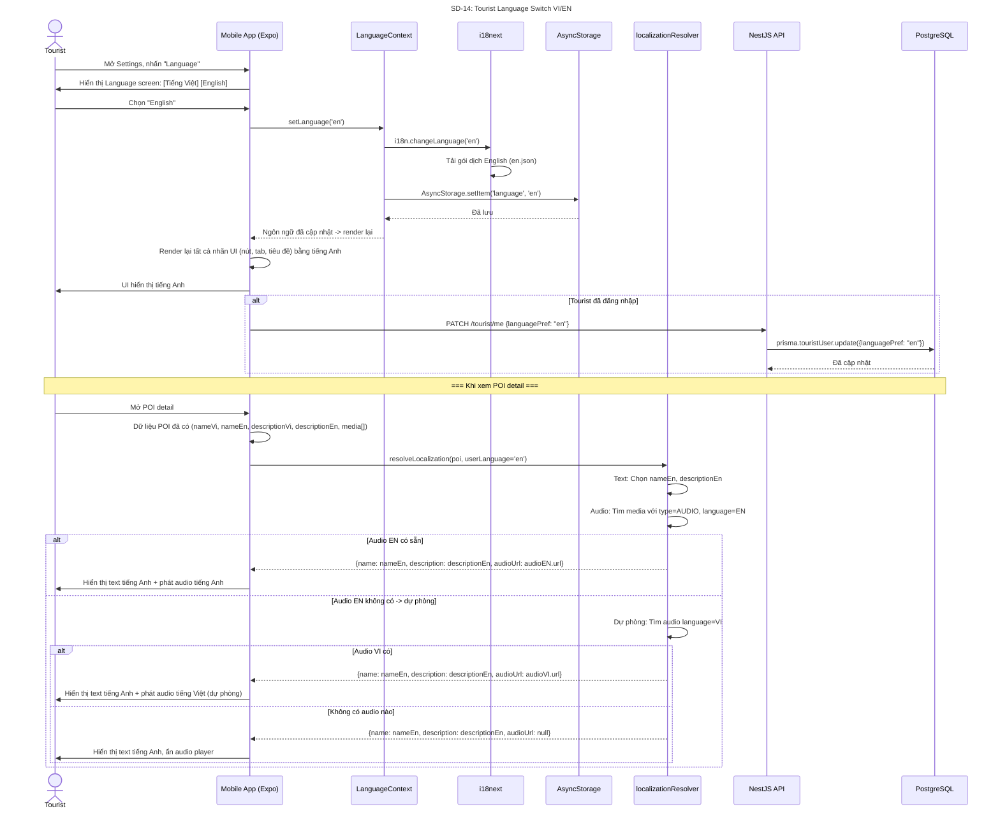
```mermaid
sequenceDiagram
    title SD-14: Tourist Language Switch VI/EN
    actor Tourist
    participant App as Mobile App (Expo)
    participant Lang as LanguageContext
    participant i18n as i18next
    participant Storage as AsyncStorage
    participant Resolver as localizationResolver
    participant API as NestJS API
    participant DB as PostgreSQL

    Tourist->>App: Mở Settings, nhấn "Language"
    App->>Tourist: Hiển thị Language screen: [Tiếng Việt] [English]
    Tourist->>App: Chọn "English"

    App->>Lang: setLanguage('en')
    Lang->>i18n: i18n.changeLanguage('en')
    i18n->>i18n: Tải gói dịch English (en.json)
    Lang->>Storage: AsyncStorage.setItem('language', 'en')
    Storage-->>Lang: Đã lưu

    Lang-->>App: Ngôn ngữ đã cập nhật -> render lại
    App->>App: Render lại tất cả nhãn UI (nút, tab, tiêu đề) bằng tiếng Anh
    App->>Tourist: UI hiển thị tiếng Anh

    alt Tourist đã đăng nhập
        App->>API: PATCH /tourist/me {languagePref: "en"}
        API->>DB: prisma.touristUser.update({languagePref: "en"})
        DB-->>API: Đã cập nhật
    end

    Note over Tourist, DB: === Khi xem POI detail ===
    Tourist->>App: Mở POI detail
    App->>App: Dữ liệu POI đã có (nameVi, nameEn, descriptionVi, descriptionEn, media[])
    App->>Resolver: resolveLocalization(poi, userLanguage='en')

    Resolver->>Resolver: Text: Chọn nameEn, descriptionEn
    Resolver->>Resolver: Audio: Tìm media với type=AUDIO, language=EN

    alt Audio EN có sẵn
        Resolver-->>App: {name: nameEn, description: descriptionEn, audioUrl: audioEN.url}
        App->>Tourist: Hiển thị text tiếng Anh + phát audio tiếng Anh
    else Audio EN không có -> dự phòng
        Resolver->>Resolver: Dự phòng: Tìm audio language=VI
        alt Audio VI có
            Resolver-->>App: {name: nameEn, description: descriptionEn, audioUrl: audioVI.url}
            App->>Tourist: Hiển thị text tiếng Anh + phát audio tiếng Việt (dự phòng)
        else Không có audio nào
            Resolver-->>App: {name: nameEn, description: descriptionEn, audioUrl: null}
            App->>Tourist: Hiển thị text tiếng Anh, ẩn audio player
        end
    end
```

---

## SD-15: Tourist Đăng ký & Đăng nhập

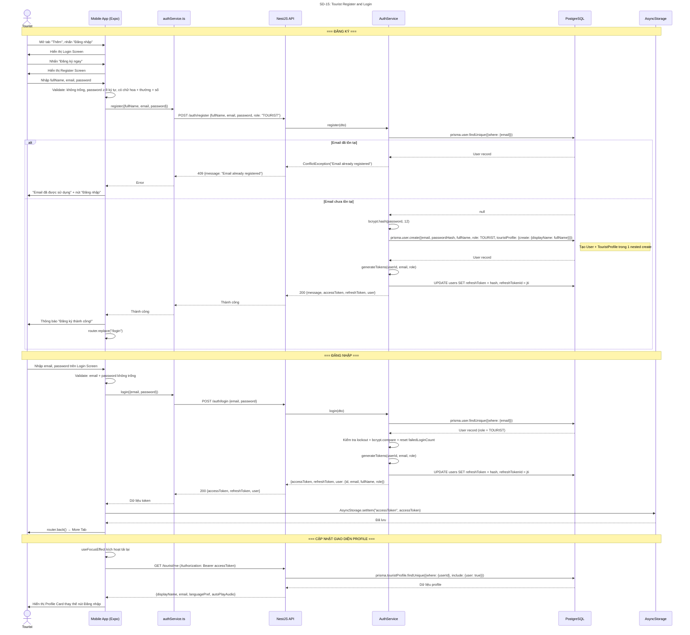
```mermaid
sequenceDiagram
    title SD-15: Tourist Register and Login
    actor Tourist
    participant App as Mobile App (Expo)
    participant Auth as authService.ts
    participant API as NestJS API
    participant AuthSvc as AuthService
    participant DB as PostgreSQL
    participant Store as AsyncStorage

    Note over Tourist, Store: === ĐĂNG KÝ ===
    Tourist->>App: Mở tab "Thêm", nhấn "Đăng nhập"
    App->>Tourist: Hiển thị Login Screen
    Tourist->>App: Nhấn "Đăng ký ngay"
    App->>Tourist: Hiển thị Register Screen
    Tourist->>App: Nhập fullName, email, password
    App->>App: Validate: không trống, password ≥ 8 ký tự, có chữ hoa + thường + số
    App->>Auth: register({fullName, email, password})
    Auth->>API: POST /auth/register {fullName, email, password, role: "TOURIST"}
    API->>AuthSvc: register(dto)
    AuthSvc->>DB: prisma.user.findUnique({where: {email}})

    alt Email đã tồn tại
        DB-->>AuthSvc: User record
        AuthSvc-->>API: ConflictException("Email already registered")
        API-->>Auth: 409 {message: "Email already registered"}
        Auth-->>App: Error
        App->>Tourist: "Email đã được sử dụng" + nút "Đăng nhập"
    else Email chưa tồn tại
        DB-->>AuthSvc: null
        AuthSvc->>AuthSvc: bcrypt.hash(password, 12)
        AuthSvc->>DB: prisma.user.create({email, passwordHash, fullName, role: TOURIST, touristProfile: {create: {displayName: fullName}}})
        Note right of DB: Tạo User + TouristProfile trong 1 nested create
        DB-->>AuthSvc: User record
        AuthSvc->>AuthSvc: generateTokens(userId, email, role)
        AuthSvc->>DB: UPDATE users SET refreshToken = hash, refreshTokenId = jti
        AuthSvc-->>API: 200 {message, accessToken, refreshToken, user}
        API-->>Auth: Thành công
        Auth-->>App: Thành công
        App->>Tourist: Thông báo "Đăng ký thành công!"
        App->>App: router.replace("/login")
    end

    Note over Tourist, Store: === ĐĂNG NHẬP ===
    Tourist->>App: Nhập email, password trên Login Screen
    App->>App: Validate: email + password không trống
    App->>Auth: login({email, password})
    Auth->>API: POST /auth/login {email, password}
    API->>AuthSvc: login(dto)
    AuthSvc->>DB: prisma.user.findUnique({where: {email}})
    DB-->>AuthSvc: User record (role = TOURIST)
    AuthSvc->>AuthSvc: Kiểm tra lockout + bcrypt.compare + reset failedLoginCount
    AuthSvc->>AuthSvc: generateTokens(userId, email, role)
    AuthSvc->>DB: UPDATE users SET refreshToken = hash, refreshTokenId = jti
    AuthSvc-->>API: {accessToken, refreshToken, user: {id, email, fullName, role}}
    API-->>Auth: 200 {accessToken, refreshToken, user}
    Auth-->>App: Dữ liệu token
    App->>Store: AsyncStorage.setItem("accessToken", accessToken)
    Store-->>App: Đã lưu
    App->>Tourist: router.back() → More Tab

    Note over Tourist, Store: === CẬP NHẬT GIAO DIỆN PROFILE ===
    App->>App: useFocusEffect kích hoạt tải lại
    App->>API: GET /tourist/me (Authorization: Bearer accessToken)
    API->>DB: prisma.touristProfile.findUnique({where: {userId}, include: {user: true}})
    DB-->>API: Dữ liệu profile
    API-->>App: {displayName, email, languagePref, autoPlayAudio}
    App->>Tourist: Hiển thị Profile Card thay thế nút Đăng nhập
```

---

## SD-16: Global Audio Singleton

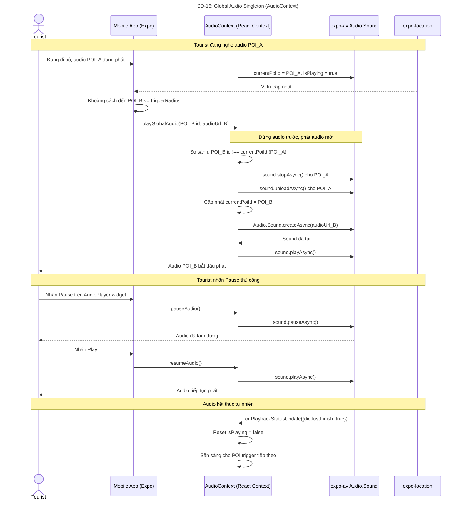
```mermaid
sequenceDiagram
    title SD-16: Global Audio Singleton (AudioContext)
    actor Tourist
    participant App as Mobile App (Expo)
    participant Ctx as AudioContext (React Context)
    participant Player as expo-av Audio.Sound
    participant GPS as expo-location

    Note over Tourist, GPS: Tourist đang nghe audio POI_A
    Tourist->>App: Đang đi bộ, audio POI_A đang phát
    Ctx->>Player: currentPoiId = POI_A, isPlaying = true

    GPS-->>App: Vị trí cập nhật
    App->>App: Khoảng cách đến POI_B <= triggerRadius
    App->>Ctx: playGlobalAudio(POI_B.id, audioUrl_B)

    Note over Ctx, Player: Dừng audio trước, phát audio mới
    Ctx->>Ctx: So sánh: POI_B.id !== currentPoiId (POI_A)
    Ctx->>Player: sound.stopAsync() cho POI_A
    Ctx->>Player: sound.unloadAsync() cho POI_A
    Ctx->>Ctx: Cập nhật currentPoiId = POI_B
    Ctx->>Player: Audio.Sound.createAsync(audioUrl_B)
    Player-->>Ctx: Sound đã tải
    Ctx->>Player: sound.playAsync()
    Player-->>Tourist: Audio POI_B bắt đầu phát

    Note over Tourist, GPS: Tourist nhấn Pause thủ công
    Tourist->>App: Nhấn Pause trên AudioPlayer widget
    App->>Ctx: pauseAudio()
    Ctx->>Player: sound.pauseAsync()
    Player-->>Tourist: Audio đã tạm dừng

    Tourist->>App: Nhấn Play
    App->>Ctx: resumeAudio()
    Ctx->>Player: sound.playAsync()
    Player-->>Tourist: Audio tiếp tục phát

    Note over Tourist, GPS: Audio kết thúc tự nhiên
    Player-->>Ctx: onPlaybackStatusUpdate({didJustFinish: true})
    Ctx->>Ctx: Reset isPlaying = false
    Ctx->>Ctx: Sẵn sàng cho POI trigger tiếp theo
```

---

## SD-17: QR Code Offline Fallback (SQLite)

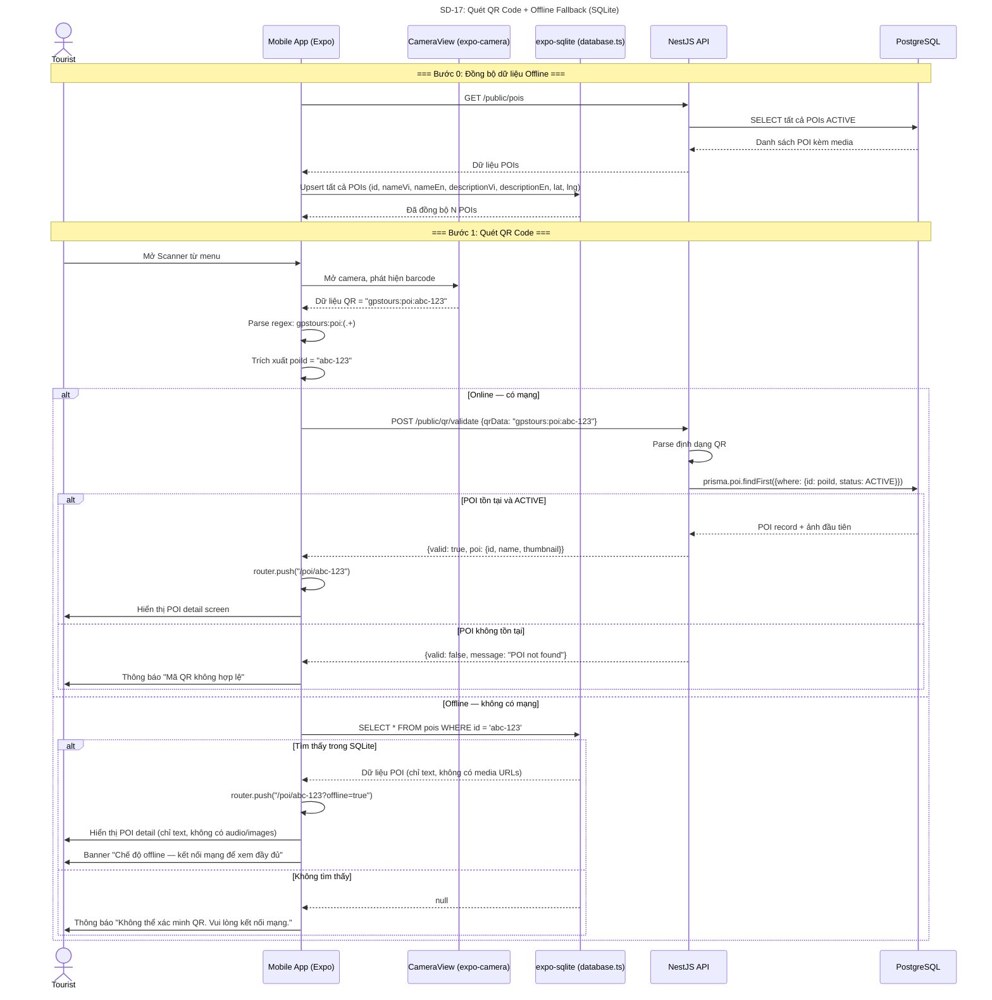
```mermaid
sequenceDiagram
    title SD-17: Quét QR Code + Offline Fallback (SQLite)
    actor Tourist
    participant App as Mobile App (Expo)
    participant Scanner as CameraView (expo-camera)
    participant SQLite as expo-sqlite (database.ts)
    participant API as NestJS API
    participant DB as PostgreSQL

    Note over Tourist, DB: === Bước 0: Đồng bộ dữ liệu Offline ===
    App->>API: GET /public/pois
    API->>DB: SELECT tất cả POIs ACTIVE
    DB-->>API: Danh sách POI kèm media
    API-->>App: Dữ liệu POIs
    App->>SQLite: Upsert tất cả POIs (id, nameVi, nameEn, descriptionVi, descriptionEn, lat, lng)
    SQLite-->>App: Đã đồng bộ N POIs

    Note over Tourist, DB: === Bước 1: Quét QR Code ===
    Tourist->>App: Mở Scanner từ menu
    App->>Scanner: Mở camera, phát hiện barcode
    Scanner-->>App: Dữ liệu QR = "gpstours:poi:abc-123"

    App->>App: Parse regex: gpstours:poi:(.+)
    App->>App: Trích xuất poiId = "abc-123"

    alt Online — có mạng
        App->>API: POST /public/qr/validate {qrData: "gpstours:poi:abc-123"}
        API->>API: Parse định dạng QR
        API->>DB: prisma.poi.findFirst({where: {id: poiId, status: ACTIVE}})

        alt POI tồn tại và ACTIVE
            DB-->>API: POI record + ảnh đầu tiên
            API-->>App: {valid: true, poi: {id, name, thumbnail}}
            App->>App: router.push("/poi/abc-123")
            App->>Tourist: Hiển thị POI detail screen
        else POI không tồn tại
            API-->>App: {valid: false, message: "POI not found"}
            App->>Tourist: Thông báo "Mã QR không hợp lệ"
        end

    else Offline — không có mạng
        App->>SQLite: SELECT * FROM pois WHERE id = 'abc-123'

        alt Tìm thấy trong SQLite
            SQLite-->>App: Dữ liệu POI (chỉ text, không có media URLs)
            App->>App: router.push("/poi/abc-123?offline=true")
            App->>Tourist: Hiển thị POI detail (chỉ text, không có audio/images)
            App->>Tourist: Banner "Chế độ offline — kết nối mạng để xem đầy đủ"
        else Không tìm thấy
            SQLite-->>App: null
            App->>Tourist: Thông báo "Không thể xác minh QR. Vui lòng kết nối mạng."
        end
    end
```

---

## SD-18: TTS Audio Generation

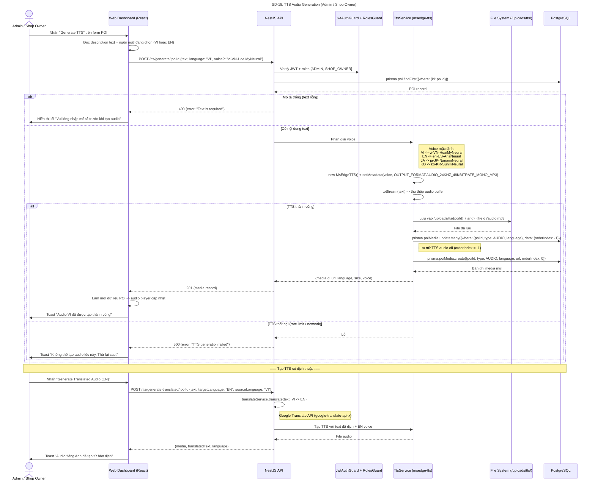
```mermaid
sequenceDiagram
    title SD-18: TTS Audio Generation (Admin / Shop Owner)
    actor User as Admin / Shop Owner
    participant UI as Web Dashboard (React)
    participant API as NestJS API
    participant Guard as JwtAuthGuard + RolesGuard
    participant TTS as TtsService (msedge-tts)
    participant FS as File System (/uploads/tts/)
    participant DB as PostgreSQL

    User->>UI: Nhấn "Generate TTS" trên form POI
    UI->>UI: Đọc description text + ngôn ngữ đang chọn (VI hoặc EN)

    UI->>API: POST /tts/generate/:poiId {text, language: "VI", voice?: "vi-VN-HoaiMyNeural"}
    API->>Guard: Verify JWT + roles [ADMIN, SHOP_OWNER]

    API->>DB: prisma.poi.findFirst({where: {id: poiId}})
    DB-->>API: POI record

    alt Mô tả trống (text rỗng)
        API-->>UI: 400 {error: "Text is required"}
        UI->>User: Hiển thị lỗi "Vui lòng nhập mô tả trước khi tạo audio"
    else Có nội dung text
        API->>TTS: Phân giải voice
        Note right of TTS: Voice mặc định:<br/>VI -> vi-VN-HoaiMyNeural<br/>EN -> en-US-AriaNeural<br/>JA -> ja-JP-NanamiNeural<br/>KO -> ko-KR-SunHiNeural
        TTS->>TTS: new MsEdgeTTS() + setMetadata(voice, OUTPUT_FORMAT.AUDIO_24KHZ_48KBITRATE_MONO_MP3)
        TTS->>TTS: toStream(text) -> thu thập audio buffer

        alt TTS thành công
            TTS->>FS: Lưu vào /uploads/tts/{poiId}_{lang}_{fileId}/audio.mp3
            FS-->>TTS: File đã lưu

            TTS->>DB: prisma.poiMedia.updateMany({where: {poiId, type: AUDIO, language}, data: {orderIndex: -1}})
            Note right of TTS: Lưu trữ TTS audio cũ (orderIndex = -1)
            TTS->>DB: prisma.poiMedia.create({poiId, type: AUDIO, language, url, orderIndex: 0})
            DB-->>TTS: Bản ghi media mới

            TTS-->>API: {mediaId, url, language, size, voice}
            API-->>UI: 201 {media record}
            UI->>UI: Làm mới dữ liệu POI -> audio player cập nhật
            UI->>User: Toast "Audio VI đã được tạo thành công"
        else TTS thất bại (rate limit / network)
            TTS-->>API: Lỗi
            API-->>UI: 500 {error: "TTS generation failed"}
            UI->>User: Toast "Không thể tạo audio lúc này. Thử lại sau."
        end
    end

    Note over User, DB: === Tạo TTS có dịch thuật ===
    User->>UI: Nhấn "Generate Translated Audio (EN)"
    UI->>API: POST /tts/generate-translated/:poiId {text, targetLanguage: "EN", sourceLanguage: "VI"}
    API->>API: translateService.translate(text, VI -> EN)
    Note right of API: Google Translate API (google-translate-api-x)
    API->>TTS: Tạo TTS với text đã dịch + EN voice
    TTS-->>API: File audio
    API-->>UI: {media, translatedText, language}
    UI->>User: Toast "Audio tiếng Anh đã tạo từ bản dịch"
```

---

## SD-19: Device Capability Check

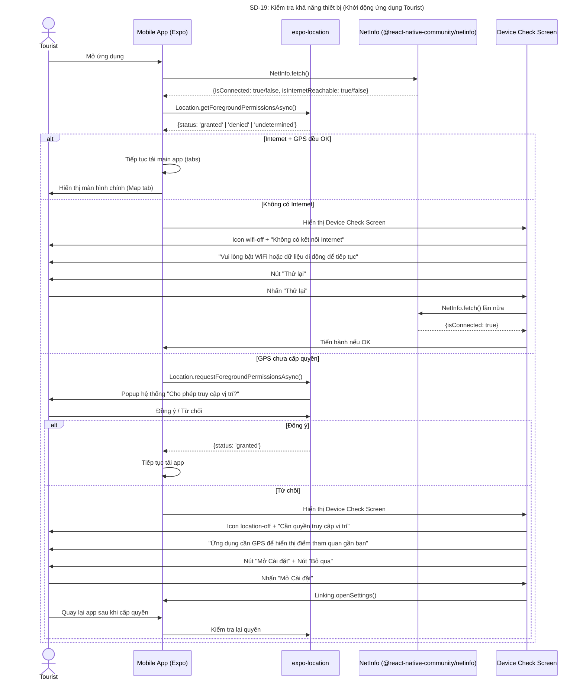
```mermaid
sequenceDiagram
    title SD-19: Kiểm tra khả năng thiết bị (Khởi động ứng dụng Tourist)
    actor Tourist
    participant App as Mobile App (Expo)
    participant GPS as expo-location
    participant Net as NetInfo (@react-native-community/netinfo)
    participant UI as Device Check Screen

    Tourist->>App: Mở ứng dụng

    App->>Net: NetInfo.fetch()
    Net-->>App: {isConnected: true/false, isInternetReachable: true/false}

    App->>GPS: Location.getForegroundPermissionsAsync()
    GPS-->>App: {status: 'granted' | 'denied' | 'undetermined'}

    alt Internet + GPS đều OK
        App->>App: Tiếp tục tải main app (tabs)
        App->>Tourist: Hiển thị màn hình chính (Map tab)
    else Không có Internet
        App->>UI: Hiển thị Device Check Screen
        UI->>Tourist: Icon wifi-off + "Không có kết nối Internet"
        UI->>Tourist: "Vui lòng bật WiFi hoặc dữ liệu di động để tiếp tục"
        UI->>Tourist: Nút "Thử lại"
        Tourist->>UI: Nhấn "Thử lại"
        UI->>Net: NetInfo.fetch() lần nữa
        Net-->>UI: {isConnected: true}
        UI->>App: Tiến hành nếu OK
    else GPS chưa cấp quyền
        App->>GPS: Location.requestForegroundPermissionsAsync()
        GPS->>Tourist: Popup hệ thống "Cho phép truy cập vị trí?"
        Tourist->>GPS: Đồng ý / Từ chối

        alt Đồng ý
            GPS-->>App: {status: 'granted'}
            App->>App: Tiếp tục tải app
        else Từ chối
            App->>UI: Hiển thị Device Check Screen
            UI->>Tourist: Icon location-off + "Cần quyền truy cập vị trí"
            UI->>Tourist: "Ứng dụng cần GPS để hiển thị điểm tham quan gần bạn"
            UI->>Tourist: Nút "Mở Cài đặt" + Nút "Bỏ qua"
            Tourist->>UI: Nhấn "Mở Cài đặt"
            UI->>App: Linking.openSettings()
            Tourist->>App: Quay lại app sau khi cấp quyền
            App->>GPS: Kiểm tra lại quyền
        end
    end
```

---

## SD-20: Admin & Shop Owner Map View

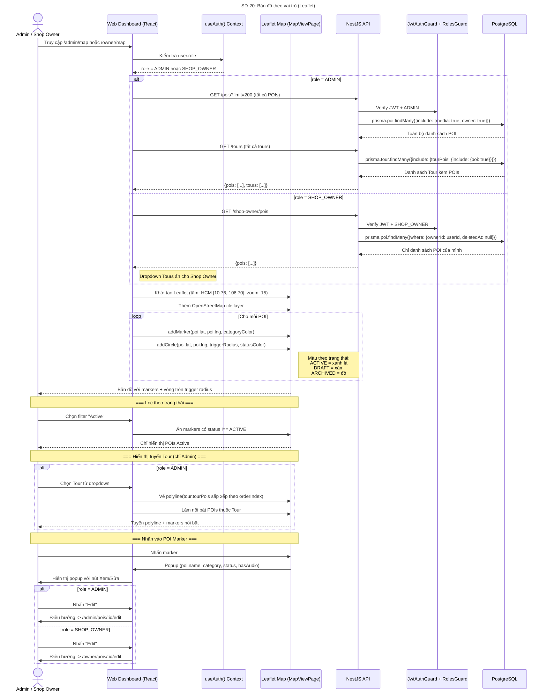
```mermaid
sequenceDiagram
    title SD-20: Bản đồ theo vai trò (Leaflet)
    actor User as Admin / Shop Owner
    participant UI as Web Dashboard (React)
    participant Auth as useAuth() Context
    participant Map as Leaflet Map (MapViewPage)
    participant API as NestJS API
    participant Guard as JwtAuthGuard + RolesGuard
    participant DB as PostgreSQL

    User->>UI: Truy cập /admin/map hoặc /owner/map
    UI->>Auth: Kiểm tra user.role
    Auth-->>UI: role = ADMIN hoặc SHOP_OWNER

    alt role = ADMIN
        UI->>API: GET /pois?limit=200 (tất cả POIs)
        API->>Guard: Verify JWT + ADMIN
        API->>DB: prisma.poi.findMany({include: {media: true, owner: true}})
        DB-->>API: Toàn bộ danh sách POI

        UI->>API: GET /tours (tất cả tours)
        API->>DB: prisma.tour.findMany({include: {tourPois: {include: {poi: true}}}})
        DB-->>API: Danh sách Tour kèm POIs
        API-->>UI: {pois: [...], tours: [...]}

    else role = SHOP_OWNER
        UI->>API: GET /shop-owner/pois
        API->>Guard: Verify JWT + SHOP_OWNER
        API->>DB: prisma.poi.findMany({where: {ownerId: userId, deletedAt: null}})
        DB-->>API: Chỉ danh sách POI của mình
        API-->>UI: {pois: [...]}
        Note right of UI: Dropdown Tours ẩn cho Shop Owner
    end

    UI->>Map: Khởi tạo Leaflet (tâm: HCM [10.76, 106.70], zoom: 15)
    UI->>Map: Thêm OpenStreetMap tile layer

    loop Cho mỗi POI
        UI->>Map: addMarker(poi.lat, poi.lng, categoryColor)
        UI->>Map: addCircle(poi.lat, poi.lng, triggerRadius, statusColor)
        Note right of Map: Màu theo trạng thái:<br/>ACTIVE = xanh lá<br/>DRAFT = xám<br/>ARCHIVED = đỏ
    end
    Map-->>User: Bản đồ với markers + vòng tròn trigger radius

    Note over User, Map: === Lọc theo trạng thái ===
    User->>UI: Chọn filter "Active"
    UI->>Map: Ẩn markers có status !== ACTIVE
    Map-->>User: Chỉ hiển thị POIs Active

    Note over User, Map: === Hiển thị tuyến Tour (chỉ Admin) ===
    alt role = ADMIN
        User->>UI: Chọn Tour từ dropdown
        UI->>Map: Vẽ polyline(tour.tourPois sắp xếp theo orderIndex)
        UI->>Map: Làm nổi bật POIs thuộc Tour
        Map-->>User: Tuyến polyline + markers nổi bật
    end

    Note over User, Map: === Nhấn vào POI Marker ===
    User->>Map: Nhấn marker
    Map->>UI: Popup (poi.name, category, status, hasAudio)
    UI->>User: Hiển thị popup với nút Xem/Sửa

    alt role = ADMIN
        User->>UI: Nhấn "Edit"
        UI->>User: Điều hướng -> /admin/pois/:id/edit
    else role = SHOP_OWNER
        User->>UI: Nhấn "Edit"
        UI->>User: Điều hướng -> /owner/pois/:id/edit
    end
```

---

## SD-21: Auto QR Code Generation & View/Download

```mermaid
sequenceDiagram
    title SD-21: Tự động tạo QR Code + Xem/Tải
    actor Admin
    participant UI as Admin Dashboard (React)
    participant API as NestJS API
    participant POI as PoisService
    participant QR as QrService
    participant FS as File System (/uploads/qr/)
    participant DB as PostgreSQL

    Note over Admin, DB: === Giai đoạn 1: Tự động tạo khi tạo POI ===
    Admin->>UI: Tạo POI (nhấn Save)
    UI->>API: POST /pois {name, desc, lat, lng, ...}
    API->>POI: create(dto)
    POI->>DB: prisma.poi.create({...})
    DB-->>POI: POI record (poiId)

    POI->>QR: generateForPoi(poiId) [fire-and-forget]
    QR->>QR: qrData = "gpstours:poi:{poiId}"
    QR->>QR: QRCode.toFile(filePath, qrData, {width: 512, errorCorrectionLevel: 'H'})
    QR->>FS: Lưu /uploads/qr/poi_{poiId}.png
    QR->>DB: prisma.poi.update({qrCodeUrl: '/uploads/qr/poi_{poiId}.png'})
    QR-->>POI: QR URL đã lưu

    POI-->>API: 201 {poi}
    API-->>UI: POI đã tạo

    Note over Admin, DB: === Giai đoạn 2: Xem QR trong trang Edit ===
    Admin->>UI: Mở /admin/pois/:id/edit
    UI->>API: GET /pois/:id/qr
    API->>QR: getQr(poiId)
    QR->>DB: prisma.poi.findFirst({where: {id: poiId}})

    alt QR code tồn tại (qrCodeUrl not null)
        QR->>QR: QRCode.toDataURL() -> base64 data URL
        QR-->>API: {poiId, poiName, qrCodeUrl, qrDataUrl, qrContent}
    else QR code chưa được tạo
        QR->>QR: generateForPoi(poiId) — tự động tạo
        QR-->>API: {poiId, poiName, qrCodeUrl, qrDataUrl, qrContent}
    end
    API-->>UI: Dữ liệu QR code
    UI->>Admin: Hiển thị QR code (ảnh + nút tải + nút tạo lại)

    Note over Admin, DB: === Giai đoạn 3: Tải QR ===
    Admin->>UI: Nhấn "Download PNG"
    UI->>API: GET /pois/:id/qr/download
    API->>QR: downloadQr(poiId)
    QR->>FS: Kiểm tra file tồn tại
    QR-->>API: res.download(filePath, "QR_{poiName}.png")
    API-->>UI: Tải file (PNG)
    UI->>Admin: Trình duyệt tải file QR PNG

    Note over Admin, DB: === Giai đoạn 4: Tạo lại (chỉ Admin) ===
    Admin->>UI: Nhấn "Regenerate"
    UI->>API: POST /pois/:id/qr/regenerate
    API->>QR: generateForPoi(poiId)
    QR->>FS: Ghi đè /uploads/qr/poi_{poiId}.png
    QR->>DB: UPDATE pois SET qrCodeUrl
    QR-->>API: Dữ liệu QR mới
    API-->>UI: {qrCodeUrl, qrDataUrl}
    UI->>Admin: Hiển thị QR code mới + Toast "Đã tạo lại"
```

---

## SD-22: Shop Owner View/Edit POI + TTS Generation

```mermaid
sequenceDiagram
    title SD-22: Shop Owner Xem/Sửa POI + Tạo TTS
    actor SO as Shop Owner
    participant UI as Shop Owner Dashboard (React)
    participant Form as ShopOwnerPOIFormPage
    participant API as NestJS API
    participant Guard as JwtAuthGuard + RolesGuard(SHOP_OWNER)
    participant TTS as TtsService
    participant FS as File System
    participant DB as PostgreSQL

    Note over SO, DB: === Giai đoạn 1: Điều hướng từ Dashboard ===
    SO->>UI: Xem danh sách My POIs trên Dashboard
    UI->>SO: Hiển thị danh sách POIs (nút Edit, View)

    alt Nhấn "View"
        SO->>UI: Nhấn nút View (biểu tượng ExternalLink)
        UI->>Form: Điều hướng -> /owner/pois/:id (readOnly=true)
    else Nhấn "Edit"
        SO->>UI: Nhấn nút Edit (biểu tượng Edit3)
        UI->>Form: Điều hướng -> /owner/pois/:id/edit (readOnly=false)
    end

    Note over SO, DB: === Giai đoạn 2: Lấy chi tiết POI ===
    Form->>API: GET /shop-owner/pois/:id
    API->>Guard: Verify JWT + role = SHOP_OWNER
    Guard-->>API: userId được trích xuất
    API->>DB: prisma.poi.findFirst({where: {id, deletedAt: null}, include: {media: true, owner: true}})
    DB-->>API: Bản ghi POI kèm media

    alt poi.ownerId !== userId
        API-->>Form: 403 Forbidden
        Form->>SO: Lỗi -> chuyển hướng về dashboard
    else Quyền sở hữu OK
        API-->>Form: 200 {poi kèm media}
        Form->>Form: Điền formData (nameVi, nameEn, descriptionVi, descriptionEn, lat, lng)
        Form->>Form: Đặt existingMedia (danh sách images + audio)
    end

    Note over SO, DB: === Giai đoạn 3: Chế độ xem (readOnly) ===
    alt readOnly = true
        Form->>SO: Hiển thị chi tiết POI (tất cả input bị vô hiệu)
        Form->>SO: Hiển thị images + audio player
        Form->>SO: Nút "Quay lại" để trở về
    end

    Note over SO, DB: === Giai đoạn 4: Chế độ chỉnh sửa ===
    alt readOnly = false
        SO->>Form: Chỉnh sửa thông tin (tabs VI/EN)
        SO->>Form: Upload thêm media (images, audio)

        Note over SO, DB: === Tạo TTS ===
        SO->>Form: Nhấn "Generate VI Audio"
        Form->>API: POST /tts/generate/:poiId {text: descriptionVi, language: "VI"}
        API->>Guard: Verify JWT + roles [ADMIN, SHOP_OWNER]
        API->>TTS: synthesize(text, "VI", voice)
        TTS->>TTS: MsEdgeTTS -> tạo MP3
        TTS->>FS: Lưu file audio
        TTS->>DB: Lưu trữ TTS cũ + tạo mới poiMedia
        API-->>Form: 201 {media record}
        Form->>API: GET /shop-owner/pois/:id (làm mới danh sách media)
        API-->>Form: POI cập nhật kèm audio mới
        Form->>SO: Toast "TTS audio đã tạo" + audio player cập nhật

        Note over SO, DB: === Lưu thay đổi ===
        SO->>Form: Nhấn "Save Changes"
        Form->>API: PUT /shop-owner/pois/:id {nameVi, nameEn, descriptionVi, descriptionEn}
        API->>Guard: Xác minh quyền sở hữu (ownerId === userId)
        API->>DB: prisma.poi.update({where: {id}, data: {...dto}})
        DB-->>API: Bản ghi đã cập nhật

        opt Upload file media mới
            Form->>API: POST /shop-owner/pois/:id/media (multipart, type=IMAGE)
            API->>FS: Multer lưu -> /uploads/{UUID}
            API->>DB: prisma.poiMedia.create({poiId, type, language, url})
        end

        API-->>Form: Thành công
        Form->>SO: Toast "POI updated" -> Điều hướng đến /owner/dashboard
    end
```

---

## SD-23: Translation Workflow

```mermaid
sequenceDiagram
    title SD-23: Quy trình dịch thuật (Admin / Shop Owner)
    actor User as Admin / Shop Owner
    participant UI as Web Dashboard (React)
    participant API as NestJS API
    participant Guard as JwtAuthGuard + RolesGuard
    participant Translate as TranslateService (google-translate-api-x)
    participant DB as PostgreSQL

    Note over User, DB: === Dịch đơn lẻ ===
    User->>UI: Trên POI Form, nhấn "Tự động dịch VI -> EN"
    UI->>API: POST /translate {text: descriptionVi, from: "vi", to: "en"}
    API->>Guard: Verify JWT + roles [ADMIN, SHOP_OWNER]
    API->>Translate: translate(text, {from: "vi", to: "en"})
    Note right of Translate: Dynamic import: google-translate-api-x (ESM)
    Translate-->>API: {translatedText}
    API-->>UI: 200 {translatedText, from: "vi", to: "en"}
    UI->>UI: Điền descriptionEn với translatedText
    UI->>User: Toast "Dịch hoàn tất"

    Note over User, DB: === Dịch hàng loạt ===
    User->>UI: Nhấn "Dịch tất cả trường VI -> EN"
    UI->>API: POST /translate/batch {texts: [nameVi, descriptionVi], from: "vi", to: "en"}
    API->>Translate: translateBatch(texts, from, to)

    loop Cho mỗi text trong batch
        Translate->>Translate: translate(text) — dự phòng (trả lại bản gốc nếu lỗi)
    end

    Translate-->>API: {translations: [nameEn, descriptionEn]}
    API-->>UI: 200 {translations, from, to}
    UI->>UI: Điền các trường nameEn + descriptionEn
    UI->>User: Toast "Tất cả trường đã dịch"

    Note over User, DB: === Lấy ngôn ngữ hỗ trợ ===
    UI->>API: GET /translate/languages
    API-->>UI: [{code: "vi", label: "Tiếng Việt"}, {code: "en", label: "English"}, {code: "ja", label: "Tiếng Nhật"}, ...]
```

---

## SD-24: Tourist Custom Tour CRUD

```mermaid
sequenceDiagram
    title SD-24: Tourist Custom Tour CRUD
    actor Tourist
    participant App as Mobile App (Expo)
    participant API as NestJS API
    participant Guard as JwtAuthGuard
    participant Service as TouristService
    participant DB as PostgreSQL

    Note over Tourist, DB: === Tạo Custom Tour ===
    Tourist->>App: Mở tab Tours, nhấn "Tạo Tour tùy chỉnh"
    App->>Tourist: Hiển thị tour/create screen
    App->>API: GET /public/pois (lấy danh sách POIs để chọn)
    API-->>App: Tất cả POIs đang hoạt động

    Tourist->>App: Chọn POIs, sắp xếp thứ tự, nhập tên tour
    App->>API: POST /tourist/me/tours {name, description?, poiIds: [id1, id2, id3]}
    API->>Guard: Verify JWT (role = TOURIST)
    API->>Service: createCustomTour(userId, dto)
    Service->>DB: prisma.poi.findMany({where: {id: {in: poiIds}, status: ACTIVE}})
    DB-->>Service: Xác nhận tất cả POIs tồn tại + ACTIVE

    Service->>Service: Tính estimatedDuration
    Note right of Service: Khoảng cách haversine / 75m mỗi phút<br/>+ 10 phút mỗi điểm dừng

    Service->>DB: prisma.tour.create({name, description, tourType: CUSTOM, createdById: userId, estimatedDuration})
    Service->>DB: prisma.tourPoi.createMany([{tourId, poiId: id1, orderIndex: 0}, ...])
    DB-->>Service: Tour + TourPois đã tạo
    Service-->>API: Custom tour
    API-->>App: 201 {tour}
    App->>Tourist: Toast "Tour đã tạo!" -> điều hướng đến danh sách tour

    Note over Tourist, DB: === Xem Custom Tours ===
    Tourist->>App: Mở tab Tours, mục "My Tours"
    App->>API: GET /tourist/me/tours
    API->>DB: prisma.tour.findMany({where: {createdById: userId, tourType: CUSTOM, deletedAt: null}})
    DB-->>API: Danh sách custom tour
    API-->>App: [{id, name, poiCount}, ...]
    App->>Tourist: Hiển thị danh sách custom tours

    Note over Tourist, DB: === Chỉnh sửa Custom Tour ===
    Tourist->>App: Chọn tour, nhấn "Edit"
    App->>API: GET /tourist/me/tours/:tourId
    API->>DB: Xác minh quyền sở hữu + tourType = CUSTOM
    API-->>App: Chi tiết Tour kèm POIs
    Tourist->>App: Thêm/xóa POIs, thay đổi thứ tự
    App->>API: PATCH /tourist/me/tours/:tourId {name?, poiIds?}
    API->>Service: updateCustomTour(userId, tourId, dto)

    alt poiIds thay đổi
        Service->>DB: prisma.tourPoi.deleteMany({where: {tourId}})
        Service->>DB: prisma.tourPoi.create (các điểm dừng mới)
        Service->>Service: Tính lại estimatedDuration
    end

    Service->>DB: prisma.tour.update({name, estimatedDuration})
    API-->>App: 200 {tour đã cập nhật}

    Note over Tourist, DB: === Xóa Custom Tour ===
    Tourist->>App: Nhấn "Xóa Tour"
    App->>API: DELETE /tourist/me/tours/:tourId
    API->>DB: Xác minh quyền sở hữu
    API->>DB: prisma.tour.update({deletedAt: new Date()}) — xóa mềm
    API-->>App: 200
    App->>Tourist: Tour đã xóa khỏi danh sách
```

---

## SD-25: Admin Analytics Overview

```mermaid
sequenceDiagram
    title SD-25: Admin Analytics Overview
    actor Admin
    participant UI as Admin Dashboard (AnalyticsPage)
    participant API as NestJS API
    participant Guard as JwtAuthGuard + RolesGuard(ADMIN)
    participant Analytics as AnalyticsService
    participant DB as PostgreSQL

    Admin->>UI: Nhấn "Analytics" trên sidebar
    UI->>API: GET /admin/analytics/overview?startDate=2026-03-01&endDate=2026-04-01
    API->>Guard: Verify JWT + ADMIN

    API->>Analytics: getOverview(startDate?, endDate?)

    par Truy vấn DB song song
        Analytics->>DB: prisma.poi.count({where: {deletedAt: null}})
        DB-->>Analytics: totalPois
    and
        Analytics->>DB: prisma.tour.count({where: {deletedAt: null}})
        DB-->>Analytics: totalTours
    and
        Analytics->>DB: prisma.touristUser.count()
        DB-->>Analytics: totalTourists
    and
        Analytics->>DB: prisma.viewHistory.count({where: {viewedAt: {gte, lte}}})
        DB-->>Analytics: totalViews
    and
        Analytics->>DB: prisma.viewHistory.count({where: {audioPlayed: true, viewedAt: {gte, lte}}})
        DB-->>Analytics: totalAudioPlays
    end

    Analytics->>DB: Top 10 POIs theo lượt xem (GROUP BY poiId, ORDER BY count DESC, LIMIT 10)
    DB-->>Analytics: topPois [{poiId, name, viewCount}]

    Analytics->>DB: Phân bổ loại trigger: prisma.triggerLog.count (group by triggerType: GPS, QR, MANUAL)
    DB-->>Analytics: triggerStats {gps: N, qr: N, manual: N}

    Analytics-->>API: {totalPois, totalTours, totalTourists, totalViews, totalAudioPlays, topPois, triggerStats}
    API-->>UI: 200 {dữ liệu tổng quan}

    UI->>Admin: Hiển thị Analytics Dashboard
    Note right of UI: - Thẻ thống kê (POIs, Tours, Tourists, Views)<br/>- Biểu đồ cột Top 10 POIs<br/>- Biểu đồ tròn loại trigger (GPS/QR/Manual)<br/>- Bộ chọn khoảng thời gian
```

---

## SD-26: Admin Merchant Management

```mermaid
sequenceDiagram
    title SD-26: Quản lý Merchant (Shop Owner) bởi Admin
    actor Admin
    participant UI as Admin Dashboard (MerchantListPage)
    participant API as NestJS API
    participant Guard as JwtAuthGuard + RolesGuard(ADMIN)
    participant Service as MerchantsService
    participant DB as PostgreSQL

    Note over Admin, DB: === Danh sách Merchants ===
    Admin->>UI: Nhấn "Merchants" trên sidebar
    UI->>API: GET /merchants?page=1&limit=10&search=
    API->>Guard: Verify JWT + ADMIN
    API->>Service: findAll(page, limit, search)
    Service->>DB: prisma.user.findMany({where: {role: SHOP_OWNER, OR: [name LIKE, email LIKE, shopOwner.shopName LIKE]}})
    Service->>DB: prisma.user.count({where: tương tự})
    DB-->>Service: Danh sách Merchant + tổng số
    Service-->>API: Merchants phân trang
    API-->>UI: {data: [{id, fullName, email, shopOwner: {shopName, phone}}], total, page}
    UI->>Admin: Hiển thị bảng merchant

    Note over Admin, DB: === Tạo Merchant ===
    Admin->>UI: Nhấn "+ Add Merchant"
    UI->>Admin: Hiển thị MerchantFormPage
    Admin->>UI: Nhập email, password, fullName, shopName, phone, shopAddress
    UI->>API: POST /merchants {email, password, fullName, shopName, shopAddress, phone}
    API->>Service: create(dto)
    Service->>DB: prisma.user.findUnique({where: {email}}) — kiểm tra trùng
    Service->>Service: bcrypt.hash(password, 12)
    Service->>DB: prisma.user.create({email, passwordHash, fullName, role: SHOP_OWNER})
    Service->>DB: prisma.shopOwner.create({userId, shopName, shopAddress, phone})
    DB-->>Service: User + ShopOwner đã tạo
    Service-->>API: Merchant (loại trừ passwordHash)
    API-->>UI: 201 {merchant}
    UI->>Admin: Toast "Merchant đã tạo" -> chuyển hướng danh sách

    Note over Admin, DB: === Cập nhật Merchant ===
    Admin->>UI: Nhấn "Edit" trên dòng merchant
    UI->>API: GET /merchants/:id
    API->>DB: prisma.user.findUnique({include: {shopOwner: true}})
    API-->>UI: Chi tiết Merchant
    Admin->>UI: Sửa thông tin, nhấn Save
    UI->>API: PUT /merchants/:id {fullName, status, shop: {name, address, phone}}
    API->>DB: prisma.user.update + prisma.shopOwner.update
    API-->>UI: 200 {merchant đã cập nhật}

    Note over Admin, DB: === Xóa (Khóa) Merchant ===
    Admin->>UI: Nhấn "Delete" trên dòng merchant
    UI->>Admin: Dialog xác nhận
    Admin->>UI: Xác nhận
    UI->>API: DELETE /merchants/:id
    API->>Service: remove(id)
    Service->>DB: prisma.user.update({where: {id}, data: {status: "LOCKED"}})
    Note right of Service: Xóa mềm — đặt status = LOCKED<br/>Không xóa dữ liệu, chỉ vô hiệu hóa tài khoản
    DB-->>Service: Đã cập nhật
    Service-->>API: User (đã khóa)
    API-->>UI: 200
    UI->>Admin: Merchant đã xóa khỏi danh sách hoạt động
```

---

## SD-27: Profile Management (All Roles)

```mermaid
sequenceDiagram
    title SD-27: Quản lý Profile (Admin, Shop Owner, Tourist)
    actor User
    participant UI as Dashboard / Mobile App
    participant API as NestJS API
    participant Guard as JwtAuthGuard
    participant Profile as ProfileService
    participant FS as File System (/uploads/)
    participant DB as PostgreSQL

    Note over User, DB: === Xem Profile ===
    User->>UI: Mở trang Profile
    UI->>API: GET /me
    API->>Guard: Verify JWT
    API->>Profile: getProfile(userId)
    Profile->>DB: prisma.user.findUnique({where: {id: userId}, include: {shopOwner: true}})
    DB-->>Profile: Bản ghi User + ShopOwner profile (nếu có)
    Profile->>Profile: Parse profile JSON (phone, birthDate, gender, address)
    Profile-->>API: {fullName, email, role, phone, gender, avatarUrl, shop?: {name, address, phone, openingHours}}
    API-->>UI: 200 {profile}
    UI->>User: Hiển thị trang profile

    Note over User, DB: === Cập nhật Profile ===
    User->>UI: Sửa thông tin, nhấn Save
    UI->>API: PUT /me {fullName?, phone?, birthDate?, gender?, address?, shop?: {name?, address?, openingHours?}}
    API->>Guard: Verify JWT
    API->>Profile: updateProfile(userId, dto)
    Profile->>DB: prisma.user.findUnique({where: {id: userId}})
    Profile->>DB: prisma.user.update({fullName, profile: JSON(phone, birthDate, gender, address)})

    alt User là SHOP_OWNER và có shop data
        Profile->>DB: prisma.shopOwner.update({shopName, shopAddress, phone, openingHours})
    end

    DB-->>Profile: Đã cập nhật
    Profile-->>API: Profile đã cập nhật
    API-->>UI: 200 {profile}
    UI->>User: Toast "Profile đã cập nhật"

    Note over User, DB: === Upload Avatar ===
    User->>UI: Chọn ảnh avatar
    UI->>API: POST /me/avatar (multipart, tối đa 5MB)
    API->>Guard: Verify JWT
    API->>FS: Multer diskStorage -> /uploads/{UUID}{ext}
    FS-->>API: File đã lưu
    API->>DB: prisma.user.update({profile: {..., avatarUrl}})

    alt User là SHOP_OWNER
        API->>DB: prisma.shopOwner.update({avatarUrl})
    end

    API-->>UI: 200 {avatarUrl}
    UI->>User: Avatar preview đã cập nhật
```

---

## SD-28: Token Refresh & Logout

```mermaid
sequenceDiagram
    title SD-28: Luồng Token Refresh & Logout
    actor User
    participant Client as Dashboard / Mobile App
    participant Interceptor as Axios Interceptor
    participant API as NestJS API
    participant Auth as AuthService
    participant DB as PostgreSQL

    Note over User, DB: === Tự động làm mới Token ===
    Client->>API: GET /any-protected-endpoint (Authorization: Bearer accessToken)
    API-->>Client: 401 Unauthorized (token hết hạn)

    Client->>Interceptor: Response interceptor bắt lỗi 401
    Interceptor->>Interceptor: Lấy refreshToken từ storage
    Interceptor->>API: POST /auth/refresh {refreshToken}
    API->>Auth: refreshToken(dto)
    Auth->>Auth: jwt.verify(refreshToken, JWT_REFRESH_SECRET)
    Auth->>Auth: Xác minh tokenType === REFRESH
    Auth->>DB: prisma.revokedToken.findUnique({where: {tokenId: jti}})

    alt Token đã bị thu hồi
        DB-->>Auth: Tìm thấy bản ghi RevokedToken
        Auth-->>API: UnauthorizedException("Token revoked")
        API-->>Interceptor: 401
        Interceptor->>Client: Xóa tất cả tokens
        Client->>User: Chuyển hướng → Trang đăng nhập
    else Token chưa bị thu hồi
        DB-->>Auth: null (chưa thu hồi)
        Auth->>DB: prisma.user.findUnique({where: {id: payload.sub}, select: {refreshToken, refreshTokenId}})
        Auth->>Auth: Kiểm tra user.refreshTokenId === payload.jti
        Auth->>Auth: bcrypt.compare(refreshToken, user.refreshToken) — xác minh khớp
        Auth->>DB: prisma.revokedToken.upsert({tokenId: jti, reason: "ROTATED"}) — thu hồi token cũ
        Note right of Auth: Token rotation: refresh token cũ<br/>bị thu hồi ngay khi sử dụng (reason: ROTATED)
        Auth->>Auth: generateTokens(userId, email, role) — cặp token mới
        Auth->>Auth: bcrypt.hash(newRefreshToken, 10)
        Auth->>DB: prisma.user.update({refreshToken: newHash, refreshTokenId: newJti})
        Auth-->>API: {accessToken, refreshToken}
        API-->>Interceptor: 200 {accessToken, refreshToken}
        Interceptor->>Interceptor: Lưu tokens mới vào storage
        Interceptor->>API: Gửi lại request ban đầu với accessToken mới
        API-->>Client: Dữ liệu response ban đầu
    end

    Note over User, DB: === Đăng xuất ===
    User->>Client: Nhấn "Đăng xuất"
    Client->>API: POST /auth/logout (Authorization: Bearer accessToken)
    API->>Auth: logout(userId, accessTokenId, accessTokenExp)
    Note right of Auth: userId, accessTokenId, accessTokenExp<br/>lấy từ JWT payload qua @CurrentUser() decorator
    Auth->>DB: prisma.user.findUnique({where: {id: userId}, select: {refreshTokenId}})
    Auth->>DB: prisma.user.update({refreshToken: null, refreshTokenId: null})
    Auth->>DB: prisma.revokedToken.upsert({tokenId: refreshTokenId, reason: "LOGOUT"})
    alt accessTokenId được cung cấp
        Auth->>DB: prisma.revokedToken.upsert({tokenId: accessTokenId, reason: "LOGOUT"})
    end
    Auth-->>API: {message: "Logged out successfully"}
    API-->>Client: 200
    Client->>Client: Xóa tokens khỏi localStorage/AsyncStorage
    Client->>User: Chuyển hướng → Trang đăng nhập
```

---

## Summary

| Diagram | Actors | Lifelines | Complexity | Thay đổi so với v3.1 |
|---------|--------|-----------|------------|----------------------|
| SD-01 | Admin | 4 | Medium | Fix: 401 thay 403, thêm status field, refreshTokenId, JWT claims chi tiết |
| SD-02 | Shop Owner | 4 | Medium | Fix: nested create shopOwnerProfile, thêm shopName/phone, conflict handling |
| SD-03 | Admin | 7 | High | Fix: bỏ S3/Nominatim, dùng disk storage + Multer |
| SD-04 | Shop Owner | 7 | Medium | Fix: bỏ Nominatim, khớp với /shop-owner/pois endpoint |
| SD-05 | Admin | 5 | Medium | Fix: dùng /tours và /tours/:id/pois endpoints |
| SD-06 | Tourist | 6 | High | Fix: dùng react-native-maps, thêm AudioContext + triggerLog |
| SD-07 | Tourist | 6 | High | Fix: bỏ Mapbox, dùng react-native-maps, thêm history tracking |
| SD-08 | System | 4 | Medium | **Viết lại:** Bỏ Criteria Engine scoring, dùng distance sort |
| SD-09 | All | 6 | High | **Viết lại:** Web+Mobile, MailService Brevo API, fire-and-forget, _devToken |
| SD-10 | Admin | 7 | High | Fix: bỏ S3, dùng disk storage, thêm TTS re-generation |
| SD-11 | Admin | 5 | Medium | **Đơn giản hóa:** Bỏ force delete/cascade, chỉ soft delete |
| SD-12 | Tourist | 4 | Medium | Fix: tách add/remove (không toggle), dùng /tourist/me/favorites |
| SD-13 | Shop Owner | 5 | Medium | Fix: dùng viewHistory.audioPlayed, startDate/endDate params |
| SD-14 | Tourist | 6 | Medium | **Viết lại:** Chỉ VI/EN (bỏ ZH), thêm localizationResolver |
| SD-15 | Tourist | 6 | Medium | Fix: nested create touristProfile, validate, conflict handling, AuthService chi tiết |
| SD-16 | Tourist | 4 | Medium | Fix: dùng expo-av API chính xác |
| SD-17 | Tourist | 5 | High | Sửa nhỏ, làm rõ offline logic |
| SD-18 | Admin/SO | 6 | High | Fix: bỏ S3, dùng /uploads/tts/, thêm archive logic |
| SD-19 | Tourist | 4 | Medium | Sửa nhỏ |
| SD-20 | Admin/SO | 6 | Medium | Sửa nhỏ |
| SD-21 | Admin | 6 | High | Sửa nhỏ |
| SD-22 | Shop Owner | 7 | High | Sửa nhỏ |
| SD-23 | Admin/SO | 5 | Medium | Làm chi tiết hơn (batch, languages) |
| SD-24 | Tourist | 5 | Medium | Làm chi tiết hơn (CRUD đầy đủ, duration calc) |
| SD-25 | Admin | 5 | Medium | **Mới:** Admin analytics overview |
| SD-26 | Admin | 5 | Medium | **Mới:** Quản lý Merchant CRUD |
| SD-27 | All | 5 | Medium | **Mới:** Quản lý Profile + avatar |
| SD-28 | All | 5 | High | Fix: refreshTokenId check, reason fields, @CurrentUser decorator, JWT claims |

---

> **Reference:** Codebase tại `apps/api/src/modules/`, `apps/admin/src/pages/`, `apps/mobile/app/`
> **DB Schema:** `apps/api/prisma/schema.prisma`
