# 📐 Sequence Diagrams
## Dự án GPS Tours & Phố Ẩm thực Vĩnh Khánh

> **Phiên bản:** 2.0  
> **Ngày tạo:** 2026-02-10  
> **Cập nhật:** 2026-02-26

---

## Danh sách Diagrams

| ID | Diagram | Actor | Ref UC |
|----|---------|-------|--------|
| SD-01 | Admin Login | Admin | UC-01 |
| SD-02 | Shop Owner Register + Login | Shop Owner | UC-02, UC-03 |
| SD-03 | Admin Create POI | Admin | UC-11 |
| SD-04 | Shop Owner Create POI | Shop Owner | UC-40 |
| SD-05 | Create Tour | Admin | UC-21 |
| SD-06 | Tourist View Map + Auto-trigger | Tourist, System | UC-30, UC-51 |
| SD-07 | Tourist Follow Tour | Tourist | UC-33 |
| SD-08 | Overlap Zone Handling | System | UC-52 |
| SD-09 | Quên mật khẩu (Forgot Password) | Admin, Shop Owner | UC-04 |
| SD-10 | Chỉnh sửa POI (Edit POI) | Admin | UC-12 |
| SD-11 | Xóa POI (Delete POI + Cascade) | Admin | UC-13 |
| SD-12 | Tourist Lưu POI yêu thích | Tourist | UC-36 |
| SD-13 | Shop Owner Xem Analytics | Shop Owner | UC-41 |
| SD-14 | Tourist Chuyển đổi ngôn ngữ | Tourist | UC-34 |
| SD-15 | **Tourist Đăng ký & Đăng nhập** | Tourist | FR-404 |
| SD-16 | **Global Audio Singleton** | Tourist, System | FR-403 |
| SD-17 | **QR Code Offline Fallback (SQLite)** | Tourist | FR-503 |

---

## SD-01: Admin Login

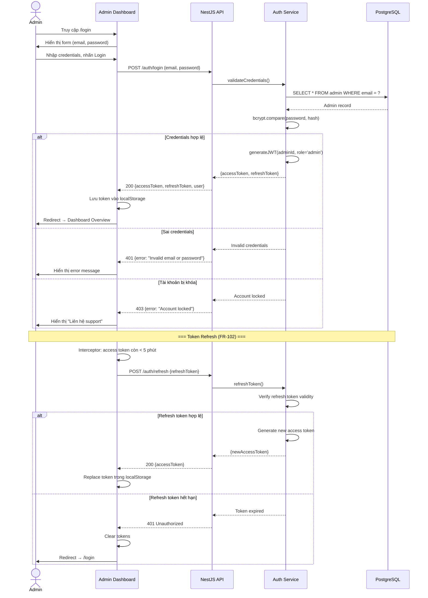
```mermaid
sequenceDiagram
    actor Admin
    participant UI as Admin Dashboard
    participant API as NestJS API
    participant Auth as Auth Service
    participant DB as PostgreSQL

    Admin->>UI: Truy cập /login
    UI->>Admin: Hiển thị form (email, password)
    Admin->>UI: Nhập credentials, nhấn Login
    UI->>API: POST /auth/login {email, password}
    API->>Auth: validateCredentials()
    Auth->>DB: SELECT * FROM admin WHERE email = ?
    DB-->>Auth: Admin record
    Auth->>Auth: bcrypt.compare(password, hash)
    
    alt Credentials hợp lệ
        Auth->>Auth: generateJWT(adminId, role='admin')
        Auth-->>API: {accessToken, refreshToken}
        API-->>UI: 200 {accessToken, refreshToken, user}
        UI->>UI: Lưu token vào localStorage
        UI->>Admin: Redirect → Dashboard Overview
    else Sai credentials
        Auth-->>API: Invalid credentials
        API-->>UI: 401 {error: "Invalid email or password"}
        UI->>Admin: Hiển thị error message
    else Tài khoản bị khóa
        Auth-->>API: Account locked
        API-->>UI: 403 {error: "Account locked"}
        UI->>Admin: Hiển thị "Liên hệ support"
    end

    Note over Admin, DB: === Token Refresh (FR-102) ===
    UI->>UI: Interceptor: access token còn < 5 phút
    UI->>API: POST /auth/refresh {refreshToken}
    API->>Auth: refreshToken()
    Auth->>Auth: Verify refresh token validity
    alt Refresh token hợp lệ
        Auth->>Auth: Generate new access token
        Auth-->>API: {newAccessToken}
        API-->>UI: 200 {accessToken}
        UI->>UI: Replace token trong localStorage
    else Refresh token hết hạn
        Auth-->>API: Token expired
        API-->>UI: 401 Unauthorized
        UI->>UI: Clear tokens
        UI->>Admin: Redirect → /login
    end
```

---

## SD-02: Shop Owner Register + Login

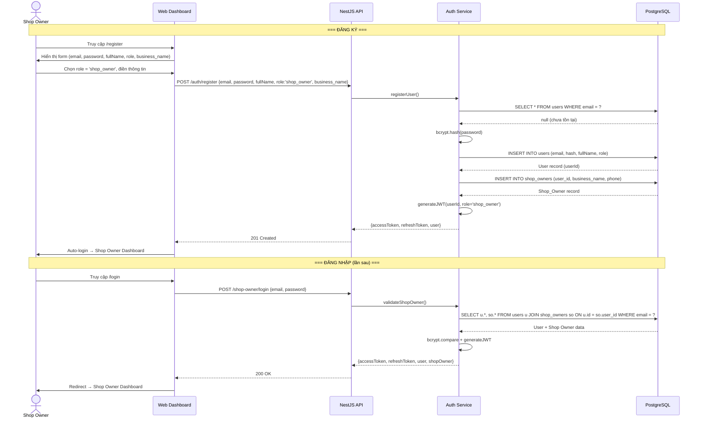
```mermaid
sequenceDiagram
    actor SO as Shop Owner
    participant UI as Web Dashboard
    participant API as NestJS API
    participant Auth as Auth Service
    participant DB as PostgreSQL

    Note over SO, DB: === ĐĂNG KÝ ===
    SO->>UI: Truy cập /register
    UI->>SO: Hiển thị form (email, password, fullName, role, business_name)
    SO->>UI: Chọn role = 'shop_owner', điền thông tin
    UI->>API: POST /auth/register {email, password, fullName, role:'shop_owner', business_name}
    API->>Auth: registerUser()
    Auth->>DB: SELECT * FROM users WHERE email = ?
    DB-->>Auth: null (chưa tồn tại)
    Auth->>Auth: bcrypt.hash(password)
    Auth->>DB: INSERT INTO users (email, hash, fullName, role)
    DB-->>Auth: User record (userId)
    Auth->>DB: INSERT INTO shop_owners (user_id, business_name, phone)
    DB-->>Auth: Shop_Owner record
    Auth->>Auth: generateJWT(userId, role='shop_owner')
    Auth-->>API: {accessToken, refreshToken, user}
    API-->>UI: 201 Created
    UI->>SO: Auto-login → Shop Owner Dashboard

    Note over SO, DB: === ĐĂNG NHẬP (lần sau) ===
    SO->>UI: Truy cập /login
    UI->>API: POST /shop-owner/login {email, password}
    API->>Auth: validateShopOwner()
    Auth->>DB: SELECT u.*, so.* FROM users u JOIN shop_owners so ON u.id = so.user_id WHERE email = ?
    DB-->>Auth: User + Shop Owner data
    Auth->>Auth: bcrypt.compare + generateJWT
    Auth-->>API: {accessToken, refreshToken, user, shopOwner}
    API-->>UI: 200 OK
    UI->>SO: Redirect → Shop Owner Dashboard
```

---

## SD-03: Admin Create POI

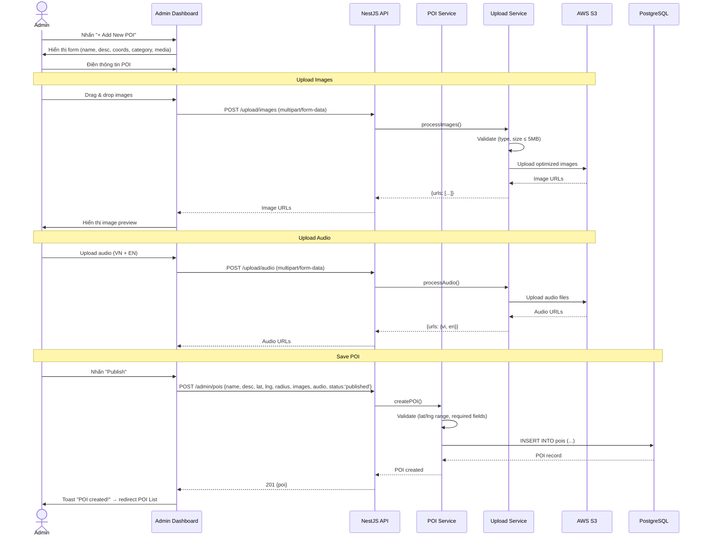
```mermaid
sequenceDiagram
    actor Admin
    participant UI as Admin Dashboard
    participant API as NestJS API
    participant POI as POI Service
    participant Upload as Upload Service
    participant S3 as AWS S3
    participant DB as PostgreSQL

    Admin->>UI: Nhấn "+ Add New POI"
    UI->>Admin: Hiển thị form (name, desc, coords, category, media)
    
    Admin->>UI: Điền thông tin POI

    Note over Admin, S3: Upload Images
    Admin->>UI: Drag & drop images
    UI->>API: POST /upload/images (multipart/form-data)
    API->>Upload: processImages()
    Upload->>Upload: Validate (type, size ≤ 5MB)
    Upload->>S3: Upload optimized images
    S3-->>Upload: Image URLs
    Upload-->>API: {urls: [...]}
    API-->>UI: Image URLs
    UI->>Admin: Hiển thị image preview

    Note over Admin, S3: Upload Audio
    Admin->>UI: Upload audio (VN + EN)
    UI->>API: POST /upload/audio (multipart/form-data)
    API->>Upload: processAudio()
    Upload->>S3: Upload audio files
    S3-->>Upload: Audio URLs
    Upload-->>API: {urls: {vi, en}}
    API-->>UI: Audio URLs

    Note over Admin, DB: Save POI
    Admin->>UI: Nhấn "Publish"
    UI->>API: POST /admin/pois {name, desc, lat, lng, radius, images, audio, status:'published'}
    API->>POI: createPOI()
    POI->>POI: Validate (lat/lng range, required fields)
    POI->>DB: INSERT INTO pois (...)
    DB-->>POI: POI record
    POI-->>API: POI created
    API-->>UI: 201 {poi}
    UI->>Admin: Toast "POI created!" → redirect POI List
```

---

## SD-04: Shop Owner Create POI

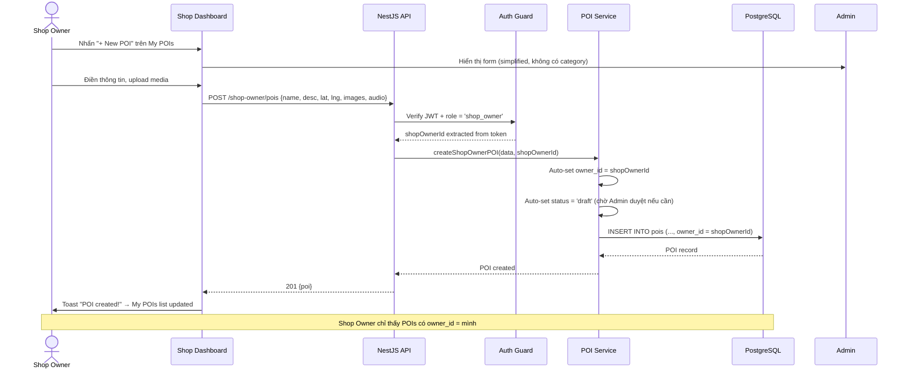
```mermaid
sequenceDiagram
    actor SO as Shop Owner
    participant UI as Shop Dashboard
    participant API as NestJS API
    participant Guard as Auth Guard
    participant POI as POI Service
    participant DB as PostgreSQL

    SO->>UI: Nhấn "+ New POI" trên My POIs
    UI->>Admin: Hiển thị form (simplified, không có category)

    SO->>UI: Điền thông tin, upload media
    UI->>API: POST /shop-owner/pois {name, desc, lat, lng, images, audio}
    
    API->>Guard: Verify JWT + role = 'shop_owner'
    Guard-->>API: shopOwnerId extracted from token

    API->>POI: createShopOwnerPOI(data, shopOwnerId)
    POI->>POI: Auto-set owner_id = shopOwnerId
    POI->>POI: Auto-set status = 'draft' (chờ Admin duyệt nếu cần)
    POI->>DB: INSERT INTO pois (..., owner_id = shopOwnerId)
    DB-->>POI: POI record
    POI-->>API: POI created
    API-->>UI: 201 {poi}
    UI->>SO: Toast "POI created!" → My POIs list updated

    Note over SO, DB: Shop Owner chỉ thấy POIs có owner_id = mình
```

---

## SD-05: Create Tour

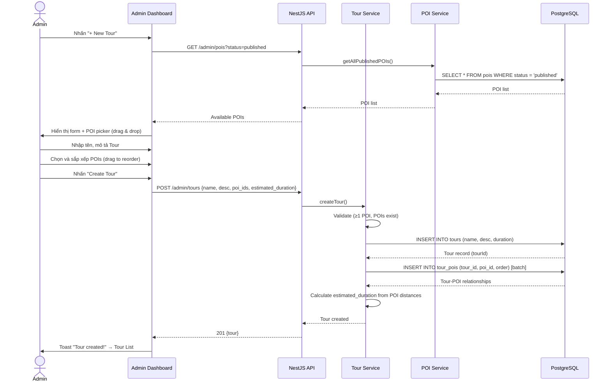
```mermaid
sequenceDiagram
    actor Admin
    participant UI as Admin Dashboard
    participant API as NestJS API
    participant Tour as Tour Service
    participant POI as POI Service
    participant DB as PostgreSQL

    Admin->>UI: Nhấn "+ New Tour"
    UI->>API: GET /admin/pois?status=published
    API->>POI: getAllPublishedPOIs()
    POI->>DB: SELECT * FROM pois WHERE status = 'published'
    DB-->>POI: POI list
    POI-->>API: POI list
    API-->>UI: Available POIs

    UI->>Admin: Hiển thị form + POI picker (drag & drop)
    Admin->>UI: Nhập tên, mô tả Tour
    Admin->>UI: Chọn và sắp xếp POIs (drag to reorder)
    Admin->>UI: Nhấn "Create Tour"

    UI->>API: POST /admin/tours {name, desc, poi_ids, estimated_duration}
    API->>Tour: createTour()
    Tour->>Tour: Validate (≥1 POI, POIs exist)
    Tour->>DB: INSERT INTO tours (name, desc, duration)
    DB-->>Tour: Tour record (tourId)
    Tour->>DB: INSERT INTO tour_pois (tour_id, poi_id, order) [batch]
    DB-->>Tour: Tour-POI relationships
    Tour->>Tour: Calculate estimated_duration from POI distances
    Tour-->>API: Tour created
    API-->>UI: 201 {tour}
    UI->>Admin: Toast "Tour created!" → Tour List
```

---

## SD-06: Tourist View Map + Auto-trigger

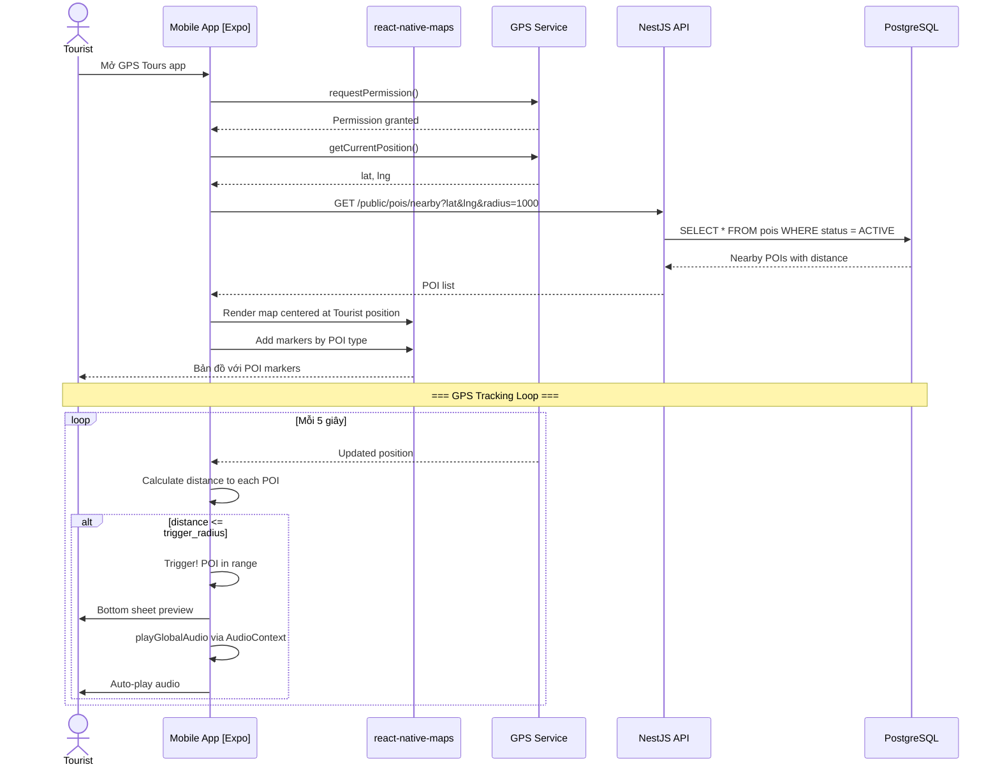
```mermaid
sequenceDiagram
    actor Tourist
    participant App as Mobile App [Expo]
    participant Map as react-native-maps
    participant GPS as GPS Service
    participant API as NestJS API
    participant DB as PostgreSQL

    Tourist->>App: Mở GPS Tours app
    App->>GPS: requestPermission()
    GPS-->>App: Permission granted
    App->>GPS: getCurrentPosition()
    GPS-->>App: lat, lng

    App->>API: GET /public/pois/nearby?lat&lng&radius=1000
    API->>DB: SELECT * FROM pois WHERE status = ACTIVE
    DB-->>API: Nearby POIs with distance
    API-->>App: POI list

    App->>Map: Render map centered at Tourist position
    App->>Map: Add markers by POI type
    Map-->>Tourist: Bản đồ với POI markers

    Note over Tourist, DB: === GPS Tracking Loop ===
    loop Mỗi 5 giây
        GPS-->>App: Updated position
        App->>App: Calculate distance to each POI
        
        alt distance <= trigger_radius
            App->>App: Trigger! POI in range
            App->>Tourist: Bottom sheet preview
            App->>App: playGlobalAudio via AudioContext
            App->>Tourist: Auto-play audio
        end
    end
```

---

## SD-07: Tourist Follow Tour

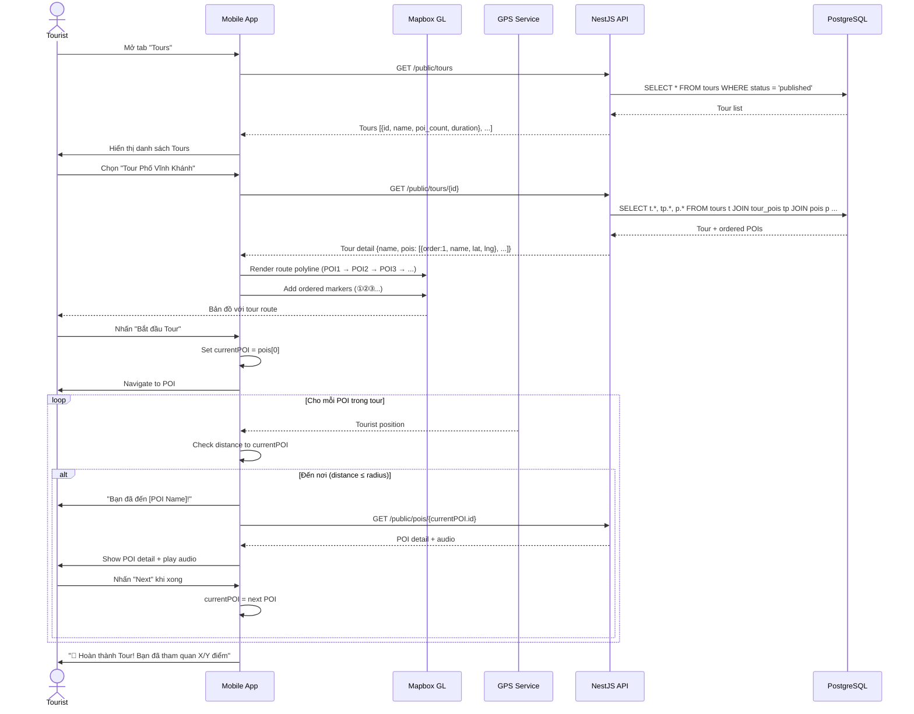
```mermaid
sequenceDiagram
    actor Tourist
    participant App as Mobile App
    participant Map as Mapbox GL
    participant GPS as GPS Service
    participant API as NestJS API
    participant DB as PostgreSQL

    Tourist->>App: Mở tab "Tours"
    App->>API: GET /public/tours
    API->>DB: SELECT * FROM tours WHERE status = 'published'
    DB-->>API: Tour list
    API-->>App: Tours [{id, name, poi_count, duration}, ...]
    App->>Tourist: Hiển thị danh sách Tours

    Tourist->>App: Chọn "Tour Phố Vĩnh Khánh"
    App->>API: GET /public/tours/{id}
    API->>DB: SELECT t.*, tp.*, p.* FROM tours t JOIN tour_pois tp JOIN pois p ...
    DB-->>API: Tour + ordered POIs
    API-->>App: Tour detail {name, pois: [{order:1, name, lat, lng}, ...]}

    App->>Map: Render route polyline (POI1 → POI2 → POI3 → ...)
    App->>Map: Add ordered markers (①②③...)
    Map-->>Tourist: Bản đồ với tour route

    Tourist->>App: Nhấn "Bắt đầu Tour"
    App->>App: Set currentPOI = pois[0]
    App->>Tourist: Navigate to POI #1

    loop Cho mỗi POI trong tour
        GPS-->>App: Tourist position
        App->>App: Check distance to currentPOI
        
        alt Đến nơi (distance ≤ radius)
            App->>Tourist: "Bạn đã đến [POI Name]!"
            App->>API: GET /public/pois/{currentPOI.id}
            API-->>App: POI detail + audio
            App->>Tourist: Show POI detail + play audio
            Tourist->>App: Nhấn "Next" khi xong
            App->>App: currentPOI = next POI
        end
    end

    App->>Tourist: "🎉 Hoàn thành Tour! Bạn đã tham quan X/Y điểm"
```

---

## SD-08: Overlap Zone Handling

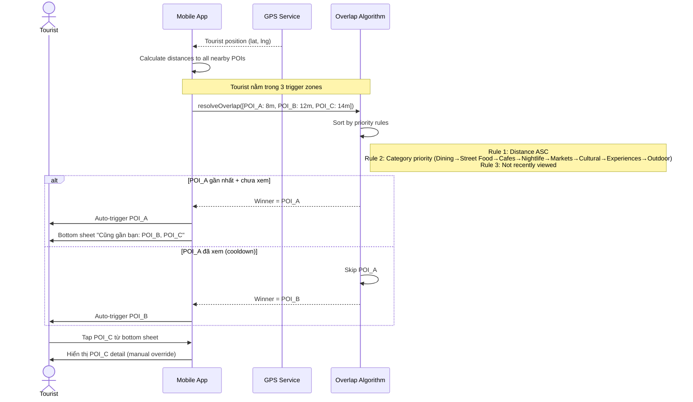
```mermaid
sequenceDiagram
    actor Tourist
    participant App as Mobile App
    participant GPS as GPS Service
    participant Algo as Overlap Algorithm

    GPS-->>App: Tourist position (lat, lng)
    App->>App: Calculate distances to all nearby POIs

    Note over App, Algo: Tourist nằm trong 3 trigger zones

    App->>Algo: resolveOverlap([POI_A: 8m, POI_B: 12m, POI_C: 14m])
    
    Algo->>Algo: Sort by priority rules
    Note right of Algo: Rule 1: Distance ASC<br/>Rule 2: Category priority (Dining→Street Food→Cafes→Nightlife→Markets→Cultural→Experiences→Outdoor)<br/>Rule 3: Not recently viewed

    alt POI_A gần nhất + chưa xem
        Algo-->>App: Winner = POI_A
        App->>Tourist: Auto-trigger POI_A
        App->>Tourist: Bottom sheet "Cũng gần bạn: POI_B, POI_C"
    else POI_A đã xem (cooldown)
        Algo->>Algo: Skip POI_A
        Algo-->>App: Winner = POI_B
        App->>Tourist: Auto-trigger POI_B
    end

    Tourist->>App: Tap POI_C từ bottom sheet
    App->>Tourist: Hiển thị POI_C detail (manual override)
```

---

## SD-09: Quên mật khẩu (Forgot Password)

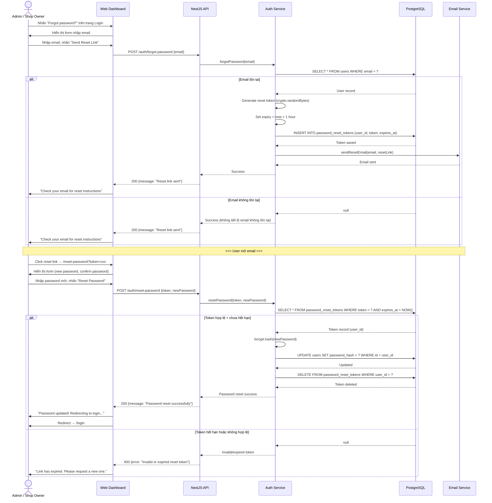
```mermaid
sequenceDiagram
    actor User as Admin / Shop Owner
    participant UI as Web Dashboard
    participant API as NestJS API
    participant Auth as Auth Service
    participant DB as PostgreSQL
    participant Email as Email Service

    User->>UI: Nhấn "Forgot password?" trên trang Login
    UI->>User: Hiển thị form nhập email

    User->>UI: Nhập email, nhấn "Send Reset Link"
    UI->>API: POST /auth/forgot-password {email}
    API->>Auth: forgotPassword(email)
    Auth->>DB: SELECT * FROM users WHERE email = ?

    alt Email tồn tại
        DB-->>Auth: User record
        Auth->>Auth: Generate reset token (crypto.randomBytes)
        Auth->>Auth: Set expiry = now + 1 hour
        Auth->>DB: INSERT INTO password_reset_tokens (user_id, token, expires_at)
        DB-->>Auth: Token saved
        Auth->>Email: sendResetEmail(email, resetLink)
        Email-->>Auth: Email sent
        Auth-->>API: Success
        API-->>UI: 200 {message: "Reset link sent"}
        UI->>User: "Check your email for reset instructions"
    else Email không tồn tại
        DB-->>Auth: null
        Auth-->>API: Success (không tiết lộ email không tồn tại)
        API-->>UI: 200 {message: "Reset link sent"}
        UI->>User: "Check your email for reset instructions"
    end

    Note over User, Email: === User mở email ===
    User->>UI: Click reset link → /reset-password?token=xxx
    UI->>User: Hiển thị form (new password, confirm password)
    User->>UI: Nhập password mới, nhấn "Reset Password"
    UI->>API: POST /auth/reset-password {token, newPassword}
    API->>Auth: resetPassword(token, newPassword)
    Auth->>DB: SELECT * FROM password_reset_tokens WHERE token = ? AND expires_at > NOW()

    alt Token hợp lệ + chưa hết hạn
        DB-->>Auth: Token record (user_id)
        Auth->>Auth: bcrypt.hash(newPassword)
        Auth->>DB: UPDATE users SET password_hash = ? WHERE id = user_id
        DB-->>Auth: Updated
        Auth->>DB: DELETE FROM password_reset_tokens WHERE user_id = ?
        DB-->>Auth: Token deleted
        Auth-->>API: Password reset success
        API-->>UI: 200 {message: "Password reset successfully"}
        UI->>User: "Password updated! Redirecting to login..."
        UI->>User: Redirect → /login
    else Token hết hạn hoặc không hợp lệ
        DB-->>Auth: null
        Auth-->>API: Invalid/expired token
        API-->>UI: 400 {error: "Invalid or expired reset token"}
        UI->>User: "Link has expired. Please request a new one."
    end
```

---

## SD-10: Chỉnh sửa POI (Edit POI)

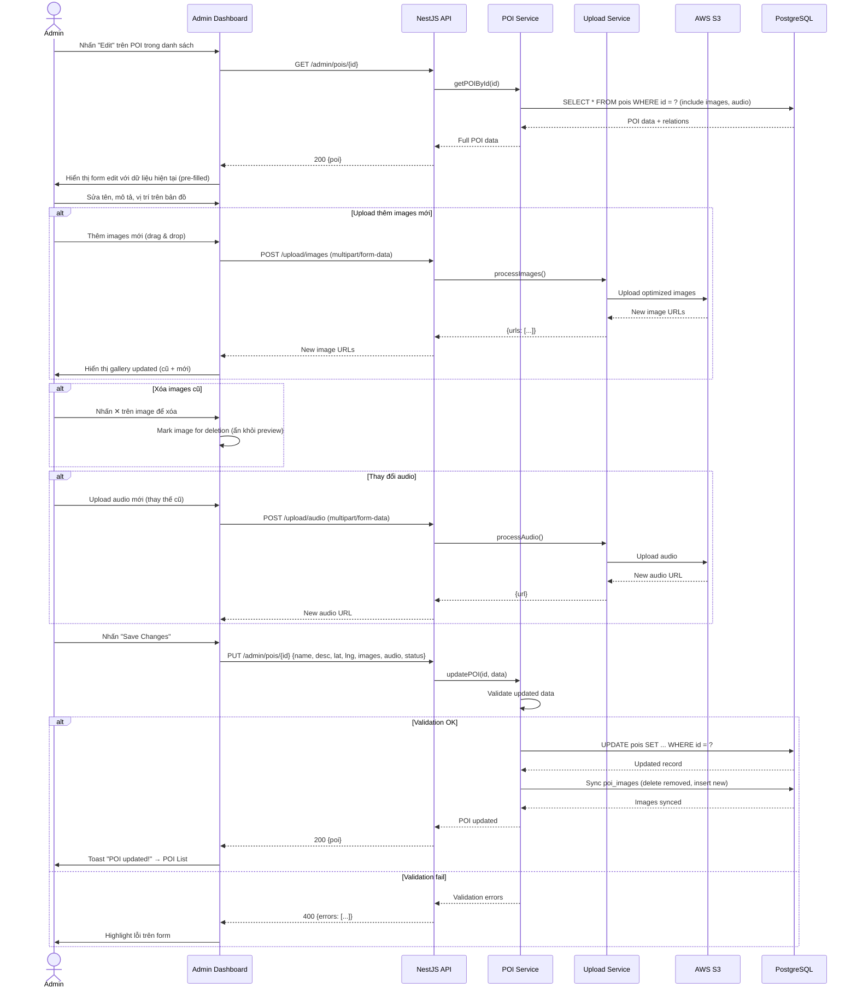
```mermaid
sequenceDiagram
    actor Admin
    participant UI as Admin Dashboard
    participant API as NestJS API
    participant POI as POI Service
    participant Upload as Upload Service
    participant S3 as AWS S3
    participant DB as PostgreSQL

    Admin->>UI: Nhấn "Edit" trên POI trong danh sách
    UI->>API: GET /admin/pois/{id}
    API->>POI: getPOIById(id)
    POI->>DB: SELECT * FROM pois WHERE id = ? (include images, audio)
    DB-->>POI: POI data + relations
    POI-->>API: Full POI data
    API-->>UI: 200 {poi}
    UI->>Admin: Hiển thị form edit với dữ liệu hiện tại (pre-filled)

    Admin->>UI: Sửa tên, mô tả, vị trí trên bản đồ
    
    alt Upload thêm images mới
        Admin->>UI: Thêm images mới (drag & drop)
        UI->>API: POST /upload/images (multipart/form-data)
        API->>Upload: processImages()
        Upload->>S3: Upload optimized images
        S3-->>Upload: New image URLs
        Upload-->>API: {urls: [...]}
        API-->>UI: New image URLs
        UI->>Admin: Hiển thị gallery updated (cũ + mới)
    end

    alt Xóa images cũ
        Admin->>UI: Nhấn ✕ trên image để xóa
        UI->>UI: Mark image for deletion (ẩn khỏi preview)
    end

    alt Thay đổi audio
        Admin->>UI: Upload audio mới (thay thế cũ)
        UI->>API: POST /upload/audio (multipart/form-data)
        API->>Upload: processAudio()
        Upload->>S3: Upload audio
        S3-->>Upload: New audio URL
        Upload-->>API: {url}
        API-->>UI: New audio URL
    end

    Admin->>UI: Nhấn "Save Changes"
    UI->>API: PUT /admin/pois/{id} {name, desc, lat, lng, images, audio, status}
    API->>POI: updatePOI(id, data)
    POI->>POI: Validate updated data
    
    alt Validation OK
        POI->>DB: UPDATE pois SET ... WHERE id = ?
        DB-->>POI: Updated record
        POI->>DB: Sync poi_images (delete removed, insert new)
        DB-->>POI: Images synced
        POI-->>API: POI updated
        API-->>UI: 200 {poi}
        UI->>Admin: Toast "POI updated!" → POI List
    else Validation fail
        POI-->>API: Validation errors
        API-->>UI: 400 {errors: [...]}
        UI->>Admin: Highlight lỗi trên form
    end
```

---

## SD-11: Xóa POI (Delete POI + Cascade)

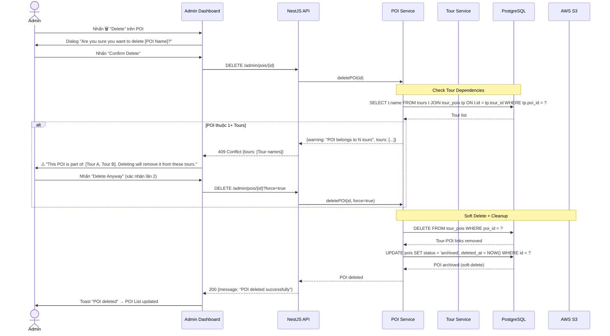
```mermaid
sequenceDiagram
    actor Admin
    participant UI as Admin Dashboard
    participant API as NestJS API
    participant POI as POI Service
    participant Tour as Tour Service
    participant DB as PostgreSQL
    participant S3 as AWS S3

    Admin->>UI: Nhấn 🗑️ "Delete" trên POI
    UI->>Admin: Dialog "Are you sure you want to delete [POI Name]?"
    Admin->>UI: Nhấn "Confirm Delete"
    
    UI->>API: DELETE /admin/pois/{id}
    API->>POI: deletePOI(id)
    
    Note over POI, DB: Check Tour Dependencies
    POI->>DB: SELECT t.name FROM tours t JOIN tour_pois tp ON t.id = tp.tour_id WHERE tp.poi_id = ?
    DB-->>POI: Tour list

    alt POI thuộc 1+ Tours
        POI-->>API: {warning: "POI belongs to N tours", tours: [...]}
        API-->>UI: 409 Conflict {tours: [Tour names]}
        UI->>Admin: ⚠️ "This POI is part of: [Tour A, Tour B]. Deleting will remove it from these tours."
        Admin->>UI: Nhấn "Delete Anyway" (xác nhận lần 2)
        UI->>API: DELETE /admin/pois/{id}?force=true
        API->>POI: deletePOI(id, force=true)
    end

    Note over POI, S3: Soft Delete + Cleanup
    POI->>DB: DELETE FROM tour_pois WHERE poi_id = ?
    DB-->>POI: Tour-POI links removed
    POI->>DB: UPDATE pois SET status = 'archived', deleted_at = NOW() WHERE id = ?
    DB-->>POI: POI archived (soft-delete)
    
    POI-->>API: POI deleted
    API-->>UI: 200 {message: "POI deleted successfully"}
    UI->>Admin: Toast "POI deleted" → POI List updated
```

---

## SD-12: Tourist Lưu POI yêu thích

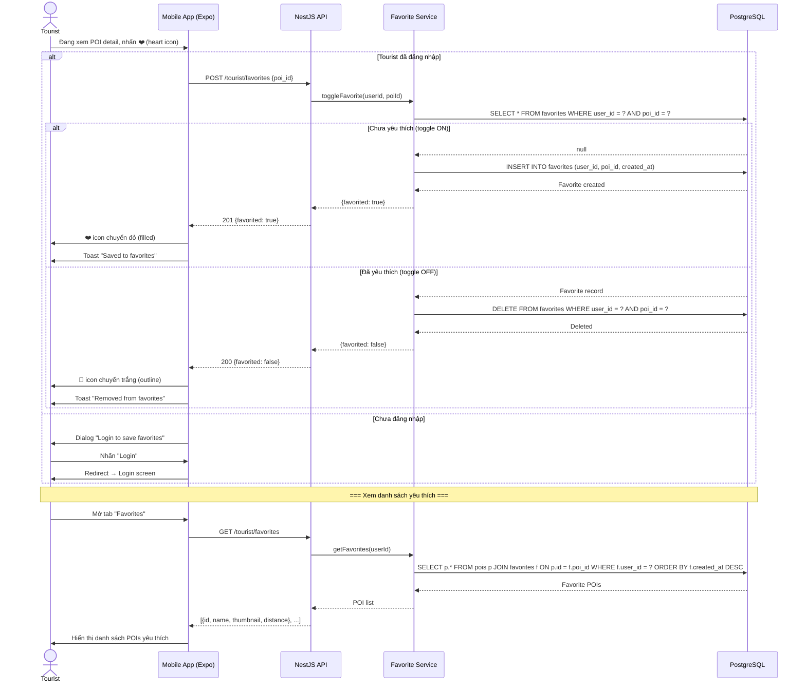
```mermaid
sequenceDiagram
    actor Tourist
    participant App as Mobile App (Expo)
    participant API as NestJS API
    participant Fav as Favorite Service
    participant DB as PostgreSQL

    Tourist->>App: Đang xem POI detail, nhấn ❤️ (heart icon)
    
    alt Tourist đã đăng nhập
        App->>API: POST /tourist/favorites {poi_id}
        API->>Fav: toggleFavorite(userId, poiId)
        Fav->>DB: SELECT * FROM favorites WHERE user_id = ? AND poi_id = ?
        
        alt Chưa yêu thích (toggle ON)
            DB-->>Fav: null
            Fav->>DB: INSERT INTO favorites (user_id, poi_id, created_at)
            DB-->>Fav: Favorite created
            Fav-->>API: {favorited: true}
            API-->>App: 201 {favorited: true}
            App->>Tourist: ❤️ icon chuyển đỏ (filled)
            App->>Tourist: Toast "Saved to favorites"
        else Đã yêu thích (toggle OFF)
            DB-->>Fav: Favorite record
            Fav->>DB: DELETE FROM favorites WHERE user_id = ? AND poi_id = ?
            DB-->>Fav: Deleted
            Fav-->>API: {favorited: false}
            API-->>App: 200 {favorited: false}
            App->>Tourist: 🤍 icon chuyển trắng (outline)
            App->>Tourist: Toast "Removed from favorites"
        end
    else Chưa đăng nhập
        App->>Tourist: Dialog "Login to save favorites"
        Tourist->>App: Nhấn "Login"
        App->>Tourist: Redirect → Login screen
    end

    Note over Tourist, DB: === Xem danh sách yêu thích ===
    Tourist->>App: Mở tab "Favorites"
    App->>API: GET /tourist/favorites
    API->>Fav: getFavorites(userId)
    Fav->>DB: SELECT p.* FROM pois p JOIN favorites f ON p.id = f.poi_id WHERE f.user_id = ? ORDER BY f.created_at DESC
    DB-->>Fav: Favorite POIs
    Fav-->>API: POI list
    API-->>App: [{id, name, thumbnail, distance}, ...]
    App->>Tourist: Hiển thị danh sách POIs yêu thích
```

---

## SD-13: Shop Owner Xem Analytics

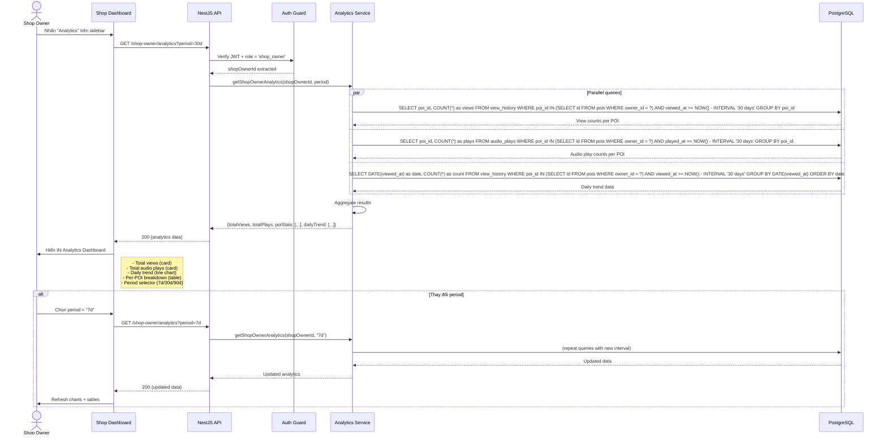
```mermaid
sequenceDiagram
    actor SO as Shop Owner
    participant UI as Shop Dashboard
    participant API as NestJS API
    participant Guard as Auth Guard
    participant Analytics as Analytics Service
    participant DB as PostgreSQL

    SO->>UI: Nhấn "Analytics" trên sidebar
    UI->>API: GET /shop-owner/analytics?period=30d
    
    API->>Guard: Verify JWT + role = 'shop_owner'
    Guard-->>API: shopOwnerId extracted
    
    API->>Analytics: getShopOwnerAnalytics(shopOwnerId, period)
    
    par Parallel queries
        Analytics->>DB: SELECT poi_id, COUNT(*) as views FROM view_history WHERE poi_id IN (SELECT id FROM pois WHERE owner_id = ?) AND viewed_at >= NOW() - INTERVAL '30 days' GROUP BY poi_id
        DB-->>Analytics: View counts per POI
    and
        Analytics->>DB: SELECT poi_id, COUNT(*) as plays FROM audio_plays WHERE poi_id IN (SELECT id FROM pois WHERE owner_id = ?) AND played_at >= NOW() - INTERVAL '30 days' GROUP BY poi_id
        DB-->>Analytics: Audio play counts per POI
    and
        Analytics->>DB: SELECT DATE(viewed_at) as date, COUNT(*) as count FROM view_history WHERE poi_id IN (SELECT id FROM pois WHERE owner_id = ?) AND viewed_at >= NOW() - INTERVAL '30 days' GROUP BY DATE(viewed_at) ORDER BY date
        DB-->>Analytics: Daily trend data
    end

    Analytics->>Analytics: Aggregate results
    Analytics-->>API: {totalViews, totalPlays, poiStats: [...], dailyTrend: [...]}
    API-->>UI: 200 {analytics data}

    UI->>SO: Hiển thị Analytics Dashboard
    Note right of UI: - Total views (card)<br/>- Total audio plays (card)<br/>- Daily trend (line chart)<br/>- Per-POI breakdown (table)<br/>- Period selector (7d/30d/90d)

    alt Thay đổi period
        SO->>UI: Chọn period = "7d"
        UI->>API: GET /shop-owner/analytics?period=7d
        API->>Analytics: getShopOwnerAnalytics(shopOwnerId, "7d")
        Analytics->>DB: (repeat queries with new interval)
        DB-->>Analytics: Updated data
        Analytics-->>API: Updated analytics
        API-->>UI: 200 {updated data}
        UI->>SO: Refresh charts + tables
    end
```

---

## SD-14: Tourist Chuyển đổi ngôn ngữ

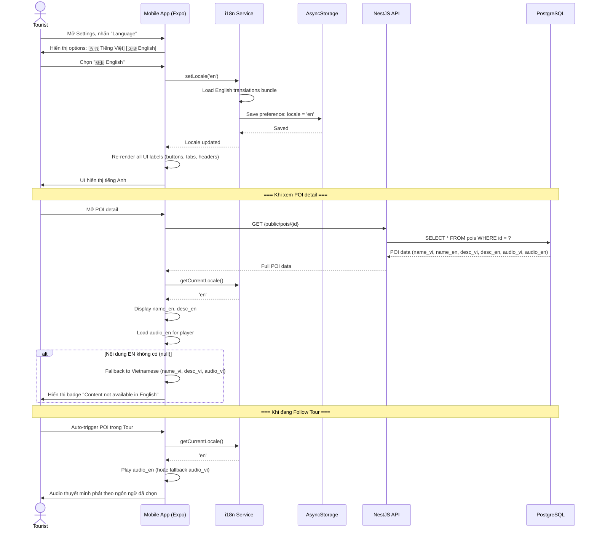
```mermaid
sequenceDiagram
    actor Tourist
    participant App as Mobile App (Expo)
    participant i18n as i18n Service
    participant Storage as AsyncStorage
    participant API as NestJS API
    participant DB as PostgreSQL

    Tourist->>App: Mở Settings, nhấn "Language"
    App->>Tourist: Hiển thị options: [🇻🇳 Tiếng Việt] [🇬🇧 English]
    Tourist->>App: Chọn "🇬🇧 English"
    
    App->>i18n: setLocale('en')
    i18n->>i18n: Load English translations bundle
    i18n->>Storage: Save preference: locale = 'en'
    Storage-->>i18n: Saved
    
    i18n-->>App: Locale updated
    App->>App: Re-render all UI labels (buttons, tabs, headers)
    App->>Tourist: UI hiển thị tiếng Anh

    Note over Tourist, DB: === Khi xem POI detail ===
    Tourist->>App: Mở POI detail
    App->>API: GET /public/pois/{id}
    API->>DB: SELECT * FROM pois WHERE id = ?
    DB-->>API: POI data (name_vi, name_en, desc_vi, desc_en, audio_vi, audio_en)
    API-->>App: Full POI data
    
    App->>i18n: getCurrentLocale()
    i18n-->>App: 'en'
    
    App->>App: Display name_en, desc_en
    App->>App: Load audio_en for player

    alt Nội dung EN không có (null)
        App->>App: Fallback to Vietnamese (name_vi, desc_vi, audio_vi)
        App->>Tourist: Hiển thị badge "Content not available in English"
    end

    Note over Tourist, DB: === Khi đang Follow Tour ===
    Tourist->>App: Auto-trigger POI trong Tour
    App->>i18n: getCurrentLocale()
    i18n-->>App: 'en'
    App->>App: Play audio_en (hoặc fallback audio_vi)
    App->>Tourist: Audio thuyết minh phát theo ngôn ngữ đã chọn
```

---

## SD-15: Tourist Đăng ký & Đăng nhập

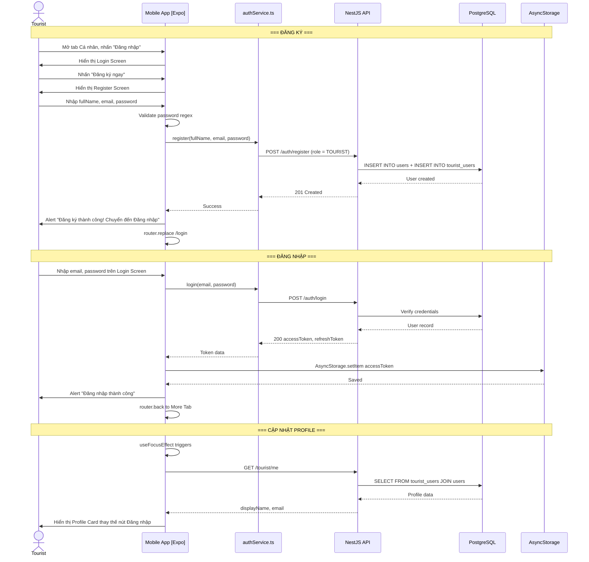
```mermaid
sequenceDiagram
    actor Tourist
    participant App as Mobile App [Expo]
    participant Auth as authService.ts
    participant API as NestJS API
    participant DB as PostgreSQL
    participant Store as AsyncStorage

    Note over Tourist, Store: === ĐĂNG KÝ ===
    Tourist->>App: Mở tab Cá nhân, nhấn "Đăng nhập"
    App->>Tourist: Hiển thị Login Screen
    Tourist->>App: Nhấn "Đăng ký ngay"
    App->>Tourist: Hiển thị Register Screen
    Tourist->>App: Nhập fullName, email, password
    App->>App: Validate password regex
    App->>Auth: register(fullName, email, password)
    Auth->>API: POST /auth/register (role = TOURIST)
    API->>DB: INSERT INTO users + INSERT INTO tourist_users
    DB-->>API: User created
    API-->>Auth: 201 Created
    Auth-->>App: Success
    App->>Tourist: Alert "Đăng ký thành công! Chuyển đến Đăng nhập"
    App->>App: router.replace /login

    Note over Tourist, Store: === ĐĂNG NHẬP ===
    Tourist->>App: Nhập email, password trên Login Screen
    App->>Auth: login(email, password)
    Auth->>API: POST /auth/login
    API->>DB: Verify credentials
    DB-->>API: User record
    API-->>Auth: 200 accessToken, refreshToken
    Auth-->>App: Token data
    App->>Store: AsyncStorage.setItem accessToken
    Store-->>App: Saved
    App->>Tourist: Alert "Đăng nhập thành công"
    App->>App: router.back to More Tab

    Note over Tourist, Store: === CẬP NHẬT PROFILE ===
    App->>App: useFocusEffect triggers
    App->>API: GET /tourist/me
    API->>DB: SELECT FROM tourist_users JOIN users
    DB-->>API: Profile data
    API-->>App: displayName, email
    App->>Tourist: Hiển thị Profile Card thay thế nút Đăng nhập
```

---

## SD-16: Global Audio Singleton

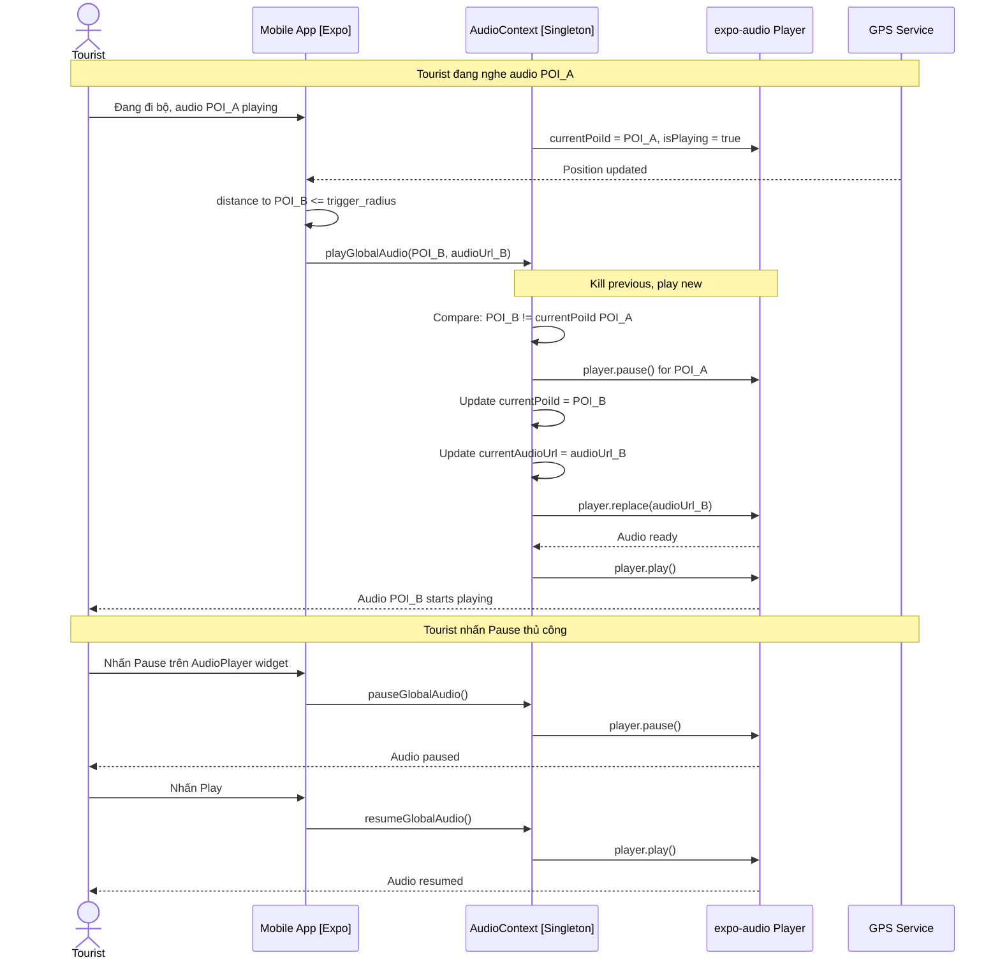
```mermaid
sequenceDiagram
    actor Tourist
    participant App as Mobile App [Expo]
    participant Ctx as AudioContext [Singleton]
    participant Player as expo-audio Player
    participant GPS as GPS Service

    Note over Tourist, GPS: Tourist đang nghe audio POI_A
    Tourist->>App: Đang đi bộ, audio POI_A playing
    Ctx->>Player: currentPoiId = POI_A, isPlaying = true

    GPS-->>App: Position updated
    App->>App: distance to POI_B <= trigger_radius
    App->>Ctx: playGlobalAudio(POI_B, audioUrl_B)

    Note over Ctx, Player: Kill previous, play new
    Ctx->>Ctx: Compare: POI_B != currentPoiId POI_A
    Ctx->>Player: player.pause() for POI_A
    Ctx->>Ctx: Update currentPoiId = POI_B
    Ctx->>Ctx: Update currentAudioUrl = audioUrl_B
    Ctx->>Player: player.replace(audioUrl_B)
    Player-->>Ctx: Audio ready
    Ctx->>Player: player.play()
    Player-->>Tourist: Audio POI_B starts playing

    Note over Tourist, GPS: Tourist nhấn Pause thủ công
    Tourist->>App: Nhấn Pause trên AudioPlayer widget
    App->>Ctx: pauseGlobalAudio()
    Ctx->>Player: player.pause()
    Player-->>Tourist: Audio paused

    Tourist->>App: Nhấn Play
    App->>Ctx: resumeGlobalAudio()
    Ctx->>Player: player.play()
    Player-->>Tourist: Audio resumed
```

---

## SD-17: QR Code Offline Fallback (SQLite)

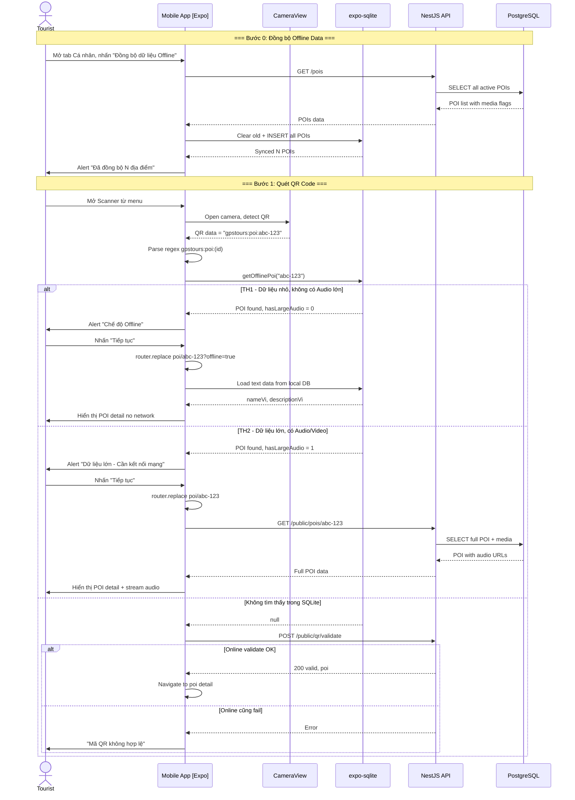
```mermaid
sequenceDiagram
    actor Tourist
    participant App as Mobile App [Expo]
    participant Scanner as CameraView
    participant SQLite as expo-sqlite
    participant API as NestJS API
    participant DB as PostgreSQL

    Note over Tourist, DB: === Bước 0: Đồng bộ Offline Data ===
    Tourist->>App: Mở tab Cá nhân, nhấn "Đồng bộ dữ liệu Offline"
    App->>API: GET /pois
    API->>DB: SELECT all active POIs
    DB-->>API: POI list with media flags
    API-->>App: POIs data
    App->>SQLite: Clear old + INSERT all POIs
    SQLite-->>App: Synced N POIs
    App->>Tourist: Alert "Đã đồng bộ N địa điểm"

    Note over Tourist, DB: === Bước 1: Quét QR Code ===
    Tourist->>App: Mở Scanner từ menu
    App->>Scanner: Open camera, detect QR
    Scanner-->>App: QR data = "gpstours:poi:abc-123"

    App->>App: Parse regex gpstours:poi:(id)
    App->>SQLite: getOfflinePoi("abc-123")

    alt TH1 - Dữ liệu nhỏ, không có Audio lớn
        SQLite-->>App: POI found, hasLargeAudio = 0
        App->>Tourist: Alert "Chế độ Offline"
        Tourist->>App: Nhấn "Tiếp tục"
        App->>App: router.replace poi/abc-123?offline=true
        App->>SQLite: Load text data from local DB
        SQLite-->>App: nameVi, descriptionVi
        App->>Tourist: Hiển thị POI detail no network
    else TH2 - Dữ liệu lớn, có Audio/Video
        SQLite-->>App: POI found, hasLargeAudio = 1
        App->>Tourist: Alert "Dữ liệu lớn - Cần kết nối mạng"
        Tourist->>App: Nhấn "Tiếp tục"
        App->>App: router.replace poi/abc-123
        App->>API: GET /public/pois/abc-123
        API->>DB: SELECT full POI + media
        DB-->>API: POI with audio URLs
        API-->>App: Full POI data
        App->>Tourist: Hiển thị POI detail + stream audio
    else Không tìm thấy trong SQLite
        SQLite-->>App: null
        App->>API: POST /public/qr/validate
        alt Online validate OK
            API-->>App: 200 valid, poi
            App->>App: Navigate to poi detail
        else Online cũng fail
            API-->>App: Error
            App->>Tourist: "Mã QR không hợp lệ"
        end
    end
```

---

## Summary

| Diagram | Actors | Lifelines | Messages | Complexity |
|---------|--------|-----------|----------|------------|
| SD-01 | Admin | 4 | 14 | Medium |
| SD-02 | Shop Owner | 4 | 22 | High |
| SD-03 | Admin | 6 | 24 | High |
| SD-04 | Shop Owner | 5 | 12 | Medium |
| SD-05 | Admin | 5 | 16 | Medium |
| SD-06 | Tourist | 5 | 18 | High |
| SD-07 | Tourist | 5 | 20 | High |
| SD-08 | Tourist | 3 | 12 | Medium |
| SD-09 | Admin/Shop Owner | 5 | 28 | High |
| SD-10 | Admin | 6 | 26 | High |
| SD-11 | Admin | 6 | 18 | High |
| SD-12 | Tourist | 4 | 20 | Medium |
| SD-13 | Shop Owner | 5 | 18 | High |
| SD-14 | Tourist | 5 | 18 | Medium |
| SD-15 | Tourist | 5 | 22 | High |
| SD-16 | Tourist | 4 | 16 | High |
| SD-17 | Tourist | 5 | 24 | High |

---

> **Reference:** `PRDs/14_usecase_diagram.md`, `PRDs/09_api_specifications.md`, `PRDs/05_functional_requirements.md`
