# 📐 Activity Diagrams
## Dự án GPS Tours & Phố Ẩm thực Vĩnh Khánh

> **Phiên bản:** 3.0
> **Ngày tạo:** 2026-02-10
> **Cập nhật:** 2026-03-22

---

## Danh sách Diagrams

| ID | Diagram | Actor | Ref UC | Ref FR |
|----|---------|-------|--------|--------|
| AD-01 | Admin Login Flow | Admin | UC-01 | FR-101 |
| AD-02 | POI Management (CRUD + TTS + ZH) | Admin | UC-10~17 | FR-201~209 |
| AD-03 | Tour Creation Flow | Admin | UC-30 | FR-301~302 |
| AD-04 | Tourist Journey | Tourist | UC-50~56 | FR-501~504 |
| AD-05 | Location Detection + Auto-trigger (Criteria Engine) | System | UC-50, UC-52 | FR-502 |
| AD-06 | Shop Owner Registration + POI Management (TTS) | Shop Owner | UC-02, UC-20~24 | FR-701~704 |
| AD-07 | Forgot Password Flow | Admin, Shop Owner | UC-04 | FR-103 |
| AD-08 | Upload Media Flow | Admin, Shop Owner | UC-14, UC-23 | FR-205, FR-401 |
| AD-09 | Delete POI (Cascade) | Admin | UC-13 | FR-204 |
| AD-10 | Tourist Favorites & History | Tourist | UC-55, UC-56 | FR-506, FR-507 |
| AD-11 | TTS Audio Generation Flow | Admin, Shop Owner | UC-16, UC-24 | FR-209 |
| AD-12 | Device Capability Check Flow | Tourist, System | UC-50 | FR-600 |
| AD-13 | Admin & Shop Owner Map View | Admin, Shop Owner | UC-18, UC-21 | FR-210 |
| AD-14 | QR Code Generation & Management | System, Admin | UC-19 | FR-211 |

---

## AD-01: Admin Login Flow

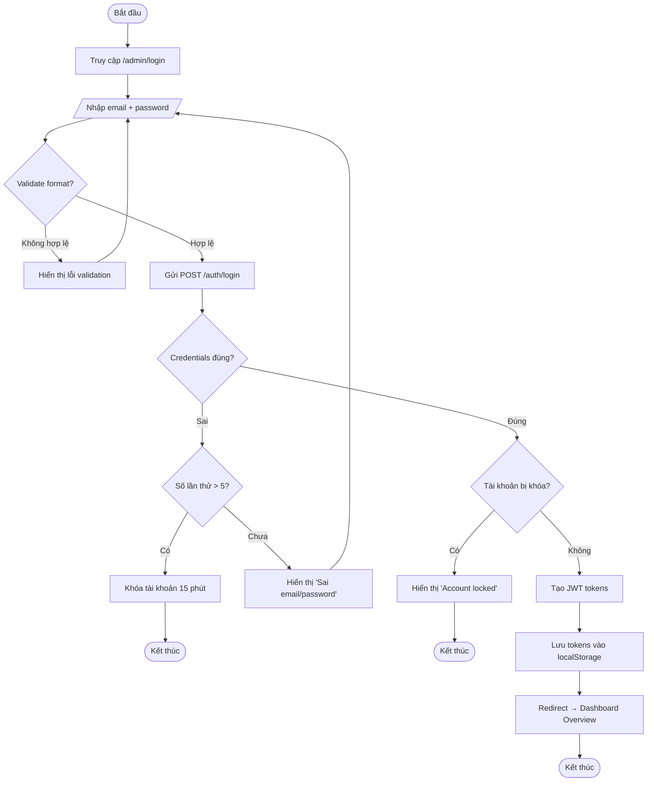
```mermaid
flowchart TD
    Start([Bắt đầu]) --> A1[Truy cập /admin/login]
    A1 --> A2[/Nhập email + password/]
    A2 --> A3{Validate format?}
    
    A3 -->|Không hợp lệ| A4[Hiển thị lỗi validation]
    A4 --> A2
    
    A3 -->|Hợp lệ| A5[Gửi POST /auth/login]
    A5 --> A6{Credentials đúng?}
    
    A6 -->|Sai| A7{Số lần thử > 5?}
    A7 -->|Có| A8[Khóa tài khoản 15 phút]
    A8 --> End1([Kết thúc])
    A7 -->|Chưa| A9[Hiển thị 'Sai email/password']
    A9 --> A2
    
    A6 -->|Đúng| A10{Tài khoản bị khóa?}
    A10 -->|Có| A11[Hiển thị 'Account locked']
    A11 --> End2([Kết thúc])
    
    A10 -->|Không| A12[Tạo JWT tokens]
    A12 --> A13[Lưu tokens vào localStorage]
    A13 --> A14[Redirect → Dashboard Overview]
    A14 --> End3([Kết thúc])
```

---

## AD-02: POI Management (CRUD)

```mermaid
flowchart TD
    Start([Bắt đầu]) --> A1[Admin vào POI Management]
    A1 --> A2{Chọn hành động?}
    
    A2 -->|Xem danh sách| B1[GET /admin/pois]
    B1 --> B2[Hiển thị POI table]
    B2 --> B3{Áp dụng filter?}
    B3 -->|Có| B4[/Chọn status, category, search/]
    B4 --> B1
    B3 -->|Không| A2

    A2 -->|Tạo mới| C1[Nhấn '+ Add New POI']
    C1 --> C2[/Nhập tên + mô tả - tabs VI / EN / ZH/]
    C2 --> C2a{Generate TTS audio?}
    C2a -->|Có| C2b[Nhấn 'Generate TTS' cho ngôn ngữ đang chọn]
    C2b --> C2c[Xem AD-11 TTS Generation Flow]
    C2c --> C3
    C2a -->|Không - upload thủ công| C3[/Chọn vị trí trên bản đồ/]
    C3 --> C3c[/Nhập ≥3 ký tự trong ô "Tìm địa chỉ"/]
    C3c --> C3d[FE debounce call → Nominatim (tối đa 5 gợi ý)]
    C3d --> C3e{Chọn gợi ý?}
    C3e -->|Có| C3f[Auto-fill lat/lng + đặt marker]
    C3e -->|Không| C3b1[Tiếp tục click bản đồ/nhập tọa độ thủ công]
    C3f --> C3a
    C3b1 --> C3a
    C3a[/Chọn category: Dining, Street Food, Cafes, Bars, Markets, Cultural, Experiences, Outdoor/] --> C3b[/Thiết lập trigger_radius 5-50m/]
    C3b --> C4[Upload media - xem AD-08]
    C4 --> C5{Validate data?}
    C5 -->|Lỗi| C6[Hiển thị validation errors]
    C6 --> C2
    C5 -->|OK| C7{Save Draft hay Publish?}
    C7 -->|Draft| C8[POST /admin/pois status='DRAFT']
    C7 -->|Publish → ACTIVE| C9[POST /admin/pois status='ACTIVE']
    C8 --> C10[Backend auto-generate QR Code + TTS]
    C9 --> C10
    C10 --> C11["QR code lưu tại /uploads/qr/poi_id.png<br/>URL lưu trong trường qr_code_url"]
    C11 --> C12[Toast 'POI saved']
    C12 --> B1

    A2 -->|Chỉnh sửa| D1[Nhấn Edit trên POI]
    D1 --> D2[GET /admin/pois/:id]
    D2 --> D2a[Hiển thị form pre-filled]
    D2a --> D3[/Sửa thông tin, thêm/xóa media/]
    D3 --> D3a{Validate data?}
    D3a -->|Lỗi| D3b[Hiển thị validation errors]
    D3b --> D3
    D3a -->|OK| D4[PUT /admin/pois/:id]
    D4 --> D5[Toast 'POI updated']
    D5 --> B1

    A2 -->|Xóa| E1[Xem AD-09 Delete POI Cascade]
```

---

## AD-03: Tour Creation Flow

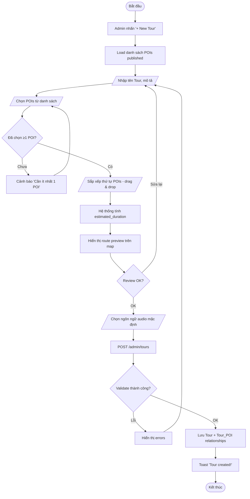
```mermaid
flowchart TD
    Start([Bắt đầu]) --> A1[Admin nhấn '+ New Tour']
    A1 --> A2[Load danh sách POIs published]
    A2 --> A3[/Nhập tên Tour, mô tả/]
    A3 --> A4[/Chọn POIs từ danh sách/]
    
    A4 --> A5{Đã chọn ≥1 POI?}
    A5 -->|Chưa| A6[Cảnh báo 'Cần ít nhất 1 POI']
    A6 --> A4
    
    A5 -->|Có| A7[/Sắp xếp thứ tự POIs - drag & drop/]
    A7 --> A8[Hệ thống tính estimated_duration]
    A8 --> A9[Hiển thị route preview trên map]
    
    A9 --> A10{Review OK?}
    A10 -->|Sửa lại| A3
    A10 -->|OK| A11[/Chọn ngôn ngữ audio mặc định/]
    A11 --> A12[POST /admin/tours]
    
    A12 --> A13{Validate thành công?}
    A13 -->|Lỗi| A14[Hiển thị errors]
    A14 --> A3
    A13 -->|OK| A15[Lưu Tour + Tour_POI relationships]
    A15 --> A16[Toast 'Tour created!']
    A16 --> End([Kết thúc])
```

---

## AD-04: Tourist Journey

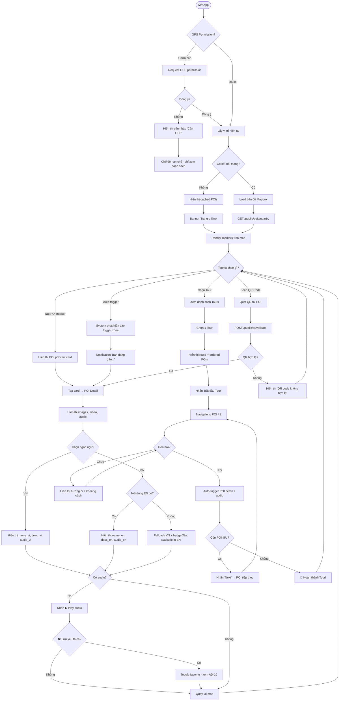
```mermaid
flowchart TD
    Start([Mở App]) --> A1{GPS Permission?}
    A1 -->|Chưa cấp| A2[Request GPS permission]
    A2 --> A3{Đồng ý?}
    A3 -->|Không| A4[Hiển thị cảnh báo 'Cần GPS']
    A4 --> A5[Chế độ hạn chế - chỉ xem danh sách]
    A3 -->|Đồng ý| A6
    A1 -->|Đã có| A6[Lấy vị trí hiện tại]
    
    A6 --> NET{Có kết nối mạng?}
    NET -->|Không| OFF1[Hiển thị cached POIs]
    OFF1 --> OFF2[Banner 'Đang offline']
    OFF2 --> A9
    NET -->|Có| A7[Load bản đồ Mapbox]
    A7 --> A8[GET /public/pois/nearby]
    A8 --> A9[Render markers trên map]
    
    A9 --> A10{Tourist chọn gì?}
    
    A10 -->|Tap POI marker| B1[Hiển thị POI preview card]
    B1 --> B2[Tap card → POI Detail]
    B2 --> B3[Hiển thị images, mô tả, audio]
    B3 --> B3a{Chọn ngôn ngữ?}
    B3a -->|VN| B3b[Hiển thị name_vi, desc_vi, audio_vi]
    B3a -->|EN| B3c{Nội dung EN có?}
    B3c -->|Có| B3d[Hiển thị name_en, desc_en, audio_en]
    B3c -->|Không| B3e[Fallback VN + badge 'Not available in EN']
    B3b --> B4{Có audio?}
    B3d --> B4
    B3e --> B4
    B4 -->|Có| B5[Nhấn ▶ Play audio]
    B5 --> B5a{❤️ Lưu yêu thích?}
    B5a -->|Có| B5b[Toggle favorite - xem AD-10]
    B5a -->|Không| B6
    B5b --> B6
    B4 -->|Không| B6[Quay lại map]
    B6 --> A10
    
    A10 -->|Chọn Tour| C1[Xem danh sách Tours]
    C1 --> C2[Chọn 1 Tour]
    C2 --> C3[Hiển thị route + ordered POIs]
    C3 --> C4[Nhấn 'Bắt đầu Tour']
    C4 --> C5[Navigate to POI #1]
    
    C5 --> C6{Đến nơi?}
    C6 -->|Chưa| C7[Hiển thị hướng đi + khoảng cách]
    C7 --> C6
    C6 -->|Rồi| C8[Auto-trigger POI detail + audio]
    C8 --> C9{Còn POI tiếp?}
    C9 -->|Có| C10[Nhấn 'Next' → POI tiếp theo]
    C10 --> C5
    C9 -->|Không| C11[🎉 Hoàn thành Tour!]
    C11 --> A10
    
    A10 -->|Auto-trigger| D1[System phát hiện vào trigger zone]
    D1 --> D2[Notification 'Bạn đang gần...']
    D2 --> B2
    
    A10 -->|Scan QR Code| QR1[Quét QR tại POI]
    QR1 --> QR2[POST /public/qr/validate]
    QR2 --> QR3{QR hợp lệ?}
    QR3 -->|Có| B2
    QR3 -->|Không| QR4[Hiển thị 'QR code không hợp lệ']
    QR4 --> A10
```

---

## AD-05: Location Detection + Auto-trigger (Criteria Engine)

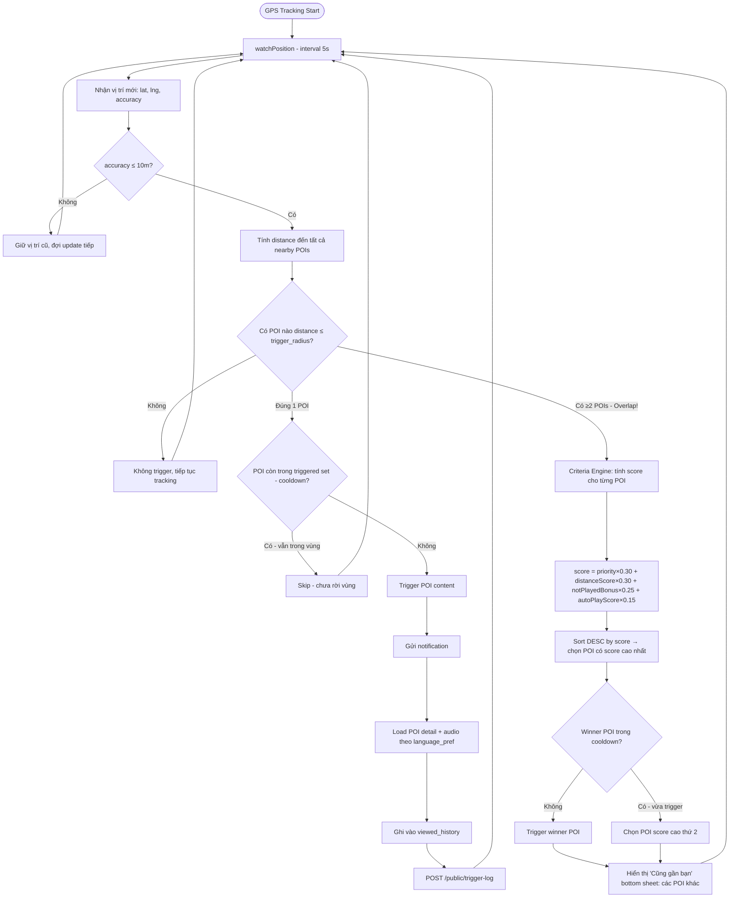
```mermaid
flowchart TD
    Start([GPS Tracking Start]) --> A1[watchPosition - interval 5s]
    A1 --> A2[Nhận vị trí mới: lat, lng, accuracy]

    A2 --> A3{accuracy ≤ 10m?}
    A3 -->|Không| A4[Giữ vị trí cũ, đợi update tiếp]
    A4 --> A1

    A3 -->|Có| A5[Tính distance đến tất cả nearby POIs]
    A5 --> A6{Có POI nào distance ≤ trigger_radius?}

    A6 -->|Không| A7[Không trigger, tiếp tục tracking]
    A7 --> A1

    A6 -->|Đúng 1 POI| B1{POI còn trong triggered set - cooldown?}
    B1 -->|Có - vẫn trong vùng| B2[Skip - chưa rời vùng]
    B2 --> A1
    B1 -->|Không| B3[Trigger POI content]
    B3 --> B4[Gửi notification]
    B4 --> B5[Load POI detail + audio theo language_pref]
    B5 --> B6[Ghi vào viewed_history]
    B6 --> B7[POST /public/trigger-log]
    B7 --> A1

    A6 -->|Có ≥2 POIs - Overlap!| C1[Criteria Engine: tính score cho từng POI]
    C1 --> C2["score = priority×0.30 + distanceScore×0.30 + notPlayedBonus×0.25 + autoPlayScore×0.15"]
    C2 --> C3[Sort DESC by score → chọn POI có score cao nhất]
    C3 --> C4{Winner POI trong cooldown?}
    C4 -->|Không| C5[Trigger winner POI]
    C4 -->|Có - vừa trigger| C6[Chọn POI score cao thứ 2]
    C5 --> C7[Hiển thị 'Cũng gần bạn' bottom sheet: các POI khác]
    C6 --> C7
    C7 --> A1
```

---

## AD-06: Shop Owner Registration + POI Management

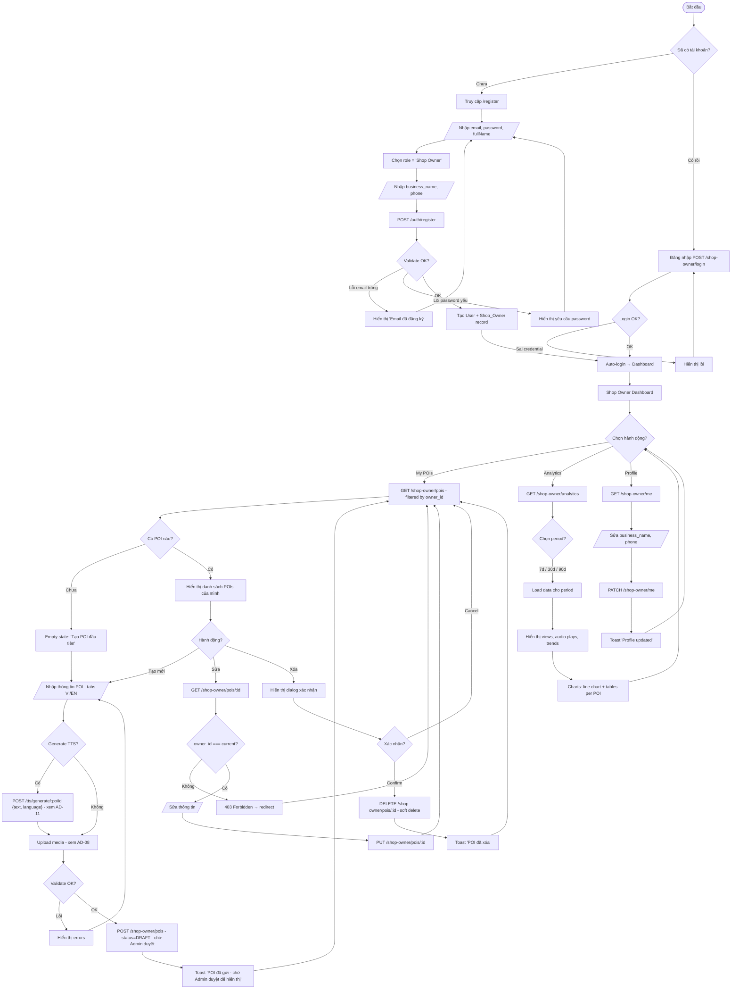
```mermaid
flowchart TD
    Start([Bắt đầu]) --> A1{Đã có tài khoản?}
    
    A1 -->|Chưa| B1[Truy cập /register]
    B1 --> B2[/Nhập email, password, fullName/]
    B2 --> B3[Chọn role = 'Shop Owner']
    B3 --> B4[/Nhập business_name, phone/]
    B4 --> B5[POST /auth/register]
    B5 --> B6{Validate OK?}
    B6 -->|Lỗi email trùng| B7[Hiển thị 'Email đã đăng ký']
    B7 --> B2
    B6 -->|Lỗi password yếu| B7a[Hiển thị yêu cầu password]
    B7a --> B2
    B6 -->|OK| B8[Tạo User + Shop_Owner record]
    B8 --> B9[Auto-login → Dashboard]
    
    A1 -->|Có rồi| C1[Đăng nhập POST /shop-owner/login]
    C1 --> C1a{Login OK?}
    C1a -->|Sai credential| C1b[Hiển thị lỗi]
    C1b --> C1
    C1a -->|OK| B9
    
    B9 --> D1[Shop Owner Dashboard]
    D1 --> D2{Chọn hành động?}
    
    D2 -->|My POIs| E1[GET /shop-owner/pois - filtered by owner_id]
    E1 --> E2{Có POI nào?}
    E2 -->|Chưa| E3[Empty state: 'Tạo POI đầu tiên']
    E3 --> E4
    E2 -->|Có| E5[Hiển thị danh sách POIs của mình]
    E5 --> E6{Hành động?}
    E6 -->|Tạo mới| E4[/Nhập thông tin POI - tabs VI/EN/]
    E4 --> E4a{Generate TTS?}
    E4a -->|Có| E4b["POST /tts/generate/:poiId {text, language} - xem AD-11"]
    E4b --> E7
    E4a -->|Không| E7[Upload media - xem AD-08]
    E7 --> E7a{Validate OK?}
    E7a -->|Lỗi| E7b[Hiển thị errors]
    E7b --> E4
    E7a -->|OK| E8[POST /shop-owner/pois - status=DRAFT - chờ Admin duyệt]
    E8 --> E8a[Toast 'POI đã gửi - chờ Admin duyệt để hiển thị']
    E8a --> E1
    E6 -->|Sửa| E9a[GET /shop-owner/pois/:id]
    E9a --> E9b{owner_id === current?}
    E9b -->|Không| E9c[403 Forbidden → redirect]
    E9c --> E1
    E9b -->|Có| E9d[/Sửa thông tin/]
    E9d --> E9[PUT /shop-owner/pois/:id]
    E9 --> E1
    E6 -->|Xóa| E10a[Hiển thị dialog xác nhận]
    E10a --> E10b{Xác nhận?}
    E10b -->|Cancel| E1
    E10b -->|Confirm| E10c[DELETE /shop-owner/pois/:id - soft delete]
    E10c --> E10d[Toast 'POI đã xóa']
    E10d --> E1
    
    D2 -->|Analytics| F1[GET /shop-owner/analytics]
    F1 --> F1a{Chọn period?}
    F1a -->|7d / 30d / 90d| F1b[Load data cho period]
    F1b --> F2[Hiển thị views, audio plays, trends]
    F2 --> F2a[Charts: line chart + tables per POI]
    F2a --> D2
    
    D2 -->|Profile| G1[GET /shop-owner/me]
    G1 --> G1a[/Sửa business_name, phone/]
    G1a --> G2[PATCH /shop-owner/me]
    G2 --> G2a[Toast 'Profile updated']
    G2a --> D2
```

---

## AD-07: Forgot Password Flow

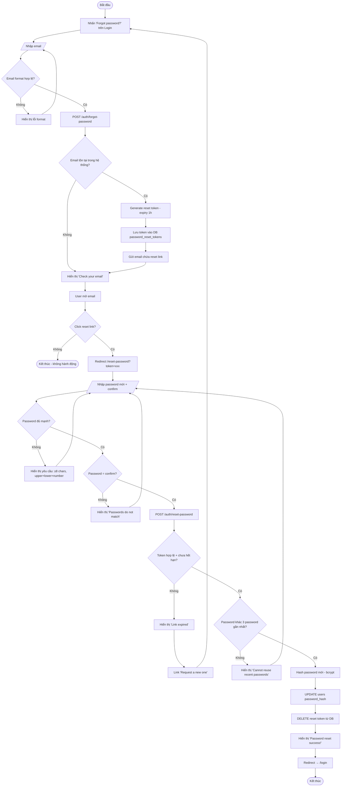
```mermaid
flowchart TD
    Start([Bắt đầu]) --> A1[Nhấn 'Forgot password?' trên Login]
    A1 --> A2[/Nhập email/]
    A2 --> A3{Email format hợp lệ?}
    A3 -->|Không| A3a[Hiển thị lỗi format]
    A3a --> A2
    A3 -->|Có| A4[POST /auth/forgot-password]
    
    A4 --> A5{Email tồn tại trong hệ thống?}
    A5 -->|Không| A6[Vẫn hiển thị 'Check email' - bảo mật]
    A5 -->|Có| A7[Generate reset token - expiry 1h]
    A7 --> A8[Lưu token vào DB password_reset_tokens]
    A8 --> A9[Gửi email chứa reset link]
    A9 --> A6[Hiển thị 'Check your email']
    
    A6 --> B1[User mở email]
    B1 --> B2{Click reset link?}
    B2 -->|Không| End1([Kết thúc - không hành động])
    B2 -->|Có| B3[Redirect /reset-password?token=xxx]
    
    B3 --> B4[/Nhập password mới + confirm/]
    B4 --> B5{Password đủ mạnh?}
    B5 -->|Không| B5a[Hiển thị yêu cầu: ≥8 chars, upper+lower+number]
    B5a --> B4
    B5 -->|Có| B6{Password = confirm?}
    B6 -->|Không| B6a[Hiển thị 'Passwords do not match']
    B6a --> B4
    B6 -->|Có| B7[POST /auth/reset-password]
    
    B7 --> B8{Token hợp lệ + chưa hết hạn?}
    B8 -->|Không| B9[Hiển thị 'Link expired']
    B9 --> B9a[Link 'Request a new one']
    B9a --> A1
    
    B8 -->|Có| B10{Password khác 3 password gần nhất?}
    B10 -->|Không| B10a[Hiển thị 'Cannot reuse recent passwords']
    B10a --> B4
    B10 -->|Có| B11[Hash password mới - bcrypt]
    B11 --> B12[UPDATE users password_hash]
    B12 --> B13[DELETE reset token từ DB]
    B13 --> B14[Hiển thị 'Password reset success!']
    B14 --> B15[Redirect → /login]
    B15 --> End2([Kết thúc])
```

---

## AD-08: Upload Media Flow

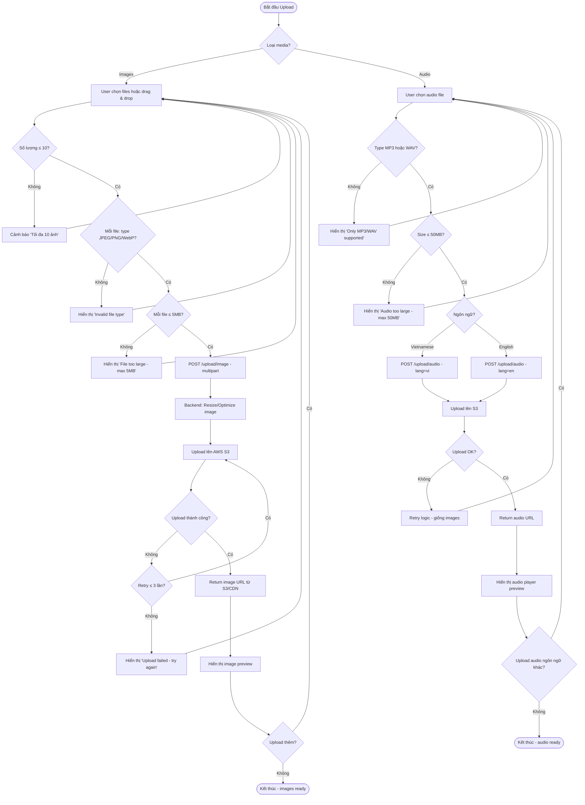
```mermaid
flowchart TD
    Start([Bắt đầu Upload]) --> A1{Loại media?}
    
    A1 -->|Images| B1[User chọn files hoặc drag & drop]
    B1 --> B2{Số lượng ≤ 10?}
    B2 -->|Không| B2a[Cảnh báo 'Tối đa 10 ảnh']
    B2a --> B1
    B2 -->|Có| B3{Mỗi file: type JPEG/PNG/WebP?}
    B3 -->|Không| B3a[Hiển thị 'Invalid file type']
    B3a --> B1
    B3 -->|Có| B4{Mỗi file ≤ 5MB?}
    B4 -->|Không| B4a[Hiển thị 'File too large - max 5MB']
    B4a --> B1
    B4 -->|Có| B5[POST /upload/image - multipart]
    B5 --> B6[Backend: Resize/Optimize image]
    B6 --> B7[Upload lên AWS S3]
    B7 --> B8{Upload thành công?}
    B8 -->|Không| B9{Retry ≤ 3 lần?}
    B9 -->|Có| B7
    B9 -->|Không| B10[Hiển thị 'Upload failed - try again']
    B10 --> B1
    B8 -->|Có| B11[Return image URL từ S3/CDN]
    B11 --> B12[Hiển thị image preview]
    B12 --> B13{Upload thêm?}
    B13 -->|Có| B1
    B13 -->|Không| End1([Kết thúc - images ready])
    
    A1 -->|Audio| C1[User chọn audio file]
    C1 --> C2{Type MP3 hoặc WAV?}
    C2 -->|Không| C2a[Hiển thị 'Only MP3/WAV supported']
    C2a --> C1
    C2 -->|Có| C3{Size ≤ 50MB?}
    C3 -->|Không| C3a[Hiển thị 'Audio too large - max 50MB']
    C3a --> C1
    C3 -->|Có| C4{Ngôn ngữ?}
    C4 -->|Vietnamese| C5[POST /upload/audio - lang=vi]
    C4 -->|English| C6[POST /upload/audio - lang=en]
    C5 --> C7[Upload lên S3]
    C6 --> C7
    C7 --> C8{Upload OK?}
    C8 -->|Không| C9[Retry logic - giống images]
    C9 --> C1
    C8 -->|Có| C10[Return audio URL]
    C10 --> C11[Hiển thị audio player preview]
    C11 --> C12{Upload audio ngôn ngữ khác?}
    C12 -->|Có| C1
    C12 -->|Không| End2([Kết thúc - audio ready])
```

---

## AD-09: Delete POI (Cascade)

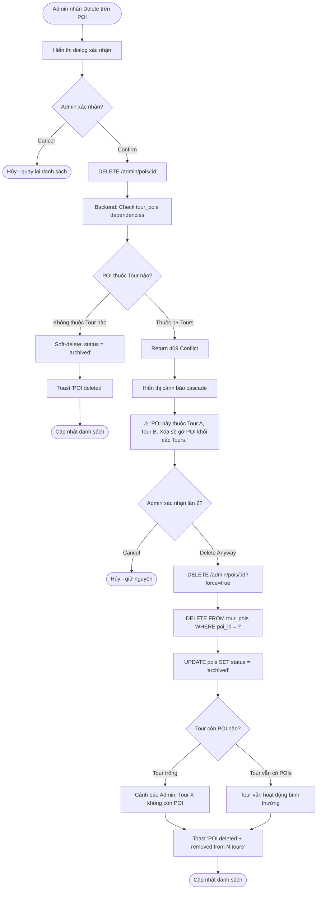
```mermaid
flowchart TD
    Start([Admin nhấn Delete trên POI]) --> A1[Hiển thị dialog xác nhận]
    A1 --> A2{Admin xác nhận?}
    A2 -->|Cancel| End1([Hủy - quay lại danh sách])
    
    A2 -->|Confirm| A3[DELETE /admin/pois/:id]
    A3 --> A4[Backend: Check tour_pois dependencies]
    A4 --> A5{POI thuộc Tour nào?}
    
    A5 -->|Không thuộc Tour nào| B1[Soft-delete: status = 'archived']
    B1 --> B2[Toast 'POI deleted']
    B2 --> End2([Cập nhật danh sách])
    
    A5 -->|Thuộc 1+ Tours| C1[Return 409 Conflict]
    C1 --> C2[Hiển thị cảnh báo cascade]
    C2 --> C2a["⚠️ 'POI này thuộc Tour A, Tour B. Xóa sẽ gỡ POI khỏi các Tours.'"]
    C2a --> C3{Admin xác nhận lần 2?}
    C3 -->|Cancel| End3([Hủy - giữ nguyên])
    C3 -->|Delete Anyway| C4[DELETE /admin/pois/:id?force=true]
    C4 --> C5[DELETE FROM tour_pois WHERE poi_id = ?]
    C5 --> C6[UPDATE pois SET status = 'archived']
    C6 --> C7{Tour còn POI nào?}
    C7 -->|Tour trống| C8[Cảnh báo Admin: Tour X không còn POI]
    C7 -->|Tour vẫn có POIs| C9[Tour vẫn hoạt động bình thường]
    C8 --> C10[Toast 'POI deleted + removed from N tours']
    C9 --> C10
    C10 --> End4([Cập nhật danh sách])
```

---

## AD-10: Tourist Favorites & History

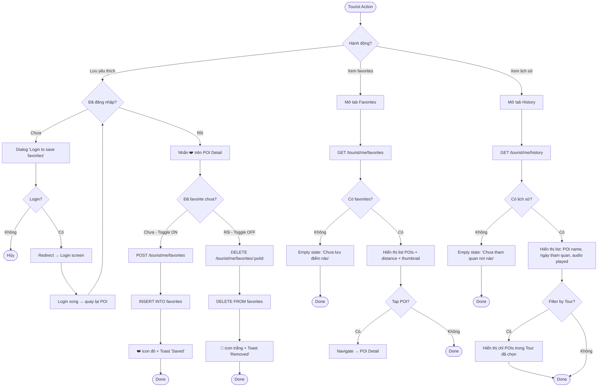
```mermaid
flowchart TD
    Start([Tourist Action]) --> A1{Hành động?}
    
    A1 -->|Lưu yêu thích| B1{Đã đăng nhập?}
    B1 -->|Chưa| B2[Dialog 'Login to save favorites']
    B2 --> B2a{Login?}
    B2a -->|Không| End0([Hủy])
    B2a -->|Có| B2b[Redirect → Login screen]
    B2b --> B2c[Login xong → quay lại POI]
    B2c --> B1
    
    B1 -->|Rồi| B3[Nhấn ❤️ trên POI Detail]
    B3 --> B4{Đã favorite chưa?}
    B4 -->|Chưa - Toggle ON| B5[POST /tourist/me/favorites]
    B5 --> B6[INSERT INTO favorites]
    B6 --> B7[❤️ icon đỏ + Toast 'Saved']
    B7 --> End1([Done])
    
    B4 -->|Rồi - Toggle OFF| B8[DELETE /tourist/me/favorites/:poiId]
    B8 --> B9[DELETE FROM favorites]
    B9 --> B10[🤍 icon trắng + Toast 'Removed']
    B10 --> End2([Done])
    
    A1 -->|Xem favorites| C1[Mở tab Favorites]
    C1 --> C2[GET /tourist/me/favorites]
    C2 --> C3{Có favorites?}
    C3 -->|Không| C4[Empty state: 'Chưa lưu điểm nào']
    C4 --> End3([Done])
    C3 -->|Có| C5[Hiển thị list POIs + distance + thumbnail]
    C5 --> C6{Tap POI?}
    C6 -->|Có| C7[Navigate → POI Detail]
    C6 -->|Không| End4([Done])
    
    A1 -->|Xem lịch sử| D1[Mở tab History]
    D1 --> D2[GET /tourist/me/history]
    D2 --> D3{Có lịch sử?}
    D3 -->|Không| D4[Empty state: 'Chưa tham quan nơi nào']
    D4 --> End5([Done])
    D3 -->|Có| D5[Hiển thị list: POI name, ngày tham quan, audio played]
    D5 --> D6{Filter by Tour?}
    D6 -->|Có| D7[Hiển thị chỉ POIs trong Tour đã chọn]
    D7 --> End6([Done])
    D6 -->|Không| End6
```

---

## AD-11: TTS Audio Generation Flow

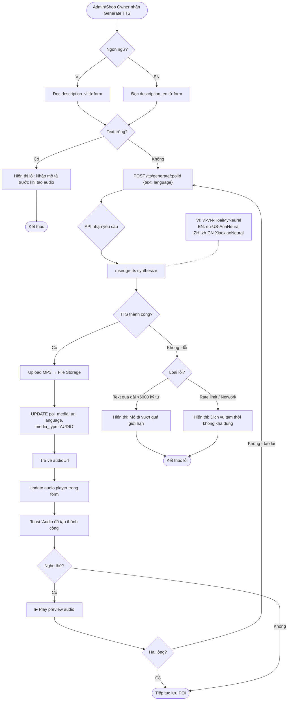
```mermaid
flowchart TD
    Start([Admin/Shop Owner nhấn Generate TTS]) --> A1{Ngôn ngữ?}
    A1 -->|VI| A2[Đọc description_vi từ form]
    A1 -->|EN| A3[Đọc description_en từ form]

    A2 --> A4{Text trống?}
    A3 --> A4
    A4 -->|Có| A5[Hiển thị lỗi: Nhập mô tả trước khi tạo audio]
    A5 --> End0([Kết thúc])

    A4 -->|Không| A6["POST /tts/generate/:poiId {text, language}"]
    A6 --> A7{API nhận yêu cầu}

    A7 --> A8[msedge-tts synthesize]
    Note1[VI: vi-VN-HoaiMyNeural\nEN: en-US-AriaNeural\nZH: zh-CN-XiaoxiaoNeural] -.- A8
    A8 --> A9{TTS thành công?}

    A9 -->|Có| A10[Upload MP3 → File Storage]
    A10 --> A11[UPDATE poi_media: url, language, media_type=AUDIO]
    A11 --> A12[Trả về audioUrl]
    A12 --> A13[Update audio player trong form]
    A13 --> A14[Toast 'Audio đã tạo thành công']
    A14 --> B1{Nghe thử?}
    B1 -->|Có| B2[▶ Play preview audio]
    B2 --> B3{Hài lòng?}
    B3 -->|Không - tạo lại| A6
    B3 -->|Có| End1([Tiếp tục lưu POI])
    B1 -->|Không| End1

    A9 -->|Không - lỗi| A15{Loại lỗi?}
    A15 -->|Text quá dài >5000 ký tự| A16[Hiển thị: Mô tả vượt quá giới hạn]
    A15 -->|Rate limit / Network| A17[Hiển thị: Dịch vụ tạm thời không khả dụng]
    A16 --> End2([Kết thúc lỗi])
    A17 --> End2
```

---

## AD-12: Device Capability Check Flow

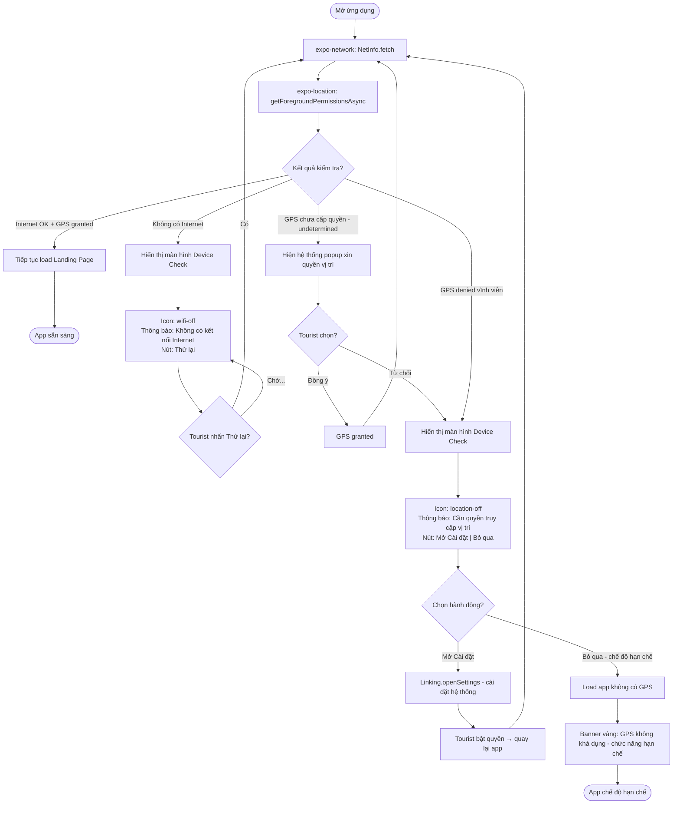
```mermaid
flowchart TD
    Start([Mở ứng dụng]) --> A1[expo-network: NetInfo.fetch]
    A1 --> A2[expo-location: getForegroundPermissionsAsync]

    A2 --> A3{Kết quả kiểm tra?}

    A3 -->|Internet OK + GPS granted| B1[Tiếp tục load Landing Page]
    B1 --> End1([App sẵn sàng])

    A3 -->|Không có Internet| C1[Hiển thị màn hình Device Check]
    C1 --> C2["Icon: wifi-off\nThông báo: Không có kết nối Internet\nNút: Thử lại"]
    C2 --> C3{Tourist nhấn Thử lại?}
    C3 -->|Có| A1
    C3 -->|Chờ...| C2

    A3 -->|GPS chưa cấp quyền - undetermined| D1[Hiện hệ thống popup xin quyền vị trí]
    D1 --> D2{Tourist chọn?}
    D2 -->|Đồng ý| D3[GPS granted]
    D3 --> A1
    D2 -->|Từ chối| D4[Hiển thị màn hình Device Check]
    D4 --> D5["Icon: location-off\nThông báo: Cần quyền truy cập vị trí\nNút: Mở Cài đặt | Bỏ qua"]
    D5 --> D6{Chọn hành động?}
    D6 -->|Mở Cài đặt| D7[Linking.openSettings - cài đặt hệ thống]
    D7 --> D8[Tourist bật quyền → quay lại app]
    D8 --> A1
    D6 -->|Bỏ qua - chế độ hạn chế| D9[Load app không có GPS]
    D9 --> D10[Banner vàng: GPS không khả dụng - chức năng hạn chế]
    D10 --> End2([App chế độ hạn chế])

    A3 -->|GPS denied vĩnh viễn| D4
```

---

## AD-13: Admin & Shop Owner Map View

```mermaid
flowchart TD
    Start([User truy cập POI management]) --> A0{Trang nào?}

    A0 -->|/admin/map| A1[GET /pois?limit=200 + GET /tours]
    A0 -->|/owner/map| A1b["GET /shop-owner/pois (role-aware, chỉ POIs của mình)"]
    A1b --> A2
    A0 -->|/admin/pois| A0a[Hiển thị POI List mặc định]
    A0 -->|/owner/dashboard| A0b[Hiển thị My POIs list mặc định]

    A0a --> A0c{Toggle View Mode?}
    A0c -->|List| A0a
    A0c -->|Map| A0d["GET /pois?limit=500 (+ filters)"]
    A0d --> A2

    A0b --> A0e{Toggle View Mode?}
    A0e -->|List| A0b
    A0e -->|Map| A0f["Lấy POIs từ overview data (owner only)"]
    A0f --> A2

    A1 --> A2[Render Leaflet map centered HCM City]
    A2 --> A3[Hiển thị markers POIs theo category color]
    A3 --> A4[Hiển thị trigger radius circles]

    A4 --> A5{User chọn hành động?}

    A5 -->|Filter status| B1[/Chọn: All / Active / Draft / Archived/]
    B1 --> B2[Filter markers theo status]
    B2 --> A5

    A5 -->|Filter category| B3[/Chọn category/]
    B3 --> B4[Filter markers theo category]
    B4 --> A5

    A5 -->|Chọn Tour| C1[/Dropdown chọn Tour (chỉ /admin/map)/]
    C1 --> C2[Vẽ Polyline nối các POIs theo thứ tự]
    C2 --> C3[Highlight POIs thuộc Tour]
    C3 --> A5

    A5 -->|Toggle radius| D1["Bật/tắt trigger radius circles (chỉ /admin/map)"]
    D1 --> A5

    A5 -->|Click marker POI| E1[Hiển thị Popup]
    E1 --> E2["Popup: tên, category, status, audio badge"]
    E2 --> E3{Chọn action?}
    E3 -->|View| E4["Navigate → /admin/pois/:id (Admin) hoặc /owner/pois/:id (Shop Owner)"]
    E3 -->|Edit| E5["Navigate → /admin/pois/:id/edit (Admin) hoặc /owner/pois/:id/edit (Shop Owner)"]
    E3 -->|Đóng popup| A5

    A5 -->|Xem Legend| F1[Hiển thị legend: 8 categories + colors]
    F1 --> A5

    A5 -->|Toggle → List| G1[Chuyển về List view]
    G1 --> A0
```

---

## AD-14: QR Code Generation & Management

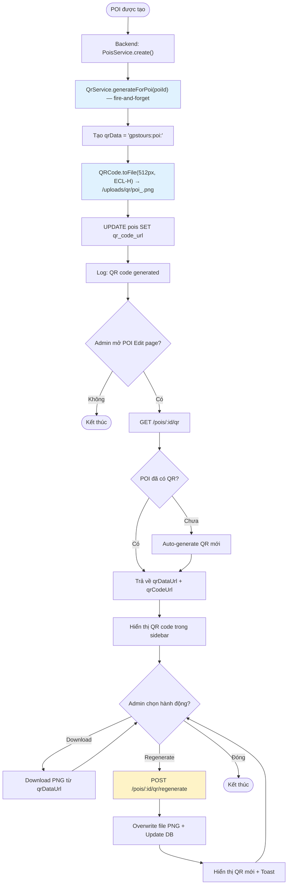
```mermaid
flowchart TD
    Start([POI được tạo]) --> A1["Backend: PoisService.create()"]
    A1 --> A2["QrService.generateForPoi(poiId) — fire-and-forget"]
    A2 --> A3["Tạo qrData = 'gpstours:poi:<poiId>'"]
    A3 --> A4["QRCode.toFile(512px, ECL-H) → /uploads/qr/poi_<id>.png"]
    A4 --> A5["UPDATE pois SET qr_code_url"]
    A5 --> A6["Log: QR code generated"]

    A6 --> B1{Admin mở POI Edit page?}
    B1 -->|Không| End1([Kết thúc])
    B1 -->|Có| B2["GET /pois/:id/qr"]
    B2 --> B3{POI đã có QR?}
    B3 -->|Có| B4[Trả về qrDataUrl + qrCodeUrl]
    B3 -->|Chưa| B5[Auto-generate QR mới]
    B5 --> B4
    B4 --> B6["Hiển thị QR code trong sidebar"]

    B6 --> C1{Admin chọn hành động?}
    C1 -->|Download| C2["Download PNG từ qrDataUrl"]
    C2 --> C1
    C1 -->|Regenerate| C3["POST /pois/:id/qr/regenerate"]
    C3 --> C4[Overwrite file PNG + Update DB]
    C4 --> C5["Hiển thị QR mới + Toast"]
    C5 --> C1
    C1 -->|Đóng| End2([Kết thúc])

    style A2 fill:#e0f2fe
    style A4 fill:#e0f2fe
    style C3 fill:#fef3c7
```

---

## Summary

| Diagram | Nodes | Decisions | Paths | Complexity |
|---------|-------|-----------|-------|------------|
| AD-01 | 14 | 4 | 5 | Medium |
| AD-02 | 34 | 10 | 11 | High |
| AD-03 | 16 | 4 | 4 | Medium |
| AD-04 | 36 | 11 | 13 | Very High |
| AD-05 | 22 | 6 | 8 | High |
| AD-06 | 38 | 11 | 13 | Very High |
| AD-07 | 22 | 6 | 7 | High |
| AD-08 | 28 | 9 | 10 | High |
| AD-09 | 16 | 4 | 5 | Medium |
| AD-10 | 24 | 7 | 8 | High |
| AD-11 | 20 | 6 | 7 | High |
| AD-12 | 18 | 5 | 6 | Medium |
| AD-13 | 24 | 7 | 9 | High |
| AD-14 | 18 | 4 | 6 | Medium |

---

> **Reference:** `PRDs/14_usecase_diagram.md`, `PRDs/15_sequence_diagrams.md`, `PRDs/05_functional_requirements.md`
