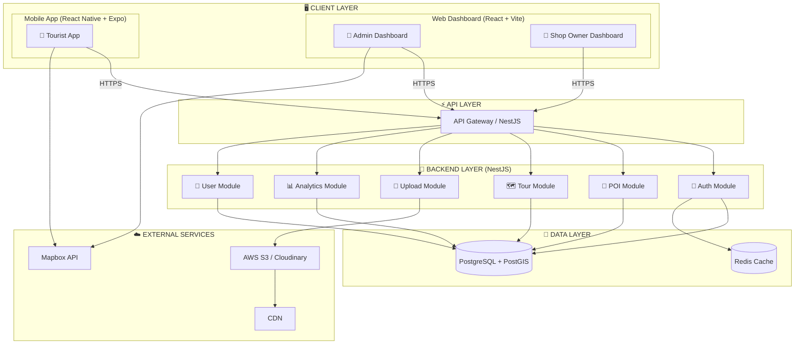
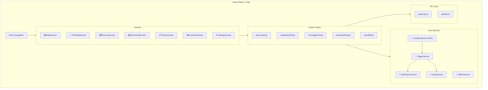
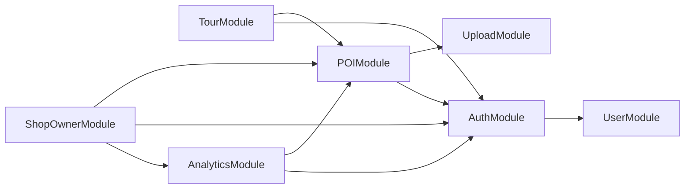
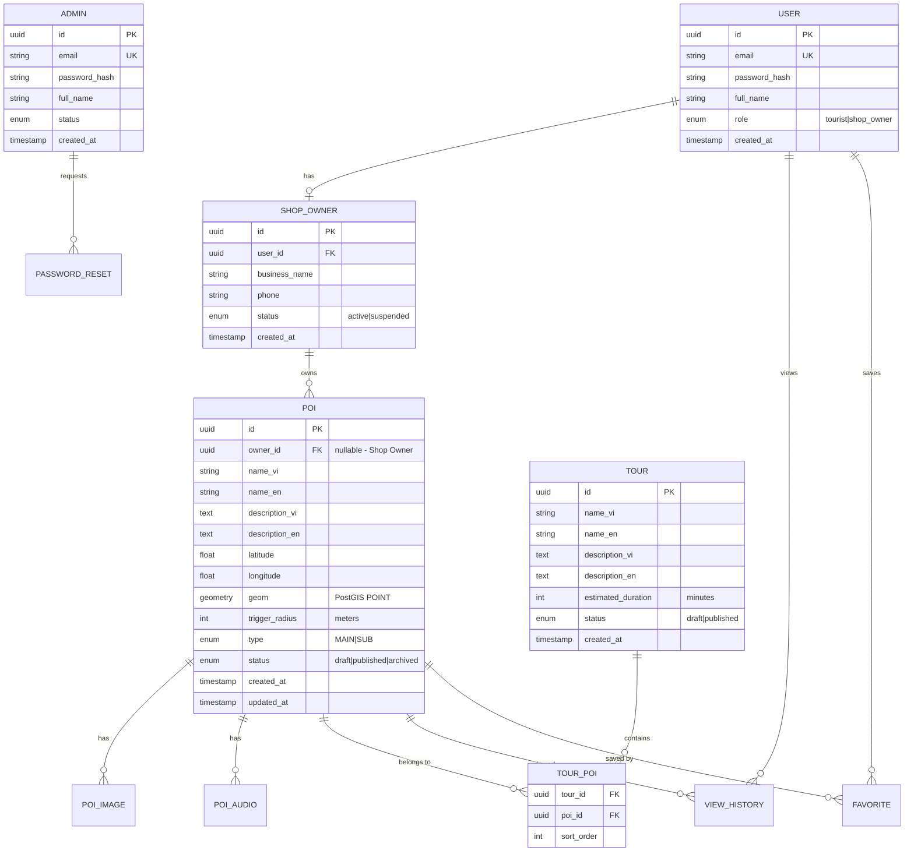
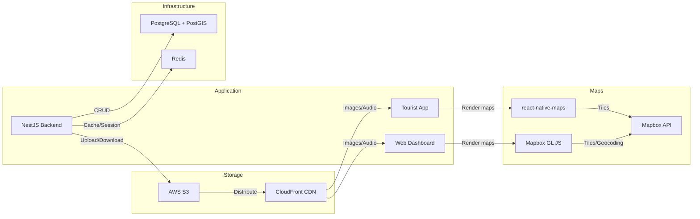

# 📐 Component Diagram
## Dự án GPS Tours & Phố Ẩm thực Vĩnh Khánh

> **Phiên bản:** 1.0  
> **Ngày tạo:** 2026-02-10

---

## 1. System Architecture Overview



---

## 2. Client Layer

### 2.1 Web Dashboard (Admin + Shop Owner)

```mermaid
graph TB
    subgraph WebApp["React + Vite + TypeScript"]
        Router["React Router v6"]
        
        subgraph Auth["Auth Layer"]
            AuthGuard["AuthGuard (Role-based)"]
            AuthContext["AuthContext"]
            LoginPage["LoginPage"]
        end

        subgraph AdminPages["Admin Pages (role='admin')"]
            AdminDashboard["Dashboard Overview"]
            POIList["POI List + CRUD"]
            POIForm["POI Create/Edit Form"]
            TourList["Tour List + CRUD"]
            TourForm["Tour Create/Edit Form"]
            AdminSettings["Settings"]
        end

        subgraph ShopPages["Shop Owner Pages (role='shop_owner')"]
            ShopDashboard["Shop Dashboard"]
            MyPOIs["My POIs List"]
            ShopPOIForm["POI Create/Edit Form"]
            ShopAnalytics["Analytics Dashboard"]
            ShopProfile["Profile Settings"]
        end

        subgraph Shared["Shared Components"]
            MapPicker["MapPicker (Mapbox GL)"]
            MediaUpload["MediaUploader (Images + Audio)"]
            DataTable["DataTable (sortable, filterable)"]
            FormComponents["Form Components (shadcn/ui)"]
        end

        subgraph Services["API Services"]
            AuthAPI["authApi.ts"]
            POIAPI["poiApi.ts"]
            TourAPI["tourApi.ts"]
            UploadAPI["uploadApi.ts"]
            AnalyticsAPI["analyticsApi.ts"]
        end
    end

    Router --> AuthGuard
    AuthGuard -->|role=admin| AdminPages
    AuthGuard -->|role=shop_owner| ShopPages
    AdminPages --> Shared
    ShopPages --> Shared
    AdminPages --> Services
    ShopPages --> Services
```



**Tech Stack:**

| Component | Technology | Version |
|-----------|-----------|---------|
| Framework | React | 18.x |
| Build Tool | Vite | 5.x |
| Language | TypeScript | 5.x |
| Styling | Tailwind CSS | 3.x |
| UI Library | shadcn/ui | latest |
| Maps | Mapbox GL JS | 3.x |
| State | React Context + hooks | - |
| HTTP Client | Axios | 1.x |
| Router | React Router | 6.x |

---

### 2.2 Tourist Mobile App



**Tech Stack:**

| Component | Technology | Version |
|-----------|-----------|---------|
| Framework | React Native | 0.73+ |
| Platform | Expo | SDK 50+ |
| Language | TypeScript | 5.x |
| Navigation | React Navigation | 6.x |
| Maps | react-native-maps | latest |
| Audio | react-native-track-player | 4.x |
| Storage | AsyncStorage | latest |
| HTTP Client | Axios | 1.x |

---

## 3. Backend Layer (NestJS)

```mermaid
graph TB
    subgraph NestJS["NestJS Application"]
        Main["main.ts (Bootstrap)"]
        
        subgraph Middleware["Middleware & Guards"]
            JwtGuard["JwtAuthGuard"]
            RolesGuard["RolesGuard"]
            RateLimit["ThrottlerGuard"]
            ValidationPipe["ValidationPipe"]
            CorsConfig["CORS Config"]
        end

        subgraph Modules["Feature Modules"]
            subgraph AuthMod["AuthModule"]
                AuthController["AuthController"]
                AuthService2["AuthService"]
                JwtStrategy["JwtStrategy"]
                LocalStrategy["LocalStrategy"]
            end

            subgraph POIMod["POIModule"]
                POIController["POIController"]
                AdminPOIController["AdminPOIController"]
                ShopPOIController["ShopOwnerPOIController"]
                POIService["POIService"]
            end

            subgraph TourMod["TourModule"]
                TourController["TourController"]
                TourService["TourService"]
            end

            subgraph UploadMod["UploadModule"]
                UploadController["UploadController"]
                UploadService["UploadService"]
                S3Provider["S3Provider"]
            end

            subgraph AnalyticsMod["AnalyticsModule"]
                AnalyticsController["AnalyticsController"]
                AnalyticsService["AnalyticsService"]
            end

            subgraph UserMod["UserModule"]
                UserController["UserController"]
                UserService["UserService"]
                ShopOwnerService["ShopOwnerService"]
            end
        end

        subgraph Database["Database Layer"]
            PrismaService["PrismaService"]
            PrismaModule["PrismaModule"]
        end
    end

    Main --> Middleware
    Middleware --> Modules
    Modules --> Database
```



### 3.1 Module Dependencies



### 3.2 API Route Structure

| Prefix | Controller | Guard | Description |
|--------|-----------|-------|-------------|
| `/auth/*` | AuthController | None (public) | Login, Register |
| `/admin/*` | Admin*Controller | JWT + RolesGuard('admin') | Admin CRUD operations |
| `/shop-owner/*` | ShopOwner*Controller | JWT + RolesGuard('shop_owner') | Shop Owner operations |
| `/public/*` | Public*Controller | None (public) | Tourist read-only APIs |
| `/upload/*` | UploadController | JWT | Media upload |

---

## 4. Data Layer

### 4.1 Database Schema (PostgreSQL + PostGIS)



### 4.2 Database Indexes

| Table | Index | Type | Purpose |
|-------|-------|------|---------|
| pois | `idx_pois_geom` | GiST (PostGIS) | Spatial queries (nearby) |
| pois | `idx_pois_owner_id` | B-tree | Shop Owner data isolation |
| pois | `idx_pois_status` | B-tree | Filter by status |
| tour_pois | `idx_tour_pois_tour_id` | B-tree | Tour → POIs lookup |
| users | `idx_users_email` | B-tree UNIQUE | Login lookup |
| view_history | `idx_views_user_poi` | B-tree | User history |

---

## 5. External Services



### 5.1 Service Details

| Service | Provider | Usage | Rate Limits |
|---------|----------|-------|-------------|
| **Map Tiles** | Mapbox | Hiển thị bản đồ, geocoding | 50K loads/month (free) |
| **Object Storage** | AWS S3 | Images (JPEG/PNG), Audio (MP3/WAV) | No limit |
| **CDN** | CloudFront | Phân phối media cho Tourist app | No limit |
| **Database** | PostgreSQL 16 | Dữ liệu chính + PostGIS geo queries | Self-managed |
| **Cache** | Redis 7 | JWT blacklist, session, API cache | Self-managed |

---

## 6. Deployment Architecture

```
┌─────────────────────────────────────────────────────────────────┐
│                        PRODUCTION                                │
├─────────────────────────────────────────────────────────────────┤
│                                                                   │
│  ┌─────────────┐     ┌─────────────┐     ┌─────────────┐        │
│  │   Vercel     │     │   Docker    │     │   Expo      │        │
│  │  (Web App)   │     │ (NestJS API)│     │  (Mobile)   │        │
│  │  React+Vite  │     │  Port 3000  │     │  iOS/Android│        │
│  └──────┬──────┘     └──────┬──────┘     └─────────────┘        │
│         │                    │                                    │
│         │        ┌───────────┤                                    │
│         │        │           │                                    │
│         │   ┌────┴────┐ ┌───┴─────┐   ┌───────────┐            │
│         │   │PostgreSQL│ │  Redis  │   │  AWS S3   │            │
│         │   │ +PostGIS │ │  Cache  │   │ +CloudFront│            │
│         │   └─────────┘ └─────────┘   └───────────┘            │
│         │                                                        │
│         └──────────── Mapbox API ────────────────────            │
│                                                                   │
└─────────────────────────────────────────────────────────────────┘
```

---

## 7. Communication Protocols

| From | To | Protocol | Format | Auth |
|------|----|----------|--------|------|
| Web Dashboard → API | REST | HTTPS | JSON | JWT Bearer |
| Tourist App → API | REST | HTTPS | JSON | JWT Bearer (optional) |
| API → PostgreSQL | TCP | PostgreSQL wire protocol | SQL (Prisma) | Connection string |
| API → Redis | TCP | Redis protocol | Key-Value | Password |
| API → S3 | HTTPS | AWS SDK | Binary + JSON | IAM credentials |
| Web → Mapbox | HTTPS | Mapbox GL JS | Vector tiles | API Key |
| Mobile → Maps | HTTPS | react-native-maps | Vector tiles | API Key |

---

> **Reference:** `PRDs/12_technical_constraints.md`, `PRDs/08_data_requirements.md`, `PRDs/09_api_specifications.md`
