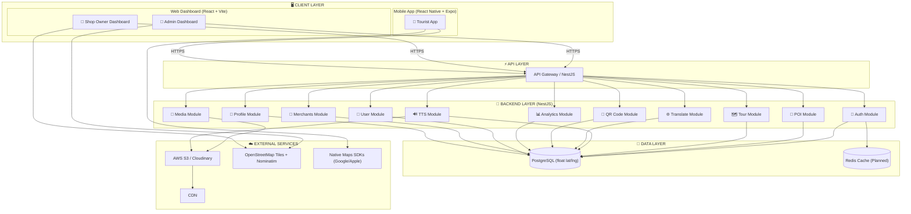
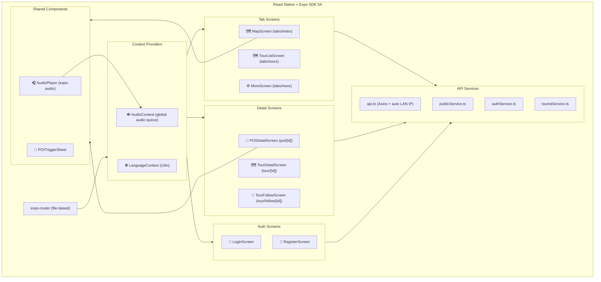
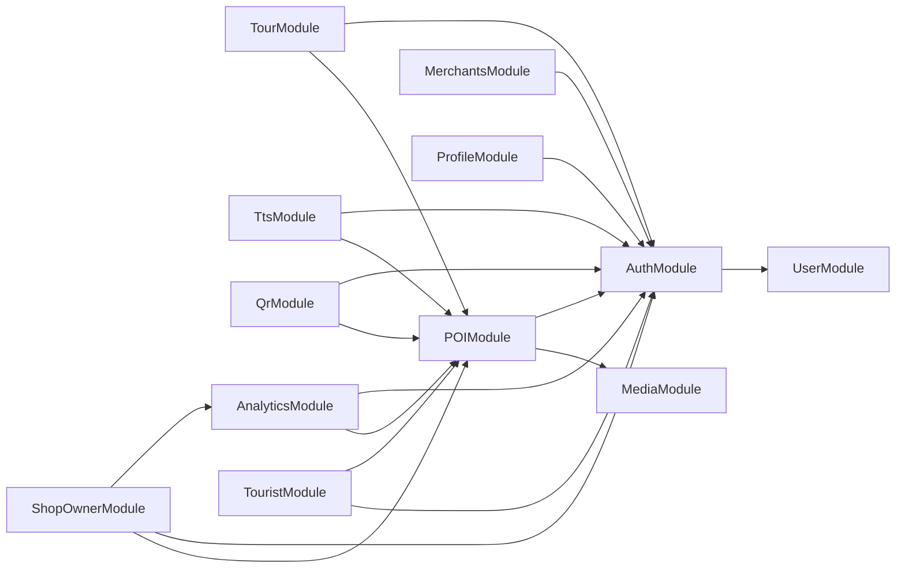
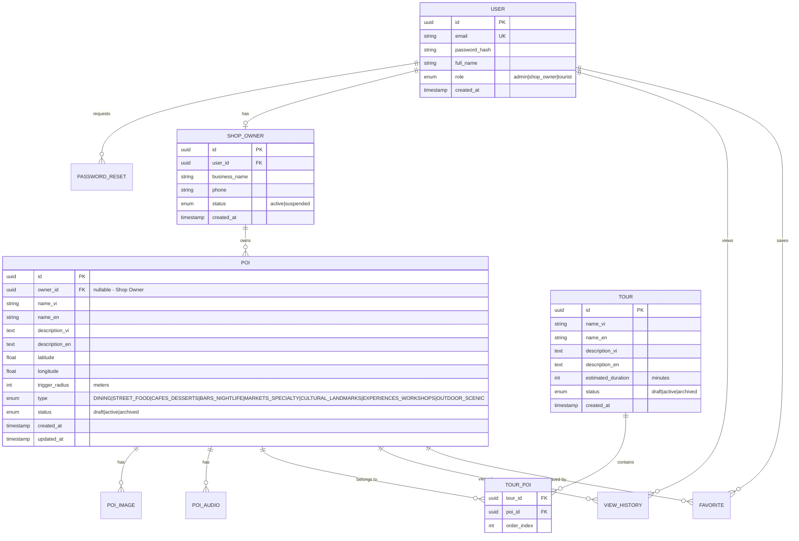
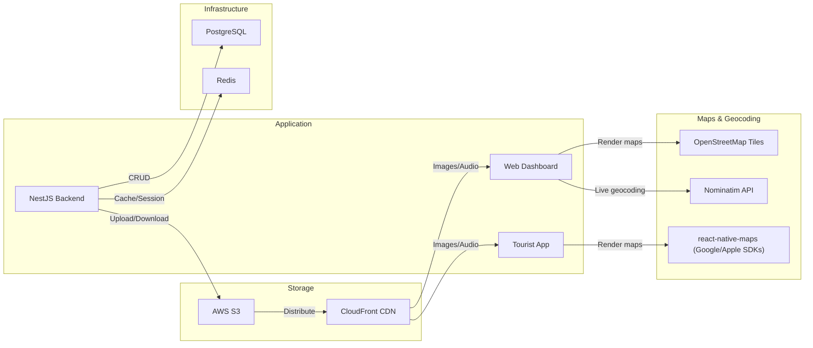

# 📐 Component Diagram
## Dự án GPS Tours & Phố Ẩm thực Vĩnh Khánh

> **Phiên bản:** 3.1
> **Ngày tạo:** 2026-02-10
> **Cập nhật:** 2026-04-04

---

## 1. System Architecture Overview


```mermaid
graph TB
    subgraph Client["🖥️ CLIENT LAYER"]
        subgraph Web["Web Dashboard (React + Vite)"]
            AdminUI["👤 Admin Dashboard"]
            ShopUI["🏪 Shop Owner Dashboard"]
        end
        subgraph Mobile["Mobile App (React Native + Expo)"]
            TouristApp["📱 Tourist App"]
        end
    end

    subgraph API["⚡ API LAYER"]
        Gateway["API Gateway / NestJS"]
    end

    subgraph Backend["🔧 BACKEND LAYER (NestJS)"]
        AuthModule["🔐 Auth Module"]
        POIModule["📍 POI Module"]
        TourModule["🗺️ Tour Module"]
        MediaModule["📁 Media Module"]
        TtsModule["🔊 TTS Module"]
        TranslateModule["🌐 Translate Module"]
        QrModule["📱 QR Code Module"]
        AnalyticsModule["📊 Analytics Module"]
        UserModule["👤 User Module"]
        MerchantsModule["🏪 Merchants Module"]
        ProfileModule["👤 Profile Module"]
    end

    subgraph Data["💾 DATA LAYER"]
        DB[("PostgreSQL (float lat/lng)")]
        Cache[("Redis Cache (Planned)")]
    end

    subgraph External["☁️ EXTERNAL SERVICES"]
        S3["AWS S3 / Cloudinary"]
        OSM["OpenStreetMap Tiles + Nominatim"]
        NativeMaps["Native Maps SDKs (Google/Apple)"]
        CDN["CDN"]
    end

    AdminUI -->|HTTPS| Gateway
    ShopUI -->|HTTPS| Gateway
    TouristApp -->|HTTPS| Gateway

    Gateway --> AuthModule
    Gateway --> POIModule
    Gateway --> TourModule
    Gateway --> MediaModule
    Gateway --> TtsModule
    Gateway --> TranslateModule
    Gateway --> QrModule
    Gateway --> AnalyticsModule
    Gateway --> UserModule
    Gateway --> MerchantsModule
    Gateway --> ProfileModule

    AuthModule --> DB
    AuthModule --> Cache
    POIModule --> DB
    TourModule --> DB
    MediaModule --> S3
    TtsModule --> DB
    TtsModule --> S3
    TranslateModule --> DB
    QrModule --> DB
    AnalyticsModule --> DB
    UserModule --> DB
    MerchantsModule --> DB
    ProfileModule --> DB

    TouristApp --> NativeMaps
    AdminUI --> OSM
    ShopUI --> OSM
    S3 --> CDN
```

---

## 2. Client Layer

### 2.1 Web Dashboard (Admin + Shop Owner)


```mermaid
graph TB
    subgraph WebApp["React + Vite + TypeScript"]
        Router["React Router v6"]
        
        subgraph Auth["Auth Layer"]
            AuthGuard["AuthGuard (Role-based)"]
            AuthContext["AuthContext"]
            LoginPage["LoginPage"]
        end

        subgraph AdminPages["Admin Pages (role='admin')"]
            AdminDashboard["Dashboard Overview"]
            POIList["POI List + CRUD (List/Map toggle)"]
            POIForm["POI Create/Edit Form + QR Code"]
            TourList["Tour List + CRUD"]
            TourForm["Tour Create/Edit Form"]
            MapViewPage["🗺️ Map View (Leaflet, role-aware)"]
            MerchantList["🏪 Merchant List"]
            AdminAnalytics["📊 Analytics Dashboard"]
            AdminSettings["Settings"]
        end

        subgraph ShopPages["Shop Owner Pages (role='shop_owner')"]
            ShopDashboard["Shop Dashboard (List/Map toggle)"]
            MyPOIs["My POIs List"]
            ShopPOIForm["POI Create/View/Edit Form + TTS"]
            ShopMapView["🗺️ Map View (role-aware)"]
            ShopAnalytics["Analytics Dashboard"]
            ShopProfile["Profile Settings"]
        end

        subgraph Shared["Shared Components"]
            MapPicker["MapPicker (Leaflet + Nominatim)"]
            MediaUpload["MediaUploader (Images + Audio)"]
            DataTable["DataTable (sortable, filterable)"]
            FormComponents["Form Components (custom Tailwind)"]
            FormLabels["FormLabels (VI/EN bilingual constants)"]
        end

        subgraph Services["API Services"]
            AuthAPI["authApi.ts"]
            POIAPI["poiApi.ts"]
            TourAPI["tourApi.ts"]
            UploadAPI["uploadApi.ts"]
            AnalyticsAPI["analyticsApi.ts"]
        end
    end

    Router --> AuthGuard
    AuthGuard -->|role=admin| AdminPages
    AuthGuard -->|role=shop_owner| ShopPages
    AdminPages --> Shared
    ShopPages --> Shared
    AdminPages --> Services
    ShopPages --> Services
```

**Tech Stack:**

| Component | Technology | Version |
|-----------|-----------|---------|
| Framework | React | 19.2.0 |
| Build Tool | Vite | 5.x |
| Language | TypeScript | 5.x |
| Styling | Tailwind CSS | 4.1.x |
| UI Library | Custom Tailwind components | - |
| Maps | Leaflet 1.9 + react-leaflet 5.x | - |
| State | React Context + hooks | - |
| HTTP Client | Axios | 1.x |
| Router | React Router | 6.x |

### 2.1.1 Shared Monorepo Package

| Package | Responsibility | Used By |
|---------|----------------|---------|
| packages/localization-shared | Shared localization client/types/hooks | Admin Web, Mobile App |

---

### 2.2 Tourist Mobile App


```mermaid
graph TB
    subgraph MobileApp["React Native + Expo SDK 54"]
        Navigation["expo-router (file-based)"]

        subgraph Contexts["Context Providers"]
            AudioContext["🔊 AudioContext (global audio queue)"]
            LanguageContext["🌐 LanguageContext (i18n)"]
        end

        subgraph Tabs["Tab Screens"]
            MapScreen["🗺️ MapScreen (tabs/index)"]
            TourListScreen["🗺️ TourListScreen (tabs/tours)"]
            MoreScreen["⚙️ MoreScreen (tabs/more)"]
        end

        subgraph DetailScreens["Detail Screens"]
            POIDetail["📍 POIDetailScreen (poi/[id])"]
            TourDetail["🗺️ TourDetailScreen (tour/[id])"]
            TourFollow["🧭 TourFollowScreen (tour/follow/[id])"]
        end

        subgraph AuthScreens["Auth Screens"]
            LoginScreen["🔐 LoginScreen"]
            RegisterScreen["📝 RegisterScreen"]
        end

        subgraph Components["Shared Components"]
            AudioPlayer["🎧 AudioPlayer (expo-audio)"]
            POITriggerSheet["📍 POITriggerSheet"]
        end

        subgraph ApiLayer["API Services"]
            ApiService["api.ts (Axios + auto LAN IP)"]
            PublicAPI["publicService.ts"]
            AuthAPI2["authService.ts"]
            TouristAPI["touristService.ts"]
        end
    end

    Navigation --> Contexts
    Contexts --> Tabs
    Contexts --> DetailScreens
    Contexts --> AuthScreens
    MapScreen --> Components
    POIDetail --> Components
    AudioPlayer --> AudioContext
    Tabs --> ApiLayer
    DetailScreens --> ApiLayer
    AuthScreens --> ApiLayer
```

**Tech Stack (Actual Implementation):**

| Component | Technology | Version |
|-----------|-----------|--------|
| Framework | React Native | 0.81 |
| Platform | Expo | SDK 54 |
| Language | TypeScript | 5.x |
| Navigation | expo-router | 4.x |
| Maps | react-native-maps | 1.20 |
| Audio | expo-av | Latest |
| Icons | lucide-react-native | Latest |
| Storage | AsyncStorage | Latest |
| HTTP Client | Axios | 1.x |

---

## 3. Backend Layer (NestJS)


```mermaid
graph TB
    subgraph NestJS["NestJS Application"]
        Main["main.ts (Bootstrap)"]
        
        subgraph Middleware["Middleware & Guards"]
            JwtGuard["JwtAuthGuard"]
            RolesGuard["RolesGuard"]
            RateLimit["ThrottlerGuard"]
            ValidationPipe["ValidationPipe"]
            CorsConfig["CORS Config"]
        end

        subgraph Modules["Feature Modules"]
            subgraph AuthMod["AuthModule"]
                AuthController["AuthController"]
                AuthService2["AuthService"]
                JwtStrategy["JwtStrategy"]
                LocalStrategy["LocalStrategy"]
            end

            subgraph POIMod["POIModule"]
                POIController["POIController"]
                PublicController["PublicController"]
                POIService["POIService"]
            end

            subgraph TourMod["TourModule"]
                TourController["TourController"]
                TourService["TourService"]
            end

            subgraph MediaMod["MediaModule"]
                MediaController["MediaController"]
                MediaService["MediaService"]
            end

            subgraph TtsMod["TtsModule"]
                TtsController["TtsController"]
                TtsService["TtsService (MsEdgeTTS)"]
            end

            subgraph QrMod["QrModule"]
                QrController["QrController"]
                QrService["QrService (qrcode lib)"]
            end

            subgraph AnalyticsMod["AnalyticsModule"]
                AnalyticsController["AnalyticsController"]
                AnalyticsService["AnalyticsService"]
            end

            subgraph UserMod["UserModule"]
                UserController["UserController"]
                UserService["UserService"]
            end

            subgraph MerchantsMod["MerchantsModule"]
                MerchantsController["MerchantsController"]
                MerchantsService["MerchantsService"]
            end

            subgraph ProfileMod["ProfileModule"]
                ProfileController["ProfileController"]
            end

            subgraph ShopOwnerMod["ShopOwnerModule"]
                ShopOwnerController["ShopOwnerController"]
            end

            subgraph TouristMod["TouristModule"]
                TouristController["TouristController"]
            end
        end

        subgraph Database["Database Layer"]
            PrismaService["PrismaService"]
            PrismaModule["PrismaModule"]
        end
    end

    Main --> Middleware
    Middleware --> Modules
    Modules --> Database
```

### 3.1 Module Dependencies


```mermaid
graph LR
    AuthMod2["AuthModule"] --> UserMod2["UserModule"]
    POIMod2["POIModule"] --> MediaMod2["MediaModule"]
    POIMod2 --> AuthMod2
    TourMod2["TourModule"] --> POIMod2
    TourMod2 --> AuthMod2
    TtsMod2["TtsModule"] --> POIMod2
    TtsMod2 --> AuthMod2
    QrMod2["QrModule"] --> POIMod2
    QrMod2 --> AuthMod2
    AnalyticsMod2["AnalyticsModule"] --> POIMod2
    AnalyticsMod2 --> AuthMod2
    ShopMod["ShopOwnerModule"] --> POIMod2
    ShopMod --> AuthMod2
    ShopMod --> AnalyticsMod2
    MerchantsMod2["MerchantsModule"] --> AuthMod2
    ProfileMod2["ProfileModule"] --> AuthMod2
    TouristMod2["TouristModule"] --> AuthMod2
    TouristMod2 --> POIMod2
```

### 3.2 API Route Structure

| Prefix | Controller | Guard | Description |
|--------|-----------|-------|-------------|
| `/auth/*` | AuthController | None (public) | Login, Register, Refresh |
| `/public/*` | PublicController | None (public) | Tourist read-only APIs |
| `/pois/*` | POIController | JWT + RolesGuard('admin') | Admin POI CRUD |
| `/pois/:poiId/media/*` | MediaController | JWT + RolesGuard('admin') | POI media upload |
| `/pois/:id/qr*` | QrController | JWT + RolesGuard('admin', 'shop_owner') | QR code get/download/regenerate |
| `/tours/*` | TourController | JWT + RolesGuard('admin') | Admin Tour CRUD |
| `/tts/*` | TtsController | JWT + RolesGuard('admin', 'shop_owner') | TTS generation |
| `/admin/analytics/*` | AnalyticsController | JWT + RolesGuard('admin') | Analytics dashboard |
| `/merchants/*` | MerchantsController | JWT + RolesGuard('admin') | Merchant management |
| `/me`, `/me/avatar` | ProfileController | JWT | User profile |
| `/shop-owner/pois` | ShopOwnerController | JWT + RolesGuard('shop_owner') | List own POIs |
| `/shop-owner/pois/:id` | ShopOwnerController | JWT + RolesGuard('shop_owner') | Get own POI detail (with media) |
| `/shop-owner/pois/:id` (PUT) | ShopOwnerController | JWT + RolesGuard('shop_owner') | Update own POI |
| `/shop-owner/pois/:id/media` | ShopOwnerController | JWT + RolesGuard('shop_owner') | Upload media to own POI |
| `/shop-owner/me`, `/shop-owner/analytics` | ShopOwnerController | JWT + RolesGuard('shop_owner') | Profile & Analytics |
| `/tourist/*` | TouristController | JWT + RolesGuard('tourist') | Tourist favorites, history |

---

## 4. Data Layer

### 4.1 Database Schema (PostgreSQL)


```mermaid
erDiagram
    USER ||--o{ PASSWORD_RESET : "requests"
    USER ||--o| SHOP_OWNER : "has"
    SHOP_OWNER ||--o{ POI : "owns"
    POI ||--o{ POI_IMAGE : "has"
    POI ||--o{ POI_AUDIO : "has"
    POI ||--o{ TOUR_POI : "belongs to"
    TOUR ||--o{ TOUR_POI : "contains"
    USER ||--o{ VIEW_HISTORY : "views"
    POI ||--o{ VIEW_HISTORY : "viewed"
    USER ||--o{ FAVORITE : "saves"
    POI ||--o{ FAVORITE : "saved by"

    USER {
        uuid id PK
        string email UK
        string password_hash
        string full_name
        enum role "admin|shop_owner|tourist"
        timestamp created_at
    }

    SHOP_OWNER {
        uuid id PK
        uuid user_id FK
        string business_name
        string phone
        enum status "active|suspended"
        timestamp created_at
    }

    POI {
        uuid id PK
        uuid owner_id FK "nullable - Shop Owner"
        string name_vi
        string name_en
        text description_vi
        text description_en
        float latitude
        float longitude
        int trigger_radius "meters"
        enum type "DINING|STREET_FOOD|CAFES_DESSERTS|BARS_NIGHTLIFE|MARKETS_SPECIALTY|CULTURAL_LANDMARKS|EXPERIENCES_WORKSHOPS|OUTDOOR_SCENIC"
        enum status "draft|active|archived"
        timestamp created_at
        timestamp updated_at
    }

    TOUR {
        uuid id PK
        string name_vi
        string name_en
        text description_vi
        text description_en
        int estimated_duration "minutes"
        enum status "draft|active|archived"
        timestamp created_at
    }

    TOUR_POI {
        uuid tour_id FK
        uuid poi_id FK
        int order_index
    }
```

### 4.2 Database Indexes

| Table | Index | Type | Purpose |
|-------|-------|------|---------|
| pois | `idx_pois_status_deleted` | B-tree | Filter status + soft delete |
| pois | `idx_pois_owner_id` | B-tree | Shop Owner data isolation |
| pois | `idx_pois_status` | B-tree | Filter by status |
| tour_pois | `idx_tour_pois_tour_id` | B-tree | Tour → POIs lookup |
| users | `idx_users_email` | B-tree UNIQUE | Login lookup |
| view_history | `idx_views_user_poi` | B-tree | User history |

---

## 5. External Services


```mermaid
graph LR
    subgraph App["Application"]
        Backend2["NestJS Backend"]
        WebApp2["Web Dashboard"]
        MobileApp2["Tourist App"]
    end

    subgraph Storage["Storage"]
        S3_2["AWS S3"]
        CDN2["CloudFront CDN"]
    end

    subgraph Maps["Maps & Geocoding"]
        LeafletTiles["OpenStreetMap Tiles"]
        Nominatim["Nominatim API"]
        RNMaps["react-native-maps (Google/Apple SDKs)"]
    end

    subgraph Infra["Infrastructure"]
        PG["PostgreSQL"]
        Redis2["Redis"]
    end

    Backend2 -->|Upload/Download| S3_2
    S3_2 -->|Distribute| CDN2
    CDN2 -->|Images/Audio| MobileApp2
    CDN2 -->|Images/Audio| WebApp2

    WebApp2 -->|Render maps| LeafletTiles
    WebApp2 -->|Live geocoding| Nominatim
    MobileApp2 -->|Render maps| RNMaps

    Backend2 -->|CRUD| PG
    Backend2 -->|Cache/Session| Redis2
```

### 5.1 Service Details

| Service | Provider | Usage | Rate Limits |
|---------|----------|-------|-------------|
| **Web Map + Geocoding** | OpenStreetMap Tiles + Nominatim | Hiển thị bản đồ Leaflet, gợi ý địa chỉ trực tiếp từ FE | Tuân thủ fair-use (≤1 req/s) |
| **Mobile Maps** | Google/Apple native (react-native-maps) | Map rendering + user location trên iOS/Android | Theo quota của thiết bị/API key |
| **Object Storage** | AWS S3 | Images (JPEG/PNG), Audio (MP3/WAV) | No limit |
| **CDN** | CloudFront | Phân phối media cho Tourist app | No limit |
| **Database** | PostgreSQL 15+ | Dữ liệu chính + float coordinates | Self-managed |
| **Cache** | Redis | Planned Phase 2 (chưa active ở MVP) | Planned |

---

## 6. Deployment Architecture

```
┌─────────────────────────────────────────────────────────────────┐
│                        PRODUCTION                                │
├─────────────────────────────────────────────────────────────────┤
│                                                                   │
│  ┌─────────────┐     ┌─────────────┐     ┌─────────────┐        │
│  │   Vercel     │     │   Docker    │     │   Expo      │        │
│  │  (Web App)   │     │ (NestJS API)│     │  (Mobile)   │        │
│  │  React+Vite  │     │  Port 3000  │     │  iOS/Android│        │
│  └──────┬──────┘     └──────┬──────┘     └─────────────┘        │
│         │                    │                                    │
│         │        ┌───────────┤                                    │
│         │        │           │                                    │
│         │   ┌────┴────┐ ┌───┴─────┐   ┌───────────┐            │
│         │   │PostgreSQL│ │  Redis  │   │  AWS S3   │            │
│         │   │ (no PostGIS)│ │ Planned │   │ +CloudFront│          │
│         │   └─────────┘ └─────────┘   └───────────┘            │
│         │                                                        │
│         └──────────── OpenStreetMap + Nominatim ─────────────    │
│                                                                   │
└─────────────────────────────────────────────────────────────────┘
```

---

## 7. Communication Protocols

| From | To | Protocol | Format | Auth |
|------|----|----------|--------|------|
| Web Dashboard → API | REST | HTTPS | JSON | JWT Bearer |
| Tourist App → API | REST | HTTPS | JSON | JWT Bearer (optional) |
| API → PostgreSQL | TCP | PostgreSQL wire protocol | SQL (Prisma) | Connection string |
| API → Redis | TCP | Redis protocol | Key-Value | Password |
| API → S3 | HTTPS | AWS SDK | Binary + JSON | IAM credentials |
| Web Dashboard → OpenStreetMap Tiles | HTTPS | Leaflet tile requests | Raster tiles (PNG) | None (identify via User-Agent) |
| Web Dashboard → Nominatim | HTTPS | REST | JSON | Custom User-Agent |
| Mobile App → Native Map SDKs | Platform SDK | react-native-maps | Vector tiles | Device-level API keys |

---

> **Reference:** `PRDs/12_technical_constraints.md`, `PRDs/08_data_requirements.md`, `PRDs/09_api_specifications.md`
