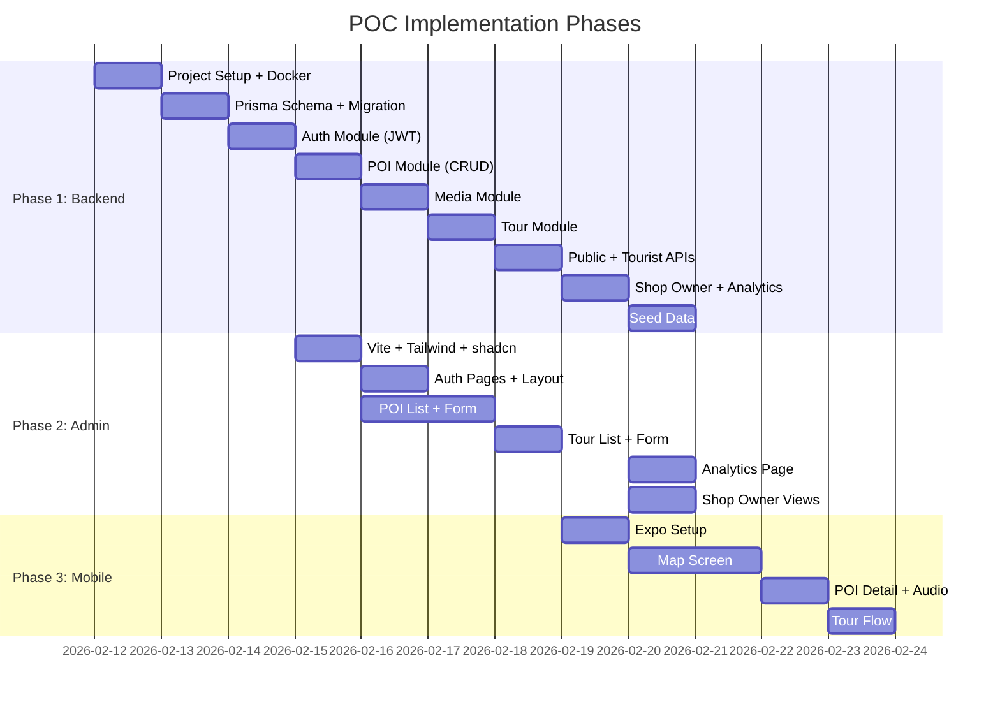

# Step 4: POC Implementation Plan

## Tổng quan

Triển khai **3 apps** cho GPS Tours & Phố Ẩm thực Vĩnh Khánh.

| App | Stack | Role | Screens |
|-----|-------|------|---------|
| **Backend API** | NestJS 10 + Prisma 5 + PostgreSQL 15 | Server | 49 endpoints |
| **Admin Dashboard** | React 18 + Vite 5 + Tailwind + shadcn/ui | Admin + Shop Owner | S01-S16 |
| **Tourist App** | Expo SDK 50 + react-native-maps | Tourist | S17-S27 |

> [!IMPORTANT]
> **POC scope:** Happy path chạy được end-to-end. Error handling cơ bản. Chưa pixel-perfect. Bỏ qua: Push notifications, Social login, Offline mode, CI/CD.

---

## Tech Stack Justification

### 1. Backend Framework

| Tiêu chí | NestJS ✅ | Express.js | Fastify | Spring Boot | Django |
|-----------|-----------|------------|---------|-------------|--------|
| Language | TypeScript | JS/TS | JS/TS | Java/Kotlin | Python |
| Architecture | Modular (DI, decorators) | Minimalist | Minimalist | Enterprise DI | MTV pattern |
| Learning curve | Trung bình | Thấp | Thấp | Cao | Trung bình |
| TypeScript support | Native | Add-on | Add-on | N/A | N/A |
| Code organization | Enforced (modules) | Tự do | Tự do | Enforced | Enforced |
| Auth ecosystem | Passport.js tích hợp | Passport.js | Passport.js | Spring Security | django-auth |
| Performance | Tốt | Tốt | Rất tốt | Tốt | Trung bình |

**Lý do chọn NestJS:**
- **Cùng language với Frontend** → TypeScript xuyên suốt cả stack (backend, admin, mobile). Shared types/interfaces giữa API response ↔ Frontend model → giảm bug do type mismatch
- **Modular architecture** → Dự án có 11 modules (auth, pois, tours, media...), NestJS enforce rõ ràng module boundaries, DI container, guard/interceptor pipeline → dễ scale codebase sau này
- **Express.js quá tự do** → không enforce cấu trúc, 49 endpoints mà không có rõ ràng module thì rất khó maintain
- **Spring Boot** → mạnh nhưng dùng Java/Kotlin, phải maintain 2 language ecosystems (Java backend + TypeScript frontend), cũng overkill cho POC
- **Django** → Python ecosystem khác hoàn toàn, không share được types

### 2. Database

| Tiêu chí | PostgreSQL ✅ | MySQL | MongoDB | SQLite |
|-----------|-------------|-------|---------|--------|
| Geospatial | PostGIS (mạnh nhất) | Spatial (trung bình) | GeoJSON (built-in) | Spatialite (hạn chế) |
| JSON support | jsonb (fast, indexable) | JSON (version 8+) | Native | Không native |
| Full-text search | Built-in `tsvector` | Built-in | Built-in | Không |
| ACID | Full | Full | Hạn chế | Full |
| Concurrency | MVCC (mạnh) | Lock-based | Document-level | File-level |
| Free hosting | Neon, Supabase, Railway | PlanetScale | Atlas | Local |

**Lý do chọn PostgreSQL:**
- **PostGIS** → Feature quyết định. Dự án cần: tìm POI theo vị trí (`GET /public/pois/nearby?lat=...&lng=...&radius=500`), tính khoảng cách user↔POI, geofence trigger. PostGIS là extension mạnh nhất cho geospatial queries, hỗ trợ `ST_DWithin()`, `ST_Distance()` — tốt hơn nhiều so với tính Haversine trong application code
- MongoDB cũng hỗ trợ GeoJSON nhưng: schema-less khó validate 95 fields + nhiều relationships (Tour ↔ POI many-to-many), dùng SQL rõ ràng hơn
- MySQL: spatial kém hơn PostgreSQL, PostGIS ecosystem lớn hơn nhiều

### 3. ORM

| Tiêu chí | Prisma ✅ | TypeORM | Drizzle | Knex |
|-----------|---------|---------|---------|------|
| Type safety | Auto-generated, excellent | Decorator-based, có lỗi | Schema-based, tốt | Manual types |
| Migration | Prisma Migrate (declarative) | Auto-sync hoặc commands | Drizzle-kit | Knex migrations |
| Schema DX | `schema.prisma` (readable) | TypeScript entities | TypeScript schema | SQL/JS |
| Performance | Tốt (Rust engine) | Trung bình (query builder) | Rất tốt (thin wrapper) | Tốt |
| Relation handling | Implicit, auto-join | Decorator (@ManyToMany) | Manual join | Manual join |
| Community | Rất lớn | Lớn (nhưng nhiều bugs) | Đang tăng nhanh | Ổn định |

**Lý do chọn Prisma:**
- **Type safety tuyệt vời** → `prisma generate` auto-tạo TypeScript types từ schema. Khi query `prisma.poi.findMany({ include: { media: true }})` → return type tự động biết có `media: PoiMedia[]` → IDE autocomplete, compile-time error. Rất quan trọng khi có 11 entities phức tạp
- **Readable schema** → `schema.prisma` file dễ đọc hơn TypeORM decorators, team mới onboard nhanh
- **TypeORM** → có nhiều issues mở (>2000 trên GitHub), bugs ở relation loading, migration conflicts. NestJS cũng đang recommend Prisma hơn
- **Drizzle** → newcomer, chưa mature cho production; cũng là option tốt nếu cần raw SQL performance, nhưng cho POC thì Prisma DX tốt hơn

### 4. Frontend Framework (Admin Dashboard)

| Tiêu chí | React ✅ | Vue 3 | Angular | Svelte |
|-----------|---------|-------|---------|--------|
| Ecosystem | Rất lớn | Lớn | Lớn (enterprise) | Nhỏ hơn |
| Component libs | shadcn/ui, MUI, Ant Design | Vuetify, Naive UI | Angular Material | Skeleton UI |
| TypeScript | Tốt | Tốt | Native | Tốt |
| Learning curve | Trung bình | Thấp | Cao | Thấp |
| Mobile sharing | React Native (cùng paradigm) | Không trực tiếp | Ionic | Không |

**Lý do chọn React:**
- **Shared mental model với React Native** → Admin (React) và Tourist App (React Native) dùng cùng component pattern (hooks, JSX, state management). Developer có thể switch giữa 2 codebases dễ dàng
- **shadcn/ui** → Component library chất lượng cao, built on Radix UI (accessibility tốt), copy-paste ownership (không lock-in), kết hợp Tailwind → nhanh chóng build Admin Dashboard với DataTable, Form, Dialog, Toast
- **Vue cũng tốt** nhưng: mobile app sẽ dùng React Native → dùng React cho admin giữ consistency
- **Angular** → quá nặng cho POC, boilerplate nhiều

### 5. Build Tool

| Tiêu chí | Vite ✅ | Webpack | Turbopack | Next.js |
|-----------|--------|---------|-----------|---------|
| Dev server start | < 300ms | 5-20s | < 500ms | 1-3s |
| HMR speed | Instant | 1-3s | Instant | Trung bình |
| Config | Minimal | Complex | Minimal | Convention |
| SSR needed? | Không (Admin = SPA) | — | — | Có (overkill) |

**Lý do chọn Vite:**
- Admin Dashboard là **SPA** (Single Page App) — chỉ authenticated users dùng, không cần SEO, không cần SSR → Next.js overkill
- Dev experience: Vite start < 300ms, HMR instant → developer productivity cao
- Webpack: cấu hình phức tạp, chậm hơn nhiều → không hợp cho POC

### 6. CSS Framework

| Tiêu chí | Tailwind CSS ✅ | Vanilla CSS | CSS Modules | Styled-components |
|-----------|---------------|-------------|-------------|-------------------|
| Speed to build | Rất nhanh | Chậm | Trung bình | Trung bình |
| Bundle size | Purged (nhỏ) | Manual | Scoped | Runtime overhead |
| Design consistency | Utility tokens | Tự quản | Tự quản | Tự quản |
| shadcn/ui compat | Native ✅ | Không | Không | Không |

**Lý do chọn Tailwind CSS:**
- **shadcn/ui yêu cầu Tailwind** → đây là dependency bắt buộc. shadcn/ui components dùng Tailwind classes
- Utility-first approach → build UI nhanh, consistent spacing/color/typography từ design tokens đã define trong UI/UX specs
- POC cần speed → Tailwind + shadcn/ui = fastest path to usable admin UI

### 7. Mobile Framework

| Tiêu chí | Expo (React Native) ✅ | Flutter | Native (Swift + Kotlin) | PWA |
|-----------|----------------------|---------|------------------------|-----|
| Language | TypeScript | Dart | Swift + Kotlin (2 codebases) | TypeScript |
| Cross-platform | iOS + Android | iOS + Android | Riêng từng platform | Web (limited) |
| GPS background | ✅ expo-location | ✅ geolocator | ✅ Native | ❌ Rất hạn chế |
| Audio background | ✅ react-native-track-player | ✅ just_audio | ✅ Native | ❌ Không |
| Maps | react-native-maps | google_maps_flutter | MapKit / Google Maps | Leaflet (basic) |
| Camera/QR | expo-camera | camera plugin | Native | Limited |
| OTA updates | expo-updates (instant) | Không | Không | Có |
| Build complexity | EAS (managed) | Flutter CLI | Xcode + Android Studio | Không cần |
| Sharing với Admin | Cùng TS + React paradigm | Dart (khác hoàn toàn) | 2 languages khác nhau | Cùng TS |

**Lý do chọn Expo (React Native):**
- **PWA bị loại** → Tourist app cần: background GPS tracking (để auto-trigger POI khi user đi gần), background audio playback (nghe thuyết minh khi lock screen), camera access (QR scan). PWA không hỗ trợ đầy đủ các feature này trên iOS
- **Expo managed workflow** → không cần configure Xcode/Android Studio. `npx expo start` → chạy trên điện thoại qua Expo Go. Perfect cho POC
- **Cùng TypeScript stack** → developer đã quen React từ Admin → chuyển sang React Native nhanh
- **Flutter** → cũng tốt, nhưng: phải học Dart (language mới), không share code/types với backend TypeScript, ecosystem nhỏ hơn cho maps/audio
- **Native** → 2 codebases (Swift + Kotlin), tốn gấp đôi effort, POC không cần

### 8. Maps Provider

| Tiêu chí | Mapbox GL JS ✅ | Google Maps | Leaflet + OpenStreetMap |
|-----------|----------------|-------------|-------------------------|
| Free tier | 50K loads/month | $200 credit/month | Free (open source) |
| Customization | Rất cao (Mapbox Studio) | Trung bình | Cao |
| 3D buildings | ✅ | ✅ | ❌ |
| Offline maps | ✅ (mobile SDK) | Hạn chế | Tiles cache |
| Vector tiles | ✅ Native | ✅ | Plugin |
| React Native | @rnmapbox/maps | react-native-maps | react-native-maps |
| Pricing | Predictable | Pay-per-use (có thể đắt) | Free |

**Lý do chọn Mapbox:**
- **Free tier đủ cho POC** → 50K map loads/month, chỉ cần vài chục users test
- **Customization cao** → có thể customize map style (dark mode, highlight POI zones) qua Mapbox Studio
- **Offline maps** → mobile SDK hỗ trợ download map tiles, quan trọng cho tourist ở vùng mạng yếu
- Google Maps: cũng tốt nhưng pricing khó predict khi scale, API key restrictions phức tạp hơn

> [!WARNING]
> **Mapbox alternative:** Nếu team quen Google Maps hơn hoặc cần Directions API (chỉ đường turn-by-turn), có thể switch sang Google Maps. Quyết định này thay đổi được mà không ảnh hưởng architecture.

### 9. State Management (Admin)

| Tiêu chí | TanStack Query + Zustand ✅ | Redux Toolkit | SWR | Jotai |
|-----------|---------------------------|---------------|-----|-------|
| Server state | TanStack Query (cache, refetch, optimistic) | RTK Query | SWR | Manual |
| Client state | Zustand (simple) | Redux slices | React State | Jotai atoms |
| Boilerplate | Rất ít | Trung bình | Ít | Rất ít |
| DevTools | ✅ Cả hai | ✅ Redux DevTools | ❌ | ✅ |

**Lý do:**
- **TanStack Query** → perfect cho app data-heavy như Admin Dashboard. Auto cache, background refetch, pagination built-in. Phần lớn state trong Admin là server state (POI list, Tour list, Analytics) → TanStack Query handle tốt nhất
- **Zustand** → chỉ cho client-only state (sidebar open/close, active filters, modal state). Nhẹ hơn Redux rất nhiều
- Redux: overkill khi đã có TanStack Query cho server state

---

## Monorepo Structure

```
Seminar/
├── docs/                         # Existing docs (step1, step2, step3)
├── apps/
│   ├── api/                      # ← Phase 1: NestJS Backend
│   │   ├── prisma/
│   │   │   ├── schema.prisma     # 11 entities, 95 fields
│   │   │   ├── migrations/
│   │   │   └── seed.ts           # Sample data
│   │   ├── src/
│   │   │   ├── main.ts
│   │   │   ├── app.module.ts
│   │   │   ├── common/
│   │   │   │   ├── guards/       # JwtAuthGuard, RolesGuard
│   │   │   │   ├── decorators/   # @Roles(), @CurrentUser()
│   │   │   │   ├── filters/      # HttpExceptionFilter
│   │   │   │   ├── pipes/        # ValidationPipe
│   │   │   │   └── dto/          # PaginationDto, ErrorResponseDto
│   │   │   ├── modules/
│   │   │   │   ├── auth/         # Login, JWT, Refresh, Forgot PW
│   │   │   │   ├── users/        # Admin CRUD
│   │   │   │   ├── pois/         # POI CRUD + Media + Status
│   │   │   │   ├── tours/        # Tour CRUD + POI ordering
│   │   │   │   ├── media/        # Upload/delete images & audio
│   │   │   │   ├── public/       # Tourist endpoints (no auth)
│   │   │   │   ├── tourist/      # Tourist profile, favorites, history
│   │   │   │   ├── shop-owner/   # SO profile, own POIs, analytics
│   │   │   │   └── analytics/    # Admin analytics dashboard
│   │   │   └── prisma/           # PrismaModule, PrismaService
│   │   ├── test/
│   │   ├── .env.example
│   │   ├── docker-compose.yml    # PostgreSQL + Redis
│   │   └── package.json
│   │
│   ├── admin/                    # ← Phase 2: React Admin Dashboard
│   │   ├── src/
│   │   │   ├── main.tsx
│   │   │   ├── App.tsx
│   │   │   ├── lib/
│   │   │   │   ├── api.ts        # Axios instance + interceptors
│   │   │   │   ├── auth.ts       # Token storage, refresh logic
│   │   │   │   └── utils.ts
│   │   │   ├── hooks/
│   │   │   │   ├── useAuth.ts
│   │   │   │   ├── usePois.ts
│   │   │   │   └── useTours.ts
│   │   │   ├── components/
│   │   │   │   ├── ui/           # shadcn/ui components
│   │   │   │   ├── layout/       # Sidebar, Header, PageContainer
│   │   │   │   ├── pois/         # PoiTable, PoiForm, MediaUpload
│   │   │   │   ├── tours/        # TourTable, TourForm, PoiPicker
│   │   │   │   └── shared/       # DataTable, ProtectedRoute
│   │   │   ├── pages/
│   │   │   │   ├── auth/         # LoginPage, ForgotPasswordPage
│   │   │   │   ├── admin/        # Dashboard, POIs, Tours, Analytics
│   │   │   │   └── shop-owner/   # SODashboard, SOPoi, SOAnalytics
│   │   │   └── routes.tsx
│   │   ├── index.html
│   │   └── package.json
│   │
│   └── mobile/                   # ← Phase 3: Expo Tourist App
│       ├── app/                  # Expo Router (file-based)
│       │   ├── (tabs)/
│       │   │   ├── index.tsx     # Map Screen (S17)
│       │   │   ├── tours.tsx     # Tour List (S19)
│       │   │   └── more.tsx      # More Menu
│       │   ├── poi/[id].tsx      # POI Detail (S18)
│       │   ├── tour/[id].tsx     # Tour Detail (S20)
│       │   ├── tour/follow.tsx   # Tour Following (S21)
│       │   ├── favorites.tsx     # Favorites (S24)
│       │   ├── history.tsx       # History (S25)
│       │   ├── scanner.tsx       # QR Scanner (S23)
│       │   └── settings.tsx      # Settings (S26)
│       ├── components/
│       │   ├── MapMarker.tsx
│       │   ├── AudioPlayer.tsx
│       │   ├── PoiCard.tsx
│       │   └── BottomSheet.tsx
│       ├── lib/
│       │   ├── api.ts
│       │   ├── location.ts
│       │   └── storage.ts
│       └── package.json
└── package.json                  # Root workspace
```

---

## Phase 1: Backend API

### 1A. Project Setup (Bước đầu tiên)

| Task | Output |
|------|--------|
| Init NestJS project | `npx @nestjs/cli new api` |
| Setup Docker Compose | PostgreSQL 15 + Redis 7 |
| Install deps | Prisma, Passport, bcrypt, Multer, class-validator |
| Config .env | DB_URL, JWT_SECRET, S3_BUCKET |

### 1B. Prisma Schema (11 entities)

```prisma
// Tóm tắt — full schema sẽ dựa trên data_fields.md

model User {
  id            String   @id @default(uuid())
  email         String   @unique
  passwordHash  String
  fullName      String
  role          Role     // ADMIN, SHOP_OWNER, TOURIST
  status        UserStatus // ACTIVE, INACTIVE, LOCKED
  failedLoginCount Int   @default(0)
  lockedUntil   DateTime?
  // ... timestamps
}

model Poi { ... }           // 15 fields
model PoiMedia { ... }      // 11 fields
model Tour { ... }          // 12 fields
model TourPoi { ... }       // 5 fields (junction)
model ShopOwner { ... }     // 7 fields
model PasswordResetToken {} // 6 fields
model TouristUser { ... }   // 9 fields
model ViewHistory { ... }   // 7 fields
model Favorite { ... }      // 4 fields
model TriggerLog { ... }    // 7 fields
```

### 1C. Modules (theo thứ tự dependency)

| Order | Module | Endpoints | Key Files |
|-------|--------|-----------|-----------|
| 1 | `prisma` | — | prisma.module.ts, prisma.service.ts |
| 2 | `common` | — | Guards, Filters, Decorators, DTOs |
| 3 | `auth` | 6 | auth.controller, auth.service, jwt.strategy, local.strategy |
| 4 | `users` | 2 | users.controller, users.service |
| 5 | `pois` | 8 | pois.controller, pois.service, create-poi.dto |
| 6 | `media` | 3 | media.controller, media.service (Multer + S3 mock) |
| 7 | `tours` | 6 | tours.controller, tours.service, tour-pois.service |
| 8 | `public` | 6 | public.controller (no auth), nearby query with PostGIS |
| 9 | `tourist` | 9 | tourist.controller, favorites.service, history.service |
| 10 | `shop-owner` | 9 | shop-owner.controller, so-pois.service, so-analytics.service |
| 11 | `analytics` | 3 | analytics.controller, analytics.service |
| 12 | `seed` | — | prisma/seed.ts (sample POIs, Tours, Users) |

### 1D. API Auth Flow

```
POST /auth/login → validate → bcrypt compare → JWT sign → return tokens
POST /auth/refresh → validate refresh token → new access token
POST /auth/register → hash password → create User + (ShopOwner | Tourist)
All protected routes → JwtAuthGuard → RolesGuard(@Roles('ADMIN'))
```

---

## Phase 2: Admin Dashboard (Web)

### 2A. Project Setup

| Task | Output |
|------|--------|
| Init Vite + React + TS | `npx create-vite admin --template react-ts` |
| Install Tailwind CSS | tailwind.config.ts |
| Install shadcn/ui | Button, Input, Table, Dialog, Toast, Tabs... |
| Install react-router-dom | Route config |
| Install TanStack Query | API caching |
| Install React Hook Form + Zod | Form validation |
| Install Mapbox GL JS | Map component |

### 2B. Core Infrastructure

| File | Purpose |
|------|---------|
| `lib/api.ts` | Axios instance, JWT interceptor, auto-refresh |
| `lib/auth.ts` | Login/logout, token storage, currentUser |
| `hooks/useAuth.ts` | Auth state, ProtectedRoute |
| `components/layout/Sidebar.tsx` | Admin sidebar (role-aware) |
| `components/layout/Header.tsx` | Search, user menu |
| `routes.tsx` | Role-based routing (Admin vs Shop Owner) |

### 2C. Pages (theo Screen IDs)

| Page | Screen | Components | API Calls |
|------|--------|------------|-----------|
| `LoginPage` | S01 | LoginForm | POST /auth/login |
| `ForgotPasswordPage` | S02 | EmailForm → ResetForm | POST /auth/forgot-password, /reset-password |
| `DashboardPage` | S03 | StatCards, RecentActivity, Chart | GET /admin/analytics/overview |
| `PoiListPage` | S04 | DataTable, Filters, Pagination | GET /pois |
| `PoiFormPage` | S05 | PoiForm (tabs VN/EN), MapPicker, MediaUpload | POST/PUT /pois, /pois/:id/media |
| `TourListPage` | S07 | DataTable | GET /tours |
| `TourFormPage` | S08 | TourForm, PoiPicker (drag & drop), RoutePreview | POST/PUT /tours, /tours/:id/pois |
| `AnalyticsPage` | S09 | StatCards, LineChart, TopPoisTable | GET /admin/analytics/overview |
| `SODashboardPage` | S13 | StatCards, MyPoisTable | GET /shop-owner/pois |
| `SOPoiFormPage` | S14 | Simplified PoiForm | POST/PUT /shop-owner/pois |
| `SOAnalyticsPage` | S15 | StatCards, Chart, PerPoiTable | GET /shop-owner/analytics |
| `SOProfilePage` | S16 | ProfileForm | GET/PATCH /shop-owner/me |

### 2D. Key Components

| Component | Used In | Complexity |
|-----------|---------|------------|
| `DataTable` | S04, S07, S13 | Sort, filter, pagination, row actions |
| `PoiForm` | S05, S14 | VN/EN tabs, map picker, media upload, validation |
| `MediaUpload` | S05, S14 | Drag & drop, preview, progress, delete |
| `MapPicker` | S05 | Click to place, search, radius preview |
| `PoiDragList` | S08 | Sortable POI list for Tour ordering |
| `StatCard` | S03, S09, S13, S15 | Metric card with trend |
| `LineChart` | S09, S15 | recharts/Chart.js line chart |

---

## Phase 3: Tourist App (Mobile)

### 3A. Project Setup

| Task | Output |
|------|--------|
| Init Expo | `npx create-expo-app mobile` |
| Install libs | react-native-maps, expo-location, expo-camera |
| Install navigation | expo-router (file-based) |
| Config EAS | eas.json for builds |

### 3B. Screens (theo Screen IDs)

| Screen | File | API Calls | Key Features |
|--------|------|-----------|--------------|
| Map (S17) | `app/(tabs)/index.tsx` | GET /public/pois/nearby | MapView, markers, bottom card |
| POI Detail (S18) | `app/poi/[id].tsx` | GET /public/pois/:id | Image carousel, audio player, favorite |
| Tour List (S19) | `app/(tabs)/tours.tsx` | GET /public/tours | FlatList, tour cards |
| Tour Detail (S20) | `app/tour/[id].tsx` | GET /public/tours/:id | Route map, POI list, start button |
| Tour Follow (S21) | `app/tour/follow.tsx` | Local state | Route tracking, progress bar |
| QR Scanner (S23) | `app/scanner.tsx` | POST /public/qr/validate | Camera, QR frame |
| Favorites (S24) | `app/favorites.tsx` | GET /tourist/me/favorites | POI list, unfavorite |
| History (S25) | `app/history.tsx` | GET /tourist/me/history | Timeline list |
| Settings (S26) | `app/settings.tsx` | PATCH /tourist/me | Language, GPS, about |

### 3C. Core Mobile Components

| Component | Purpose |
|-----------|---------|
| `AudioPlayer.tsx` | Play/pause, progress, background play |
| `MapMarker.tsx` | Custom marker (MAIN 🔴 / SUB 🟡 / IN RANGE 🔵) |
| `PoiCard.tsx` | POI preview card (thumbnail, name, distance) |
| `BottomSheet.tsx` | Auto-trigger popup, POI preview |
| `LocationTracker.tsx` | GPS tracking + trigger logic |

---

## Phased Timeline



> [!IMPORTANT]
> **Phase 2 bắt đầu song song** với Phase 1 sau khi Auth module xong. Phase 3 bắt đầu khi Public APIs xong.

---

## Verification Plan

### Smoke Tests (End-to-End)

| # | Flow | Steps |
|---|------|-------|
| 1 | Admin POI | Login → Create POI → Upload media → Publish → Verify on list |
| 2 | Admin Tour | Create Tour → Add POIs → Reorder → Publish |
| 3 | Shop Owner | Register → Login → Create own POI → View analytics |
| 4 | Tourist Map | Open map → See markers → Tap → View POI detail → Play audio |
| 5 | Tourist Tour | Browse tours → Select → Start → Follow route → Complete |

### Automated
- `npm run test` per app
- Prisma migration clean run
- API response format validation
